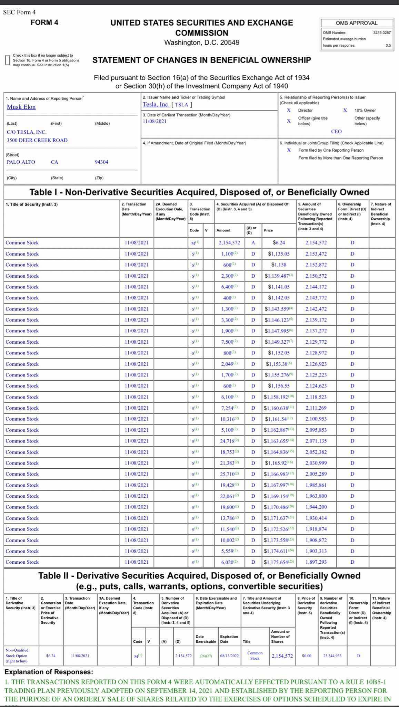
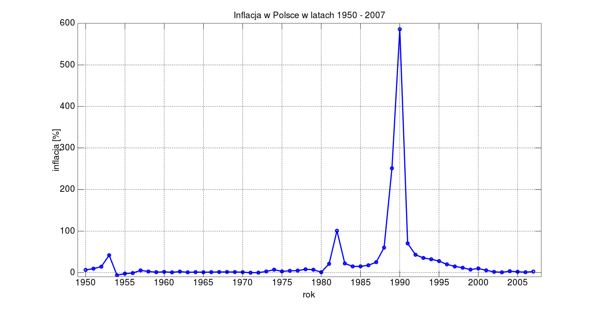
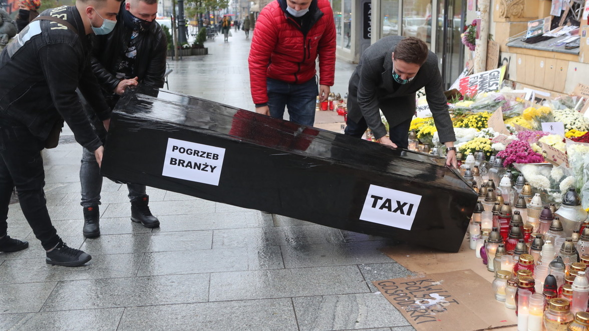

### 2021

Oficjalnie recesja?

Musk sold 676K $TSLA shares yesterday, totalling millions.

  

---

Pan Eryk Łon, członek RPP w TVPInfo:

"Myślę, że te podwyżki (stóp procentowych), których dokonaliśmy spowodowały znaczne zatrzymanie presji inflacyjnej. Już widzimy, że są pewne efekty, że jednak ta inflacja zaczyna zwalniać. Z naszych prognoz wynika, że inflacja na początku przyszłego roku osiągnie to apogeum i później będzie zwalniać".

Pan Łon myśli...🤔. Znakomicie. Tylko przyklasnąć👏

A ja myślę, że jeśli URE zaakceptuje wnioski dostawców o wzrost cen energii elektrycznej w przyszłym roku o ok. 40%, co pociągnie za sobą wzrost rachunków za prąd o ok. 20%, a klepnie jeszcze propozycję wzrostu ceny gazu do ogrzewania domów o ok. 40% i do gotowania o ok. 10%, to zauważalny spadek inflacji w 1 kw. 22 szlag trafi.

Podwyżki cen urzędowych na energię i ogrzewanie zniwelują bowiem efekt tzw. tarczy antyinflacyjnej. Inflacja dalej pozostanie w przedziale 7,5%-8,5%. Rząd zmuszony będzie w tej sytuacji przedłużyć ulgi podatkowe i „rekompensaty” na 2 i być może także 3 kwartał 2022.

A to będzie miało konsekwencje nie tylko w postaci utraty dochodów budżetu. Chodzi o wzmocnienie efektu bazy, który przełoży się na wzrost inflacji także w roku 2023.
Ten efekt będzie tym silniejszy, im wieksza będzie ingerencja polityki fiskalnej w ceny nośników energii w roku 22.
I tak, na przykład, gdyby KE, do której aplikował rząd, zgodziła się na okresową redukcję stawek VAT na paliwa i żywność, to zdejmie to co prawda z tych 7,5%-8,5% CPI w pierwszej połowie 22 ok. 0,6-0,8 p.p. (sukces w TVP murowany👍), ale za to dołoży co odjęte w 22 do inflacji w roku 23 (mniejszy sukces w TVP🥴).

Logicznie rzecz biorąc wyższa ścieżka inflacji w latach 21-23 wywoła wzmożoną presję płacową. Cudów nie ma. A efekty drugiej rundy skłonić powinny RPP – już w nowym składzie – do bardziej intensywnej podwyżki stóp procentowych już w pierwszym półroczu 22 i w całym roku zresztą też. Odbije się to na wyhamowaniu dynamiki PKB w latach 23-24 bardziej niż wyprzedaż dzisiejszych zapasów.

Chaotyczna polityka makroekonomiczna coraz bardziej uprawdopodabnia scenariusz, przed którym ostrzegałem już od dawna: w średnim okresie 2-3 lat czeka nas spowolnienie wzrostu do ok. 2%-3% oraz średnioroczna inflacja przekraczająca znacząco górny przedział odchyleń od celu, oscylująca wokół 5%-6%. Dla porządku dodać wypada, że ani Sowieci, ani Bruksela nic do tego nie mają.

Jak widać myślenie dobrze jest poprzeć jakąś, choćby śladową, analizą. To nigdy nie zaszkodzi.

---

### 2020

Wiceminister finansów: konsumenci nie odczuli w kieszeniach skutków epidemii

Wiceminister finansów Piotr Patkowski, mówiąc o wsparciu przy drugiej fali pandemii, wyjaśnił, że tarczy dla konsumentów nie będzie, bo rząd skupia się na pomocy dla firm, by ochronić miejsca pracy. Ocenił, że jeśli konsumenci nie stracili pracy, to w kieszeniach mają pieniądze zaoszczędzone na rozrywce czy rekreacji. Zastrzegł jednak, że jeśli resort zauważy, że kredytobiorcy nie będą w stanie spłacać rat kredytów hipotecznych, jakaś interwencja może nastąpić.

  

  

---

  

---

### 1941

Gubernator dystryktu warszawskiego dr Ludwig Fischer wydał obwieszczenie o karze śmierci za „nieuprawnione opuszczenie żydowskich dzielnic mieszkaniowych” oraz o karze śmierci dla osób, które Żydom świadomie udzielają schronienia lub w inny sposób pomagają.

Treść obwieszczenia:

OBWIESZCZENIE

Dotyczy: kary śmierci za nieuprawnione opuszczanie żydowskich dzielnic mieszkaniowych.

W ostatnim czasie rozprzestrzenili żydzi, którzy opuścili wyznaczone im dzielnice mieszkaniowe, w licznych udowodnionych wypadkach tyfus plamisty. Aby zapobiec grożącemu w ten sposób niebezpieczeństwu dla ludności rozporządził Generalny Gubernator, że żyd, który w przyszłości opuści nieuprawniony wyznaczoną mu dzielnicę mieszkaniową, będzie karany śmiercią.

Tej samej karze podlega ten, kto takim żydom udziela świadomie schronienia lub w inny sposób pomaga (np. przez udostępnienie noclegu, utrzymanie, przez zabranie na pojazdy wszelkiego rodzaj itp.) Osądzenie nastąpi przez Sąd Specjalny w Warszawie.

Zwracam całej ludności Okręgu Warszawskiego wyraźnie uwagę na to nowe postanowienie ustawowe, ponieważ odtąd będzie stosowana bezlitosna surowość.

### 1939

https://pl.wikipedia.org/wiki/Mustafa_Kemal_Atat%C3%BCrk

### 1938

We czwartek 10 listopada 1938 r. Niemcy obudzili się w swoich domach, ale noc miniona była inna od poprzednich. Niektórych idących po poranne zakupy mogły zdziwić splądrowane sklepy, spalone synagogi i wybite szyby, których srebrzyste okruchy dały minionej nocy nazwę KRYSZTAŁOWEJ.
#DobraHistoria
Ale w sumie czy powinni się dziwić? Po wprowadzonych w 1935 r. Ustawach norymberskich uczyniono z osób narodowości żydowskiej obywateli drugiej kategorii. Stworzono według niech osobną grupę wewnątrz zbiorowości obywateli Niemiec. Na mocy tych dokumentów Żydów można było pozbawić obywatelstwa Rzeszy, ochrony prawnej i własności. Nie mogli również pełnić służby w urzędach państwowych ani w wojsku. Zakazano im również wywieszać flagę państwową. Zabroniono zawierania małżeństw między „Aryjczykami” i „nie-Aryjczykami”, zezwalano rozwiązywać już zawarte małżeństwa tego typu, zaś stosunki intymne między nimi podlegały karze.
Pod koniec października 1938 r. siedemnaście tysięcy osób narodowości żydowskiej, posiadających do niedawna obywatelstwo polskie, zostało zmuszonych do natychmiastowego opuszczenia Rzeszy. Spodziewając się takiego obrotu spraw już w marcu polskie władze przyjęły ustawę, która pozbawiała Żydów obywatelstwa jako przebywających ponad 5 lat poza granicami RP. W ten sposób na przygranicznych stacjach kolejowych pęczniał kilkutysięczny tłum de facto bezpaństwowców pozbawionych zarówno prawa powrotu do Polski jak i do Niemiec. Kryzys humanitarny starali się łagodzić działacze Polskiego Czerwonego Krzyża, jednakże skala problemu zmusiła polskie MSZ do podjęcia zdecydowanych działań. Zagroziło ono wydaleniem z Rzeczypospolitej obywateli niemieckich, wobec czego  deportację Żydów z Niemiec wstrzymano. Niestety tych, których Niemcy nie zdołali przepędzić przez granicę, zabierano z powrotem w głąb kraju, najczęściej do obozów koncentracyjnych.
Wśród tych, którzy udali się do Polski była rodzina Grynszpanów. Ich syn, Herszel, już w 1936 r. uciekł z Niemiec chcąc osiedlić się w Palestynie. W okresie tymczasowym zamieszkał w Paryżu. Przejęty antysemicką polityką udał się do ambasady niemieckiej w Paryżu, w której ubiegał się o rozmowę z ambasadorem. Przyjął go niższy rangą sekretarz Ernst von Rath, do którego Grynszpan pięciokrotnie strzelił. Rath po dwóch dniach zmarł z odniesionych ran. Choć zamach, jako akt zemsty Grynszpana, miał znaczenie drugorzędne, niemiecka propaganda określiła go jako "atak międzynarodowego żydostwa na Rzeszę Niemiecką". 
9 listopada, po śmierci von Ratha, Goebbels oznajmił towarzyszom partyjnym, że należy zadać zadośćuczynienie społeczności żydowskiej w Niemczech, ale nie mogą być to oficjalne wystąpienia partyjne. Hitler wcześniej wyszedł z konwentu, by nie uczestniczyć w wyrażanych przez Goebbelsa zachętach. Spotkanie z ministrem propagandy zakończyło się o 22:50. Tuż po nim do ośrodków partyjnych dotarło polecenie do działania...
Paramilitarne oddziały NSDAP, czyli SA i SS dostały w ciągu kilkudziesięciu minut polecenie ochrony mienia aryjskiego, co zgodnie z linią partii zinterpretowano jako nakaz niszczenia mienia żydowskiego. W ciągu kilku godzin zamordowano ponad dwa tysiące obywateli niemieckich wyznania mojżeszowego, spalono ponad tysiąc synagog (często o wielkie wartości historycznej), zniszczono około siedem tysięcy sklepów i dwadzieścia dziewięć domów towarowych należących do Żydów. Wszystkie cmentarze żydowskie zostały zdemolowane. Po nocy około trzydzieści tysięcy żydów zostało zamkniętych w obozach koncentracyjnych.
Co więcej, Hermann Göring wydał rozporządzenie nakazujące, by Żydzi zebrali 1 mld marek (faktycznie zebrano 1,2 mld marek) jako odszkodowanie na rzecz państwa niemieckiego.
Był to pierwszy w historii pogrom zorganizowany przez organizację partyjną, czyli w przypadku III Rzeszy de facto władzę państwową. Straż pożarna nie reagowała kiedy ogień trawił biblioteki i synagogi. Policja ograniczyła się do osłony mienia aryjskiego, kiedy wybijano szyby, rabowano sklepy i mordowano obywateli Niemiec narodowości żydowskiej.
Rankiem, 10 listopada 1938 roku, ulice niemieckich miast pokrywała warstwa tłuczonego szkła, które dało minionej nocy nazwę KRYSZTAŁOWEJ.

  

Na zdjęciu płonąca w tę noc synagoga w Hanowerze. 

### 1918

Zwolniony z więzienia w Magdeburgu Józef Piłsudski przybył do Warszawy. Więzionego od 22 lipca 1917 roku zwolniono z powodu obawy niemieckiego sztabu przed połączeniem się rewolucji niemieckiej z bolszewicką. Przypuszczano,że powstanie wolnego państwa polskiego będzie skuteczną barierą przed rozprzestrzenianiem się komunizmu na zachód. Jak bardzo słuszne były to obawy, zachodnia Europa przekonała się już wkrótce.

### 1910

W krakowskim kościele pod wezwaniem świętego Mikołaja odbył się ślub 33 -letniego Feliksa Dzierżyńskiego i 28-letniej Zofii Muszkat.
Dzierżynski był synem Edmunda Dzierżyńskiego, nauczyciela fizyki i matematyki. Wywodził się z polsko-litewskiego rodu herbu Samson. Był działaczem Socjaldemokracji Krolestwa Polskiego i Litwy, Socjaldemokratycznej Partii Rosji, uczestnikiem Rewolucji Październikowej, twórcą sowieckiego systemu terroru i szefem sowieckich organów bezpieczeństwa.
Zofia Muszkat była nauczycielką i aktywną działaczką komunistyczną.
Z ich małżeństwa wywodził się jedyny syn Jan, który przyszedł na świat w czerwcu 1911 roku w więzieniu na warszawskim Pawiaku.
Na zdjęciu Feliks Dzierżyński i Zofia Dzierżyńska z synem Janem w Lugano, październik 1918 roku.

### 1909

W Symbirsku (Rosja) urodził się Paweł Jasienica (właściwe nazwisko Leon Lech Beynar) -polski pisarz, publicysta, historyk, a także żołnierz Armii Krajowej.
Był absolwentem wydziału historii Uniwersytetu Wileńskiego. W czasie okupacji został aresztowany przez NKWD, a następnie przymusowo wcielony w szeregi Ludowego Wojska Polskiego, z którego zdezerterował, by podjąć służbę w 5 Brygadzie Wileńskiej Armii Krajowej majora Zygmunta Szendzielarza, jako jego adiutant.
Ciekawostką jest fakt, że jego przybrane nazwisko pochodzi od nazwy wioski Jasienica, gdzie tuż po ucieczce z Ludowego Wojska Polskiego jesienią 1944 roku znalazł schronienie.
Paweł Jasienica był autorem cyklu esejów historycznych "Polska Piastów", "Polska Jagiellonów", "Rzeczpospolita Obojga Narodów".
Po wojnie przedostał się do Krakowa i w 1946 r. zadebiutował na łamach „Tygodnika Powszechnego” i został również jego współredaktorem. Przyjął wtedy pseudonim Paweł Jasienica, by nie narażać żony, która ówcześnie znajdowała się w Wilnie w Litewskiej SRR, gdzie formalnie miała status wdowy.
Aresztowano go ponownie w 1948 roku podczas tzw "akcji likwidacji grupy wileńskiej".
W 1964, w związku z zaostrzeniem
cenzury , Jasienica wraz z 33 innymi polskimi intelektualistami podpisał List 34 skierowany do premiera Józefa Cyrankiewicza. Reakcją na to wystąpienie było nasilenie inwigilacji pisarza. W połowie lat 60. donosiło na niego co najmniej trzydziestu agentów.
Zmarł 19 sierpnia 1970 roku w Warszawie.

---

<a href="https://github.com/TomaszWaszczyk/historia.waszczyk.com/edit/master/src/content/november-10.md" target="_blank">Edytuj tę stronę dzieląc się własnymi notatkami!</a>
