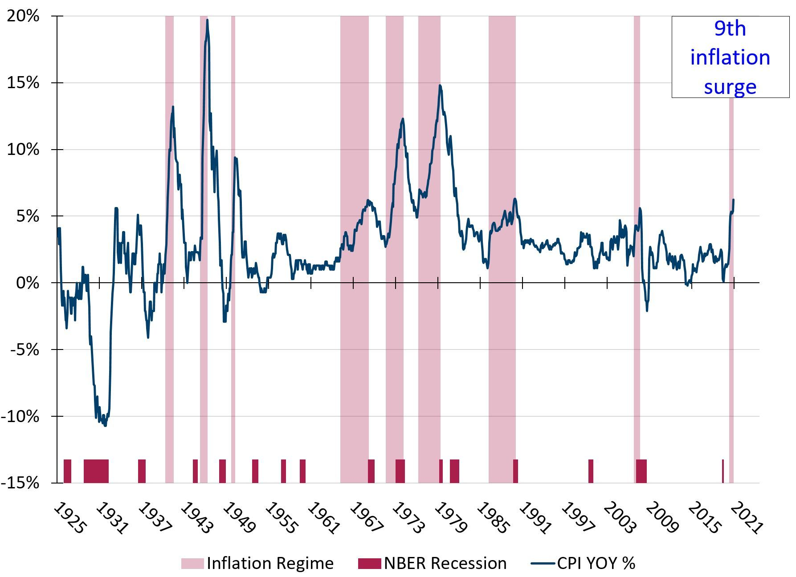
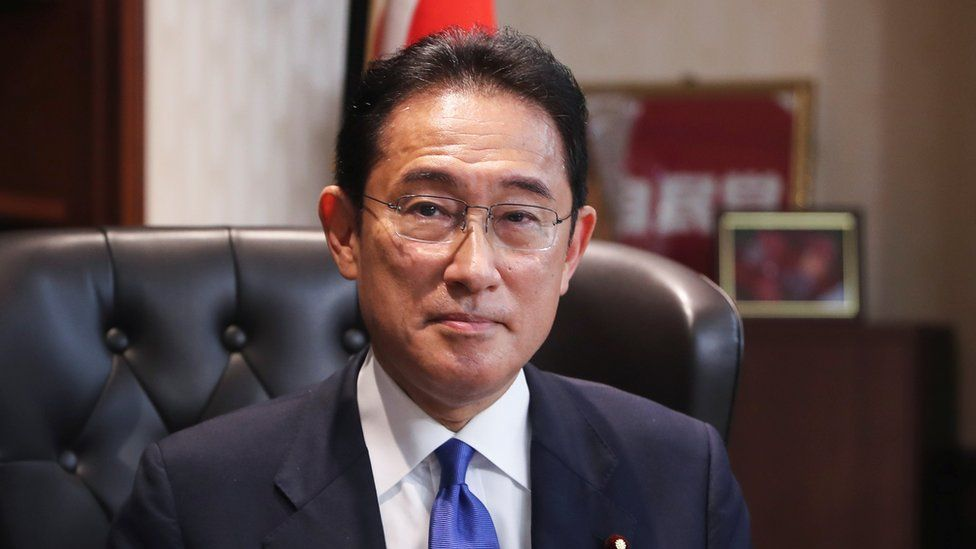
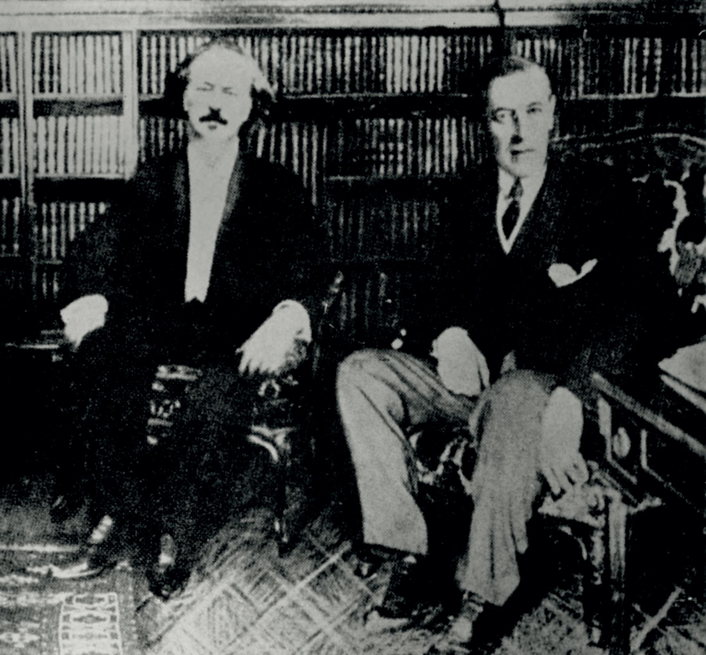

### 2021

Bez waluty nie ma kraju, a waluty narodowe się sypią.

We are in an inflation surge.  If you follow me, you know that I have been very critical of the “don’t worry, it is transitory” spin on the recent inflation reports. Even today’s media coverage mainly focuses on the transitory items. Sure, some of the inflation is transitory – that is obvious – but not all. Yes, used cars are up 26.4% YoY but that is only 3.3% of the CPI basket. I have focused on the important shelter component which constitutes one third of the CPI. The latest CPI report shows rent and owners’ equivalent rent up only 2.7% and 3.1% YoY. Yet, Case-Shiller 20 City house price index is up 19.7% and Apartment List median rent is up 16.4% (Jan-Oct). Unfortunately, there is likely more inflation to come.

  

---

How Japan's new PM is promising a 'new capitalism'. Former Japanese Foreign Minister Fumio Kishida became PM in October.

Japan's new prime minister, Fumio Kishida, has sold his plan to redistribute wealth in the country as the "new capitalism".

  

But some critics on social media suggest the plan sounds more like socialism to them - even dubbing it Japan's "common prosperity", referring to a key policy from the Chinese Communist Party.

---

Prezes NBP udzieli głosu członkom RPP. Muszą mieć jego zgodę na wywiady

Prezes NBP podejmuje decyzje o krajowych i zagranicznych wyjazdach członków Rady oraz o udziale członków Rady w konferencjach i innych wydarzeniach relacjonowanych publicznie - wynika z uchwały RPP z 3 listopada, zmieniającej regulamin Rady, opublikowanej w środę w Monitorze Polskim.

---

### 2020

🇵🇱Świętujemy dziś niepodległość🇵🇱, za którą jesteśmy wdzięczni Ignacemu Janowi Paderewskiemu, człowiekowi, który "wygrał Polskę na fortepianie"🎼. On sam mówił:

> "Myśl o Polsce wielkiej i silnej, wolnej i niepodległej była i jest treścią mego istnienia, urzeczywistnienie jej było i jest jedynym celem mojego życia".

Przypomnijmy do czego doprowadziła jego działalność polityczna, liczne kontakty i popularność.
"Swoje szerokie kontakty za oceanem (...) wykorzystuje na rzecz rodaków. Za pośrednictwem pułkownika E. M. House’a informuje prezydenta Woodrowa Wilsona o sytuacji w Polsce, polityce zaborców, o dramacie Polaków. Dzięki wielkiej aktywności Paderewskiego prezydent Wilson w słynnym orędziu z 22 stycznia 1917, mówił wyraźnie o prawie Polski do niepodległości. Na tej podstawie jeden z 14 punktów pokoju sformułowanych przez Wilsona, mówi o konieczności powstania niepodległego państwa polskiego z dostępem do morza.
Kiedy po odzyskaniu przez Polskę niepodległości Paderewski wracał do kraju, witany był jako symbol odrodzenia ojczyzny. Jego przyjazd do Poznania stał się pretekstem do wybuchu powstania wielkopolskiego.
Po przyjeździe do Warszawy podjął się roli mediatora między Piłsudskim a obozem Dmowskiego. Józef Piłsudski, widząc zaangażowanie w odbudowę niepodległej Polski oraz umiejętności zmotywowania przeciwników politycznych do działania we wspólnym celu, mianował go premierem i jednocześnie ministrem spraw zagranicznych".

Tekst z artykułu "Ignacy Jan Paderewski - mąż stanu, który łagodził obyczaje". polskieradio.pl

  

Na zdjęciu I.J. Paderewski z prezydentem W. Wilsonem 1917 r., Archiwum Akt Nowych

<!-- W ramach cyklu Paderewski - jazz - inspiracje zapraszamy na koncert -->
<!-- Herdzin meets Ignacy Jazz Paderewski -->
<!-- W programie: -->
<!-- IGNACY JAN PADEREWSKI / KRZYSZTOF HERDZIN -->
<!-- - Menuet G-dur op. 14 nr 1 -->
<!-- - Legenda As-dur op. 16 nr 1 -->
<!-- - Nokturn B-dur op. 16 nr 4 -->
<!-- - Temat z Fantazji Polskiej gis-moll op. 19 -->
<!-- - Temat z III części (Finale. Allegro molto vivace) Koncertu fortepianowego a-moll op. 17 -->

---

Dr Martyka: Zaczyna się sprawdzać czarny scenariusz. Należy żądać zniesienia restrykcji

Bezsensowne restrykcje oraz zrujnowanie funkcjonowania służby zdrowia na wiosnę tego roku, owocuje dzisiaj wzrostem zgonów o 40%!
Październik 2020 jest prawdopodobnie najtragiczniejszym miesiącem pod względem śmiertelności od II Wojny Światowej. – Liczba zgonów w październiku była o 40% wyższa niż przed rokiem oraz we wrześniu – dane GUS.
Dzisiaj umierają najsłabsze osoby, które wcześniej były pozbawione leczenia w szpitalach.
Większość zgonów wcale nie była spowodowana COVID-19. W tym samym okresie liczba zgonów ze stwierdzonym zakażeniem SARS-COV2 wyniosła 3,1 tysiąca osób (nie mylić ze zgonami z powodu choroby COVID19) – podaje. Liczba zgonów z powodu COVID-19 jest wielokrotnie niższa.
Skutki restrykcji to wzrost śmiertelności z powodu przerwanych lub zaniechanych terapii onkologicznych, zawałów, udarów i powikłań innych, dotychczas normalnie leczonych chorób.
Aby uniknąć dalszego narastania ilości ofiar z powodu restrykcji i sparaliżowania ochrony zdrowia należy domagać się zniesienia dławiących normalne funkcjonowanie państwa i służb medycznych – restrykcji.
Nic one nie dały poza ewidentnymi szkodami zdrowotnymi i gospodarczymi.

### 1990

Generał Stanisław Maczek został awansowany przez prezydenta RP na uchodźstwie do stopnia generała broni.

### 1918

11 listopada nastąpiło jedynie przekazanie władzy przez Radę Regencyjną towarzyszowi Ziółkowi z partii socjalistycznej, czyli Piłsudskiemu. Potem socjaliści gnębili Polskę podatkami i doprowadzili do klęski. 11 listopada to jest rocznica klęski. To 7 października przypada rocznica odzyskania przez Polskę niepodległości.

---

<a href="https://github.com/TomaszWaszczyk/historia.waszczyk.com/edit/master/src/content/november-11.md" target="_blank">Edytuj tę stronę dzieląc się własnymi notatkami!</a>
