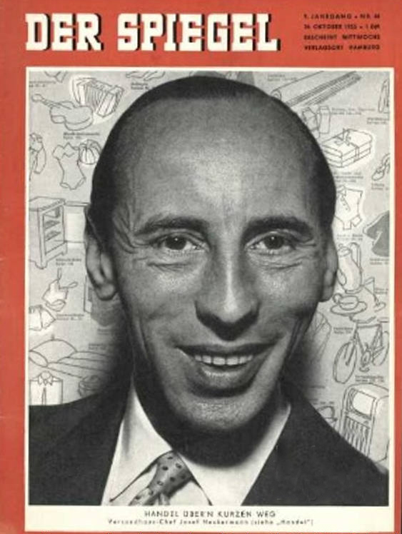

### 2019

Neckermann bankrutuje

Josef Neckermann. Mroczna przeszłość powszechnie szanowanego niemieckiego biznesmena

Był jednym z najbardziej znanych i szanowanych przedsiębiorców w powojennych Niemczech. Podziwiano go też jako zdobywcę sześciu medali olimpijskich. I tylko nikt nie chciał mówić o tym, jak Josef Neckermann dorobił się swojej fortuny.

Josef Neckermann, jeden z najbogatszych i najbardziej szanowanych przedsiębiorców w powojennych Niemczech, urodził się w 1912 roku w Würzburgu. Pierwotnie nic nie zapowiadało, żeby chłopak miał zrobić karierę w biznesie. Jego wielką pasją była jazda konna, zamierzał więc zostać oficerem kawalerii. Plany rozsypały się po tym, jak w 1928 roku zmarł jego ojciec: lokalny potentat w handlu węglem.

Neckermann zmuszony był zastąpić rodziciela w rodzinnym interesie. W niedoszłym kawalerzyście szybko obudziła się ambicja.

Pierwszy milion
Czasy sprzyjały młodemu biznesmenowi. Rodzina Neckermanna, w której dominowały poglądy narodowo-konserwatywne, zaczęła sympatyzować z nazistami. Po przejęciu przez NSDAP władzy w Niemczech kariera Josefa wyraźnie nabrała rozpędu. Przedsiębiorca w 1933 roku wstąpił do SA (Sturmabteilung, Oddziałów Szturmowych), a dwa lata później został członkiem partii nazistowskiej.

Wtedy też, po wejściu w życie norymberskich ustaw rasowych o ochronie niemieckiej krwi (drastycznie ograniczających prawa obywatelskie żydowskich obywateli Niemiec), jego firma po raz pierwszy zwiększyła swój stan posiadania. W ramach „aryzacji” żydowskich przedsiębiorstw Neckermann zagarnął znany w Würzburgu dom towarowy Siegmunda Ruschkewitza.

  

Formalnie był to zakup, ale rzecz jasna pod potężną presją nazistowskiego reżimu. Z reguły żydowscy przedsiębiorcy otrzymywali za swoje firmy tylko marny ułamek wartości. O ile w ogóle otrzymali cokolwiek.

Tymczasem Neckermann nie zasypiał gruszek w popiele. Jego kolejną inwestycja polegała na „zaryzowaniu” dużego sklepu z tekstyliami. Wkrótce też ambitny würzburczyk zarobił pierwszy milion marek. W dużym stopniu na swoim antysemityzmie.

Firma w zamian za życie
Mimo że w dość krótkim czasie Neckermann stał się jednym z najzamożniejszych mieszkańców Würzburga, ciągle uważał że działa na zbyt małą skalę. Szukał czegoś specjalnego, na czym mógłby zbić fenomenalną fortunę.

### 1944

https://pl.wikipedia.org/wiki/Tirpitz

### 1922

https://pl.wikipedia.org/wiki/Tadeusz_Borowski_(pisarz)

---

<a href="https://github.com/TomaszWaszczyk/historia.waszczyk.com/edit/master/src/content/november-12.md" target="_blank">Edytuj tę stronę dzieląc się własnymi notatkami!</a>
