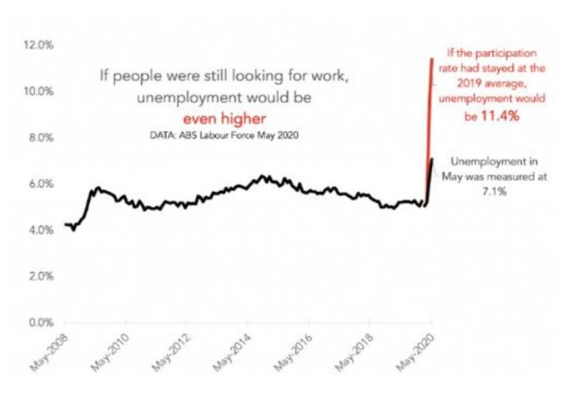

### 2021

> W starożytności za największe źródło wolności uchodziła samowiedza, w średniowieczu - samodyscyplina, w nowożytności - samostanowienie, zaś współcześnie - samozadowolenie. Pierwsze wyzwala rozum, drugie ducha, trzecie wolę, zaś czwarte - żądzę pozbycia się trzech pozostałych.

Projekt ustawy o obronie ojczyzny to kolejny majstersztyk specjalistów od prawa karnego aktualnej władzy. Tym razem proponują, by do Kodeksu karnego zostały dodane... wykroczenia. 🤓

Chodzi między innymi o nowy art. 147b Kodeksu karnego, zgodnie z którym: "Kto bez usprawiedliwionej przyczyny (...) posiadając przydział organizacyjno-mobilizacyjny do jednostki przewidzianej do militaryzacji nie zgłasza się w określonym terminie i miejscu do odbycia ćwiczeń w tej jednostce - podlega karze aresztu do 30 dni albo karze grzywny".
Jak widać, proponuje się tutaj dodanie do Kodeksu karnego czynu zabronionego obwarowanego karą "aresztu do 30 dni" lub "karą grzywny". 
Nie ma w Kodeksie karnym czegoś takiego jak kara aresztu. Dodawane jest więc "przestępstwo" z karą nieznaną ustawie. 
Kara aresztu i "kara grzywny" to sankcje charakterystyczne dla prawa wykroczeń. Czyny zabronione pod groźbą kary dzielą się w Polsce na przestępstwa (w tym zbrodnie i występki, zagrożone surowymi karami) oraz na wykroczenia, które są sankcjonowane łagodniej na podstawie osobnego Kodeksu i w odrębnej procedurze. 
Zatem otwieramy kolejny rozdział "standardów" legislacyjnych w Polsce, tym razem polegający na próbie wpisania do Kodeksu karnego czynów stanowiących wykroczenia. 
Dotyczy to także nowych "przestępstw" - de facto wykroczeń - określonych w art. 147b ustęp 2 Kodeksu karnego oraz art. 147c ustępy 1 i 2 Kodeksu karnego (zamiast "ustępów" powinny być paragrafy "§")
To zupełnie świeży, obszerny projekt ustawy o obronie ojczyzny, który został upubliczniony w piątek 12.11.2021*.

Dogmatycznie rzecz biorąc... to się komentuje samo. 
(Oczywiście oprócz tych wykroczenio-przestępstw do Kodeksu karnego mają być dodane również nowe przestępstwa dotyczące służby obronnej dla kraju).  

### 2020

Today's Thought?

On Tuesday (November 3, 2020), the Reserve Bank of Australia made its monthly announcement with respect to the conduct of monetary policy.

They said that they saw the “high rate of unemployment as a national priority and it wants to do what it can to support job creation”.

But the reality is there current policy settings will leave around 900 thousand workers without jobs over the next two years. In addition, participation by 2021-22 is assumed to be well below its August 2019 peak, which means that an additional 135 thousand workers are likely to be enduring hidden unemployment by mid-2022. Before the pandemic unemployment was 690 thousand (December 2019).

The empirical evidence is clear that the Australian economy did not provide enough jobs since the mid-1970s and the conduct of monetary policy has contributed to the malaise. The RBA forced the unemployed to engage in an involuntary fight against inflation and the fiscal authorities further worsened the situation with their austerity bias.

Hence when the RBA suddenly starts claiming they plan to prioritise reducing unemployment you can take that for the provable Lie it represents...

If the RBA truly believe they can do more – why is unemployment going to persist at such high levels for years?

---

Media zwróciły uwagę na zamieszczony w internecie „List otwarty polskich lekarzy, naukowców i pracowników służby zdrowia do polskich władz oraz mediów”, który do 2 listopada pomimo grożących sankcji ośmieliło się podpisać 177 lekarzy.
W liście tym „polscy lekarze medycyny i pracownicy służby zdrowia” wyrazili „głębokie zaniepokojenie dotyczące ewolucji sytuacji zdrowotnej w Polsce w ostatnich kilku miesiącach, związanej z ogłoszoną pandemią Covid 19”.

<!-- Zdaniem sygnatariuszy listu „nie ma już medycznego i naukowego uzasadnienia dla kontynuacji stosowanych obostrzeń. Obecne zarządzanie kryzysowe stało się całkowicie nieproporcjonalne do zagrożenia i powoduje więcej szkody niż dobra”.

 

Sygnatariusze listu wezwali „do zakończenia nieuzasadnionych epidemiologicznie działań i natychmiastowego przywrócenia normalnych, demokratycznych zasad funkcjonowania Państwa, struktur prawnych, wszystkich naszych swobód obywatelskich oraz przestrzegania praw człowieka”.

 

Według sygnatariuszy listu „szkody dodatkowe wyrządzone obecnie ludności będą miały większy wpływ w bliskiej i dalekiej przyszłości na całą populację niż liczba osób aktualnie ochronionych przed SARS-CoV-2”.

 

W opinii sygnatariuszy listu „wprowadzono obowiązkowe środki, które nie mają podstawy naukowej oraz że w mediach wykreowana została "koronapanika" bez możliwości przeprowadzenia otwartej debaty”.

 

Sygnatariusze listu uważają, że „surowa, represyjna polityka dotycząca li tylko zakażeń koronawirusem silnie kontrastuje z aktualnie minimalną polityką rządu w kwestii zapobiegania i leczenia innych chorób, wzmacniania własnego układu odpornościowego poprzez zdrowy styl życia, optymalną opiekę z dbałością o jednostkę oraz inwestowaniem w personel służby zdrowia”.

 

W liście zwrócono uwagę na zmianę definicji pandemii - „przed 12 laty WHO zmieniło definicję "pandemii". Wcześniej pandemią nazywano zaraźliwą chorobę z wysoką liczbą zgonów, obecnie wystarczy fakt, że wirus rozprzestrzenia się po całym świecie. Umożliwiło to np. ogłoszenie epidemii "świńskiej grypy" w 2009r, która okazała się typowym schorzeniem infekcyjnym dróg oddechowych. A pamiętamy ówczesny lęk i szczepionki, które spowodowały powikłania neurologiczne (narkolepsję)”.

 

List przypomina, że „początkowo szacowana śmiertelność (stosunek liczby zgonów do liczby wszystkich zakażonych) z powodu zakażenia SARS-Cov 2 w najmniejszym stopniu nie znalazła potwierdzenia w żadnym kraju. Z badań naukowych wynika, że śmiertelność ta sytuuje się na poziomie 0,02-0,4% czyli na poziomie normalnej fali grypy sezonowej). W Polsce do dn. 7.09.2020 zmarło 300 osób z dodatnim testem PCR bez chorób współistniejących, czyli 0,01%.

 

Istnieje różnica pomiędzy śmiercią z powodu koronawirusa i z koronawirusem. Ludzie często są nosicielami wielu wirusów i potencjalnie patogennych bakterii jednocześnie. Jeśli weźmiemy pod uwagę, że większość ludzi z poważnymi objawami miało dodatkową chorobę, nie można wysnuć wniosku, że właśnie koronawirus był przyczyną śmierci. Statystyki ten fakt pominęły.

 

Najbardziej podatną grupą byli pacjenci w starszym wieku - 80 lub więcej lat. Większość (70%) zmarłych, młodszych niż 70 lat, cierpiała na inną chorobę np. sercowo-naczyniową, cukrzycę, chroniczną chorobę płuc lub otyłość.

 

Ogromna większość osób zarażonych (>98%) nie miała żadnych objawów lub przechodziła chorobę łagodnie.

 

W międzyczasie opracowano dostępną, bezpieczną i skuteczną terapię dla tych, którzy mają ciężki przebieg choroby - zastosowanie HCQ (hydroksychlorochinę), cynku i azytromycyny. Szybkie zastosowanie tej terapii prowadzi do wyzdrowienia i często zapobiega hospitalizacji. Dowodem skuteczności tej terapii są dane epidemiologiczne ze Szwajcarii, w których przedstawiono porównanie wskaźnika umieralności pacjentów, u których zastosowano lub nie zastosowano tej terapii”. Z listu wynika że Covid „nie jest to wirus-zabójca a choroba łatwa do wyleczenia”.

 

Czytelnicy listu mogą się z niego dowiedzieć, że „podstawą ogłoszenia epidemii/pandemii jest stwierdzana liczba dodatnich wyników niespecyficznego testu RT-PCR dającego wiele fałszywie dodatnich wyników, który sam jego twórca - Kary Mullis (otrzymał nagrodę Nobla w dziedzinie chemii w 1993r. za wynalezienie łańcuchowej reakcji polimerazy, PCR) uznał ten test za nieprzydatny do wykrycia i zdiagnozowania infekcji wirusowej i przeznaczony jest jedynie do procedur badawczych /38/. Test jest niezwykle czuły ale niespecyficzny i daje dodatnie wyniki również w przypadku zakażenia innymi czynnikami chorobotwórczymi [...] Test ten ponadto nigdy nie był walidowany czyli naukowo zweryfikowany”.

 

Z listu można się dowiedzieć, że „test PCR [...] nie mierzy, ile wirusów jest obecnych w próbce. Prawdziwa infekcja wirusowa oznacza masową obecność wirusów, tzw. ładunek wirusów. Jeśli ktoś otrzymał dodatni wynik testu, to nie oznacza, że ta osoba jest faktycznie klinicznie zarażona, jest chora lub będzie chora. Tak zwani "bezobjawowi nosiciele" nie zarażają innych”.

 

Zdaniem sygnatariuszy listu „ponieważ pozytywny wynik testu PCR nie wskazuje automatycznie aktywnej infekcji (zakażenia) lub zaraźliwości, a jednocześnie objawy kliniczne mogą być związane z zakażeniem innymi wirusami, nie usprawiedliwia to podjętych drastycznych środków społecznych, opartych wyłącznie na tych testach”.

 

Jak przypominają sygnatariusze listu „przez tysiące lat ciało ludzkie było codziennie narażone na kontakt z zaraźliwymi mikroorganizmami (wirusy, bakterie i grzyby). Jak wiadomo, prawidłowo funkcjonujący układ odpornościowy zapobiega rozwojowi choroby. Chronić należy osoby ze słabą bądź uszkodzoną odpornością poprzez zastosowanie środków higieny bądź dystans społeczny.

 

Okazuje się, że większość ludzi ma już wrodzoną lub nabytą odporność wobec np. grypy, koronawirusa czy innych wirusów. Potwierdzają to odkrycia na statku wycieczkowym Diamond Princess, który objęto kwarantanną z powodu kilku pasażerów zmarłych na Covid-19. Większość pasażerów była w podeszłym wieku i narażona w idealnych warunkach na transmisję wirusa. Jednakże 75% okazało się nie być zarażonymi. Tak więc nawet w grupie wysokiego ryzyka większość osób jest odporna na wirusa.

 

W sytuacji zagrożenia infekcją należy wzmacniać naturalną odporność poprzez zdrowe, pełnowartościowe odżywianie, oddychanie świeżym powietrzem, bez maseczki, zredukowanie stresu i zaspokajanie kontaktów społecznych i emocjonalnych.

 

Konsekwencje zastosowania locdown, izolacji społecznej i przymusu noszenia masek na zdrowie fizyczne i psychiczne”.

 

Komentując strategie walki z Covid sygnatariusze listu stwierdzili, że „porównując fale zakażeń/zachorowań/wskaźnika śmiertelności w krajach z polityką ścisłego lockdownu do krajów, w których nie narzucono tego obostrzenia (Holandia, Szwecja, Czechy, Białoruś), widzimy podobne krzywe przebiegu infekcji. Lockdown nie doprowadził do niższej śmiertelności.

 

Izolacja społeczna i szkody ekonomiczne w tym utrata pracy, upadek małych i większych firm w wielu branżach życia gospodarczego, doprowadziły do wzrostu przypadków depresji, stanów lękowych, samobójstw, przemocy rodzinnej i molestowania dzieci.

 

Zastosowanie izolacji doprowadziło również do bezczynności fizycznej osób w każdym wieku - zarówno dzieci, młodzieży, osób starszych, ponieważ zostali zmuszeni do pozostania w domu. Aktywność fizyczna wywiera pozytywny efekt nie tylko na funkcjonowanie poszczególnych układów i narządów organizmu ale także odgrywa rolę w funkcjonowaniu poznawczym, zmniejsza depresję i stany lękowe oraz poprawia poziom energii, samopoczucie jak i ogólną jakość życia.

 

Setki badań naukowych z dziedziny psychoneuroimmunologii udowadniają ścisłą wzajemną zależność układu nerwowego, immunologicznego, endokrynnego i krążenia stąd trudno nawet oszacować przyszłe konsekwencje wprowadzonych bezpodstawnie regulacji na zdrowie Polaków”.

 

Autorzy listu przypomnieli, że w wyniku irracjonalnych działań władz wobec covid „służba zdrowia w Polsce została sparaliżowana - zamknięte poradnie POZ, urągające medycznemu wykształceniu teleporady, zmniejszona liczba przyjęć na oddziały szpitalne, niediagnozowane choroby wymagające pilnego leczenia np. onkologicznego, nieleczone choroby przewlekłe, odkładane operacje”.

 

Komentując szkodliwy przymus noszenia masek autorzy listu przypomnieli, że „rozprzestrzenianie się wirusa zachodzi poprzez zarażenie drogą kropelkową (tylko u pacjentów, którzy kaszlą lub kichają) i aerozolową w zamkniętych, niewentylowanych pomieszczeniach. Dlatego też zakażenie jest niemożliwe na otwartym powietrzu. Śledzenie kontaktu i badania epidemiologiczne pokazują, że zdrowi ludzie (lub nosiciele bezobjawowi z pozytywnym wynikiem testu) są niemalże niezdolni do przeniesienia wirusa, stąd nie są dla siebie nawzajem zagrożeniem.

 

Również przenoszenie wirusa przez przedmioty (np. pieniądze, zakupy czy wózki sklepowe) nie zostało udowodnione naukowo.

 

Maski są wskazane w przypadku kontaktu z grupą ryzyka lub osobami z niewydolnością oddechową i zmniejszają ryzyko infekcji drogą kropelkową. Jak przedstawiono w badaniach splot włókien w polecanych do powszechnego noszenia maseczkach bawełnianych ma wielkość rzędu mikrometrów, podczas gdy wielkość wirusów mieści się w granicach nanometrów czyli jest 1000-krotnie mniejsza. Nie ma więc podstaw fizycznych do twierdzenia, że maski chronią przed wirusem przenoszonym drogą powietrzną i zmniejszają jego ewakuację w przypadku drogi kropelkowej od chorego z objawami infekcji.

 

Noszenie masek daje efekty uboczne. Niedobór tlenu (ból głowy, nudności, znużenie, utrata koncentracji) pojawia się dość szybko i ma efekt podobny do choroby wysokościowej. Pacjenci skarżą się na bóle głowy, problemy z zatokami i oddychaniem. Zakumulowane CO2 prowadzi dodatkowo do toksycznego zakwaszenia organizmu, co niekorzystnie wpływa na odporność. Niektórzy eksperci ostrzegają nawet, że wirus rozprzestrzenia się lepiej przy nieodpowiednim noszeniu maski.

Belgijski Kodeks Pracy (Kodeks 6) opisuje zawartość CO2 (wentylację w miejscu pracy) rzędu 900 ppm, maksymalnie 1200 ppm w szczególnych okolicznościach. Po noszeniu maski przez 1 minutę ten toksyczny limit jest znacznie podwyższony, trzykrotnie lub czterokrotnie przekraczając dopuszczalne maksymalne wartości. Jest to sytuacja oddychania w bardzo słabo wentylowanym pomieszczeniu. Standardy amerykańskie i unijne określają dopuszczalną koncentrację CO2 800-1500ppm.

Sterylne środowisko na szpitalnych salach operacyjnych, z precyzyjną regulacją wilgotności i temperatury, dostosowanym przepływ tlenu sprawia, że szpitale spełniają surowe standardy bezpieczeństwa.

Marco Pacori - włoski psycholog i psychoterapeuta zwrócił uwagę na konsekwencje obowiązkowego noszenia masek w wieku rozwojowym. Maska obejmuje dużą część twarzy, uniemożliwiając rozpoznanie, interpretację i imitację wyrazu twarzy. Według najwybitniejszych badaczy z dziedziny psychologii znanej jako "język ciała", mimika twarzy jest jednym z najważniejszych aspektów komunikacji międzyludzkiej/.

Obszar mózgu nazywany FFA (obszar fuzji twarzy) dojrzewa w wieku rozwojowym. Jeśli podczas tej fazy rozwoju twarz przez większość czasu jest przykryta maską (godziny spędzone w szkole z kolegami z klasy i nauczycielami), istnieje ryzyko, że obszar ten zaniknie, co spowoduje, że dziecko nie będzie już w stanie odróżnić jednej twarzy od drugiej, lub stworzyć obrazu siebie samego, aby móc rozpoznać cechy wyróżniające płeć; w praktyce młody człowiek będzie dorastał bezpłciowy, bez tożsamości i bez zdolności do zrozumienia, z kim ma do czynienia”.

Według informacji zawartych w liście „badania nad szczepionkami przeciwko grypie pokazują, że w ciągu 10 lat tylko trzykrotnie stworzono szczepionkę o skuteczności na poziomie wyższym niż 50%. Szczepienie osób w podeszłym wieku wydaje się być nieskuteczne. Po 75 roku życia skuteczność prawie nie występuje.

Z powodu stałej naturalnej mutacji wirusów, co można zaobserwować każdego roku w przypadku wirusa grypy, szczepionka jest co najwyżej tymczasowym rozwiązaniem, które wymaga nowych szczepionek za każdym następnym razem. Nieprzetestowana szczepionka, prowadzona w trybie awaryjnym i taka, której twórcy już uzyskali zwolnienie z odpowiedzialności prawnej od niepożądanych skutków, budzi poważne wątpliwości. Wątpliwości budzi także sposób produkcji szczepionki, brak przeprowadzenia standardowych, kilkuetapowych badań klinicznych, które zajmują zwykle kilka lat obserwacji skuteczności i bezpieczeństwa”.

Według autorów listu „jeśli 95% ludzi doświadcza Covid-19 praktycznie bezobjawowo, wystawienie ich na działanie nieprzetestowanej szczepionki jest karygodne”.

W liście opisana jest też kwestia zwalczania prawdy o fałszywej pandemii - „wiele materiałów video oraz artykułów licznych, niezależnych autorytetów i ekspertów naukowych są usuwane z mediów społecznościowych. Taka sytuacja jest niedopuszczalna w wolnym, demokratycznym kraju. Taka polityka powoduje również efekt paraliżujący, wywołuje panikę i karmi społeczeństwo strachem i zmartwieniami. Efekt ten jest wzmacniany stosowanymi wyrażeniami i nazewnictwem wojennym. Często wspominano "wojnę" i "niewidzialnego wroga", którego należy "pokonać". Używanie w mediach określeń takich jak "bohaterowie służby zdrowia na linii walki" i "ofiary korony" dolewały jeszcze oliwy do ognia, tworząc wizję światowej walki z "wirusem mordercą".

Bez ustanku bombardowani diagramami wypuszczanymi w stronę społeczeństwa dzień w dzień, godzinę po godzinie, bez omówienia tych diagramów, bez porównania ich ze śmiertelnością na grypę w ubiegłych latach, bez porównania ich do śmiertelności z innych przyczyn, spowodowało prawdziwą psychozę strachu w całej populacji. To nie jest informacja, to manipulacja”.

Podsumowując autorzy listu zażądali „natychmiastowego zaprzestania tych procedur - przeprowadzania masowych a niediagnostycznych testów, izolacji społecznej, zmuszania społeczeństwa do noszenia masek”. -->

---

  

---

### 2019

Neckermann bankrutuje

Josef Neckermann. Mroczna przeszłość powszechnie szanowanego niemieckiego biznesmena

Był jednym z najbardziej znanych i szanowanych przedsiębiorców w powojennych Niemczech. Podziwiano go też jako zdobywcę sześciu medali olimpijskich. I tylko nikt nie chciał mówić o tym, jak Josef Neckermann dorobił się swojej fortuny.

Josef Neckermann, jeden z najbogatszych i najbardziej szanowanych przedsiębiorców w powojennych Niemczech, urodził się w 1912 roku w Würzburgu. Pierwotnie nic nie zapowiadało, żeby chłopak miał zrobić karierę w biznesie. Jego wielką pasją była jazda konna, zamierzał więc zostać oficerem kawalerii. Plany rozsypały się po tym, jak w 1928 roku zmarł jego ojciec: lokalny potentat w handlu węglem.

Neckermann zmuszony był zastąpić rodziciela w rodzinnym interesie. W niedoszłym kawalerzyście szybko obudziła się ambicja.

Pierwszy milion
Czasy sprzyjały młodemu biznesmenowi. Rodzina Neckermanna, w której dominowały poglądy narodowo-konserwatywne, zaczęła sympatyzować z nazistami. Po przejęciu przez NSDAP władzy w Niemczech kariera Josefa wyraźnie nabrała rozpędu. Przedsiębiorca w 1933 roku wstąpił do SA (Sturmabteilung, Oddziałów Szturmowych), a dwa lata później został członkiem partii nazistowskiej.

Wtedy też, po wejściu w życie norymberskich ustaw rasowych o ochronie niemieckiej krwi (drastycznie ograniczających prawa obywatelskie żydowskich obywateli Niemiec), jego firma po raz pierwszy zwiększyła swój stan posiadania. W ramach „aryzacji” żydowskich przedsiębiorstw Neckermann zagarnął znany w Würzburgu dom towarowy Siegmunda Ruschkewitza.

  

Formalnie był to zakup, ale rzecz jasna pod potężną presją nazistowskiego reżimu. Z reguły żydowscy przedsiębiorcy otrzymywali za swoje firmy tylko marny ułamek wartości. O ile w ogóle otrzymali cokolwiek.

Tymczasem Neckermann nie zasypiał gruszek w popiele. Jego kolejną inwestycja polegała na „zaryzowaniu” dużego sklepu z tekstyliami. Wkrótce też ambitny würzburczyk zarobił pierwszy milion marek. W dużym stopniu na swoim antysemityzmie.

Firma w zamian za życie
Mimo że w dość krótkim czasie Neckermann stał się jednym z najzamożniejszych mieszkańców Würzburga, ciągle uważał że działa na zbyt małą skalę. Szukał czegoś specjalnego, na czym mógłby zbić fenomenalną fortunę.

### 1944

https://pl.wikipedia.org/wiki/Tirpitz

### 1922

https://pl.wikipedia.org/wiki/Tadeusz_Borowski_(pisarz)

---

<a href="https://github.com/TomaszWaszczyk/historia.waszczyk.com/edit/master/src/content/november-12.md" target="_blank">Edytuj tę stronę dzieląc się własnymi notatkami!</a>
