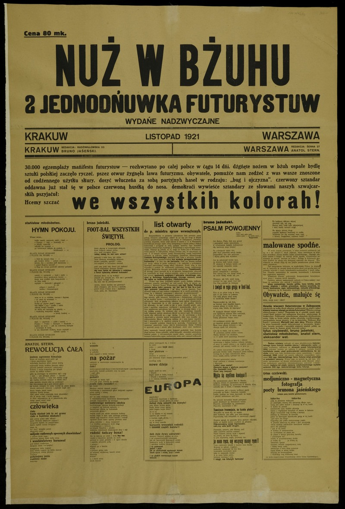

### 2017

> Nie chcę już opowiadać ludziom o swojej martyrologii, że siedziałam w więzieniu, że cierpiałam, że byłam przerażona. Chcę im powiedzieć, że życie bez miłości jest nic nie warte. (...) Trzeba mieć siłę, żeby wykrzesać w sobie miłość do bliźniego i to nie tylko do tego, który też ci ją okazuje. Ale także do tego, który jest np. wrogo nastawiony. To jest wielka sztuka, żeby się nie zniechęcić i nie machnąć wówczas ręką. Nie można zostawiać za sobą nie wyczyszczonych spraw międzyludzkich. Janowska, Alina.
> Łatwo jest mówić o Polsce. Trudniej dla niej pracować. Jeszcze trudniej umrzeć, a najtrudniej cierpieć.

W wieku 94 lat odeszła wybitna aktorka teatralna i filmowa Alina Janowska.
Widzom była doskonale znana między innym z takich filmów jak: Zakazane piosenki, Ostatni etap, Skarb oraz seriali: Wojna domowa, Podróż za jeden uśmiech czy Złotopolscy.
W czasie drugiej wojny światowej była łączniczką dowództwa Batalionu „Kiliński”, pod pseudonimem „Alina”oraz ''Setka'', bo można było na niej polegać na 100 %. Przez 9 miesięcy była więziona na tak zwanej "Serbii", czyli oddziale kobiecym Pawiaka, gdzie trafiła za pomaganie Żydom. Była uczestniczką Powstania Warszawskiego.

### 1975

Powstała Morska Jednostka Działań Specjalnych "Formoza", w której służbę pełnią płetwonurkowie bojowi. "Formoza" jest poodziałem wojsk specjalnych Wojska Polskiego.
Początki tej formacji sięgają roku 1974, kiedy powołano do życia Zespół Badawczy do Spraw Płetwonurków Morskich. "Formoza" wchodziła wtedy skład 3 Flotylli Okrętów i podlegała również pod rozkazy jej dowódcy. Pierwszym dowódcą jednostki nazwanej Wydziałem Płetwonurków a niejawnie określanej Wydziałem Działań Specjalnych był
kmdr por. dypl. Józef Rembisz (dziś komandor dyplomowany w stanie spoczynku).
Jednostka ta przez lata przechodziła wiele reform i transformacji. Jej żołnierze brali udział między innymi w polskiej misji w Afganistanie w ramach operacji Special Operations Joint Task Force -Afghanistan.
W dniu 23 września 2014 r. Jednostka Wojskowa Formoza otrzymała
sztandar ufundowany przez społeczeństwo Miasta Gdynia oraz Ligę Morską i Rzeczną.
Jednostka wojskowa cały czas prowadzi rekrutację do swych szeregów. Kandydaci do służby są poszukiwani wśród bardzo sprawnych i inteligentnych żołnierzy,
funkcjonariuszy i rezerwistów.

### 1942

We wsi Obórki na Wołyniu funkcjonariusze Ukraińskiej Policji Pomocniczej pod niemieckim dowództwem dokonali pierwszego masowego mordu na zamieszkujących tam Polakach.
Preludium do tej zbrodni była napaść na tę wieś w dniu 11 listopada 1942 roku, kiedy to Ukraińcy wywlekając z domów i bijąc do nieprzytomności kijami aresztowali 13 Polaków pod zarzutem współpracy z radziecką partyzantką i ukrywania Żydów.
13 listopada 1942 roku zbrodniarze wrócili do wsi. Tym razem wyganiali z domów wszystkich, których w nich zastali. Ludzi zapędzono do jednej ze stodół i zmuszono ich do położenia się twarzą do ziemi, po czym oddano strzały w tył głowy. Po zbrodni majątek zabitych został zagrabiony, a wieś spalona następnego dnia. Zabito 37 Polaków, 1 Ukrainkę i 1 Żydówkę.

### 1921

W Krakowie została opublikowana w formie plakatu druga jednodniówka futurystów polskich Nuż w bżuhu.
Na ulicach Krakowa, a dwa tygodnie później – Warszawy, można było kupić „Nuż w bżuhu”, dwustronicową, gęsto zadrukowaną jednodniówkę futurystów – młodych artystów propagujących kult cywilizacji i masowość sztuki. Zgodnie z uproszczoną ortografią pisali: dźgńęte nożem w bżuh ospałe bydlę sztuki polskiej zaczęło ryczeć. pszez otwur żygnęła lawa futuryzmu. (...) demokraci wywieźće sztandary ze słowami naszych szwajcarskich pszyjaćuł: „Hcemy szczać we wszystkih kolorah!”. Prasa na występy futurystów reagowała oburzeniem, a Anatol Stern trafił za bluźnierstwo na trzy miesiące do aresztu. Oprócz niego do grupy należeli m.in. Bruno Jasieński, Aleksander Wat i Tytus Czyżewski.

  

### 1916

W Drobnicach w powiecie wieluńskim urodził się Ignacy Bator "Opór" (zdjęcie) porucznik, Cichociemny, strzelec-radiooperator 301 Dywizjonu Bombowego Ziemi Pomorskiej, uczestnik Powstania Warszawskiego.
W 1942 roku zgłosił się na ochotnika do przerzutu do Polski w celu walki z Niemcami. Zgodę na to otrzymał w maju 1942 roku. Na terytorium okupowanej Polski został zrzucony pod koniec stycznia 1943 roku. Podjął służbę w konspiracji antyhitlerowskiej pod pseudonimem "Opór". Zginął w Powstaniu
Warszawskim 3 sierpnia 1944 roku.
Odznaczony Krzyżem Srebrnym Orderu Virtuti Militari, czterokrotnie Krzyżem Walecznych, Złotym Krzyżem Zasługi z Mieczami oraz brytyjskim odznaczeniem wojskowym Distinguished Flying Cross.
Spoczywa na Cmentarzu Wojskowym na Powązkach.

---

<a href="https://github.com/TomaszWaszczyk/historia.waszczyk.com/edit/master/src/content/november-13.md" target="_blank">Edytuj tę stronę dzieląc się własnymi notatkami!</a>
