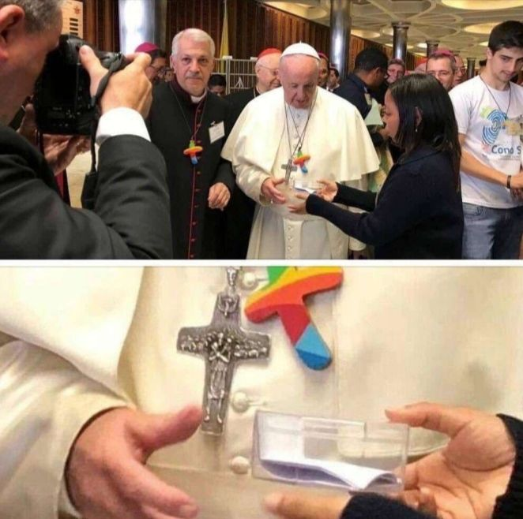

### 2021

  

---

"𝗥𝗼𝘀𝗷𝗮 𝗽𝗿𝘇𝘆𝗴𝗼𝘁𝗼𝘄𝘂𝗷𝗲 𝘀𝗶ę 𝗱𝗼 𝘀𝘇𝘆𝗯𝗸𝗶𝗲𝗷, 𝘁𝘆𝗴𝗼𝗱𝗻𝗶𝗼𝘄𝗲𝗷 𝘄𝗼𝗷𝗻𝘆."

"Rozważania na temat potencjalnej wojny z Rosją warto zacząć od geografii. To właśnie nasze położenie na mapie Europy i warunki geograficzne w tej części świata skazują nas i Rosję na działanie w ciągłym niepokoju"
"Jesteśmy „uwięzieni” na wielkiej Nizinie Środkowoeuropejskiej"
"Geografia kształtuje w dużej mierze rosyjską geopolitykę już od stuleci."

"Gra toczy się o kontrolę tzw. strefy zgniotu, czyli państw i obszarów leżących pomiędzy krajami wschodniej flanki NATO a Rosją."

"Zdaniem założyciela Strategy&Future Jacka Bartosiaka Rosja nie dysponuje obecnie wielką liczebnie armią i nie szykuje się do wojny na wielką skalę."

Rosja "nie może sobie pozwolić na skoncentrowanie bardzo dużych sił na zachodnim kierunku operacyjnym, a tym samym na prowadzenie wojskowych działań na tym obszarze na dużą skalę. Rosja realizuje swoje geopolityczne interesy w dużej mierze za pomocą swoich strategicznych sił nuklearnych. Celem Moskwy nie jest jego zdaniem bezpośrednia wojskowa konfrontacja z Polską czy krajami bałtyckimi, która znacznie zaburzyłaby równowagę sił w regionie i zmobilizowała kraje Europy Zach."
"Rosja nie przygotowuje się do wojny regionalnej z Polską i próby okupacji terytorium Rzeczpospolitej. Realizuje co najwyżej „strategię nękania” lub operacje w „szarej strefie”, działając poniżej progu wojny kinetycznej."

"Rosja dysponuje według wypowiedzi jej ministra obrony Siergieja Szojgu 170 batalionowymi grupami szybkiego reagowania. To rosyjskie „błyskawiczne” siły są kluczowe w kontekście strategii „krótkiej wojny”. Jest tak dlatego, że dyslokowanie wojsk na duże odległości daje NATO czas na wysłanie posiłków na wschodnią flankę."

"Polska w obecnej sytuacji jest w stanie w godzinie W wystawić od 10 do 12 batalionowych grup taktycznych (BTW), a to stanowczo zbyt mało, aby polityka odstraszania na wschodniej flance NATO była skuteczna."
"Polskie wojsko to wyspy nowoczesności na morzu zacofania."

---

„Jednak po słowach Kaczyńskiego o IV Rzeszy o żadnym resecie czy rozejmie nie może być mowy. W przekazach dnia PiS do tej pory mówiło się co najwyżej o dążeniu Niemiec do hegemonii, prezes sięgnął po amunicję o wiele większego kalibru. IV Rzesza Olafa Scholza to następczyni III Rzeszy Adolfa Hitlera. Polska musi znowu się szykować do walki. Nie o zablokowane przez Komisję Europejską pieniądze z Funduszu Odbudowy, nie o niepłacenie milionowych kar nałożonych przez TSUE, ale do walki na śmierć i życie.

Nie bez przyczyny Morawiecki na konferencji prasowej z Scholzem ocenił plany budowy europejskiej federacji jako glajchszaltowanie. Gleichschaltung to proces demontażu instytucji demokratycznych w III Rzeszy i podporządkowanie całego państwa nazistowskiej partii i jej przywódcy.

Nie bez przyczyny minister spraw zagranicznych Zbigniew Rau ogłosił w piątek na konferencji prasowej, że kwestia sposobu i trybu, w jakim Niemcy wypłacą Polsce reparacje, jest otwarta.

Kaczyński kazał po prostu spalić mosty. Machina propagandowa będzie się kręcić coraz szybciej. Śmiertelne żniwo pandemii, inflacja i poważne problemy gospodarcze na horyzoncie, wojna z Komisją Europejską. IV Rzeszą można przykryć wiele problemów obecnej władzy.”

„Idea federalnego państwa europejskiego jest starsza od europejskiej integracji. I mimo odważnego zapisu w niemieckiej umowie koalicyjnej pozostaje i przez długie lata pozostanie mrzonką. Także dla Niemców. Choć dyskusji o dalszym zacieśnianiu integracji trudno odmawiać sensu, patrząc na globalne wyzwania, jakie stoją przed Europą, i siłę jej globalnych przeciwników.

Dlatego chciałbym poznać polityka PiS, który ściągnął tekst z internetu, wydrukował go i dostarczył Kaczyńskiemu. Prezesa o taką dociekliwość nie podejrzewam. Z pewnością była to osoba, która wie, że państwa federalnego z Europy na razie nikt nie zbuduje. I zna Niemcy na tyle, by wiedzieć, że mówienie o IV Rzeszy w kontekście nowego rządu jest obrazą dla rozumu.

Chciałbym z tym politykiem szczerze porozmawiać o granicach cynizmu w polityce. I o zaraźliwości politycznego szaleństwa. W sprawach personalnych mam zresztą swoje typy.”

---

THIS YOU WILL NEVER LEARN IN SCHOOL

° Africa area = 30,37 million km2
° China area = 9,6 million km2
° US area = 9,8 million km2
° Europa area = 10,18 million km2
● Africa is bigger than all of Europe, China and the United States of America together.
● But on most world maps, Africa is represented in downsize.
This is deliberately done to create the visual effect of a small Africa to manipulate, brainwash, and deceive Africans wherever they are.
- Africa has 60 % arable land;
- Africa owns 90 % of raw material reserve;
- Africa owns 40 % of the global gold reserve;
- Africa, 33 % of diamond reserve;
- Africa has 80 % of Coltan's global reserve (mineral for telephone and electronics production), mainly in the Democratic Republic of Congo.
- Africa has 60 % of global cobalt reserve (mineral for car battery manufacture)
- Africa is rich in oil and natural gas.
- Africa (Namibia) has the world's richest fish coastline.
- Africa is rich in manganese, iron and wood.
- Africa is three times the area of China, three times the area of Europe, three times the United States of America.
- Africa has thirty-half million km2 (30 875 415 km2);
- Africa has 1,3 billion inhabitants (China has 1,4 billion inhabitants in 9,6 million km2).
Which means Africa is SUBPOPULATED.
-The arable lands of the Democratic Republic of Congo are capable of feeding all of Africa.
And all of Africa's arable land is a cord to feed the whole world.
- The Democratic Republic of Congo has important rivers that can illuminate Africa.
The problem is that the CIA, western companies and some African puppets have destabilized DRC for decades.
- Africa is a culturally diverse continent in terms of dance, music, architecture, sculpture, etc.
- Africa accommodates 30.000 medicinal recipes and herbs that the West modifies in its laboratories.
- Africa has a young global population that should reach 2,5 billion by the year 2050.

---

### 2017

> Nie chcę już opowiadać ludziom o swojej martyrologii, że siedziałam w więzieniu, że cierpiałam, że byłam przerażona. Chcę im powiedzieć, że życie bez miłości jest nic nie warte. (...) Trzeba mieć siłę, żeby wykrzesać w sobie miłość do bliźniego i to nie tylko do tego, który też ci ją okazuje. Ale także do tego, który jest np. wrogo nastawiony. To jest wielka sztuka, żeby się nie zniechęcić i nie machnąć wówczas ręką. Nie można zostawiać za sobą nie wyczyszczonych spraw międzyludzkich. Janowska, Alina.
> Łatwo jest mówić o Polsce. Trudniej dla niej pracować. Jeszcze trudniej umrzeć, a najtrudniej cierpieć.

W wieku 94 lat odeszła wybitna aktorka teatralna i filmowa Alina Janowska.
Widzom była doskonale znana między innym z takich filmów jak: Zakazane piosenki, Ostatni etap, Skarb oraz seriali: Wojna domowa, Podróż za jeden uśmiech czy Złotopolscy.
W czasie drugiej wojny światowej była łączniczką dowództwa Batalionu „Kiliński”, pod pseudonimem „Alina”oraz ''Setka'', bo można było na niej polegać na 100 %. Przez 9 miesięcy była więziona na tak zwanej "Serbii", czyli oddziale kobiecym Pawiaka, gdzie trafiła za pomaganie Żydom. Była uczestniczką Powstania Warszawskiego.

### 1975

Powstała Morska Jednostka Działań Specjalnych "Formoza", w której służbę pełnią płetwonurkowie bojowi. "Formoza" jest poodziałem wojsk specjalnych Wojska Polskiego.
Początki tej formacji sięgają roku 1974, kiedy powołano do życia Zespół Badawczy do Spraw Płetwonurków Morskich. "Formoza" wchodziła wtedy skład 3 Flotylli Okrętów i podlegała również pod rozkazy jej dowódcy. Pierwszym dowódcą jednostki nazwanej Wydziałem Płetwonurków a niejawnie określanej Wydziałem Działań Specjalnych był
kmdr por. dypl. Józef Rembisz (dziś komandor dyplomowany w stanie spoczynku).
Jednostka ta przez lata przechodziła wiele reform i transformacji. Jej żołnierze brali udział między innymi w polskiej misji w Afganistanie w ramach operacji Special Operations Joint Task Force -Afghanistan.
W dniu 23 września 2014 r. Jednostka Wojskowa Formoza otrzymała
sztandar ufundowany przez społeczeństwo Miasta Gdynia oraz Ligę Morską i Rzeczną.
Jednostka wojskowa cały czas prowadzi rekrutację do swych szeregów. Kandydaci do służby są poszukiwani wśród bardzo sprawnych i inteligentnych żołnierzy,
funkcjonariuszy i rezerwistów.

### 1942

We wsi Obórki na Wołyniu funkcjonariusze Ukraińskiej Policji Pomocniczej pod niemieckim dowództwem dokonali pierwszego masowego mordu na zamieszkujących tam Polakach.
Preludium do tej zbrodni była napaść na tę wieś w dniu 11 listopada 1942 roku, kiedy to Ukraińcy wywlekając z domów i bijąc do nieprzytomności kijami aresztowali 13 Polaków pod zarzutem współpracy z radziecką partyzantką i ukrywania Żydów.
13 listopada 1942 roku zbrodniarze wrócili do wsi. Tym razem wyganiali z domów wszystkich, których w nich zastali. Ludzi zapędzono do jednej ze stodół i zmuszono ich do położenia się twarzą do ziemi, po czym oddano strzały w tył głowy. Po zbrodni majątek zabitych został zagrabiony, a wieś spalona następnego dnia. Zabito 37 Polaków, 1 Ukrainkę i 1 Żydówkę.

### 1921

W Krakowie została opublikowana w formie plakatu druga jednodniówka futurystów polskich Nuż w bżuhu.
Na ulicach Krakowa, a dwa tygodnie później – Warszawy, można było kupić „Nuż w bżuhu”, dwustronicową, gęsto zadrukowaną jednodniówkę futurystów – młodych artystów propagujących kult cywilizacji i masowość sztuki. Zgodnie z uproszczoną ortografią pisali: dźgńęte nożem w bżuh ospałe bydlę sztuki polskiej zaczęło ryczeć. pszez otwur żygnęła lawa futuryzmu. (...) demokraci wywieźće sztandary ze słowami naszych szwajcarskich pszyjaćuł: „Hcemy szczać we wszystkih kolorah!”. Prasa na występy futurystów reagowała oburzeniem, a Anatol Stern trafił za bluźnierstwo na trzy miesiące do aresztu. Oprócz niego do grupy należeli m.in. Bruno Jasieński, Aleksander Wat i Tytus Czyżewski.

  

### 1916

W Drobnicach w powiecie wieluńskim urodził się Ignacy Bator "Opór" (zdjęcie) porucznik, Cichociemny, strzelec-radiooperator 301 Dywizjonu Bombowego Ziemi Pomorskiej, uczestnik Powstania Warszawskiego.
W 1942 roku zgłosił się na ochotnika do przerzutu do Polski w celu walki z Niemcami. Zgodę na to otrzymał w maju 1942 roku. Na terytorium okupowanej Polski został zrzucony pod koniec stycznia 1943 roku. Podjął służbę w konspiracji antyhitlerowskiej pod pseudonimem "Opór". Zginął w Powstaniu
Warszawskim 3 sierpnia 1944 roku.
Odznaczony Krzyżem Srebrnym Orderu Virtuti Militari, czterokrotnie Krzyżem Walecznych, Złotym Krzyżem Zasługi z Mieczami oraz brytyjskim odznaczeniem wojskowym Distinguished Flying Cross.
Spoczywa na Cmentarzu Wojskowym na Powązkach.

---

<a href="https://github.com/TomaszWaszczyk/historia.waszczyk.com/edit/master/src/content/november-13.md" target="_blank">Edytuj tę stronę dzieląc się własnymi notatkami!</a>
