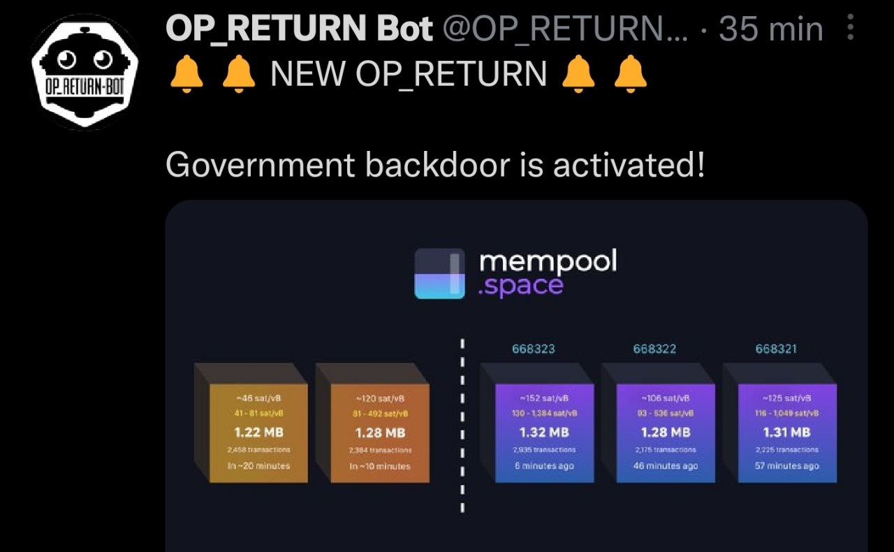

### 2022

> Thanks to KYC/AML regulations the criminals at FTX now have the name, address and passport details of millions of individuals.

“There are decades where nothing happens; and there are weeks where decades happen.”

― Vladimir Ilyich Lenin

We watched the collapse of one of the top exchanges in less than a week, followed by massive conspiracy theories such as FTX being a government agent to bring down crypto or a money laundering scheme for the Democratic Party.

The dominant headline, on the other hand, is that cryptocurrency is doomed to fail. What if I told you that this whole mess has nothing to do with crypto but everything to do with human behavior? Traditional finance is plagued with fraud. People forget about Bernie Madoff and MF Global. LTCM was not a scam, but rather a manifestation of arrogance, overconfidence, and overleverage. FTX was a hybrid of the two, a little bit of Bernie and a little LTCM. Saying crypto is a scam now is akin to saying the Euro is a hoax when a major bank or stock exchange goes bankrupt.

So is this the end?

The industry is too significant and offers too much to eventually disappear. However, it will need to start reevaluating its dependence on centralized institutions and exchanges, and perhaps put more of an emphasis on DeFi and actual use cases. Use it for payments and other purposes so that you may promote it as an improvement over our inefficient financial system at the moment.

What exactly do I mean by inefficient? In the last 16 years, the S&P 500 has had eleven sectors, with financials being one of the poorest performers (XLF), and banks being the worst performer within financials. The market is telling you that Finance is primed for revolution. DeFi is that concept.

Let us abandon the casino mentality and 100x leveraged perpetual futures in favor of constructing a better version of the financial system that includes self-sovereignty and all other features. But if all you speak about is the number going up and mooning again, we're not going to make it. This is going to be a watershed moment for the industry.

Revolutionizing isn't about blowing things apart; it's about improving on what's already good. Most crucially, it is not about taking the same Tradfi model we know and making it digital; it is about incorporating new concepts such as self-sovereignty, peer-to-peer, and immutability. As an example, consider the JP Morgan experiments. They tokenized deposits, traded on an open blockchain such as Polygon, and employed an Aave Arch fork. That's the kind of actions you'll see in the future. But here's the thing: there is a tipping point between knowledge and experience.

Each of these new companies should find a person with a lot of experience in the Tradfi world and hire them. Accept them and ask them for help. Get some experienced people to help you through the change. One thing is certain: Crypto will be fought by regulators, even though we need them so much. Talking with people who have been there before can help.

Build the framework for this new financial technology, and as a group we will be stronger and more powerful.

### 2021

  

### 2020

Kobieta która dąży do likwidacji chrześcijaństwa:

  

### 2018

  

---

<a href="https://github.com/TomaszWaszczyk/historia.waszczyk.com/edit/master/src/content/november-14.md" target="_blank">Edytuj tę stronę dzieląc się własnymi notatkami!</a>
