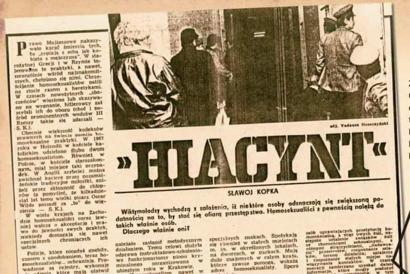

### 1985

1985 roku z rokazu ministra spraw wewnętrznych Czesława Kiszczaka Milicja Obywatelska rozpoczęła na terenie całego kraju akcję o kryptonimie Hiacynt. Była to trwająca dwa lata inwigilacja polskich środowisk homoseksualnych.
Oficjalnym powodem podjęcia przez władze tego kroku była chęć zapobiegania epidemii AIDS oraz walka z prostytucją. W rzeczywistości chodziło jednak o zebranie jak największej ilości materiałów operacyjnych, które mogłyby skompromitować i którymi dałoby się później szantażować niektórych ludzi oraz zmusić ich w ten sposób do współpracy ze Służbą Bezpieczeństwa.
Werbowany w szkole, na uczelni czy w zakładzie pracy człowiek, w stosunku do którego istniało podejrzenie, że jest homoseksualistą dostawał do podpisu lojalkę następującej tresci:
" Niniejszym oświadczam, że ja [imię i nazwisko] jestem homoseksualistą od urodzenia. Miałem w życiu wielu partnerów, wszystkich pełnoletnich. Nie jestem zainteresowany osobami nieletnimi."
Zwerbowanemu w ten sposób współpracownikowi zakładano tzw "różową teczkę".
Akcja „Hiacynt” spowodowała, że geje zaczęli jeszcze bardziej ukrywać swoją
orientację seksualną . Część osób homoseksualnych wyemigrowało z Polski. Wydarzenia spotkały się z reakcją zagranicznych mediów, władza robiła jednak wszystko, by sprawę zataić. Pytany o akcję rzecznik prasowy rządu Jerzy Urban w wywiadzie dla amerykańskiej prasy zaprzeczył, jakoby kiedykolwiek miała ona miejsce.
Ocenia się, że w wyniku akcji Hiacynt założono około 11 tysięcy teczek osobowych.
W roku 2007 dwóch działaczy na rzecz LGBT złożyło wniosek do Instytutu Pamięci Narodowej o wszczęcie ścigania generała Czesława Kiszczaka z powodu wydania rozkazu rozpoczęcia akcji Hiacynt. Wniosek ten jednak został odrzucony w lutym 2008 roku. W uzasadnieniu do odrzucenia wniosku IPN napisał:
[...] czynności przeprowadzone w ramach tej operacji związane były z ustawowymi zadaniami ówczesnej MO, określonymi w ustawie o powołaniu tej służby, do obowiązków której należała m.in. ochrona porządku i bezpieczeństwa, wykrywanie przestępstw, ściganie sprawców i przeciwdziałanie przestępczości. Jak wynika z ustaleń sprawy operacja „Hiacynt” miała charakter prewencyjny, jej celem było rozpoznanie zagrożeń kryminalnych w hermetycznych środowiskach osób homoseksualnych i w konsekwencji zapobieganie i zwalczanie przestępczości. Z powyższego powodu działaniom przedsięwziętym przez funkcjonariuszy MO nie sposób przypisać cech bezprawności.

  

### 1867

https://pl.wikipedia.org/wiki/W%C5%82adys%C5%82aw_Studnicki

---

<a href="https://github.com/TomaszWaszczyk/historia.waszczyk.com/edit/master/src/content/november-15.md" target="_blank">Edytuj tę stronę dzieląc się własnymi notatkami!</a>
