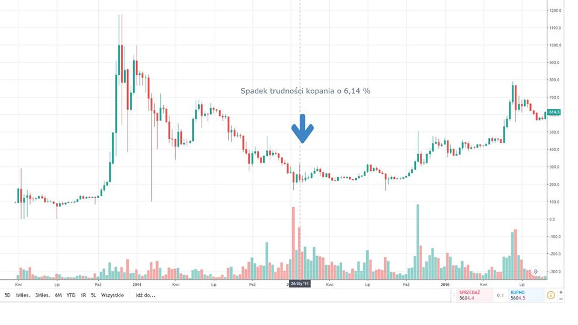
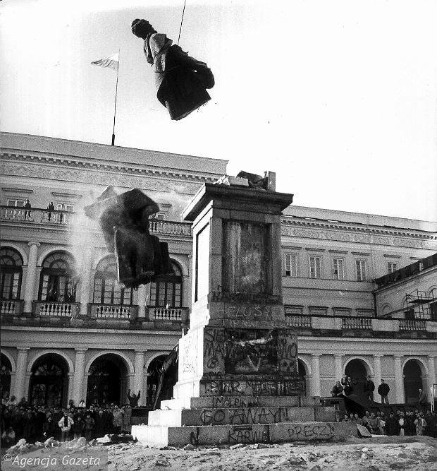

### 2019

> Udało się zwiększyć strategiczne rezerwy złota i podjąć działania w celu repatriacji znacznej części polskiego złota do kraju – podkreślał Adam Glapiński, prezes NBP. - Tworzymy rezerwy, które będą strzegły bezpieczeństwa finansowego Polski. Taki jest światowy trend, ale także oczekiwanie polskiego społeczeństwa.

Konwoje w Polsce.

Opinia: Polska akumuluje/zmienienia miejsce trzymania złota.

### 2018

Dzisiaj w nocy miała miejsce kolejna regulacja trudności kopania Bitcoina. Trudność spadła o 7,39%. Tak duży spadek mocy obliczeniowej ostatni raz odnotowany był 23.01 2013 roku ( -8,64% ) i była to kontynuacja spadków mocy obliczeniowych po bańce z 2011 roku. zmieściłem zdjęcie

Nieco mniejsze spadki mocy obliczeniowych Bitcoina ale wciąż znaczne ( 6,14 %) mieliśmy w styczniu 2015 roku czyli na samym dnie spadku z 2014 roku który potem po paru miesiacach jeszcze raz zbliżył się do tego poziomu jednak była to jednodniowa świeczka i szybki ruch ceny.

Osobiście uważam iż w związku z tak znacznym spadkiem moc obliczeniowa zaraz powróci korzystając z w sumie 10% rabatu będącym wynikiem ostatnich 3 regulacji trudności. Warto jednak zauważyć iż gdy tak się nie stanie bo cena BTC np spadnie do poziomu 1000 USD tak jak głoszą prognozy wszystkich hejterów i płaczków wypisujących mi na pv i w komentarzach z fejkowych kont to może mieć to ciekawe konsekwencje. Spadek BTC do 1000 USD lub niżej oznaczał by konieczność spadku trudności kopania o około 80% do nawet 90%. W praktyce oznaczało by to wyłączenie milionów urządzeń pobierających energię równowartości kilka elektrowni jądrowych. Skupienie wszystkich BTC w obiegu (około 17 mln sztuk jednak 50% z tego zalicza się do zamrożonych BTC u hodlerów lub w jest po prostu zgubiona ) przy tak niskich wycenach dało by śmieszną kwotę poniżej 17 MLD dolarów . Śmieszną dlatego gdyż sam Bitmain w 2017 roku zaksięgował ok 4-5 MLD USD zysku netto. Dzisiaj jak wiadomo Bitmain nie jest już aż tak konkurencyjny ze swoimi koparkami. Mimo iż wypuścił on niedawno nowe koparki oparte na chipach 7nm to wiemy iż konkurencja nie śpi i dostać możemy tak samo lub nawet bardziej wydajne koparki od konkurencji płacąc za nie również w Bitcoinach. Wiem że w okresie bessy każdy odmienny pogląd wydaje się być śmieszny i coraz częściej mi się za to od Was obrywa no ale cóż. To nie jest porada inwestycyjna, rynek wszystko zweryfikuje, nie podaję dat, nie naganiam ale gdy wszyscy w grudniu kupowali bo był szał tak dzisiaj wszyscy sprzedają... wydaje mi się to trochę analogiczna sytuacja w drugą stronę. W przeciwieństwie do kupna i wypłaty środków z giełdy gra na spadki kosztuje znacznie większe prowizje przy odpowiednio dużych dźwigniach i potrafi ona zaboleć.

  

  

### 1999

W wieku 78 lat zmarła Zinaida Giring szpieg Zrzeszenia Wolność i Niezawisłość w Wojewódzkim Urzędzie Bezpieczeństwa Publicznego w Białymstoku, sekretarka zastępcy szefa białostockiego UB majora Józefa Pluty.
Mając 25 zgłosiła się na ochotnika do pracy w tamtejszej katowni. Ocenia się, że dokumenty, które systematycznie przekazywała do warszawskiej siedziby WiN przyczyniły się do uratowania życia wielu byłych żołnierzy Armii Krajowej i działaczy podziemia antykomunistycznego. Jak sama tłumaczyła, do WiN, a następnie do pracy w UB zgłosiła się z chęci zemsty na komunistach, których oskarżała o wydanie Niemcom swojej matki- deputowanej.
Wśród dokumentów, które wynosiła były plany obław, aresztowań, rewizji czy zarządzeń i postanowień. Ujawniła całą kadrę kierowniczą. Rysopisy, charakterystyki, a nawet numery rejestracyjne samochodów, którymi jeździli ubecy. Ciekawostką, a jednocześnie przykładem wielkiej odwagi i zaufania, jakie potrafiła wzbudzić u ubeków był fakt, że wiele dokumentów wywiozła wprost do warszawskiego WiN samochodem należącym do białostockiego UB. Działała przez półtora roku. Wpadła 31 grudnia 1946 roku w punkcie kontaktowym Zarządu Głównego WiN w Warszawie podczas aresztowania prezesa warszawskiego Okręgu WiN Mariana Świtalskiego "Juhasa". W śledztwie wskazał on miejsce ukrycia archiwum Komendy Okręgu WiN. Została aresztowana i poddana brutalnemu śledztwu. 20 czerwca 1947 roku w obstawie 90 milicjantów i ubeków została postawiona przed Sądem Rejonowym w Białymstoku. Otrzymała 12 lat więzienia. Na tym jednak nie koniec. 13 października 1947 roku odbyła się kolejna rozprawa. Tym razem, otoczona już przez ponad 370 funkcjonariuszy została skazana przez sędziego majora Adama Gajewskiego na karę śmierci. Wyrok, na jej drugą z kolei prośbę został zamieniony przez Bieruta na 15 lat więzienia, z których 9 lat odsiedziała w bydgoskim Fordonie.
Do jej wpadki przyczyniła się prawdopodobnie inna członkini WiN Halina Żukowska, która zaproponowała współpracę z antykomunistami.

### 1989

Ukazało się ostatnie wydanie Dziennika Telwizyjnego.
Ten główny propagandowy i informacyjny program TVP ukazywał się na antenie od 1 stycznia 1958 roku,kiedy to zastąpił ukazujące się od 1956 roku Wiadomości Dnia. Pierwsze wydanie DTV poprowadził Jerzy Tepli (pózniejszy korespondent Telewizji Polskiej w RFN).
Po Sierpniu 1980 roku Dziennik Telewizyjny był jednym z najzacieklej krytykowanych przez Solidarność i środowiska opozycyjne bastionów władzy i równie zaciekle przez władzę PRL broniony i sterowany. Był często narzędziem manipulacji i dezinformacji, przy czym nie wzdragano się przed stosowaniem metod powszechnie uznawanych w dziennikarstwie za nieuczciwe i godne potępienia.
Po 13 grudnia 1981 roku prowadzący DTV między innnymi: Andrzej Racławicki, Witold Stefanowicz, Marcin Wilman czy Marek Tumanowicz przywdziali wojskowe mundury. Podobno był to pomysł właśnie Tumanowicza. W DTV swoją karierę rozpoczynała również pózniejsza rzeczniczka rządu Leszka Millera -Aleksandra Jakubowska.

---

Po 38 latach usunięto z Pl. Bankowego w Warszawie pomnik krwawego zbrodniarza komunistycznego Feliksa Dzierżyńskiego. W trakcie demontażu monument, ku radości zebranych ludzi, rozpadł się na części. Wydarzenie to jest jednym z symboli obalania komunizmu w Polsce.

  

---

### 1956

W Moskwie odbyły się polsko- radzieckie rozmowy, w których udział wzięła delegacja pod przewodnictwem Władysława Gomułki (zdjęcie). Ustalono, iż zadłużenie Polski według stanu z 1 listopada 1956 roku zostanie umorzone oraz postanowiono o repatriacji 30 tysięcy Polaków zamieszkałych na terenie Związku Radzieckiego. Uzgodniono również status wojsk radzieckich w Polsce.

### 1944

Główny Zarząd Polityczno Wychowawczy Ludowego Wojska Polskiego wydał wytyczne dotyczące pracy propagandowo- wychowawczej skierowane do szeregowych żołnierzy oraz kadry oficerskiej.
Uznano, iż mimo złożonej zaledwie miesiąc wcześniej przysięgi wiedza żołnierzy dotycząca tej kwestii jest niedostateczna.
W wytycznych czytamy:
" „Jeżeli żołnierz dezerteruje, porzuca służbę lub stara się jej uniknąć – łamie uroczystą przysięgę, że będzie »walczyć z niemieckim najeźdźcą o wyzwolenie Ojczyzny oraz utrwalenie wolności, niepodległości i potęgi Rzeczypospolitej«.”

„Jeżeli żołnierz jest samowolny, nieposłuszny, niekarny, gadatliwy, lekkomyślny – łamie przysięgę, że będzie »rzetelnie i sumiennie wypełniać obowiązki żołnierza polskiego, wiernie wykonywać wydane rozkazy i ściśle przestrzegać tajemnicy wojskowej«”.

„Jeżeli żołnierz jest maruderem, wałęsa się poza oddziałem, prowadzi się niemoralnie utrzymuje stosunki z niepewnymi politycznie osobami – narusza przysięgę, że będzie »wiernie służyć Rzeczpospolitej i nigdy nie skala imienia Polaka«.”

„Jeżeli żołnierz daje posłuch bałamutnym plotkom politycznym , rozpowszechnia je, zdradza brak czujności wobec wrogów Narodu, – narusza przysięgę, że dochowa »wierności Krajowej Radzie Narodowej, Władzy Naczelnej narodu Polskiego«”.

„W każdej gawędzie , przy omawianiu każdego wypadku, jaki zaszedł na terenie jednostki, powoływać się należy na odnośny ustęp roty przysięgi. Powinna ona każdemu żołnierzowi i oficerowi »wejść w krew«. – podkreślano w instrukcji. Zalecano także by „Plakat z tekstem przysięgi wykonany ozdobnie i przybrany zielenią znajdować się powinien w miejscu rozlokowania każdej kompanii, na widocznym miejscu”.

### 1942

Armia Krajowa przeprowadziła szeroką akcję dywersyjną, w sporym stopniu skierowaną przeciwko niemieckim transportom wojskowym. Jednym z elementów tego przedsięwzięcia było wysadzenie torów kolejowych w okolicach Radomia. Nie byłoby w tym fakcie nic nadzwyczajnego, gdyby nie to, że dokonał tego oddział dywersyjny "Dysk" złożony z samych kobiet. Dowódcą tej formacji, powołanej w roku 1940 przez majora Franciszka Niepokólczyckiego była lekarka sportowa i członek Polskiej Organizacji Wojskowej Zofia Franio "Doktór"

### 1923

Prezydent Stanisław Wojciechowski dokonał uroczystego otwarcia położonej w okolicach Warszawy Transatlantyckiej Centrali Radionadawczej.
Obiekt ten składający się z masztów radiowych był sposobem na utorzenie w Polsce ogólnopolskiej i międzykontynentalnej sieci radiotelegraficznej. Generalnym wykonawcą,który w 1922 roku przystąpił do budowy było Towarzystwo Akcyjne Machin i Odlewów. K.Rudzki i spółka.
W czasie okupacji TCR służyła Niemcom, którzy dzień przed przybyciem do Warszawy Rosjan 16 stycznia 1945 roku wysadzili maszty w powietrze. Odbudowana centrala rozpoczęła ponowne nadawanie w 1956 roku.

### 1847

Zakończył się w Berlinie proces powstańców wielkopolskich i działaczy niepodległościowych zrzeszonych w Centralizacji Poznańskiej i Związku Plebejuszy.
Na ławie oskarżonych znaleźli się m.in. Ludwik Mierosławski, Karol Libelt, Maciej Palacz, Władysław Niegolewski, Florian Ceynowa , Leon Kapliński. Przebieg procesu wzmógł sympatie europejskiej opinii publicznej dla narodu polskiego . Wyrokiem sądu 8 oskarżonych zostało skazanych na śmierć, 23 na dożywocie, a 103 na kary więzienia; pozostałych zwolniono.
Rewolucja berlińska, która wybuchła w 1848 roku sprawiła, że król pruski Fryderyk Wilhelm IV zastosował wobec skazanych Polaków amnestię.

### 1796

Zmarła caryca Katarzyna II. Chociaż zasiadała na tronie rosyjskim to w rzeczywistości była Niemką, której prawdziwe nazwisko to Zofia Fryderyka Augusta Anhalcka. Na tronie rosyjskim zasiadła z racji ślubu z carem Piotrem III.
Okres jej panowania to nie tylko czas twardych rządów w samej Rosji, ale również podporządkowanie sobie za sprawą rozbiorów Rzeczypospolitej.
To właśnie ona obaliła Konstytucję 3 Maja i zdławiła insurekcję kościuszkowską.
Prywatnie była kochanką polskiego króla Stanisława Augusta Poniatowskiego.

### 1780

W Warszawie w wieku 59 lat zmarł Bernardo Belotto Canaletto (grafika) Włoch, który w latach 1767 -1780 był nadwornym malarzem króla Stanisława Augusta Poniatowskiego.
Jego twórczość znacząco wpłynęła na rozwój malarstwa polskiego.
Głównym warszawskim dziełem Bellotta jest, wykonany na zamówienie królewskie, cykl 26 wedut z widokami miasta powstałych w latach 1770-80, do Zamku Królewskiego w Warszawie, do specjalnie nań przeznaczonej sali zwanej salą Prospektową (później salą Canaletta).

---

<a href="https://github.com/TomaszWaszczyk/historia.waszczyk.com/edit/master/src/content/november-17.md" target="_blank">Edytuj tę stronę dzieląc się własnymi notatkami!</a>
