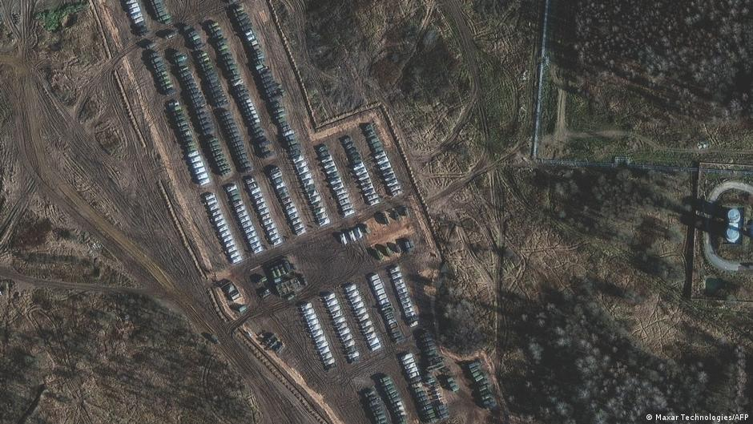

### 2022

> Globalization is over

<video width="640" height="480" controls>
<source src="./movies/november/globalisationisover.mp4" type="video/mp4">
Your browser does not support the video tag.
</video>

### 2021

Alarm na Ukrainie. Coraz większe ryzyko rosyjskiej inwazji

Nigdy od 2014 roku niebezpieczeństwo nowej, zakrojonej na szeroką skalę inwazji rosyjskiej nie było tak duże – alarmuje ambasador Ukrainy w Niemczech.

  

---

> Business Insider: „Biden chce śledztwa w sprawie cen paliw”

Podoba mi się ten pomysł. Uważam, że wraz z Jerome Powell, Szefem Rezerwy Federalnej powinni usiąść razem przy stole, podliczyć ile „świeżej pustej kasy” razem wydrukowali przez ostatni rok i wreszcie powinni zacząć szukać winnych wysokich cen. Tak jak to w każdym porządnym komunistycznym państwie się dawniej robiło!!!

---

### 2020

Francuski Episkopat oraz część wiernych nie akceptuje administracyjnego zakazu odprawiania mszy z udziałem wiernych, który obowiązuje we Francji od 3 listopada. Kilku organizatorów niedzielnych modlitw zostanie wezwanych w poniedziałek rano na komisariat policji w Bordeaux z powodu złamania zasady świeckości. 
Kontekst całej tej sytuacji istotnie zmienia fakt, że zgodnie z przyjętą w 1905 r. ustawą, która precyzowała zasady rozdziały państwa i kościoła, wszystkie budynki sakralne wybudowanej przed tym rokiem stały się własnością państwa.
Warto pamiętać, że własność prywatna w takich momentach daje poczucie bezpieczeństwa i chroni  przed ingerencją z zewnątrz osób trzecich, w tym państwa. Sytuacja Kościoła w Polsce w czasie lockdownu jest inna i z pewnością dlatego, że Kościół jest właścicielem budynków sakralnych.

---

Jedyną analogią dla sytuacji, w której już za moment się znajdziemy – kiedy system przestanie działać, kiedy nastąpi realny kolaps – jest stan wojny. Wtedy także instytucjonalno-społeczna struktura praktycznie przestaje działać, i przestają działać rozmaite formy symboliczne, które utrzymują w stanie względnej stabilności nasz obraz świata, siebie i innych, a tym samym regulują nasze myślenie i zachowanie się. 
Francuski myśliciel Rene Girard, wieszcząc w swojej ostatniej książce z 2010 roku, opublikowanej kilka lat przed śmiercią, nadchodzącą apokalipsę, stawiał tezę, że zachodnia kultura – wskutek rozmaitych procesów cywilizacyjnych – niemal całkowicie utraciła zdolność do kanalizowania i ukierunkowywania przemocy. Że – innymi słowy – nie działają już żadne cywilizowane instytucje mające na celu łagodzenie potencjalnie radykalnych konsekwencji konfliktu, które sprowadzają się jego zdaniem do jednego: powszechnego antagonizmu, który doprowadzi prędzej czy później do samozagłady. 
Nie wiem czy skrajny pesymizm Girarda wynika z trafnego przewidywania przyszłości, czy też jest wyłącznie konsekwencją pewnych teoretycznych założeń, które przyjął, ale jedno jest pewne: przed nami potężny kryzys, którego skali nie jesteśmy sobie w stanie nawet dzisiaj wyobrazić. 
Tymczasem ludzie stojący na czele instytucji mających za zadanie temu kryzysowi zapobiec – a także my sami, oddalający od siebie te myśli i zachowujący się tak, jakby i tym razem „wszystko miało być ostatecznie dobrze” – zdajemy się tego wszystkiego całkowicie nie dostrzegać. I zachowujemy się jakby nigdy nic. 
Co oczywiście tylko przyspiesza nadejście katastrofy.

---

### 1966

By the summer of 1966, the pressure on sterling was acute but Wilson was determined to resist devaluation. To him the pound was a symbol of national status, of Britain’s role in the world as a key player. On 12 July 1966 the Cabinet rejected the devaluation option and agreed to a tough package of deflation and austerity instead.

However, due to several factors including international crises and dock strikes, by November 1967 the financial pressures had become overwhelming. On 16 November the Chancellor of the Exchequer, James Callaghan, with Wilson’s backing, recommended to the Cabinet that sterling should be devalued by just under 15 per cent. This was agreed and then implemented, at 14 per cent on 18 November. A package of measures including defence cuts, restrictions on hire purchase (credit), and higher interest rates was also agreed.

---

<a href="https://github.com/TomaszWaszczyk/historia.waszczyk.com/edit/master/src/content/november-18.md" target="_blank">Edytuj tę stronę dzieląc się własnymi notatkami!</a>
