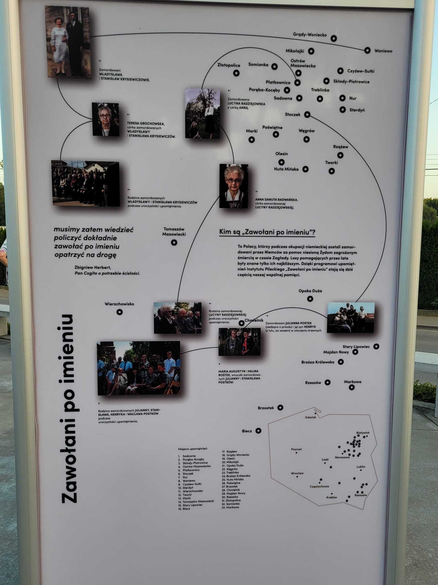
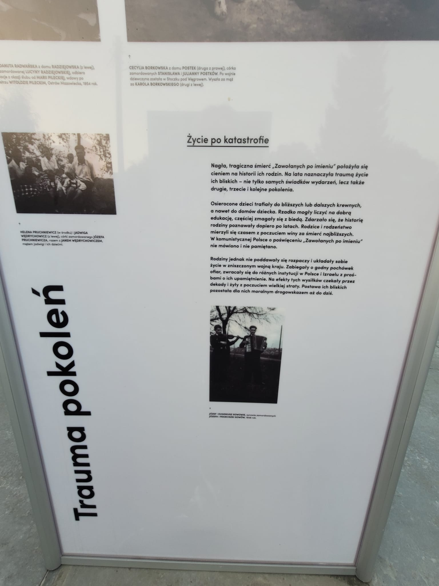
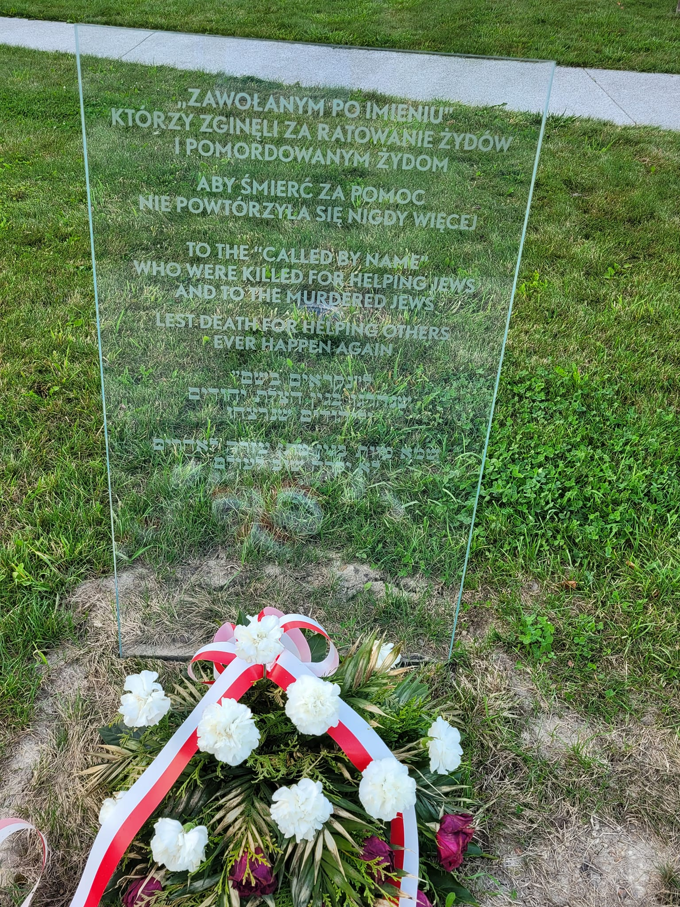
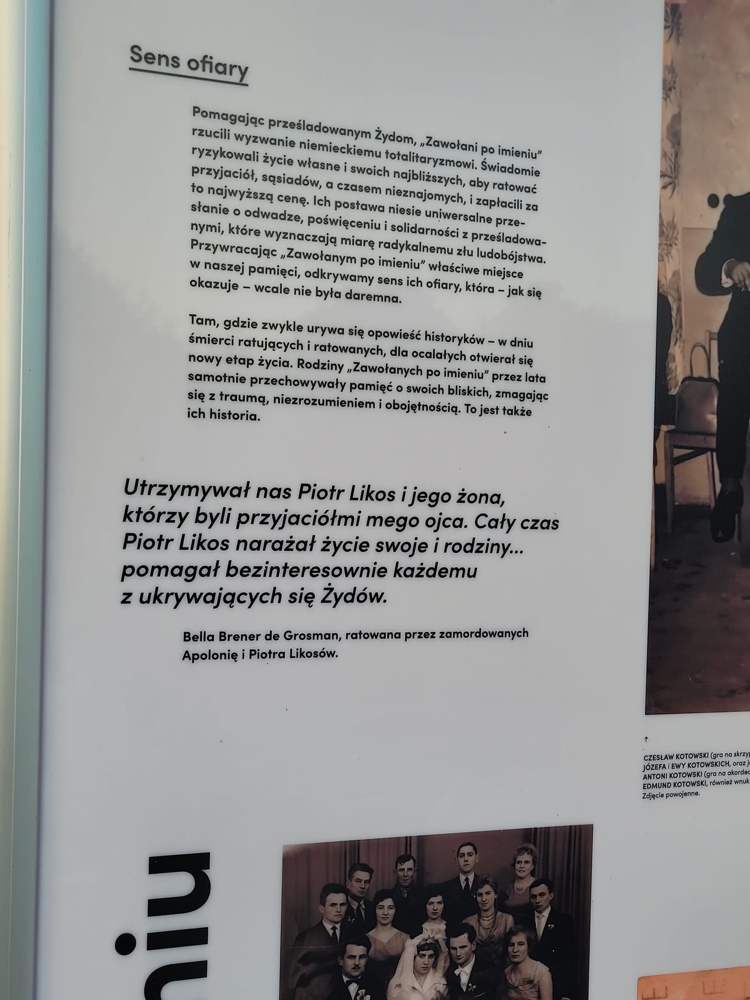
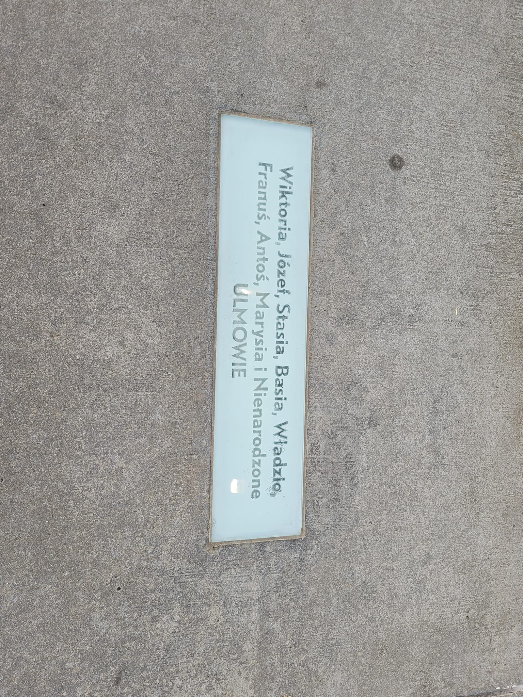
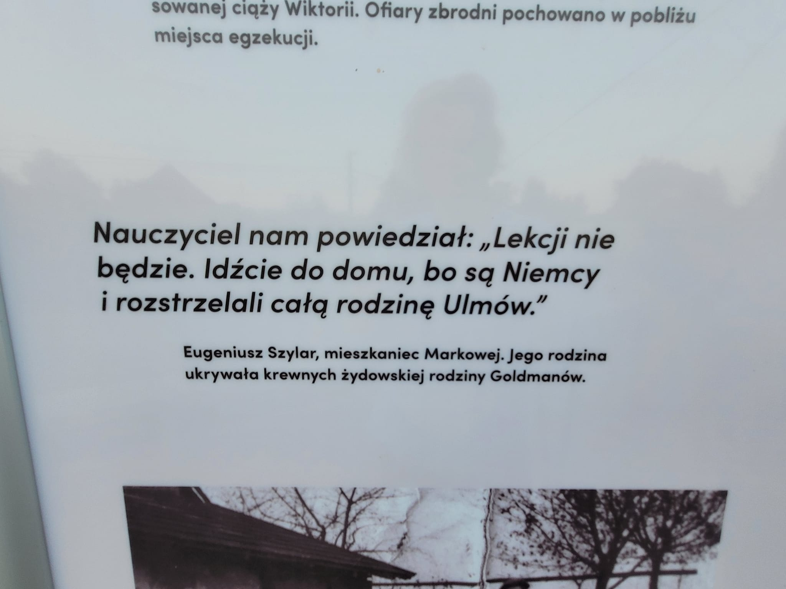
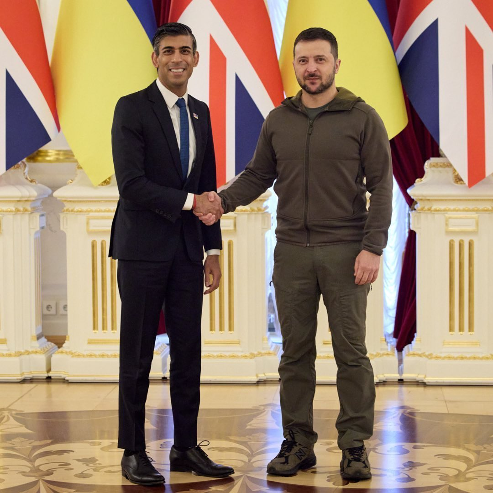
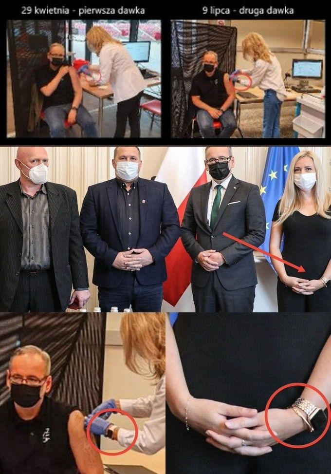

### 2023

  

  

  

  

  

  

  

  

  

  

  

  

### 2022

> Niedawno przy okazji pewnego projektu pracowałem z tak zwaną flaga Yiddish inaczej nazywana flaga aszkenazyjska. To nie jest zadna ofcjalna flaga ale pojawia sie tu i tamjako flaga zydów Aszkenazyjskich. Takich flag jest kilka róznych. Pomyslałem, że czemu polscy Żydzi nie mieliby miec swojej flagi? Kiedyś w domu nauki zagadałem do osoby siedzącej obok co robie dość często i powiedziałem: nu Cadyk, naucz mnie czegos, daj mi Torah, daj mi jakąś jednominutową lekcje Torah, coc dobrego! W odpowiedzi usłyszałem: Ja ciebie mam uczyć? przeciez ty jestes polskim Żydem, wy polscy Żydzi zawsze najmądrzejsi i wszystko wiecie najlepiej - powiedział to wyrźnie podkreslając sarkazm swoim tonem głosu. Pewnie, że jesteśmy najlepssi i najwaspanialsi, zawsze byliśmy i zawsze bedziemy i ja zawsze bedę dumny z bycia polskim Żydem, bycie polskim Żydem to nie jest bardzo specyficzne poczucie wewnętrzne wyjatkowości, a co? Bo czemu nie 🙂 Oczywiście traktujcie to z przymróżeniem oka trochę wszystko! Czy to sie komus podoba czy nie postanowiłem zaprojektować flage polskich Żydów! Prosze bardzo! przedstawiam wam falge Polskich Żydów. Jakby stała sie znana i akceptowana to nie zapomnijcie kto ja zaprojektował 🙂 Z Usmiechem i duma ślijcie flage polskich Żydów w Świat! Dla jasności ja nikogo nie reprezentuje i nie mam prawa reprezentować a flaga to efekt chwilowego natchnienia i mysli.... L'Chaim ©Eliyahu Yosef/Tajemniczy Świat Żydów

  

---

> Budżet Krakowa wygląda dramatycznie. Koszt obsługi zadłużenia to blisko 400 mln zł. Na rolowanie długów ma iść 200 mln. Trzeba pożyczyć 1,1 mld, by spiąć finanse. Pomyśleć, że ludzie, którzy do tego doprowadzili, nazywali populistami tych, którzy ostrzegali, że wydają ponad stan.

---

> Lech Wałęsa w Meksyku: "Jestem za tym żeby zorganizowanie Europy powierzyć Niemcom"

---

UK PM Sunak meets Zelensky

  

---

### 2021

Budowanie mieszkanio-cel (kredyt w pakiecie):

Marzysz o własnych czterech kątach? 🏠 Dzięki rządowemu programowi #PolskiŁad Twoje marzenia staną się realne. Prezydent Andrzej Duda podpisał ustawę o gwarantowanym kredycie mieszkaniowym! Co to oznacza dla Ciebie?

🔹 Kredyt dostaniesz bez wkładu własnego;
🔹 BGK - wspieramy rozwój firm udzieli Ci gwarancji do 20% kwoty kredytu (jednak nie więcej niż do 100 tys. złotych);
🔹 jednorazowo przysługiwać Ci będzie spłata kredytu w wysokości 20 tysięcy (w przypadku urodzenia się drugiego dziecka) lub 60 tysięcy złotych (w przypadku urodzenia się kolejnych dzieci).

🔔 Nowe przepisy wejdą w życie w pierwszej połowie 2022 roku.

  

---

Złoto wyrażone w PLN najdroższe w historii, PLN najsłabszy w historii.

  

---

– Szpitale powiatowe były i są „zwijane” – i to nie w wyniku decyzji tego czy innego rządu, ale dostosowywania się do rzeczywistych potrzeb, a zwłaszcza z powodu braku personelu medycznego, głównie lekarzy, którzy zniechęceni złymi warunkami pracy i płacy szukają zatrudnienia gdzie indziej. Taka jest rzeczywistość – bez względu na to, co mówi PiS

---

  

---

### 2000

<video width="640" height="480" controls>
<source src="./movies/november/szymon-perez-o-historii.mp4" type="video/mp4">
Your browser does not support the video tag.
</video>

---

<a href="https://github.com/TomaszWaszczyk/historia.waszczyk.com/edit/master/src/content/november-19.md" target="_blank">Edytuj tę stronę dzieląc się własnymi notatkami!</a>
