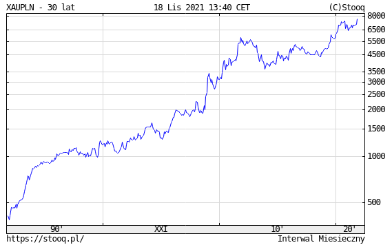

### 2021

Budowanie mieszkanio-cel (kredyt w pakiecie):

Marzysz o własnych czterech kątach? 🏠 Dzięki rządowemu programowi #PolskiŁad Twoje marzenia staną się realne. Prezydent Andrzej Duda podpisał ustawę o gwarantowanym kredycie mieszkaniowym! Co to oznacza dla Ciebie?

🔹 Kredyt dostaniesz bez wkładu własnego;
🔹 BGK - wspieramy rozwój firm udzieli Ci gwarancji do 20% kwoty kredytu (jednak nie więcej niż do 100 tys. złotych);
🔹 jednorazowo przysługiwać Ci będzie spłata kredytu w wysokości 20 tysięcy (w przypadku urodzenia się drugiego dziecka) lub 60 tysięcy złotych (w przypadku urodzenia się kolejnych dzieci).

🔔 Nowe przepisy wejdą w życie w pierwszej połowie 2022 roku.

  

---

Złoto wyrażone w PLN najdroższe w historii, PLN najsłabszy w historii.

  

---

– Szpitale powiatowe były i są „zwijane” – i to nie w wyniku decyzji tego czy innego rządu, ale dostosowywania się do rzeczywistych potrzeb, a zwłaszcza z powodu braku personelu medycznego, głównie lekarzy, którzy zniechęceni złymi warunkami pracy i płacy szukają zatrudnienia gdzie indziej. Taka jest rzeczywistość – bez względu na to, co mówi PiS

---

<a href="https://github.com/TomaszWaszczyk/historia.waszczyk.com/edit/master/src/content/november-19.md" target="_blank">Edytuj tę stronę dzieląc się własnymi notatkami!</a>
