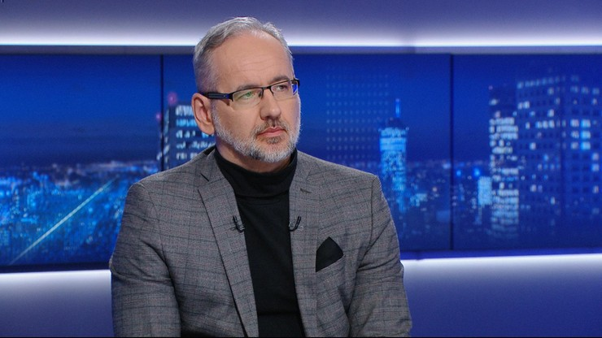
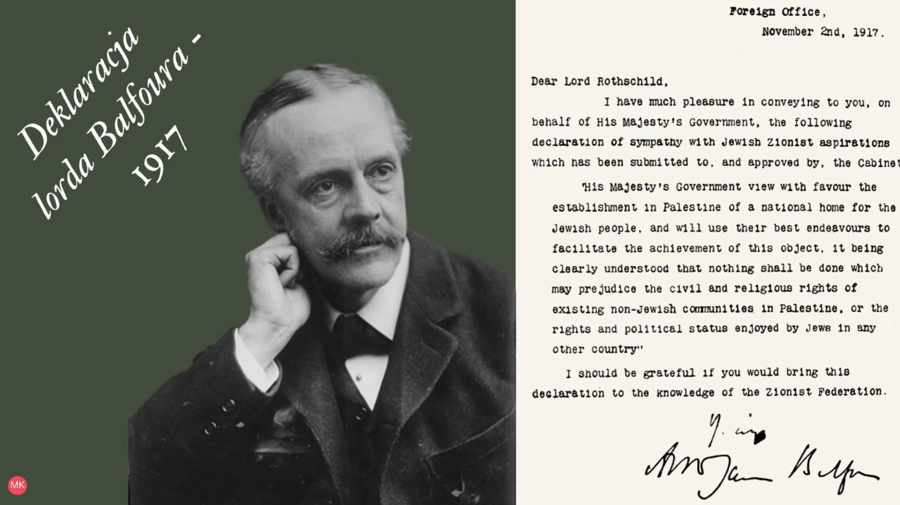

### 2022

> Dugin: trzeba zawrzeć nowy pakt Ribbentrop-Mołotow i wybawić Europę Zachodnią od Wschodniej. Zjednoczenie i niezależność od USA, wtedy Europa będzie ruską, a my po bratersku i słowiańsku rozwiążemy problem tych którzy przeszkadzają.

---

```
Dzień dobry,

od 19 listopada 2022 roku udostępnimy Państwu nową, bezpłatną funkcjonalność - Ślad węglowy w bankowości internetowej.

Umożliwia ona poznanie indywidualnej, orientacyjnej wartości śladu węglowego związanego z Państwa zakupami. Szacujemy go na podstawie płatności naszymi kartami. Częścią tej funkcjonalności są również: eko porady oraz pytania i odpowiedzi.
```

---

Berliner Zeitung: Ameryka wypycha Rosję z europejskiego rynku energii

„Rząd USA jest na drodze do wypchnięcia Rosji z europejskiego rynku energii. Koncern Westinghouse otrzymał kontrakt na budowę z Polsce pierwszej elektrowni atomowej” – podał w środę niemiecki dziennik „Berliner Zeitung”.

Gazeta w środę (02.11.2022) zaznacza, że amerykańska inwestycja jest wyrazem „kompleksowego nuklearnego partnerstwa energetycznego” zawartego przez Polskę z USA w 2020 roku.

Amerykańska minister energetyki opublikowała na Twitterze post, w którym określiła porozumienie z Polską jako „jasny sygnał pod adresem Rosji”.

„Nie pozwolimy dłużej na to, żeby (Rosja) wykorzystywała energię jako broń. Zachód solidarnie przeciwstawi się nie sprowokowanej agresji i zdywersyfikuje łańcuch dostaw energii, a także wzmocni współpracę w dziedzinie ochrony klimatu” – napisała Jennifer Granholm.

---

MakerDAO Developer Found Dead.

Nikolai Mushegian, an early developer of MakerDAO, was found dead on Friday in San Juan, Puerto Rico.

A 29-year-old man was found close to Condado Beach. His body was dragged there by water currents.

Nikolai contributed to the Web3 ecosystem in the early stage of Ethereum smart contracts. He predicted smart contract hacks and invented the security-oriented approach to smart contract design.

The reason of his death is unknown. Yesterday Twitter was full of speculations about whether it was an accident or a murder.

<br><br>

---

### 2021

> „Książę Karol twierdzi, że „ogromna kampania w stylu militarnym” jest wymagana, aby przeprowadzić „fundamentalną transformację gospodarczą”

---

> Pracodawca sprawdzi zaszczepienie pracowników. Niedzielski: ustawa na najbliższym posiedzeniu Sejmu

<br><br>

Minister zdrowia Adam Niedzielski powiedział w "Gościu Wydarzeń", że resort spodziewa się za dwa tygodnie wzrostu średniej liczby zakażeń do 10 tys. Odpowiedzią ma być ustawa, która da pracodawcom możliwość sprawdzenia, czy pracownik jest zaszczepiony. - Ustawa będzie kierowana na rząd i trafi na Sejm - powiedział polityk. - Wyborem jest zdrowie innych - wyjaśnił.

---

### 2020

It’s already been one year since I took up my role as President of the European Central Bank. It has been a difficult year for Europe and the world, but together we have achieved some important milestones:

• The outbreak of the coronavirus pandemic came as a deep shock to all of us and warranted fast policy responses – and we delivered. Our measures are providing crucial support to the eurozone economy.
• During the crisis, Europe has shown that by acting together, we can achieve more for European citizens. I am proud of our collaboration during this time.
• We launched the #ECBstrategyreview. It’s an intense process and we are leaving no stone unturned.
• I provided my signature for use on euro banknotes – it was great to see the finished product earlier this year.
• __We have started exploring the possibility of launching a digital euro.__

<br><br>

The period ahead will be challenging but I am ready, together with my colleagues, to continue supporting Europe’s economies.

---

Branża lotnicza znowu pikuje 😟 193 lotniskom europejskim grozi upadłość...w Polsce zagrożonych 60 tys miejsc pracy i ubytek PKB rzędu 2 mld USD.

---

### 1917

<br><br>

---

<a href="https://github.com/TomaszWaszczyk/historia.waszczyk.com/edit/master/src/content/november-2.md" target="_blank">Edytuj tę stronę dzieląc się własnymi notatkami!</a>
