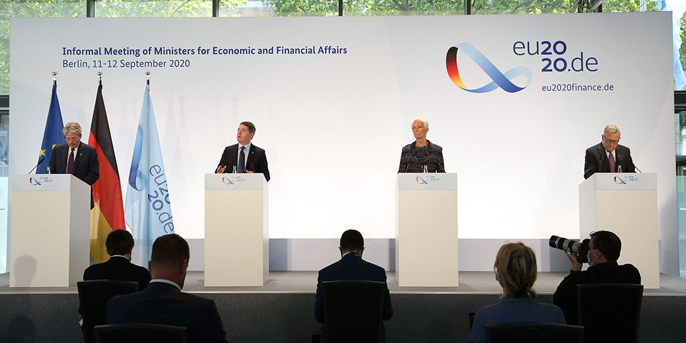

### 2020

It’s already been one year since I took up my role as President of the European Central Bank. It has been a difficult year for Europe and the world, but together we have achieved some important milestones:

• The outbreak of the coronavirus pandemic came as a deep shock to all of us and warranted fast policy responses – and we delivered. Our measures are providing crucial support to the eurozone economy.
• During the crisis, Europe has shown that by acting together, we can achieve more for European citizens. I am proud of our collaboration during this time.
• We launched the #ECBstrategyreview. It’s an intense process and we are leaving no stone unturned.
• I provided my signature for use on euro banknotes – it was great to see the finished product earlier this year.
• __We have started exploring the possibility of launching a digital euro.__

  

The period ahead will be challenging but I am ready, together with my colleagues, to continue supporting Europe’s economies.

---

Branża lotnicza znowu pikuje 😟 193 lotniskom europejskim grozi upadłość...w Polsce zagrożonych 60 tys miejsc pracy i ubytek PKB rzędu 2 mld USD.

---

---

<a href="https://github.com/TomaszWaszczyk/historia.waszczyk.com/edit/master/src/content/november-2.md" target="_blank">Edytuj tę stronę dzieląc się własnymi notatkami!</a>
