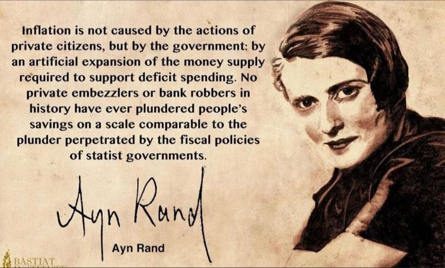
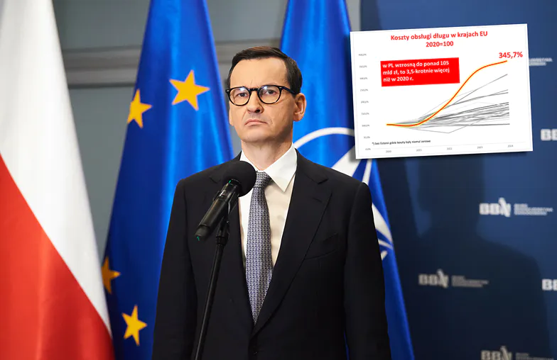
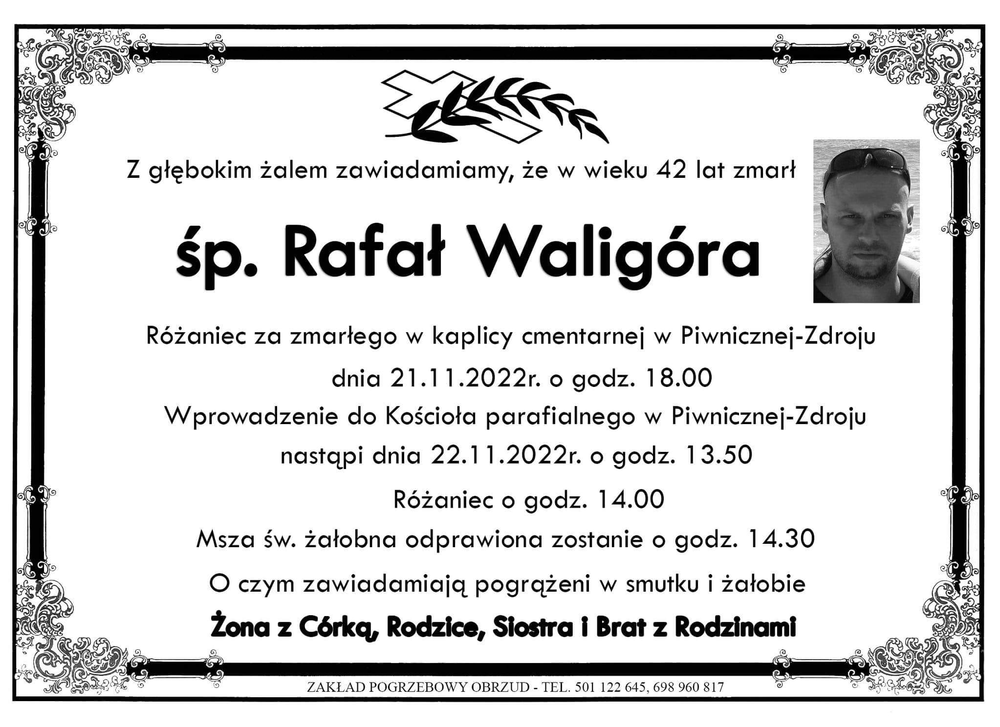
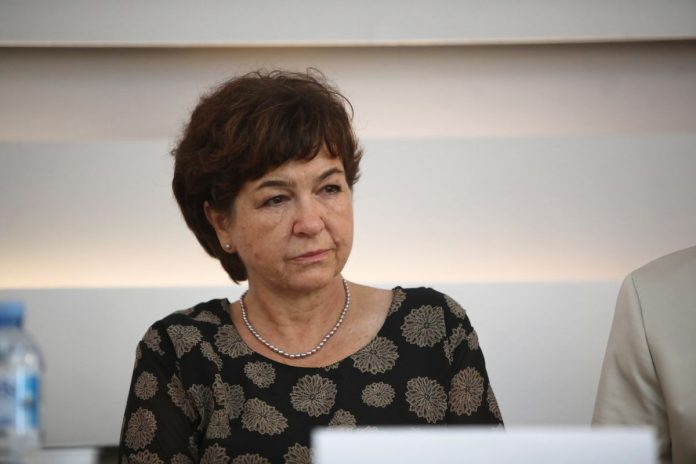
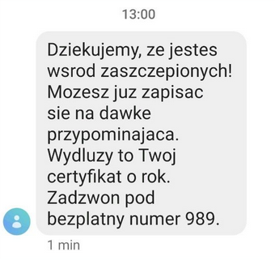

### 2023

  

<video width="640" height="480" controls>
<source src="./movies/november/przyjaciele.mp4" type="video/mp4">
Your browser does not support the video tag.
</video>

  

### 2022

Jesteśmy liderem w UE, ale tym rząd PiS się raczej nie pochwali. Zagrożenie dla Polski.

Koszty obsługi polskiego długu publicznego wrosną najszybciej w całej Unii i w 2024 r. wyniosą ponad 105 mld zł - prognozuje Komisja Europejska. - To oznacza, że będą one aż 3,5-krotnie wyższe niż jeszcze w 2020 r. - zauważa w komentarzu dla money.pl Sławomir Dudek, główny ekonomista FOR.

  

---

<!--    -->

---

Dorota Sienkiewicz zawieszona za zniechęcanie do szczepień przeciwko covidowi. Ten apel nie spodobał się Izbie Lekarskiej.

  

Dr Dorota Sienkiewicz została zawieszona w prawach do wykonywania zawodu przez Sąd Lekarski. Za ostrzeganie dzieci przed przyjęciem szczepionki przeciw Covid-19.

Jak podaje Polskie Stowarzyszenie Niezależnych Lekarzy i Naukowców, w dniu 14 listopada 2022 roku odbył się sąd nad dr Dorotą Sienkiewicz.

Białostocka Okręgowa Izba Lekarska przyczepiła się do słów dr Sienkiewicz skierowanych do dzieci i młodzieży w „Apelu do młodych Polaków”.

---

### 2021

> Life as a service.

  

---

Coraz więcej głosów "polityków", kapitał chce masowej adopcji już niedługo.

> Hillary Clinton: Bitcoin threatens US dollar as reserve currency.

---

Sad, but true.

  

---

<!-- ### 2020

 November 21, 2020

I’m running for the Polkadot council. My address is 13Gdmw7xZQVbVoojUCwnW2usEikF2a71y7aocbgZcptUtiX9.

My address has the verified identity “ROB” on the Polkadot mainnet.

I’ve had my candidacy up for some time, but haven’t focused strongly on securing a seat. This post represents my commitment to joining the Polkadot council, and my request for your support.

First, a bit of context on why I want to join. I’ve been in the Polkadot ecosystem quite literally from day 1, as a co-founder of the network. I made the first commit to the codebase and built most of the consensus and staking logic for Polkadot. For the past year, I’ve been focusing exclusively on designing and building parachains, which many consider to be Polkadot’s core feature. Before that, I wrote most of the BABE and GRANDPA consensus implementations that power the Polkadot and Kusama networks stably with hundreds of globally distributed validators.

Beyond the core technology, Polkadot has incredible potential to enact change, power research, and accelerate the growth of the blockchain space. My core values in this regard are privacy, liberty, and community. I don’t believe that freedom implies a degradation to the Hobbesian jungle. And I believe that the place where blockchain technology can take us will allow people to abstract over most of the complexity of everyday life and focus on the things that matter. The governance and treasury systems of Polkadot enable us to identify and fund key initiatives to increase the value provided by the network. Long term I’m interested in reducing the participation of the council in favor of automated mechanisms and incentives that accomplish the desired goals.

My long-term outset is driven by a vision of a transparent society better able to utilize its human resources and better able to value contributions of many kinds. On the near-term, I plan to focus on user adoption, developer adoption, privacy technology, and new economic primitives.

I’m a crypto native who’s been with Polkadot since day 1. I’ve been here since before crypto was mainstream and I’m here for the long-term. I’m comfortable navigating the murky depths of the future and drawing a map as I go. I’m a developer with a commitment to quality, thoroughness, and practicality. I’m a generalist comfortable in business and academic circles. I’m a citizen of the West, and I can see the damage done by malfunctioning institutions, entrenched special interests, and civic disengagement. The crypto space, and Polkadot in particular, is capable of doing better.

Vote Rob for Polkadot Council -->

### 2013

https://en.wikipedia.org/wiki/Euromaidan

### 1902

https://en.wikipedia.org/wiki/Isaac_Bashevis_Singer

---

<a href="https://github.com/TomaszWaszczyk/historia.waszczyk.com/edit/master/src/content/november-21.md" target="_blank">Edytuj tę stronę dzieląc się własnymi notatkami!</a>
