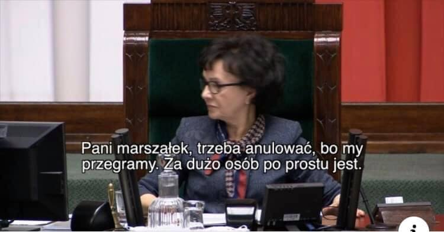

### 2022

> Olaf Scholz:"Germany must be prepared for Ukraine war escalation" - Reuters

---

  

---

### 2021

> Zaszczepieni umierają na COVID, a czwarta dawka jest nieunikniona? Odpowiada ekspert

  

  

> Premier mówi, złoty się umacnia. "Zrobimy wszystko, by złotówka była nieco silniejsza"

Przy poziomach 5.0 i wyżej na parze EURPLN aż prosi się o atak spekulacyjny w społczeństwie, które jest tak silnie zakredytowane przy jednocześnie najdroższych nieruchomościach.

Za trzy kwartały USDPLN po 5.0?

  

> Kryptowaluty to GetBack i AmberGold na sterydach, 30 razy gorsza bańka, powiedział Artur Kurasiński

---

  

---

### 2020

  

### 2019

 
  

### 1963

<a href="https://pl.wikipedia.org/wiki/Zamach_na_Johna_F._Kennedy%E2%80%99ego" target="_blank">Zamach na Johna F. Kennedyego</a>

---

<a href="https://github.com/TomaszWaszczyk/historia.waszczyk.com/edit/master/src/content/november-22.md" target="_blank">Edytuj tę stronę dzieląc się własnymi notatkami!</a>
