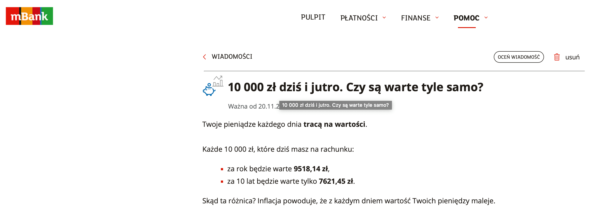

### 2021

  

  

  

---

Next PLN?

  

1950 w Polsce:

<video width="640" height="480" controls>
<source src="./movies/november/polskiefinanse1950.mp4" type="video/mp4">
Your browser does not support the video tag.
</video>

---

### 2020

  

---

Chiny wzywają do stworzenia globalnego kodu zdrowotnego, by ułatwić podróże,
„Chiny zaproponowały globalny mechanizm wzajemnego uznawania certyfikatów zdrowotnych opartych na wynikach badań genetycznych, w formie akceptowanych międzynarodowo kodów QR. Mamy nadzieję, że więcej krajów dołączy do tego mechanizmu” – powiedział Xi w weekend w wystąpieniu na wirtualnym szczycie przywódców G20 w Arabii Saudyjskiej.
Przed przyjęciem globalnego systemu kodów QR przestrzegł na Twitterze dyrektor wykonawczy organizacji Human Rights Watch (HRW) Kenneth Roth. „Początkowe skupienie na zdrowiu może się z łatwością przerodzić w konia trojańskiego dla szerszego nadzoru politycznego i wykluczenia”
W Chinach kody zdrowotne na smartfonach używane są powszechnie w walce z pandemią już od lutego.

### 2010

  

---

<a href="https://github.com/TomaszWaszczyk/historia.waszczyk.com/edit/master/src/content/november-23.md" target="_blank">Edytuj tę stronę dzieląc się własnymi notatkami!</a>
