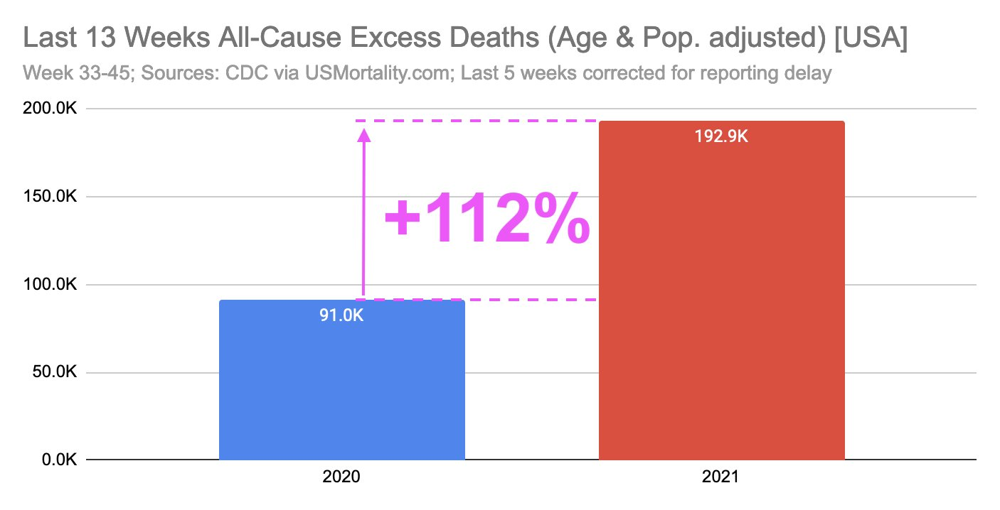

### 2021

Excess Deaths in the US are through the roof!

+112% all-cause excess deaths just the last 13 weeks!

That is 193 thousand people died more than normal in just 13 weeks! That's besides these widely available vaccines... Something is not right!

  

### 2020

  

  

### 1894

W Warszawie urodził się Stefan Tyszkiewicz-polski hrabia, inżynier, wynalazca, uczestnik wojny polsko-bolszewickiej i obu wojen światowych, ale przede wszystkim konstruktor pierwszego polskiego samochodu Ralf Stetysz (zdjęcie).
Auto jego konstrukcji odniosło sukces w VIII Rajdzie Monte Carlo, gdzie otrzymało główną nagrodę za "wygodę i przystosowanie do podróży".
Stefan Tyszkiewicz został w 1940 roku aresztowany przez NKWD celem zwerbowania go do współpracy, której odmówił. Zwolniono go w 1941 roku po czym rozpoczął służbę w Armii generała Andersa jako szef służby samochodowej. Po wojnie wyemigrował do Londynu. Zmarł 6 lutego 1976 roku.

  

### 1887

https://en.wikipedia.org/wiki/Erich_von_Manstein

---

<a href="https://github.com/TomaszWaszczyk/historia.waszczyk.com/edit/master/src/content/november-24.md" target="_blank">Edytuj tę stronę dzieląc się własnymi notatkami!</a>
