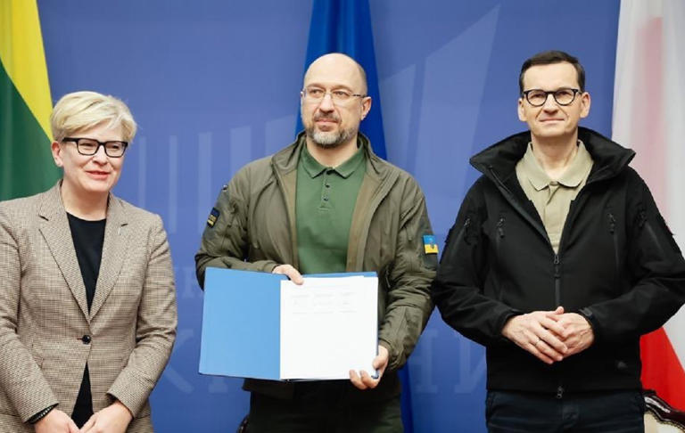
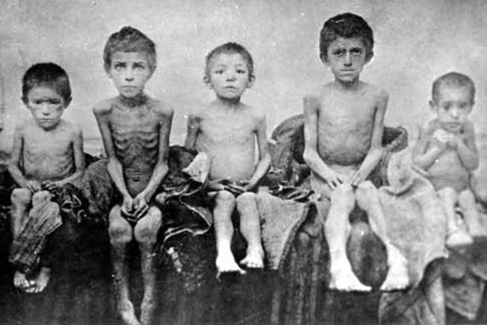
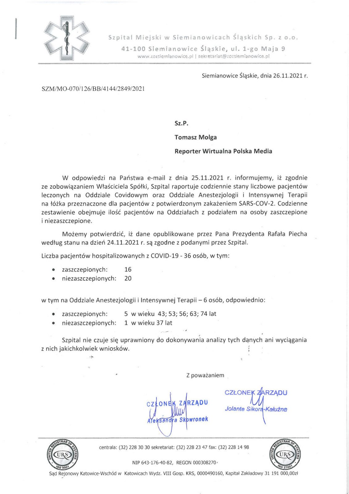
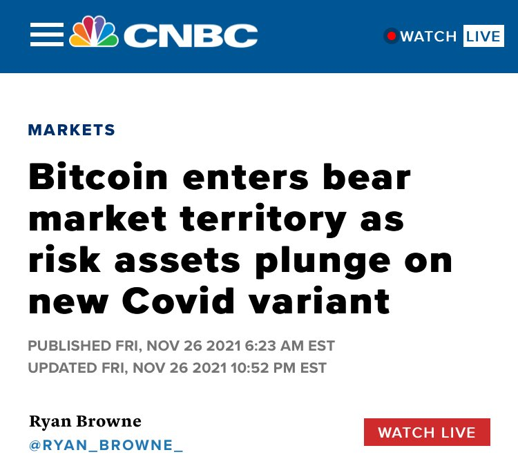
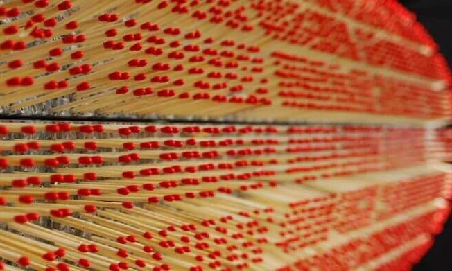

### 2023

The US dollar is near a two-century low against the Swiss franc. What is the outlook for the next century?

A clue as to what the future might hold for this currency pair can be gleaned from the interest rate differential. As can be seen from the chart, over the past 186 years, interest rates in the United States have tended to be much higher: 5% vs. 3% on average. Thus, the dollar offered around 2% per year more.

That the currency paying the higher interest rate in a currency pair is the depreciating currency was already known in the ancient world (https://lnkd.in/eYKqUy_n). And, indeed, the dollar has lost 83% of its value against the franc, which has appreciated by 487% against the dollar, or by an average of 2.8% per year.

Looking ahead, the market is signalling a continuation of substantially higher relative US interest rates in this currency pair. The yield on the Swiss 10-year government bond traded at 1% this morning compared to 4.5% for the US — a differential of 3.5 percentage points per year. One possible reason for this massive spread could be these two republics' divergence on fiscal policy (https://lnkd.in/eqEr6mhT).

Why the reference to Napoleon in the chart? In 1798, he invaded the Swiss Confederacy. He thought it suboptimal that each canton was issuing its own money, so he cancelled their powers and in 1799 introduced a single currency, the Swiss franc. However, the Swiss were ungovernable, and when Napoleon's troops withdrew, the cantons took back control and in 1803 cancelled the Swiss franc.

Reflecting on what had gone wrong, Napoleon said: "There was an underlying dislike of me in Switzerland...I was too little aware of it...I had other problems to deal with."

Napoleon did not live to see the reintroduction of the Swiss franc, but business had recognised the benefits of a unified currency and pressure grew to reinstate it. Geneva went first, introducing the "Geneva franc" in 1838 (the blue dotted line on the chart), which served as a model that the rest of the cantons signed up to in 1850.

For currencies, big ideas matter, as do big interest rate differentials.

  

### 2022

Premierzy RP, Ukrainy i Litwy podpisali w Kijowie deklarację

„W wojnie rozpętanej przez Rosję wynik może być tylko jeden: albo Ukraina zwycięży, albo przegra cała Europa” - podkreślił w Kijowie premier Mateusz Morawiecki. Szef rządu spotkał się z premierami Ukrainy i Litwy w ramach Trójkąta Lubelskiego. Z kolei Ingrida Simonyte zwróciła uwagę, że wojna Rosji przeciw Ukrainie nie ma granic i przypomniała o śmierci dwóch osób, zabitych na terytorium Polski. „Tylko Rosja jest za to odpowiedzialna” – powiedziała.

  

Podczas spotkania zostało podpisane porozumienie, jednak treści tego porozumienia nie ma.

---

On the fourth Saturday of November, Ukrainians throughout the world are lighting candles in memory of the millions of people who died in Soviet Ukraine during the Holodomor-genocide of 1932-33. Holodomor (death by starvation) - the man-made famine planned and implemented by the communist Stalin’s regime in 1932-1933. It was genocide.

Joseph Stalin wanted to starve into submission the rebellious Ukrainian peasantry and force them into collective farms. russians requisitioned more grain than farmers could provide. When they resisted, brigades of Communist Party activists swept through the villages and took everything that was edible.

Despite russia’s denial of the Holodomor, over the years Ukraine has always felt the support and solidarity of the international community in establishing the truth about one of the greatest crimes against humanity in the world’s history and in paying proper tribute to its victims. National parliaments and regional assemblies in many countries of the world have also recognized Holodomor as genocide.

Mourning millions of innocent victims of Holodomor who were killed by barbaric policy of the Soviet totalitarian regime, we stress the importance of remembrance and maintaining a firm stance in condemning totalitarianism.

Today the russians are robbing Ukrainian farmers and illegally exporting grain, fuel, agricultural machinery, and the first seasonal crops from Ukraine. The occupying power takes away the sowing material from the farmers, but at the same time requires them to successfully sow and then send new crops to russia. russians prohibit the farmers to pay taxes to the state budget of Ukraine. In case of disagreement, the soldiers threaten the locals with physical violence. 

russia is repeating Soviet policy of mass looting of Ukrainian peasants in the late 1920s. This is how Soviets started the Holodomor, a genocide of Ukrainians via mass starvation, in 1932-33. This is also how Soviets destroyed the private property on Ukrainian lands. Under the guise of a “war of liberation against the Nazis,” russia is provoking famine in the occupied territories and destroying Ukraine as a competitor in the international food market.

  

<!-- https://www.rferl.org/a/ukraine-holodomor-photographs-directory-wienerberger-abbe-whiting-bokan/31235172.html -->

### 2021

  

  

### 2020

Ostatni przemysłowy producent zapałek w kraju - PCC Consumer Products Czechowice, zostanie zlikwidowany. Spółka poinformowała, że w czwartek zadecydowali o tym akcjonariusze podczas nadzwyczajnego walnego zgromadzenia.

„Decyzję podjęto w związku z trudną sytuacją ekonomiczną zakładu spowodowaną malejącym popytem na zapałki oraz trudnościami związanymi z epidemią COVID-19. Proces likwidacji potrwa kilka miesięcy, a w jego trakcie zostaną spełnione wszystkie zobowiązania wobec pracowników i kontrahentów likwidowanego zakładu” – podano w lakonicznym komunikacie.

Kiedy decyzja wejdzie w życie, przestanie istnieć ostatni przemysłowy producent zapałek w Polsce. Wcześniej zostały zamknięte fabryki w Gdańsku, Sianowie, Bystrzycy i Częstochowie.

Czechowicka fabryka zapałek zaczęła produkcję 100 lat temu. Była jednym z największych w Europie producentów. Eksportowała także poza Stary Kontynent. W latach 2000. jej zdolności produkcyjne sięgały 650 mln szt. pudełek zapałek standardowych oraz ok. 30 mln szt. pudełek reklamowych i galanterii zapałczanej.

Latem 2011 r. warszawska spółka PCC Consumer Products odkupiła 85 proc. akcji fabryki od Skarbu Państwa. (PAP)

  

### 2008

W Oxford w Wielkiej Brytanii w wieku 89 lat zmarła Helena Wolińska polska działaczka komunistyczna, nauczyciel akademicki, ale głównie prokurator stalinowskich sądów.
Karierę rozpoczęła w 1936 roku, wstępując do Komunistycznego Związku Młodzieży Polskiej. Po ucieczce z warszawskiego getta w roku 1942 rozpoczęła służbę w Armii Ludowej i Gwardii Ludowej na stanowisku szefa Biura Sztabu Głównego. Od roku 1944 do 1949 była szefową Wydziału Kadr Komendy Głównej Milicji Obywatelskiej. Do roku 1954 służyła w Naczelnej Prokuraturze Ludowego Wojska Polskiego.
Jako prokurator wojskowy przyczyniła się lub bezpośrednio wydała wiele wyroków śmierci na żołnierzy i działaczy polskiego podziemia antykomunistycznego. Jednym z oskarżonych przez nią był generał brygady August Emil Fieldorf "Nil", na którego 21 listopada 1950 wydała postanowienie o tymczasowym aresztowaniu i nadzorowała prowadzone przeciwko niemu śledztwo.
Jej zbrodnie zostały potwierdzone już w roku 1956, kiedy to została zwolniona z prokuratury wojskowej i zdegradowana "z uwagi na charakter i rozmiar zarzutów".
Tak po wielu latach o tym, co działo się wokół Wolińskiej mówił na podstawie własnych przeżyć profesor Władysław Bartoszewski:
"Podpis ppłk Wolińskiej figuruje na moim akcie oskarżenia czerwonym ołówkiem. Zatwierdzając akt oskarżenia wobec mnie wiedziała, że jestem współzałożycielem Żegoty (Rady Pomocy Żydom). Jestem przykładem, że tłumaczenia pewnych ludzi wokół Wolińskiej i jej samej, że trwa wokół niej jakaś antysemicka akcja, są bzdurą".
A to już fragment wspomnień Krystyny Sobolewskiej, żony skazanego przez Wolińską w 1953 roku podporucznika saperów Armii Krajowej Juliusza Sobolewskiego:
"Pani pułkownik siedziała za wielkim stołem, zza którego ledwo ją było widać. Krystyna pytała o ratunek dla niewinnie przetrzymywanego męża, co Wolińska skwitowała krótkim: „to najgorszy dzień w moim życiu, bo umarł Stalin”
Po latach mówiła ona dalej:
"Wolińskiej trudno dziś życzyć więzienia, kary śmierci, szubienicy. Marzę tylko o jednym – żeby została uznana za inkwizytorkę, człowieka podłego. Żeby ten potwór w mundurze przestał żyć w chwale żony profesora Oksfordu."
W roku 2006 prezydent RP Lech Kaczyński pozbawił ją Krzyża Kawalerskiego
Orderu Odrodzenia Polski (przyznanego w 1945) i Krzyża Komandorskiego tego orderu (przyznanego w 1954), zaś w roku 2007 Instytut Pamięci Narodowej wystąpił z wnioskiem o wydanie europejskiego nakazu aresztowania (ENA) wobec przebywającej w Wielkiej Brytanii Heleny Wolińskiej. Ona sama określiła to wszystko jako "cyrk".

<!-- To są sponsorowane bzdury, mieszkania drożeją... a wystaw w tej cenie mieszkanie i sprawdź kto do ciebie zadzwoni bo obstawiam ze telefon będzie gorący od pośredników (bo nie sprzedają i pali się dupa) a ile będzie tel od klientów potencjalnych. Prosty test pokazuje ze bańka już spadła na ziemie ale jeszcze nie pękła bo trzyma ją napięcie powierzchniowe wody z której się składa. mające tyle samo wspólnego z obecnym rynkiem nieruchomosci co ten artykuł. ☝️ -->

### 1991

Polska weszła w skład Rady Europy- międzynarodowej organizacji międzyrządowej, której celem jest osiąganie większej jedności między jej członkami dla ochrony ideałów i zasad, stanowiących wspólne dziedzictwo państw członkowskich, oraz ułatwienie ich przemian ekonomicznych i społecznych. Składając wniosek o przyjęcie do Rady Europy, premier Tadeusz Mazowiecki (zdjęcie) przed Zgromadzeniem Parlamentarnym Rady Europy w Strasburgu 30 stycznia 1990 r. powiedział: ,,Polacy są narodem świadomym swojej przynależności do Europy, swojej europejskości. Są jej świadomi, podobnie jak inne europejskie narody żyjące u zbiegu kultur, w sąsiedztwie wielkich mocarstw, przeżywa­jące okresy polityczne istnienia i nieistnienia i z tego powodu potrzebujące utwierdzenia się w swojej tożsamości. Zawsze punktem odniesienia dla odpowiedzi o naszą tożsamość była dla nas Europa. Europa, której Polacy czuli się obrońcami, którą kochali. Przez trzysta lat żywa była w Polsce ideologia „przedmurza chrześcijaństwa” – a więc przedmurza Europy. Jest zatem Europa obecna w polskiej świadomości jako wartość, dla której warto żyć, lecz dla której trzeba czasami umierać. Do tej Europy miewano także żale, pretensje i to nastawienie tkwi w naszej świadomości po dzień dzisiejszy. Nadal widzimy w Europie wartość, ojczyznę wolności i prawa, i nadal mocno się z Europą utożsamiamy. Nadal mamy do Europy pre­tensje – za zgodę na Jałtę, na podział Europy, na pozostawienie nas po tamtej stronie kurtyny.Dzisiaj jednak, kiedy powrót do Europy, kiedy odradzanie się Europy jako całości stają się„coraz bardziej realne, coraz częściej zadajemy sobie pytanie o to, co mamy Europie do przekazania, jaki jest nasz dzisiejszy wkład do europejskiego skarbca? Otóż sądzę, że mamy Europie do zaoferowania niemało. Naszym wkładem do Europy jest zarówno nasza siła, jak i nasza słabość. Jesteśmy jak człowiek po ciężkiej chorobie. Znajdowaliśmy się przez lata pod straszliwą presją totalitarnego ciśnienia i wytrzymaliśmy je. Jesteśmy nadal rekonwalescentami. Nasza gospodarka znalazła się w sta­nie kryzysu, z którego ją podnosimy, demokratyczne instytucje państwa są dopiero odbudowywane i przywracane życiu.
Ale mamy doświadczenia, których nie zapomnimy i które będziemy przekazywać innym. Jeśli udało nam się przetrwać jako zbiorowości, zawdzięczamy to między innymi głębokiemu przywiązaniu do pewnych instytucji i do pew­nych wartości należących do europejskiej normy. Zawdzięczamy to religii i Kościołowi, przywiązaniu do demokracji i pluralizmu, do praw ludzkich i do wolności obywatelskich, do idei solidarności. Nawet nie mogąc prakty­kować tych wartości w pełni, nie mogąc wcielać ich w życie zbiorowe – ceniliśmy je, kochaliśmy je, walczyliśmy o nie – znamy je, znamy ich cenę. Znamy cenę europejskości, europejskiej normy, którą obecnie mieszkańcy Zachodu dziedziczą nie płacąc nawet podatku spadkowego. O tej cenie możemy im przypominać. Wnosimy więc do Europy naszą wiarę w Europę.
Dzisiaj składamy wniosek o przyjęcie do Rady Europy. Chcemy reali­zować bliższą wspólnotę między członkami, aby chronić i wspierać ideały i zasady będące ich wspólnym dziedzictwem i przyczyniać się do ich postępu ekonomicznego i społecznego. Chcemy wspólnie rozwijać prawa człowieka i podstawowe wolności. Rada Europy, mająca tak wielkie zasługi dla obrony praw ludzkich i wolności, będąca wspaniałą kuźnią europejskich idei i inicjatyw, wydaje się właściwym miejscem dla obecności w niej Polski, która dla obrony tych praw i wolności uczyniła niemało.''

### 1987

Minister spraw wewnętrznych generał Czesław Kiszczak (zdjęcie) skierował do prokuratora generalnego Józefa Żyty oficjalne pismo w którym domagał się złagodzenia kar dla zabójców księdza Jerzego Popiełuszki. Dla Grzegorza
Piotrowskiego z 25 do 15 lat, Adama Pietruszki z 15 do 10 lat, Leszka Pękali z 15 do 10 lat oraz
Waldemara Chmielewskiego z 8 lat do 4 lat i 6 miesięcy.
Swoją prośbę uzasadnił pogarszającym się stanem zdrowia Pietruszki i złą sytuacją rodzinną Piotrowskiego i Chmielewskiego. Aby nie zostać posądzonym o to, że broni „swoich”, gen. Kiszczak w tym samym piśmie z
listopada 1987 roku wystąpił także o zastosowanie amnestii wobec osób skazanych w związku z zabójstwem sierżanta MO Zdzisława Karosa. Wszyscy skazani są dziś na wolności.Leszek Pękala wyszedł po 6 latach,Chmielewski po 5, Adam Pietruszka po 9, Piotrowski po 15.

### 1982

Fragment notatki Urzędu do Spraw Wyznań z dnia 26 listopada 1982 roku, wystosowanej do Kurii Warszawskiej w sprawie księdza Jerzego Popiełuszki.

"Od dłuższego już czasu nabożeństwa odprawiane przez księdza Jerzego Popiełuszko przekształcają się w manifestacje polityczne, powodując zagrożenie ładu, bezpieczeństwa i porządku w stolicy".

Jako uzasadnienie podany został wystrój ołtarza "w postaci dużych rozmiarów rysunku, przedstawiającego świętego Maksymiliana Kolbego na tle drutów kolczastych, z napisem na tle biało-czerwonym "Patron Polski udręczonej".

### 1919

W Białymstoku urodził się Ryszard Kaczorowski ostatni prezydent Polski na emigracji. Urząd ten sprawował w latach 1989-90, zastępując na tym stanowisku Kazimierza Sabbata. W czasie II wojny światowej służył w II Korpusie Wojska Polskiego generała Władysława Andersa,był uczestnikiem walk o Monte Cassino. Zginął 10 kwietnia 2010 roku w katastrofie samolotu prezydenckiego pod Smoleńskiem.

### 1894

https://en.wikipedia.org/wiki/Norbert_Wiener

### 1715

W Tarnogrodzie zawiązana została konfederacja, której celem doprowadzenie do wyjścia z Polski wojsk saskich odsunięcie urzędników saskich od wtrącania się w wewnętrzne sprawy Rzeczypospolitej.
Na jej czele stanął marszałek Stanisław Ledóchowski herbu Szaława (grafika). W krótkim czasie zyskał on poparcie szlachty, a nawet samego posła rosyjskiego Grzegorza Dołgorukiego, który uważał, że po ustąpieniu Augusta II to nie kto inny, jak Ledóchowski ma szansę zająć jego miejsce na polskim tronie. W tym celu podjął się nawet mediacji z obiema stronami sporu, co z czasem przerodziło się w wewnetrzny konflikt w Rzeczpospolitej , będący na rękę Rosjanom.

Do konfederacji przyłączyła się część wojska koronnego i litewskiego. Hetmani wielcy koronny i litewski Adam Mikołaj Sieniawski i Ludwik Pociej, powiązani z Rosją, nie zdecydowali się na poparcie żadnej ze stron konfliktu. Działania wojenne w trakcie konfederacji tarnogrodzkiej miały charakter wojny podjazdowej.
Działania konfederacji zakończył zawarty w 1716 roku na sejmie niemym Traktat Warszawski.

---

<a href="https://github.com/TomaszWaszczyk/historia.waszczyk.com/edit/master/src/content/november-26.md" target="_blank">Edytuj tę stronę dzieląc się własnymi notatkami!</a>
