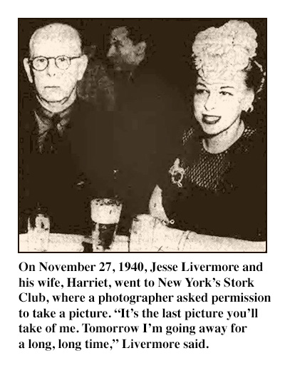
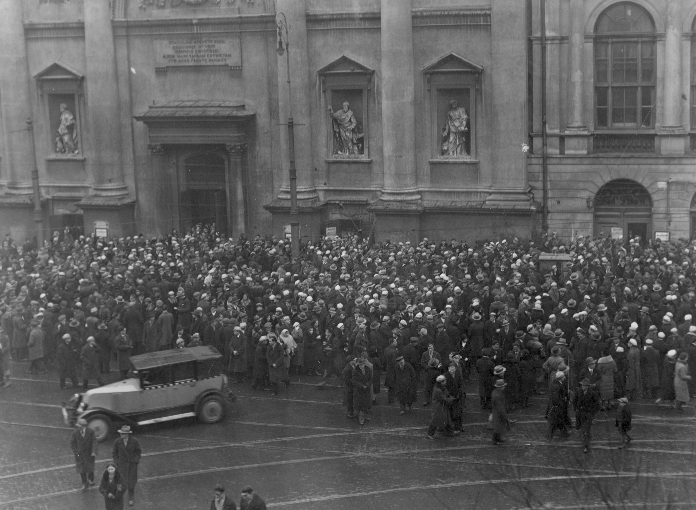

### 2022

🦊MetaMask will begin collecting users' IPaddresses and Ethereum wallet addresses 👛 during on-chain transactions to comply with their AML and KYC obligations🤫

🦊ConsenSys (MetaMask's developer) revised its Privacy Policy on 23 November to reflect the fact that they will start collecting the following information from their users:

🔏 Identity information: ( first name, last name, username or similar identifier, title, date of birth, and gender)
🔏Contact information: (postal address, email address and telephone number)
🔏 Profile information: (username and password, interests, preferences, feedback and survey responses)
🔏Feedback and correspondence: ( information provided in responses to surveys, market research activities, reporting problems with service, receiving customer support etc)
🔏 Financial information (credit card or other payment card details)
🔏Transaction information: (details about purchases made through the Service and billing details)
🔏Usage information (information about how users use the service and interact with metamask)
🔏 Marketing information and preferences
🔏Financial information (such as bank account number and bank routing number; financial assets holdings)

Information Automatically Collected includes Log Data including IP address, device and browser type, operating system, among other things.

---

  

---

### 2021

  

### 2020

  

### 1981

Zakończył się strajk pracowników Huty Warszawa. Fakt jest o tyle ciekawy, że jest on epilogiem wielu splecionych ze sobą poprzedzających go wydarzeń.
Strajk był efektem nie podporządkowania się Zarządu Komisji Zakładowej NSZZ Solidarność do decyzji Zarządu Regionu Mazowsze o zakończeniu trawającego od listopada 1980 roku protestu w sprawie uwolnienia działacza Solidarności, współzałożyciela podziemnego wydawnictwa NOWA Jana Narożniaka, a także uwolnienia innych aresztowanych i powołania komisji śledczej do sprawdzenia roli prokuratora generalnego generała Leszka Czubińskiego, który po wydarzeniach w Radomiu i Ursusie w roku 1976, na forum Sejmu PRL zapewniał, że nigdzie nie doszło do bicia protestujących, a funkcjonariusze MO zachowywali się zgodnie z prawem, co było ewidentnym kłamstwem.
Strona rządowa zgodziła się tylko na uwolnienie Narożniaka. Reszta postulatów została odrzucona, na co przystała delegacja związkowa, a co właśnie wywołało oburzenie hutniczej Solidarności.
W dniu 27 listopada 1981 r. do Huty Warszawa przybyli członkowie Krajowej Komisji Porozumiewawczej NSZZ „Solidarność” wraz ze związkowymi doradcami, m. in. Lechem Wałęsą, Jackiem Kuroniem, Bronisławem Geremkiem, Tadeuszem Mazowieckim i Karolem Modzelewskim, aby doprowadzić do zakończenia akcji strajkowej. Po długich negocjacjach robotnicy Huty postanowili przerwać strajk.
Na zdjęciu ks. Jerzy Popiełuszko wśród pracowników Huty Warszawa w maju 1981 roku.

### 1946

W więzieniu w Bydgoszczy wykonano wyrok śmierci na Ludwiku Augustyniaku powstańcu wielkopolskim, uczestniku bitwy nad Bzurą, więźniu obozów Sachsenhausen i Mauthausen, żołnierzu polskiego podziemia niepodległościowego, a następnie antykomunistycznego. Augustyniakowi postawiono zarzut współudziału w zamordowaniu trzech milicjantów, którzy eskortowali go do więzienia w Jastrowiu po aresztowaniu przez NKWD 23 lutego 1945 roku. Co ciekawe Augustyniak mimo swojej przeszłości był postacią dwuznaczną. Jeszcze w czerwcu 1945 roku podjął pracę w Komendzie Miejskiej Milicji Obywatelskiej w Bydgoszczy, którą wykonywał do ponownego aresztowania 16 kwietnia 1946 roku. W chwili śmierci miał niespełna 48 lat. Został potajemnie pochowany na cmentarzu Komunalnym w Bydgoszczy. W 1990 roku rodzina Ludwika Augustyniaka wystąpiła o jego rehabilitację. 19 grudnia 1991 sąd odmówił unieważnienia wyroku.

### 1943

Z rozkazu dowódcy SS i policji na Dystrykt Warszawski, 10 Polaków zostało zamordowanych za przynależność do nielegalnej organizacji, za udzielanie pomocy partyzantom, ukrywanie Żydów, posiadanie broni i kolportaż ulotek. Zamordowani zostali: Stanisław Cabaj (lat 29), Bronisław Kondraciuk (lat 35), Kazimierz Księżopolski (lat 27), Jerzy Lorkiewicz (lat 23), Jan Ston (lat 29) Bolesław Ston (lat 31), Jan Włodarczyk (lat 55), Ludwik Zacharczuk (lat 31), Franciszek Zakrzewski (lat 46), Piotr Zakrzewski (lat 48). Jak czytamy w obwieszczeniu skazanie na śmierć 10 Polaków było również formą ,,pokuty'' za zabicie 10 listopada 1943 roku Niemca z Siedlec - Henryka Joachimiaka i ranienie Ukraińca - Wasylego Skołozdra.

---

Trybuna Chłopska opublikowała list lubelskich członków Stronnictwa Ludowego. Czytamy w nim między innymi:
" Połączenie Stronnictwa Ludowego w jeden blok z reakcją niepokoi nas chłopów członków Stronnictwa Ludowego. Obszarnicy i inni reakcjoniści nigdy nie będą przyjaciółmi chłopów. Gdy w wolnej Polsce brakowało chłopom ziemi, chleba i pracy- ich to nie obchodziło. Endecja stale zwalczała reformę rolną. Obszarnicy nie płacili podatków, nie spełniali różnych powinności jak podwody i szarwarki, które musieli spełniać chłopi. Obszarnicy czerpali z kas państwa wielkie pożyczki na niski procent po osiem od sta rocznie, a chłop, który potrzebował pieniędzy na kupno krowy musiał płacić lichwiarskie procenty po osiem i dziesięć miesięcznie od sta. Obszarnicy nie zwrócili tych milionów, które pożyczyli z banków państwowych, a w rzeczywistości z naszej kieszeni, bo nikt ich do oddania pożyczki, jak i płacenia podatków siłą nie zmuszał. A z chłopa siłą zdarto ostatnią koszulę na podatki. My pamiętamy te czasy, gdy endeccy, a później sanacyjni starostowie kłaniali się w pas dziedzicowi, a chłopem poniewierano; pozbawiono nas praw jak niewolników. My takich rządów więcej w Polsce nie chcemy!"
Grafika przedstawia iniaturę plakatu propagandowego “Piaty Ogólnopolski Kongres Stronnictwa Ludowego w Warszawie w 1946 r. – Jednością silni” wydany w 1980 roku przez wydawnictwo Prasa z okazji Dni Prasy Ludowej w 1980 r.

### 1942

Z 27 na 28 listopada Niemcy przystąpili do wielkiej akcji wysiedlenia Polaków z terenu Zamojszczyzny. Wysiedlenie trwało od 27 listopada 1942 roku do marca 1943 roku. Objęto nim 110 tysięcy Polaków, w tym 30 tysięcy dzieci z powiatów: biłgorajskiego, hrubieszowskiego, tomaszowskiego i zamojskiego. Wysiedlono prawie trzysta wsi . Celem akcji było całkowite zgermanizowanie Europy Wschodniej. Akcję przeprowadzały jednostki policji, żandarmerii, gestapo, SS, Wehrmacht i funkcjonariusze policji ukraińskiej. Nocą bądź wczesnym rankiem otaczali oni wsie, dając zaskoczonej ludności 20 minut na spakowanie bagażu podręcznego. Starców i ludzi chorych, którzy nie mogli wyjść z domów o własnych siłach zabijano na miejscu. Wysiedlonych ludzi ładowano z bagażami na furmanki i wywożono za druty obozów przejściowych dla wysiedlonej ludności Zamojszczyzny, gdzie panowały fatalne warunki. Takie obozy funkcjonowały w Zamościu , Zwierzyńcu i Biłgoraju. W samym zamojskim obozie tymczasowym funkcjonującym od 27 listopada 1942 do 19 stycznia 1944 roku, przez który przewinęło się 70 tysięcy ludzi, zmarło z głodu, zimna i chorób kilka tysięcy ludzi - głównie dzieci. Do 3 grudnia 1942 roku Niemcom udało się umieścić w obozie zamojskim 9771 osób. Następnie w każdym obozie odbywała się selekcja i przydział każdej grupy do innego baraku.
Każdy otrzymywał w kartotece jeden z poniższych oznaczeń:

- AA /Arbeitseinisatz/ zdolny do pracy przeznaczony na roboty przymusowe do Niemiec
- RD /Rentendorfer/ starcy chorzy ułomni /do szybkiej eksterminacji/
- AG /Arbeitsanisatz Generalgouvernement/ - zdolni do pracy pozostający jako parobcy przydzieleni nasiedlonym Volksdeutschom.
- KL / Lager Birkenau/ wysiedleńcy skierowani do obozu Auschwitz - Birkenau do fizycznej likwidacji
- WE /Widereindeutschungsfahig/ - osoby nadające się do zniemczenia
- KI /Kinderaktion/ dzieci - po sprawdzeniu czystości rasowej były deportowane w głąb Niemiec do zniemczenia / wadliwe rasowo otrzymywały kategorię KL/
Nie można pominąć kwestii przymusowej germanizacji dzieci polskich lub ich fizycznej likwidacji, której ta akcja była nieodłącznym elementem: od lipca do sierpnia 1943 dwudziestoma transportami kolejowymi hitlerowcy wywieźli z Lubelszczyzny do III Rzeszy na zniemczenie 4454 dzieci w wieku od dwu do jedenastu lat. Dzieci te były siłą odbierane prawowitym rodzicom. Pozostałe dzieci, które nie miały ,,aryjskiego wyglądu'' zostały wywiezione same lub z rodzicami do obozów koncentracyjnych, gdzie zostały uśmiercone w komorach gazowych i spopielone w krematoriach. Aby stłumić płacz i krzyki rodziców i dzieci wołających o pomstę do nieba, w obozach przejściowych utworzono specjalną orkiestrę dętą.
Po wysiedleniu Polaków, Niemcy jeszcze tego samego dnia osiedlili nowych niemieckich kolonistów, których było znacznie mniej niż samych wysiedlonych. Zajmowali oni najlepsze gospodarstwa i domy. Co ciekawe jednymi z takich niemieckich kolonistów byli rodzice Horsta Köhlera, który przyszedł na świat 22 lutego 1943 w Skierbieszowie a w 2004 roku został prezydentem Republiki Federalnej Niemiec.
Polski ruch oporu urządzał akcje odwetowe np. nocą z 9 na 10 grudnia polska partyzanta spaliła kilka gospodarstw zajętych przez kolonistów. W odwecie Niemcy wymordowali prawie całą ludność Kitowa, 168 osób - w tym kobiety i dzieci. Jednak partyzanci nie zaprzestali działań co w połączeniu z oporem stawianym ze strony polskich wysiedleńców (np. ludzie celowo niszczyli swój majątek) spowodowało zatrzymanie akcji wysiedleńczej. Partyzanci Batalionów Chłopskich, Armii Krajowej, Gwardii Ludowej oraz oddziały partyzantki radzieckiej atakowały niemieckie siły. Głośnym echem odbiły się bitwy pod Wojdą, Zaborecznem, Różą, Lasowcami lub potyczki w Bondyrzu Kaczorkach Trzepiecinach. Do Berlina dotarła informacja, że na Zamojszczyźnie wybuchło powstanie. Od kul partyzantów poległo wielu kolonistów, część w obawie przed partyzantami uciekła do Szczebrzeszyna i Suchowoli.
Po wojnie do opuszczonych wiosek powracali nieliczni ocaleli rdzenni mieszkańcy. Część gospodarstw obsadzono repatriantami z terenów, które po wojnie znalazły się poza granicami Polski.

### 1940

  

### 1939

W Brześciu nad Bugiem odbyła się wspólna konferencja Gestapo i NKWD na której debatowano nad metodami zwalczania polskiej konspiracji niepodległościowej. Opracowywano również system przepływu informacji między III Rzeszą, a ZSRR, metody eliminacji polskiej klasy przywódczej i inteligencji oraz działania mające na celu germanizację i wynarodowienie Polaków.
Na zdjęciu konferencja oficerów Gestapo Armii Czerwonej w Urzędzie

### 1933

https://de.wikipedia.org/wiki/Kraft_durch_Freude

### 1932

We Lwowie rozpoczęły się rozruchy antyżydowskie.

Zaczęło się od bzdetu. Student IV roku weterynarii Jan Grodkowski biesiadował przy suto zakrapianym stole ze swoimi kolegami.

  

### 1915

W Kodymie urodził się Stanisław Skalski, as myśliwski okresu II wojny światowej o najwyższej liczbie zestrzeleń wśród polskich pilotów.

<video width="640" height="480" controls>
  <source src="https://raw.githubusercontent.com/TomaszWaszczyk/historia.waszczyk.com/master/src/content/img/november/PolishStudio(2014-12-06)StanislawSkalski.mp4" type="video/mp4">
Your browser does not support the video tag.
</video>

<!-- <video width="640" height="480" controls>
  <source src="https://raw.githubusercontent.com/TomaszWaszczyk/historia.waszczyk.com/master/src/content/img/november/skalski.mp4" type="video/mp4">
Your browser does not support the video tag.
</video> -->

### 1905

Aleksander Drej – kat z UB
(artykuł przeczytało 2100 Czytelników)

Urodził się 27 listopada 1905 w Warszawie. W czasie II wojny światowej był żołnierzem Armii Ludowej – organizacji związanej z komunistami i Moskwą. 15 lutego 1945 został funkcjonariuszem sekcji VII wydziału I Wojewódzkiego Urzędu Bezpieczeństwa Publicznego w Warszawie w randze młodszego wywiadowcy. W latach 1945–1947 pełnił funkcje referenta i kuriera a 1 lutego 1947 został przydzielony do dyspozycji szefa. W latach 1947–1954 będąc oficjalnie przydzielonym do dyspozycji Szefa Urzędu, Wydziału I, Ekspozytury Kolejowej, Wydziału II, Wydziału Ogólnego, Wydziału IV Warszawskiego WUBP pracował jako kat w więzieniu na Mokotowie wykonując wyroki śmierci strzałem w potylicę. 1 marca 1951 w piwnicach domku gospodarczego w więzieniu na Mokotowie zamordował na mocy wyroku stalinowskiego sądu członków IV Zarządu organizacji Wolność i Niezawisłość. Sowieckim strzałem w tył głowy polskich bohaterów Aleksander Drej. To on strzelił w tył głowy majorowi Zygmuntowi Szendzielarzowips. „Łupaszka” – dowódcy 5. Wileńskiej Brygady Armii Krajowej. Aleksander Drej to jeden z katów Mokotowa. 1 kwietnia 1955, kiedy Służba Więzienna przeszła pod nadzór Ministerstwa Sprawiedliwości, został etatowym katem będąc oficjalnie do dyspozycji kierownika WudsBP. Następnie oficjalnie pracował na stanowiskach konwojenta od 1 stycznia 1956 i dyżurnego pomocnika od 15 listopada 1956. Zarządzeniem nr 19 MBP za „ofiarną pracę” w zwalczaniu wrogiego podziemia otrzymał premię w wysokości 30 tys. zł. To była dwuletnia średnia pensja. Od 1 stycznia 1957 do chwili zwolnienia ze służby 30 listopada 1957 „w związku z brakiem przygotowania do służby w MO, gdyż przez okres służby w BP st. sierż. Drej wykonywał zlecenia specjalne” pełnił swoją funkcję jako etatowy funkcjonariusz MO w stopniu starszego sierżanta. Zmarł w latach 90. XX wieku. Nigdy nie został osądzony za swoje zbrodnie. Do końca pobierał resortową emeryturę dla szczególnie zasłużonych.

Kat z UB zamordował wykonując wyroki komunistycznych sądów między innymi takie osoby:
ppłk Antoni Olechnowicz ps. „Pohorecki” – ostatni komendant Okręgu Wileńskiego Armii Krajowej
kpt. Henryk Borowski ps. „Trzmiel” – dowódca Ośrodka Mobilizacyjnego Wileńskiego Okręgu Armii Krajowej
mjr Zygmunt Szendzielarz ps. „Łupaszka” – dowódca 5. Wileńskiej Brygady Armii Krajowej
ppor. Lucjan Minkiewicz ps. „Wiktor”
Tadeusz Cieśla – więzień KL Auschwitz w obozowej konspiracji działający razem z rotmistrzem Witoldem Pileckim
ppłk Łukasz Ciepliński – prezes IV Zarządu WiN
mjr Adam Lazarowicz ps. „Klamra” – zastępca prezesa IV Zarządu WiN
mjr Mieczysław Kawalec ps. „Żbik” – członek IV Zarządu WiN
kpt. Józef Batory ps. „Argus” – członek IV Zarządu WiN
kpt. Franciszek Błażej ps. „Roman” – członek IV Zarządu WiN
por. Karol Chmiel ps. „Zygmunt” – członek IV Zarządu WiN
por. Józef Rzepka – członek IV Zarządu WiN

### 1620

W Warszawie został stracony Michał Piekarski-niezrównoważony psychicznie szlachcic sandomierski, ale przede wszystkim niedoszły zabójca króla Zygmunta III Wazy. Czynu tego Piekarski dokonał 15 listopada 1620 roku przed kolegiatą św. Jana w Warszawie. Zadał królowi dwa ciosy w plecy czekanem. Tylko przytomność umysłu syna króla-księcia Władysława, który ranił napastnika szablą sprawiła, że nie doszło do tragedii.
Piekarskiego spotkała straszna śmierć. Został rozszarpany końmi na warszawskim Rynku Starego Miasta.

---

<a href="https://github.com/TomaszWaszczyk/historia.waszczyk.com/edit/master/src/content/november-27.md" target="_blank">Edytuj tę stronę dzieląc się własnymi notatkami!</a>
