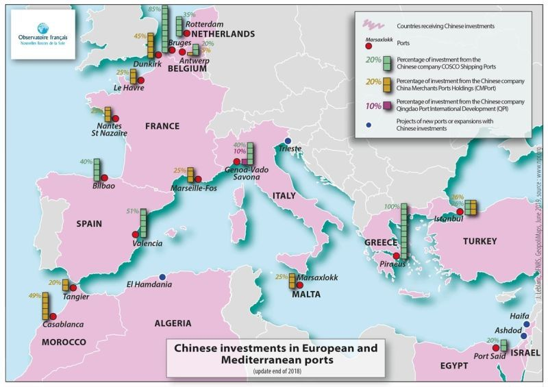
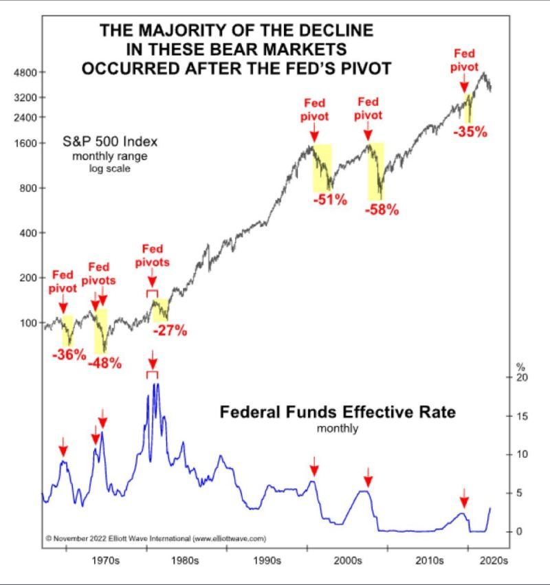
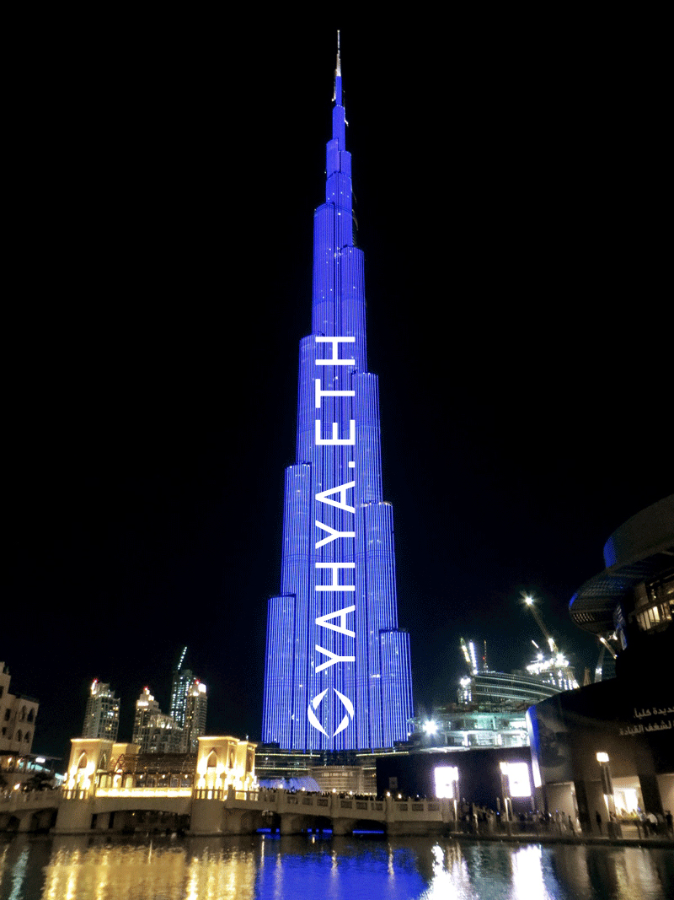
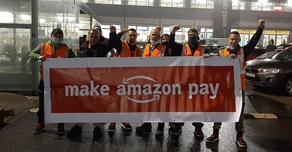

### 2022

> Centralna ścieżka projekcji NBP zakłada, że inflacja w tym roku wyniesie 14,5 proc., w przyszłym roku 13,1 proc., natomiast w 2024 r. będzie to 5,9 proc. - wynika z listopadowej projekcji Narodowego Banku Polskiego.

---

  

  

  

  

### 2021

  

  

### 2020

„Niech Amazon zapłaci” - pod takim hasłem pracownicy kalifornijskiego giganta na całym świecie domagają się lepszych płac, przestrzegania prawa i szanowania planety. Pracownicy polskich magazynów protestują od dwóch tygodni. „Firma nie poczuwa się do tego, żeby podzielić się z nami tym zyskiem, który przecież wypracowaliśmy”

  

### 1943

Rozpoczęła się trwająca do 1 grudnia 1943 roku konferencja w Teheranie. Tak zwana Wielka Trójka (na zdjęciu od lewej: Stalin, Roosevelt , Churchill) zdecydowała o nowym podziale Europy. Polskę oddano pod radziecką strefę wpływów, a wschodnią granicę ustalono według przebiegu tzw Linii Curzona.

---

<a href="https://github.com/TomaszWaszczyk/historia.waszczyk.com/edit/master/src/content/november-28.md" target="_blank">Edytuj tę stronę dzieląc się własnymi notatkami!</a>
