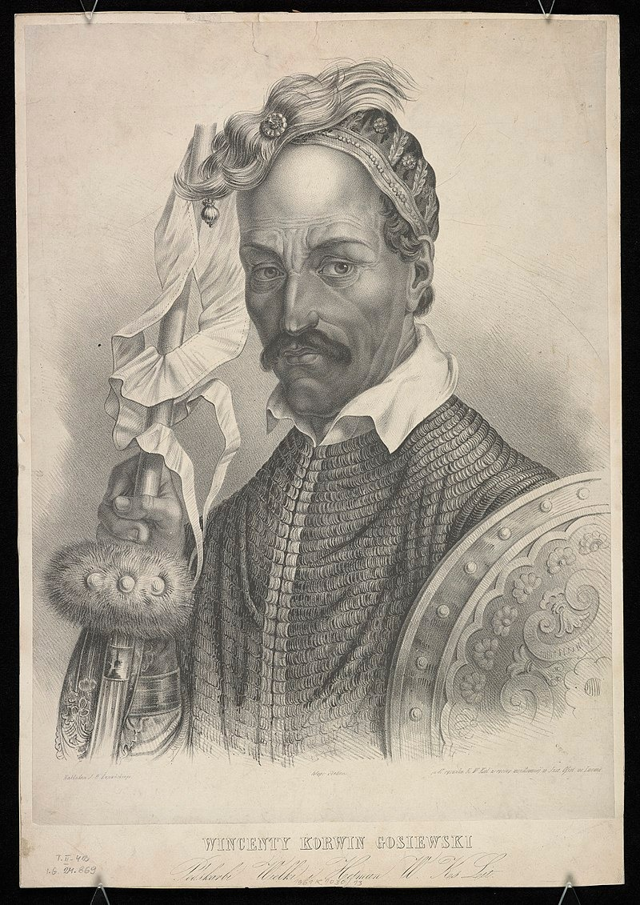

### 2020

## Może prawda a może nie

"Wyciek ze służb w sprawie operacji: "Dorwać Giertycha"
O ile mnie pamięć nie myli, to dzisiejszy wyciek danych z Centralnego Rejestru Zainteresowań Operacyjnych (tak się to przynajmniej nazywało, gdy byłem szefem komisji ds. Służb Specjalnych) jest największy w historii. Obejmuje kilkanaście nazwisk osób, które w ciągu ostatnich lat prowadziło wobec mnie nielegalne działania operacyjne polskich służb specjalnych, w tym podsłuchy, inwigilację, prowokacje kontrolowane. (patrz sluzbyspecjalne.com). Wskazana jest osoba koordynatora działań wobec mnie różnych organów prokuratury. Jest nim nie kto inny tylko sam Prokurator Krajowy - Bogdan Święczkowski - najbardziej zaufany człowiek Zbigniewa Ziobry i Jarosława Kaczyńskiego (ostatnio ponoć odwrotna kolejność w lojalności). Z zapisów wynika po pierwsze, że:
byłem stale podsłuchiwany od czasu, gdy reprezentowałem m.in. Donalda Tuska w sprawach przed prokuraturą i komisjami śledczymi. Po drugie od tego czasu były prowadzone operacje mojej inwigilacji w kraju i poza granicami. Po trzecie podsłuchy dotyczyły również mojej żony i córki. Po czwarte w systemie zapisano plan stawiania zarzutów w jakichś sprawach toczonych w Poznaniu i w Lublinie (ponoć w Poznaniu, ale to wiem z innego źródła, oprócz ostatnio sławnej sprawy toczy się jakaś dotycząca rzekomego tworzenia fałszywych dowodów przeciwko J.Kaczyńskiemu w postepowaniu w spr. dwóch wież). I tutaj jest najciekawsza część przecieku. Wynika z zapisów, że realizacje spraw planowano zimą i wiosną przyszłego roku. O co to chodzi? Najprawdopodobniej autor tego planu zakładał, że sąd pod wpływem mediów i nacisku władzy zastosuje areszt wobec mnie w sprawie, gdzie mnie zatrzymano. I zdając sobie sprawę, ze względu na lichość dowodów (a właściwie jak zauważył sąd ich brak), że będzie problem z przedłużaniem aresztu, to zaplanował zarzuty w tych nowych sprawach na zimę i wiosnę przyszłego roku. To stara praktyka prokuratorska w przypadku słabych dowodów, że próbuje się nowe zarzuty postawić bezpośrednio przed sprawą o przedłużenie aresztu, aby sąd znowu nie miał czasu na analizę dowodów. Stąd zapis w danych Rejestru mówiący o realizacji w określonych datach. Ma to uprzedzić służby realizujące sprawę (CBA) przed zbyt szybkim postępowaniem (teoretycznie gdy materiał uzasadnia dostatecznie zarzuty, to należy je postawić niezwłocznie).
Mam pytanie do tych wszystkich osób, których nazwiska dzisiaj zostały ujawnione. Czy Państwo macie świadomość, że uczestnicząc w podsłuchiwaniu adwokata prowadzącego sprawy karne, który nic złego nie zrobił, popełniacie przestępstwo przekroczenia uprawnień? I że kwalifikacja ze względu na wysługiwanie się partii rządzącej w oczekiwaniu na awans może być tylko z art. 231 par. 2 kk, za co grozi 10 lat więzienia? I że wszyscy za to odpowiecie? Zdumiewa mnie wasza odwaga. Te sprawy praktycznie się nie przedawniają (15 lat od odejścia PiS od władzy). Myślicie, że tak jak w 1989 SB zniszczyła archiwa i była bezpieczna, to sak samo wy postąpicie? Dzisiaj już niektórzy w waszych kolegów, jak widać na przykładzie tej sprawy, się reflektują. Wy zostaniecie z zapisami elektronicznymi waszych przestępstw i nikt o nich przecież nie zapomni. Każdy kto uczestniczył w tej sprawie zostanie pociągnięty do odpowiedzialności. 
Jak wynika z przecieku, aby mnie dopaść Kaczyński z Święczkowskim użyli ABA, Policji, CBA, Agencji Wywiadu i SKW. A od strony medialnej wszystkich mediów rządowych. Działania te (szczególnie podsłuchiwanie rodziny i rozmów obrońcy z klientami) są tak obrzydliwe, że wymykają się normalnej ocenie. Słów bowiem należałoby szukać gdzieś w okolicach specjalistycznych badań psychiatrycznych odnoszących się do skrajnych psychopatów.
Jeszcze kilka dni temu niektórzy moi przyjaciele, którzy czytali jeszcze nieopublikowaną wersję "Kariery prokuratora Żółcia" (Polecam zakup lub pobieranie za darmo wersji elektronicznej na stronach wydawnictwa Ecoredonum) mówili, że przesadziłem w tej książce w opisie Polski opanowanej przez dyktaturę. Niestety to co się dzisiaj ujawniło wskazuje, że nic nie przesadziłem, a może nawet wyobraźni mi zabrakło.
Wiem jedno. I tutaj zwracam się do wszystkim autorów i uczestników tej akcji. Rzeczpospolita Polska wam za to, co mi i mojej rodzinie zrobiliście, zapłaci. Surowo zapłaci. I nikt się nie wywinie, że wykonywał tylko rozkazy. To wam obiecuję.
Roman Giertych"

### 2018

<video width="640" height="480" controls>
  <source src="./movies/november/Wallstreetismanipulating Bitcoin price to buy it cheap.mp4" type="video/mp4">
Your browser does not support the video tag.
</video>

### 1943

Niemcy przeprowadzili w Lublinie łapankę, której efektem było schwytanie kilkudziesięciu młodych mężczyzn. Wszystkich wywieziono do obozu w Majdanku. Po pewnym czasie postawiono im alternatywę, którą była służba w Baudienst (Służba Budowlana). Miało to gwarantować im szybkie opuszczenie obozu. Z tej możliwości skorzystało tylko dwóch mężczyzn, których zwolniono z obozu już po miesiącu.

### 1904

> Kochany Tatusiu! Idę dzisiaj zameldować się do wojska. Chcę okazać, że znajdę tyle sił, by służyć i wytrzymać. Obowiązkiem moim jest iść, gdy mam dość sił, bo brakuje ciągle ludzi dla wyswobodzenia Lwowa. Jerzy
List Jerzego Bitschana do Ojca.

W Piaskach koło Sosnowca urodził się Jerzy. Bitschan - jeden z najmłodszych obrońców Lwowa. 21 listopada 1918 roku podczas obrony miasta poległ od dwóch ukraińskich kul. W chwili śmierci miał 14 lat. Począwszy od wieczora 20 listopada aż do rana 21 listopada stał bez przerwy na posterunku, a przez ostatnie godziny swego życia walczył, ostrzeliwany przez nieprzyjaciela.
Grób Jerzego Bitschana znajduje się na Cmentarzu Obrońców Lwowa.

### 1662

Hetman polny litewski Wincenty Korwin Gosiewski został zamordowany przez członków Związku Braterskiego.
Hetman Wincenty Korwin Gosiewski (1620-62),jeden z bardziej utalentowanych polskich wojskowych. To on wziął do niewoli księcia Bogusława Radziwiłła w opisywanej przez Sienkiewicza w 'Potopie' bitwie pod Prostkami (1656). Cztery ostatnie lata życia spędził w moskiewskiej niewoli, do której dostał się po przegranej bitwie pod Werkami. Wkrótce po uwolnieniu Jan Kazimierz wysłał go z misją dogadania się ze zbuntowanymi żołnierzami (Związkiem Święconym), co przypłacił życiem.
Bo też coraz w większe ludzie wojskowi wdawali się pijaństwo, z której konsekwencyjej trudno się było spodziewać statku i powagi, co się w krótkim czasie weryfikowało, kiedy swego marszałka rozsiekali, człowieka wielce zacnego, Kazimierza Żeromskiego, starostę czeczerskiego, a potem i Gosiewskiego, hetmana polnego i podskarbiego litewskiego (...) rostrzelali z jednego tylko małego podobieństwa i fałszywego udania (...) - tak Jan Chryzostom Pasek opisał śmierć hetmana Wincentego Korwina Gosiewskiego. Ten zasłużony dowódca z czasów potopu szwedzkiego pojechał rozwiązywać Związek Braterski - konfederację nieopłacanych żołnierzy litewskich, którzy królowi Janowi Kazimierzowi wypowiedzieli posłuszeństwo i oskarżali go o knowania przeciw wolnościom szlacheckim. Gosiewski został zamordowany w Ostrynie niedaleko Grodna.

  

Lata 1660-1667 to najbardziej zmarnowany okres w dziejech Rzeczypospolitej. Wtedy stało się ostatecznie zło, którego nie zdołano odwrócić aż do rozbiorów. Miast podjąć próbę reform skarbowo - wojskowych i politycznych, a za tym i gospodarczych, zajęto sie kolejną wojeną domową stronnictw tak charakterystyczną dla naszych elit, wtedy i dziś. A projekty reform były, całkiem rozsądne, choćby zniesie Liberum Veto. Tyle, że dwa głowne stronnictwa, nie chciały, potrafiły się porozumieć, przy wydatnym udziale intryg posłów państw trzecich.

---

<a href="https://github.com/TomaszWaszczyk/historia.waszczyk.com/edit/master/src/content/november-29.md" target="_blank">Edytuj tę stronę dzieląc się własnymi notatkami!</a>
