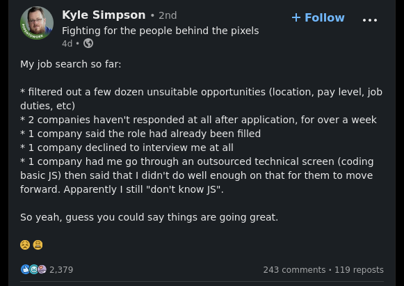
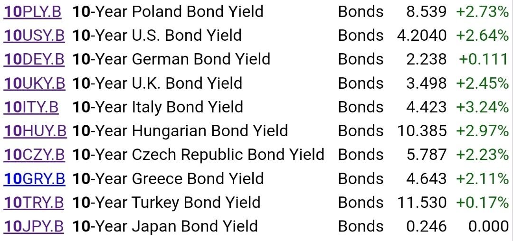
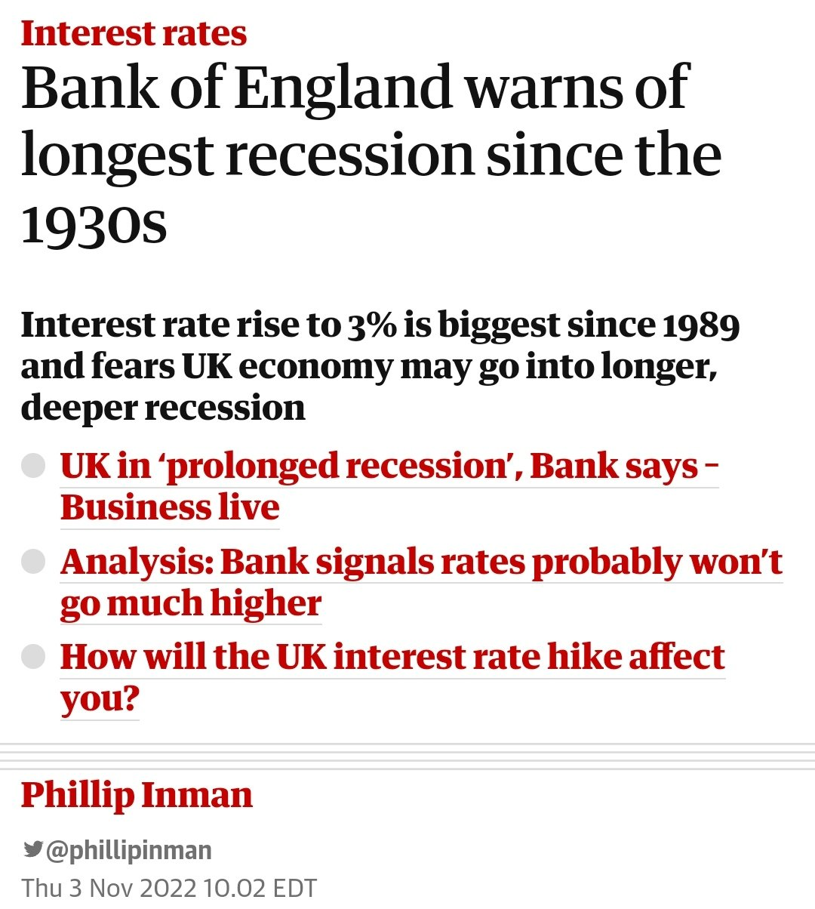
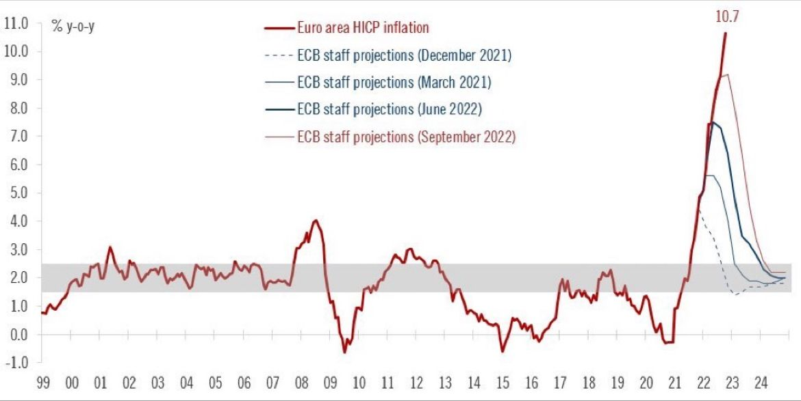
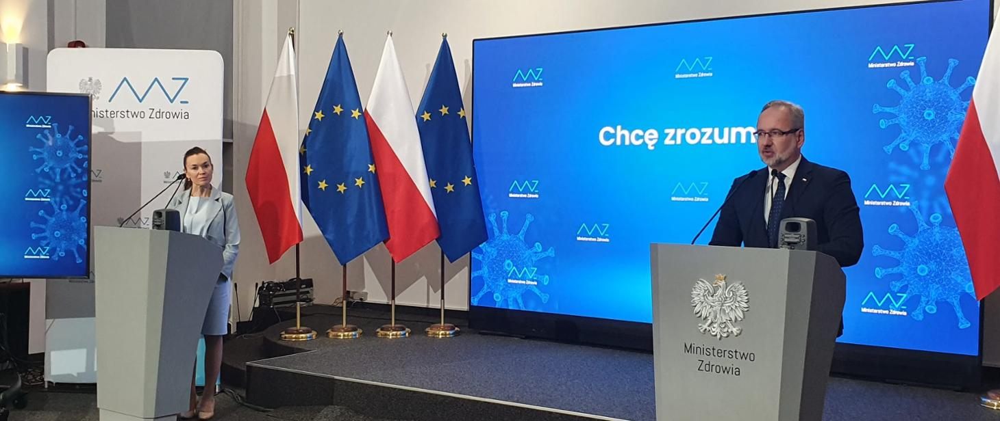
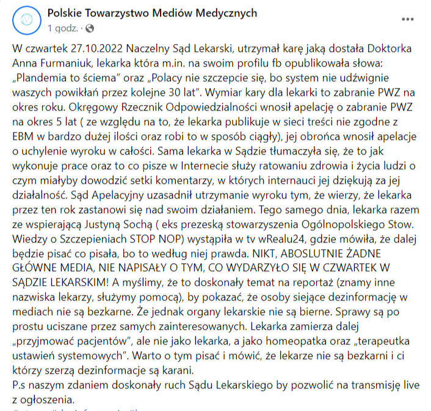
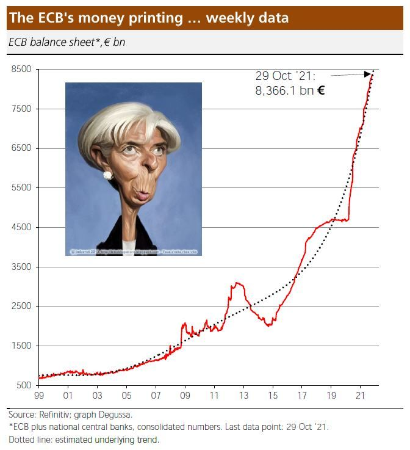
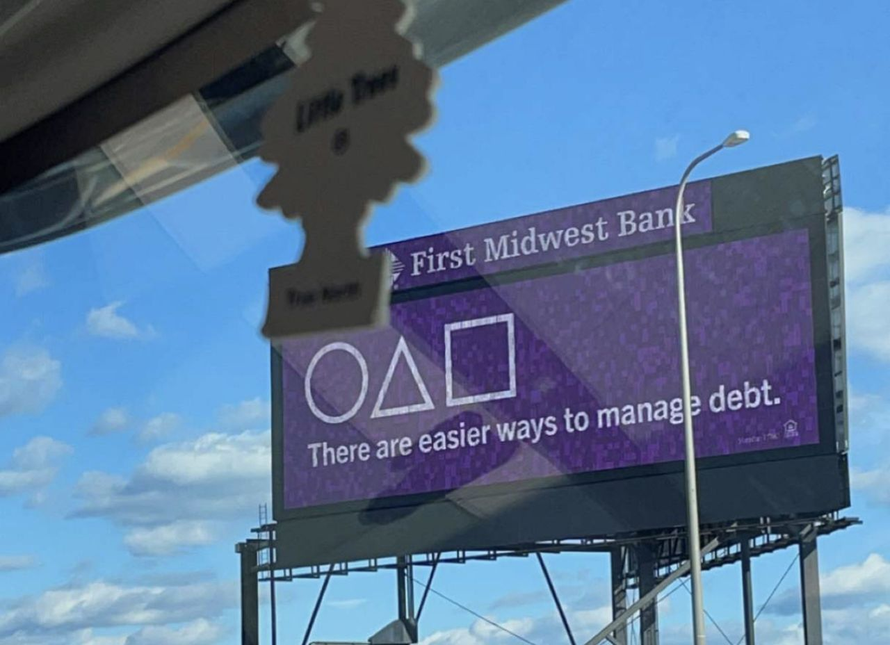

### 2023

  

### 2022

Dzień po decyzji FED:

  

---

> ECB'S LAGARDE: RECESSION WOULDN'T BE ENOUGH TO TAME INFLATION

Let me translate:

“We are going to hike rates through a recession”

---

  

---

  

---

Mohamed El-Erian – główny doradca ekonomiczny w Allianz – uważa, że ​bitcoin nigdy nie stanie się globalną walutą rezerwową, a jego cena nie przekroczy poziomu 100 000 dolarów.

---

Z początkiem października rusza kampania informacyjna „Chcę zrozumieć”. Ma przekonać do szczepień przeciw COVID-19 tych, którzy mają wątpliwości. Jak wynika z badań focusowych osoby nieprzekonane oczekują więcej przystępnych informacji na temat szczepionek. Dlatego wraz z kampanią uruchamiamy też stronę internetową gov.pl/chcezrozumiec.

  

  

---

### 2021

"rekompensaty" z lat 198x w nowej wersji, ceteris paribus, idzie hiperinflacja

> Wiceminister finansów Piotr Patkowski spodziewa się, że inflacja w Polsce może wynieść 8%. Skok cen rząd chce zrekompensować BONEM ENERGETYCZNYM.

  

Patkowski zapowiada, że Polacy sami zdecydują, na co wydadzą pieniądze z bonu.

---

From 1 to 29 Oct ’21, the ECB’s balance sheet increased by 92.9 €bn after 81.9 €bn in Sep, 203.9 €bn in Aug and 110.2 €bn in July. In other words: The ECB continues with its inflationary policy.

  

---

  

---

  

---

### 2020

  

  

### 1942

Harcerze służący w Szarych Szeregach zostali podzieleni na trzy grupy wiekowe.
"Zawisza (do lat 16) miała za zadnie kolportowanie prasy podziemnej,służbę w łączności i wywiad.
"Bojowe szkoły(od 16-18) lat miały za zadanie szkolenia na kursach kierowców, podstawowych kursach wojskowych, a także udział w akcjach "Małego sabotażu"
Grupy szturmowe (powyżej 18 lat) miały brać udział w akcjach nowopowstałego kedywu Komendy Głównej AK.
Na zdjęciu listonoszki Harcerskiej Poczty
Polowej.

  

### 1478

W czasie tak zwanej "wojny popiej" czyli konfliktu na tle religijnym między królem Kazimierzem IV Jagiellończykiem, a zbuntowanym biskupem warmińskim  Mikołajem Tungenem wojska polskie dowodzone przez burgrabiego krakowskiego Jana Białego i Jana Żelezieńskiego zajęły Frombork

  

---

<a href="https://github.com/TomaszWaszczyk/historia.waszczyk.com/edit/master/src/content/november-3.md" target="_blank">Edytuj tę stronę dzieląc się własnymi notatkami!</a>
