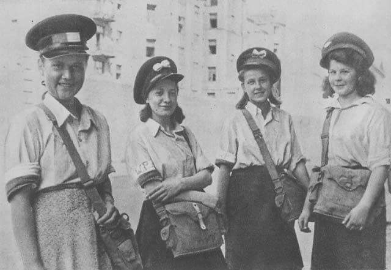

### 1942

Harcerze służący w Szarych Szeregach zostali podzieleni na trzy grupy wiekowe.
"Zawisza (do lat 16) miała za zadnie kolportowanie prasy podziemnej,służbę w łączności i wywiad.
"Bojowe szkoły(od 16-18) lat miały za zadanie szkolenia na kursach kierowców, podstawowych kursach wojskowych, a także udział w akcjach "Małego sabotażu"
Grupy szturmowe (powyżej 18 lat) miały brać udział w akcjach nowopowstałego kedywu Komendy Głównej AK.
Na zdjęciu listonoszki Harcerskiej Poczty
Polowej.

  

### 1478

W czasie tak zwanej "wojny popiej" czyli konfliktu na tle religijnym między królem Kazimierzem IV Jagiellończykiem, a zbuntowanym biskupem warmińskim  Mikołajem Tungenem wojska polskie dowodzone przez burgrabiego krakowskiego Jana Białego i Jana Żelezieńskiego zajęły Frombork

  

---

<a href="https://github.com/TomaszWaszczyk/historia.waszczyk.com/edit/master/src/content/november-3.md" target="_blank">Edytuj tę stronę dzieląc się własnymi notatkami!</a>
