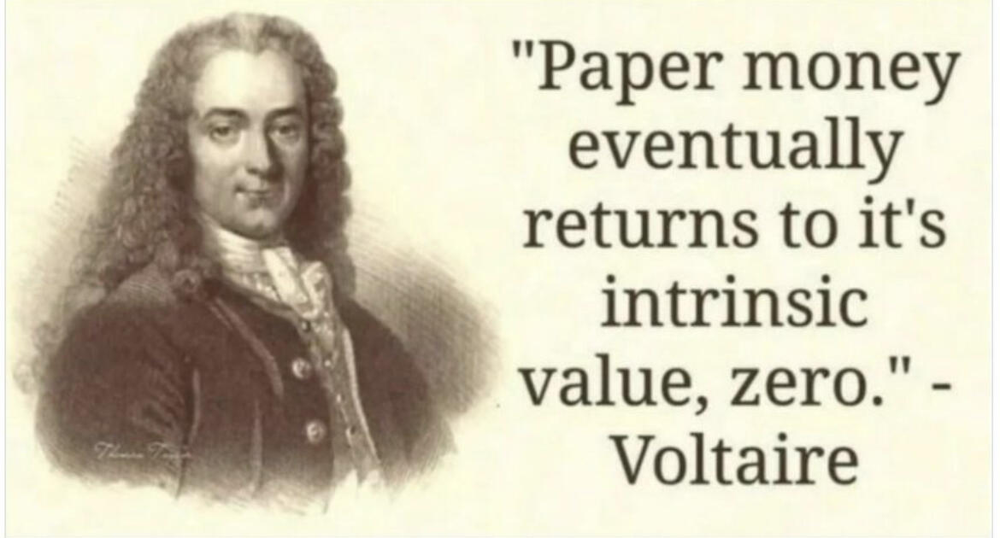
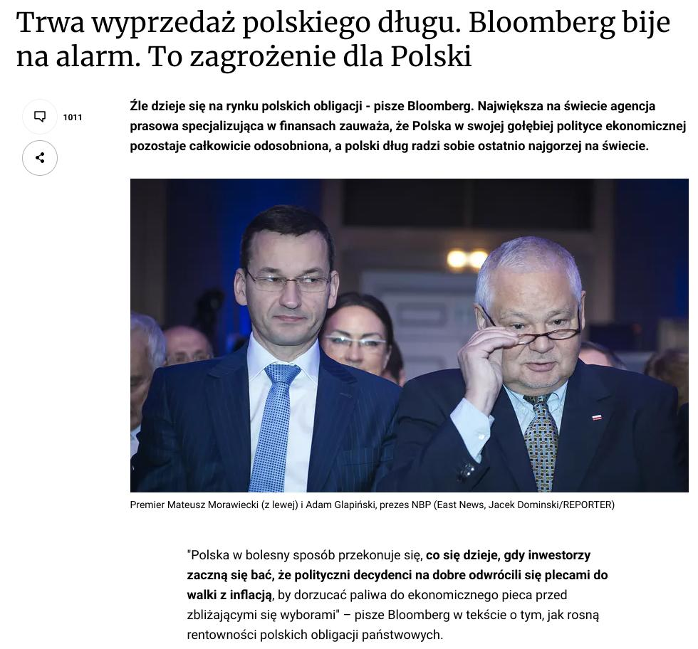
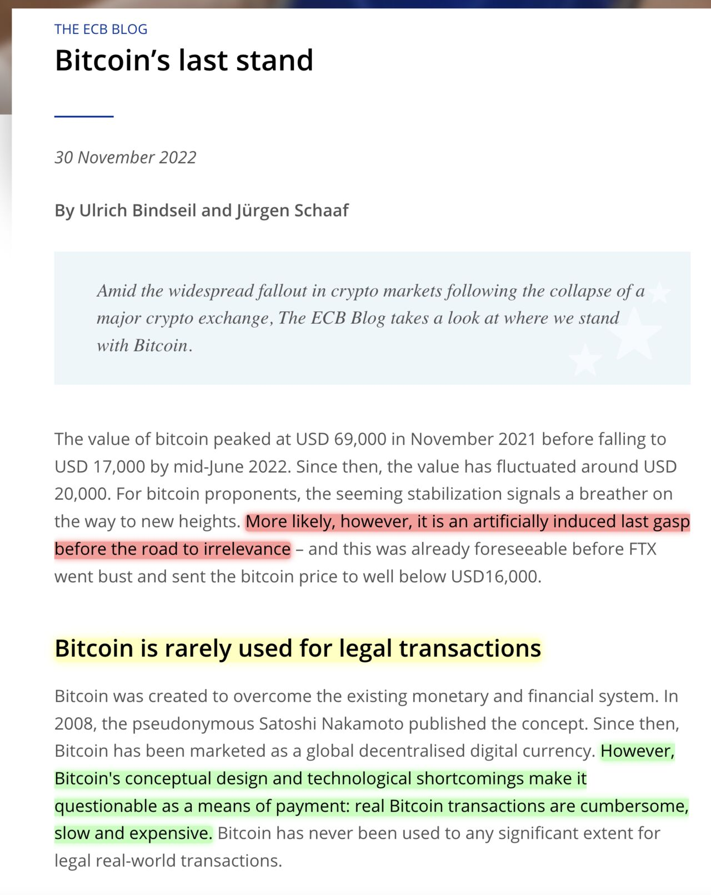
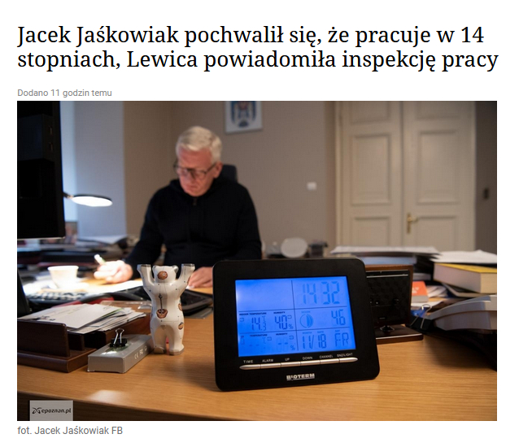
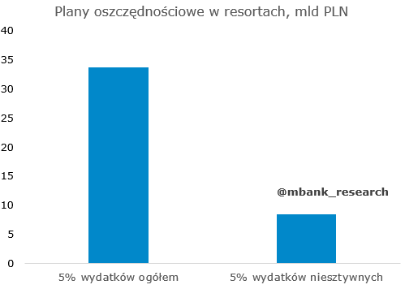
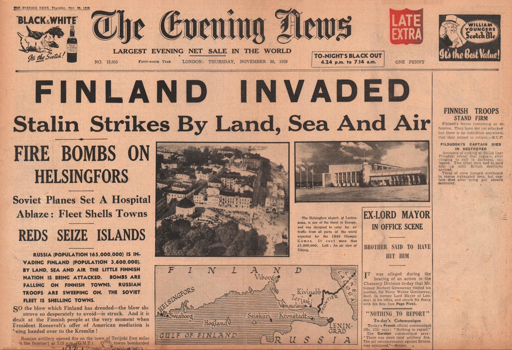

### 2022

  

  

Test:

> Bitcoin is "on a road to irrelevance" - European Central Bank

  

---

<a href="./documents/november/2263.pdf" target="_blank">Konstytucja</a>

---

<a href="./documents/november/BudgetChartBook-2022-1.pdf" target="_blank">Debt of USA</a>

---

<a href="./documents/november/2263.pdf" target="_blank">Zmiana konstytucji</a>

---

  

---

> Papież Franciszek: „Kiedy patrzę na Ewangelię tylko z socjologicznego punktu widzenia, tak, jestem komunistą i był nim też Jezus”.

---

  

---

Minister Rzeczkowska mówi, że resorty zostały zobligowane do szukania oszczędności w wysokości 5%. Biorąc za punkt referencyjny wydatki budżetu ogółem w 2023 lub tylko wydatki niesztywne wychodzą z tego kwoty odpowiednio ok. 34 i 8 mld zł.

  

Jednocześnie wskazano, że zerowy VAT na żywność będzie obowiązywał co najmniej przez I półrocze 2023. Koszt całego zabiegu wynieść ma ok. 8 mld zł. Pierwotnie NBP zakładał, że koszt ten przekroczy 33 mld zł. Oczywiście w to miejsce weszły inne programy wsparcia.

---

<video width="640" height="480" controls>
<source src="./movies/november/chwalaukrainie.mp4" type="video/mp4">
Your browser does not support the video tag.
</video>

---

### 2021

Inflacja za listopad wyniosła już 7,7%. Okazało się, że drukowanie pieniędzy, wprowadzanie kolejnych podatków i regulacji, zwiększanie zasiłków, zniechęcanie do pracy i inwestowania prowadzi do wzrostu cen. No kto mógł się tego spodziewać? Przecież najlepsze modele prognostyczne prezesa NBP Adama Glapińskiego przewidywały znaczący spadek inflacji, a nawet groziły nam deflacją.

Inflacja w okolicy 8% oznacza, że jeden miesiąc w roku pracujemy za darmo. Zbliżamy się w ten sposób małymi krokami do ideału, czyli państwa komunistycznego, gdzie cały rok pracuje się za darmo.
Na szczęście nie ma się co obawiać. Rząd ma już świetny plan. Należy tylko dodrukować trochę pieniędzy, wydać je na zasiłki mające zrekompensować wzrost inflacji. Kolejny krok to oczywiście ceny maksymalne, które wprawdzie spowodują niedobory, ale które pokonamy kartkami, a nie, przepraszam, oczywiście bonami, za które będziemy kupowali żywność. Wtedy pozostanie tylko wyłapywanie spekulantów, którzy będą sprzedawać spod lady po cenach czarnorynkowych oraz specjalne sklepy, gdzie za żółtymi firankami członkowie partii będą mogli kupić jakieś towary luksusowe.

Wszystko zgodnie z najlepszymi metodami wenezuelskiej szkoły ekonomii. To musi się udać.

> Plus jest taki, że wraz z rozprzestrzenianiem się omikronu - nowego, groźniejszego wariantu koronawirusa spadały w ostatnim czasie ceny ropy naftowej (inwestorzy obawiali się lockdownów i spadku mobilności), co może wpłynąć na grudniową inflację.

Przykład pseudoekonomicznego pierdolenia w wykonaniu anallllityków mBank:

> "Fiu fiu, inflacja w listopadzie wzrosła do 7,7 proc.. Grubo powyżej konsensusu (7,4 proc.). Szarpnięcie na rynku ropy naftowej sugeruje, że jest szansa na grudniowy odczyt poniżej 8 proc." - sugerują ekonomiści mBanku.

> Co dalej z inflacją? Co zrobi RPP?

> Z kolei według ekonomistów Polskiego Instytutu Ekonomicznego wzrost cen spowolni dopiero w przyszłym roku. Szacują oni, że rządowa tarcza antyinflacyjna obniży CPI w I kwartale 2022 o ok. 1,2 pkt. proc – inflacja spadnie w okolice 6,5 – 7 proc.. 

### 2020

Po Q3 liczba cudzoziemców ubezpieczonych w ZUS znowu osiągnęła nowe maksimum (689,2 tys.). Tym samym w ujęciu kwartalnym minione 3 miesiące odrobiły z nawiązką odpływ widoczny w Q2. Od początku roku liczba ta wzrosła o 37,7 tys. Taka sytuacja z pewnością będzie działać w kierunku łagodzenia potencjalnych napięć podażowych na rynku pracy. Z drugiej strony słabiej wygląda liczba ubezpieczonych Polaków, która od początku roku jest spadła o 413,5 tys.

  

### 1962

W nocy z 30 listopada na 1 grudnia 1962 r. w związku z budową trasy W-Z i poszerzaniem Al. gen. K. Świerczewskiego (dawniej Leszno, obecnie Al. "Solidarności"). został w całości przesunięty o 21 metrów do tyłu Kościół Narodzenia Najświętszej Maryi Panny.

  

"54 minuty po północy pierwszego dnia grudnia 1962 r. barokowa świątynia drgnęła. A potem ruszyła z prędkością 9,3 cm na minutę. W środku nie zgasła ani jedna lampa."

### 1943

Fragment wspomnień podporucznika Henryka Kuckowskiego działacza Milicji Ludowej, żołnierza Batalionu Szturmowego " Czwartaków" Armii Ludowej, po wojnie pracownika delegatury Państwowego Urzędu Bezpieczeństwa w Przasnyszu i Włochach oraz attache wojskowego ambasady PRL w Kopehadze:

"30 listopada 1943 roku rozstrzelano mojego młodszego brata. Brat 11 listopada kończył 20 lat. Starszy brat, który był ranny w czasie obrony Warszawy, mieszkał również na Starym Mieście. W momencie kiedy wybuchło Powstanie… Pragnę podkreślić, że nasza organizacja AL-owska nie była informowana o przygotowaniach i terminie wybuchu Powstania. Przykre to jest niestety, dlatego że dużo kolegów zginęło, zanim dotarło do Starego Miasta. Warszawski sztab Armii Ludowej zdecydował, że w tej dzielnicy będzie koncentracja naszych AL-owców z Warszawy. Nieduża grupa pozostała na Śródmieściu, natomiast trzon sił „Czwartaków” był na Starym Mieście.
Organizacja na Starym Mieście: sztab Armii Ludowej Okręgu Warszawskiego, który się mieścił [na Freta], i my jako bojowa organizacja, Batalion „Czwartaków”. Z tego sztabu otrzymywaliśmy zadania. Dowódcą „Czwartaków” na Starym Mieście był „Konrad”, Lech Kobyliński, późniejszy profesor, znany zresztą na Wybrzeżu. Jego zastępcą był porucznik Edwin Rozłubirski pseudonim „Gustaw”. Zresztą również znana postać, przyszły generał, pierwszy organizator Dywizji Spadochronowej w Krakowie.
Przebieg działań na terenie Starego Miasta, pierwsze dni przy tym chaosie, jaki wywołało Powstanie wśród ludności, która nie znalazła jeszcze jakiejś formy i konieczności chronienia się. Pierwszą rzeczą naszego oddziału była placówka na rogu Podwala i Krakowskiego Przedmieścia, w tym miejscu, gdzie w tej chwili są schody [ruchome]. Później ona troszeczkę się przesunęła. Ta placówka była bardzo istotna. Narażona często na bardzo ostre działanie Niemców, szczególnie w momencie kiedy jeszcze chciano przeprawiać się przez most Kierbedzia na drugą stronę. Wtedy objęliśmy w działanie tę placówkę, placówkę na Piwnej (przez kilka dni była w naszym działaniu) i na Mostowej. Tam była garbarnia. Opodal wylotu Mostowej na Wybrzeże [Gdańskie] też była jedna bardzo poważna placówka, bardzo narażona na działanie [Niemców], ponieważ Niemcy chcieli zachować swobodę działania wzdłuż Wisły. Spodziewali się jeszcze w początkowym okresie, że może armia polska i radziecka dojść do Wisły i będzie tylko Wisła dzieliła."

Źródło: Archiwum historii mówionej.

### 1939

NOVEMBER 1939: RUSSIA INVADES FINLAND

History teaches us great lessons if we only want to study them. Here is one.

The Winter War was a war between the Soviet Union and Finland. The war began with a Soviet invasion of Finland on 30 November 1939 and ended three-and-a-half months later. Before invading, Stalin made several demands, including that Finland cede substantial border territories, claiming security reasons. When Finland refused, the Soviets invaded. Most sources conclude that the Soviet Union had intended to conquer all of Finland, and establish a puppet Finnish Communist government.

The Finnish soldiers fought with immense bravery. They repelled Soviet attacks for more than two months and inflicted substantial losses on the invaders. The League of Nations deemed the attack illegal and expelled the Soviet Union. In spite of its brave resistance, Finland had to surrender in March 1940.

Today, again, Russia invades a smaller nation - Ukraine - with the objective of grabbing land and expanding its sphere of influence under the pretext of "security concerns". Same objectives, same pretext, same sufferance inflicted on civilian population.

Putin uses the same old strategy already followed by Stalin. First, raising "security concerns" and creating troubles in the border areas by leveraging local Russian minorities. Then invading the smaller country. This has already been successfully done in Moldova and Georgia. Less successfully, In Latvia and Lithuania.

History teaches a clear lesson. Let's learn from it.

  

### 1913

W roku w Jabłonce, powiat Brzozów, województwo Podkarpackie urodził się Romuald Rajs "Bury"- żołnierz Armii Krajowej, dowódca I Kompanii Szturmowej 3 Brygady Wileńskiej, uczestnik operacji "Ostra Brama", podwładny majora Zygmunta Szendzielarza.
Uchodził za doskonałego i bezlitosnego szkoleniowca. Brygada, chociaż najliczniejsza i mająca na swoim koncie najwięcej akcji bojowych, ponosiła najmniejsze straty we własnych szeregach. To pod wodzą "Burego" rozbite zostało więzienie w Woronianach, z którego uwolniono siedemdziesięciu Żydów i Polaków, a także opanowane zostały miejscowości: Nowe Troki, Turgiele i Taborszyki. Niestety, będąc dowódcą ''Bury'' przejawiał skłonność do okrucieństwa.
Pierwszej zbrodni dopuścił się 8 stycznia 1944 roku na dziesięciu jeńcach narodowości litewskiej, rozstrzeliwując osobiście kilku z nich. Mord przeprowadzony na jeńcach był sprzecznym z zasadami panującymi w oddziale kapitana Gracjana Fróga ''Szczerbca'', którego "Bury" wówczas zastępował na stanowisku dowódcy. Do drugiej zbrodni doszło podczas operacji Ostra Brama, w lipcu 1944 roku, wtedy w odwecie za duże straty w swoim oddziale "Bury" własnoręcznie rozstrzelał niemieckich pracowników kolei i jednego esesmana. Był bezlitosny również dla własnych żołnierzy, który przejawiali nawet najmniejszą oznakę niesubordynacji. Istnieje relacja Lucjana Grabowskiego ''Wybickiego" mówiąca o skazaniu na śmierć żołnierza z oddziału Burego, który ukradł rolnikowi spodnie. Wyrok został wykonany na oczach całego oddziału i właściciela skradzionych spodni, który na próżno błagał "Burego", aby darować żołnierzowi życie. Ponadto "Bury" odpowiedzialny był za brutalne pacyfikacje pięciu białoruskich wsi i śmierć około osiemdziesięciu Białorusinów, został za to skazany w 1950 roku na karę śmierci. Wyrok wykonano 30 grudnia 1950 roku w Białymstoku.
W 1995 roku Sąd Warszawskiego Okręgu
Wojskowego unieważnił wyrok śmierci na
Romualda Rajsa, uzasadniając, że „walczył o
niepodległy byt państwa polskiego” a wydając
rozkazy dotyczące m.in. pacyfikacji
białoruskich wsi, działał w sytuacji stanu
wyższej konieczności, zmuszającego do
podejmowania działań nie zawsze
jednoznacznych etycznie.
O tym jak pacyfikacja wyglądała z perspektywy żołnierzy Burego można przeczytać w archiwum Ośrodka KARTA. Oto fragment wspomnień ''Pliszki'': Zaczęli uciekać z tych domów. Myśmy mieli jeden rozkaz, żeby ich nie wypuścić. Można było puścić tylko bydło i dzieci. To przykra sprawa i przykro o tym opowiadać. Rozkaz to rozkaz i trzeba go wykonać, a jednak to do ludzi się strzelało. Ja tam nie żałuję ich, broń Boże, bo to kacapy. Cholera, ale jednak to człowiek był. (...) Ja byłem okropnie cięty na nich, ale lepiej niech to między nami zostanie. Ale jednak taka walka to nie dla katolika. Mogłem ich puścić, a nie puściłem. Nie wypuściłem, nikogo. Dzieci tak. Krowy uciekali, konie, a reszta to... To była jednak nieprzyjemna walka. Daj Boże, żeby więcej takich walk nie było. Front co innego, a to co innego, ale trzeba było to zrobić. Ten rozkaz to wydał "Bury".

Post powstał w oparciu o informacje i teksty źródłowe zawarte w książce "Skazy na pancerzach. Czarne karty epopei Żołnierzy Wyklętych" autorstwa Piotra Zychowicza.

---

<a href="https://github.com/TomaszWaszczyk/historia.waszczyk.com/edit/master/src/content/november-30.md" target="_blank">Edytuj tę stronę dzieląc się własnymi notatkami!</a>
