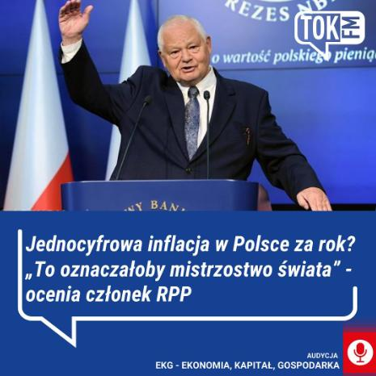
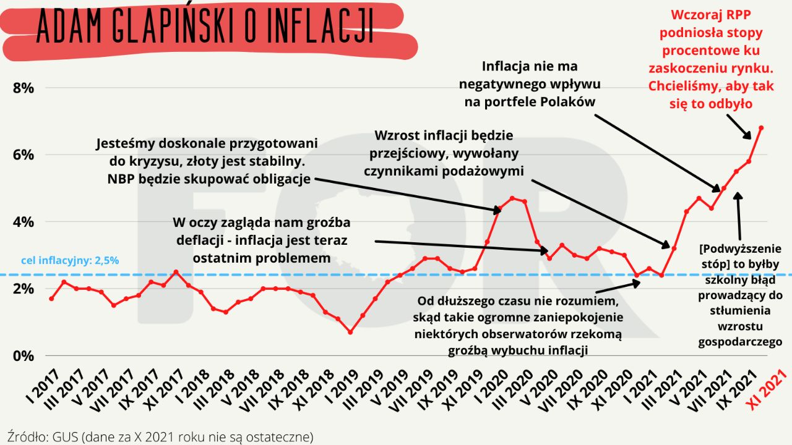
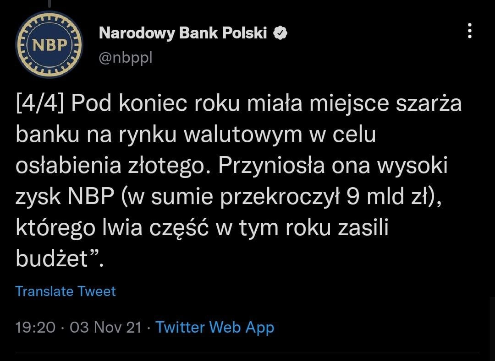
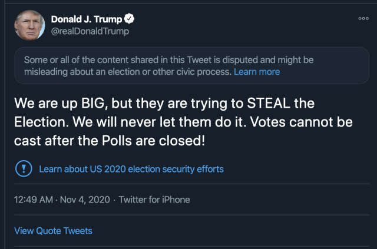
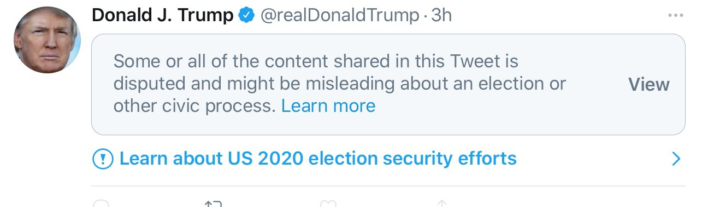
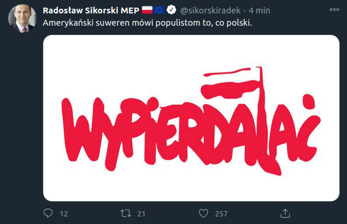
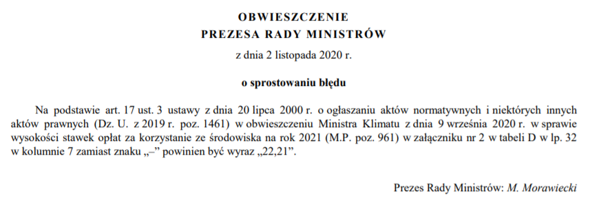
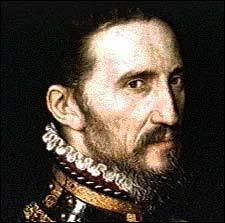

### 2022

  

> Do wczoraj wszyscy spodziewali się 20 proc. w lutym, ale dzisiaj być może będzie to 23-24 proc - tak członek RPP Ludwik Kotecki zareagował na słowa prezesa Polskiego Funduszu Rozwoju o wygaszeniu tarczy inflacyjnej w przyszłym roku. Doniesienia jednej z członkiń zarządu NBP o jednocyfrowej inflacji za rok gość TOK FM nazwał zaś "myśleniem życzeniowym".

### 2021

Żodyn się ni spodziewoł, dosłownie żodyn ykonomysta

> Prezes NBP: Nie mamy wpływu na bieżącą inflację. Jest wysoka i jeszcze wzrośnie.

// Ciekawe czy stopy procentowe wzrosną do poziomu ~15% w celu wywłaszczenia społeczeństw/a z zakredytowanych nieruchomości?

  

Usunięty ćwierk:

  

Zysk za wszelką cenę a później szybka konwersja do twardego aktywa, śmieciowa waluta zostaje dla ludu.

---

Szczyt klimatyczny. Polska liderem w dekarbonizacji.

Jak potwierdza min. P. Naimski: "...minister Soboń już podpisał i wysłał pisma do Komisji Europejskiej ws. harmonogramu wyłączeń elektrowni Bełchatów, Turów, Kozienice z nowymi blokami, Połaniec." w niewyemitowanym wywiadzie.

Ceny energii w średnim terminie mogą wzrosnąć ~3x, w dłuższym ~7x+

<video width="640" height="480" controls>
<source src="./movies/november/polskielektrownie.mp4" type="video/mp4">
Your browser does not support the video tag.
</video>

---

### 2020

  

  

---

  

---

Jacek Gniadek o wprowadzonym drugim lockdown:

> Społeczeństwo jest zirytowane i nie widzi w tym wszystkim sensu - mówi Rafał Ziemkiewicz. Mam podobne obserwacje. W marcu byłem gotowy na lockdown do świąt Wielkiejnocy, by poznać wirusa i zyskać na czasie. Dzisiaj to już do nikogo nie przemawia.
> Zamykamy przedszkola i szkoły? Gdzie lekarze, pielęgniarki oraz pozostały personel medyczny zostawi małe dzieci, by pójść do pracy? Wprowadzamy lockdown, który zwiększa ilość zgonów NON COVID.
> Wtedy zamknęliśmy fryzjerów, a teraz siłownie.  
> W ubiegłą niedzielę byłem na zastępstwie w sąsiedniej parafii. Na mszy św. było mniej osób, niż wynosił limit. Teraz wprowadzamy nowe.
> Lista pomysłów na walkę z wirusem, które nie mają sensu, jest długa. Obserwuje ludzi i widzę, że już pogodzili się z tym, że jest wirus i muszą nauczyć się z nim żyć. To, co ich irytuje, to działanie rządu, który mówi, że chce im pomóc. „Dziewięć najbardziej przerażających słów w języku angielskim to: jestem członkiem rządu i przybywam tu, by wam pomóc" (Ronald Reagan). W polskim tłumaczeniu też wyszło dziewięć.

---

Kwiat narodu:

  

---

  

### 1897

https://pl.wikipedia.org/wiki/Dmitrij_Paw%C5%82ow

### 1794

Rosyjscy żołnierze gen. Aleksandra Suworowa dokonali rzezi mieszkańców warszawskiej Pragi. Liczba zamordowanych jest trudna do ustalenia, szacuje się, że zgineło od 13 do 20 tys. mieszkańców miasta. Mordowano kobiety i dzieci, w klasztorze Bernardynek zgwałcono i zamordowano niemal wszystkie zakonnice. W klasztorze Bernardynów zabito 19 zakonników i wszystkich kalekich starców przebywającyh w tamtejszym przytułku. 
"Do samej Wisły na każdym kroku spotkać się dawali zabici i umierający różnego stanu ludzie; na brzegu rzeki piętrzyły się stosy żołnierzy, cywilnych, Żydów, księży, zakonników, kobiet i dzieci. Na widok tego wszystkiego serce zamierało w człowieku, a obmierzłość obrazu duszę jego oburzała. W czasie bitwy człowiek nie tylko nie czuje w sobie żadnej litości, ale rozzwierzęca się jeszcze, lecz morderstwa po bitwie, to hańba".- Relacja jednego z rosyjskich dowódców gen. Lwa Nikołajewicza Engelharda.
„Widok Pragi był okropny, ludzie obojej płci, starcy i niemowlęta u piersi matek pomordowane leżały na kupie; krwią zbroczone i obnażone ciała żołnierzy, połamane wozy, pozabijane konie, psy, koty, nawet świnie. Tu i ówdzie drgały jeszcze członki umierających. Całe miasto Praga stało w płomieniach i w dymie, a dachy zawalały się z trzaskiem, któremu odpowiadało przeraźliwe wycie kozaków, klątwa rozjuszonego żołdactwa”. -Tak notował pruski kronikarz prowiantowy.
„Z najwyższym żalem informuję Waszą Lordowską Mość, że atakowi na linie obrony Pragi towarzyszyło najstraszliwsze i zupełnie niepotrzebne barbarzyństwo...” – raportował premierowi Wielkiej Brytanii jej warszawski ambasador, pułkownik Wiliam Gardiner

  

### 1790

Na działce podarowanej przez rodzinę Szymanowskich założony został cmentarz na Powązkach. Jego poświęcenie miało miejsce w maju 1792 roku.
Na zajmującej dziś 44 hektary powierzchni spoczywa dziś około milion osób. Wiele z nich to osoby, które swoją działalnością przysłużyły się Warszawie, Polsce i światu.
Od 1974 roku na rzecz ratowania zabytkowych
pomników, działa Społeczny Komitet Opieki nad Starymi Powązkami im. Jerzego Waldorffa (1910-1999, założyciela Komitetu, pisarza i publicysty). Z jego inicjatywy od 1975 roku odbywają się coroczne kwesty w dniu Wszystkich Świętych, 1 listopada. Kwestują osoby znane z telewizji i teatru, sportowcy oraz politycy, co dla wielu odwiedzających cmentarz jest niepowtarzalną okazją do rozmowy ze swoimi idolami. Zaduszkowa kwesta wpisała się już na stałe w charakter Powązek.

### 1612

Dzień Jedności Narodowej, ros. День народного единства – rosyjskie święto państwowe obchodzone 4 listopada w rocznicę upamiętniającą zdobycie w 1612 roku Kremla moskiewskiego, opanowanego przez Polaków, w wyniku działań wojny polsko-rosyjskiej 1609-1618, przez powstańców ludowych pod przywództwem: Dymitra Pożarskiego i Kuźmy Minina. Wtedy też Rosja odzyskała niepodległość.

Święto to miało w zamyśle władz zastąpić przypadającą na 7 listopada rocznicę wybuchu rewolucji październikowej. Zmiany nazwy i okazji świętowanego wydarzenia dokonano 12 grudnia 2004.

### 1576

Katolickie wojska hiszpańskie dokonały rzezi protestanckiej Antwerpii. Wydarzenie to przeszło do historii jako Hiszpańska Furia.

  

---

<a href="https://github.com/TomaszWaszczyk/historia.waszczyk.com/edit/master/src/content/november-4.md" target="_blank">Edytuj tę stronę dzieląc się własnymi notatkami!</a>
