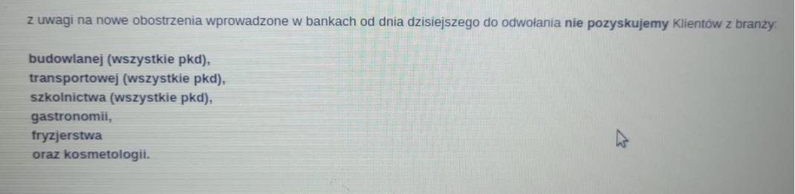
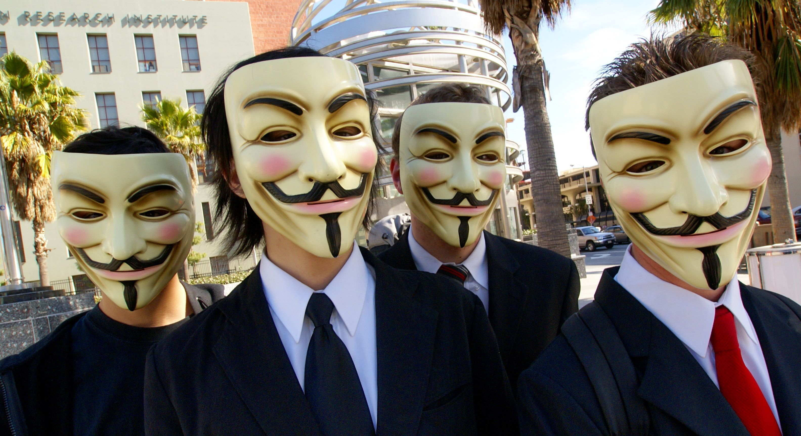
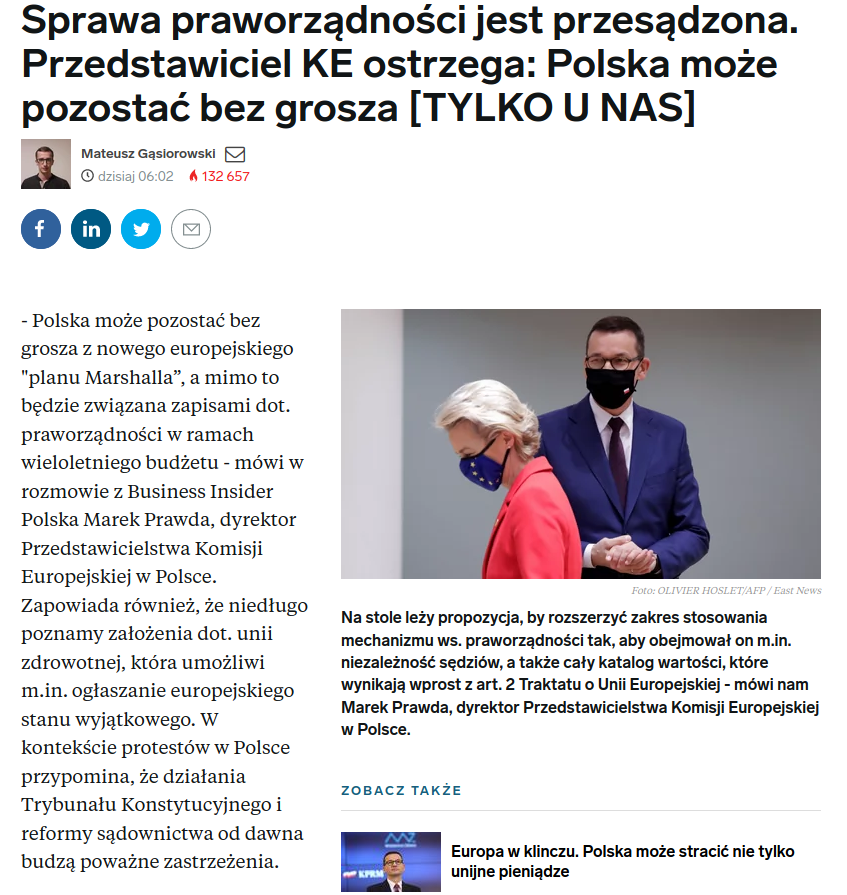
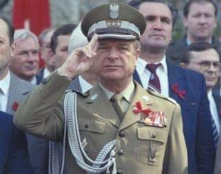
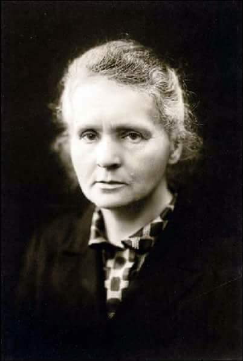

### 2020

Pół godziny do konferencji Premiera, a banki już szkołą pracowników z nowych obostrzeń.

  

---

Guy Fawkes – dziedzictwo

Nie dano jednak zapomnieć o postaci Guya Fawkesa. Na mocy specjalnej ustawy, rokrocznie 5 listopada palono ogniska (ang. bonfires) oraz podpalano kukłę Fawkesa. Miało być to wyrazem wdzięczności za przeżycie króla. O najsłynniejszego uczestnika spisku prochowego upomniała się też kultura, także ta popularna. Popularności tej postaci przysporzyła sztuka Juliusza Verne’a oraz komiks i nakręcony na jego podstawie film „V jak vendetta”. To właśnie z tego filmu pochodzi maska Guya Fawkesa, będąca znakiem rozpoznawczym członków hakerskiej grupy Anonymous. Ale to zupełnie inna historia.

  

---

  

### 2015

W Warszawie w wieku 90 lat zmarł generał Czesław Kiszczak (zdjęcie).
Czesław Kiszczak urodził się 19 października 1925 roku w Roczynach w województwie małopolskim. Był synem hutnika -komunisty, który w latach 30-tych XX wieku stracił pracę za prowadzenie takiej właśnie działalności. Sam Kiszczak od wczesnej młodości zafascynowany był ideologią komunistyczną. Już jako młody żołnierz był jednym z organizatorów milicji ludowej, a także zajmował się rozpracowywaniem środowisk byłych żołnierzy Armii Władysława Andersa. Na początku lat 50 tych rozpoczął służbę w kontrwywiadzie wojskowym. Zaś w roku 1967 został zastępcą szefa Wojskowej Służby Wewnętrznej. Pięć lat później objął stanowisko szefa Sztabu Generalnego Ludowego Wojska Polskiego, które sprawował do roku 1979, kiedy to został szefem WSW. Jednak to na lata 80-te, gdy do roku 1989 sprawował funkcję ministra spraw wewnętrznych przypadł okres budzącej największe kontrowersje jego działalności. Był bliskim współpracownikiem generała Wojciecha Jaruzelskiego, a co za tym idzie jednym ze współautorów stanu wojennego, w czasie którego ZOMO dokonało masakry górników w Kopalni Wujek. To podlegający mu również funkcjonariusze Służby Bezpieczeństwa zamordowali księdza Jerzego Popiełuszkę. Kiszczak był również pomysłodawcą akcji Hiacynt mającej na celu inwigilację polskiego środowiska homoseksualnego. Według Komisji Odpowiedzialności Konstytucyjnej pracującej do 1994, Czesław Kiszczak wraz z Wojciechem Jaruzelskim mieli w 1989 wydać polecenie zniszczenia stenogramów posiedzeń KC PZPR . Na początku lat 90. XX wieku toczyło się w tej sprawie postępowanie, później, ze względów formalnych, umorzone.
Był kilkakrotnie, z różnym skutkiem sądzony w sprawie wspomnianej tu już masakry w Kopalni Wujek.

  

### 1906

Swój pierwszy wykład na Sorbonie wygłosiła Maria Skłodowska-Curie. Wykład dotyczył elektryczności, rozpadu atomów i substancji promieniotwórczych.

  

---

<a href="https://github.com/TomaszWaszczyk/historia.waszczyk.com/edit/master/src/content/november-5.md" target="_blank">Edytuj tę stronę dzieląc się własnymi notatkami!</a>
