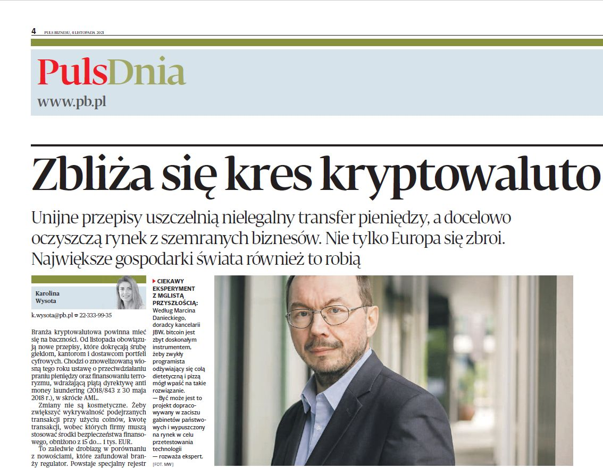

### 2021

> Wystąpienie Adama Glapińskiego spotkało się z natychmiastową reakcją ekspertów: "Fidel Castro polskich finansów".

Nastroje Stooq.com:

  

---

  

---

Tak wyglądają umowy rządów europejskich z korporacjami farmaceutycznymi:

<video width="640" height="480" controls>
<source src="./movies/november/umowyeu.mp4" type="video/mp4">
Your browser does not support the video tag.
</video>

---

USA jest oficjalnie republiką bananową. Nie dlatego, że na tamtejszych uczelniach cenzuruje się Szekspira czy naucza, że istnieją "bezpłciowi ludzie", nie dlatego, że tamtejszych policjantów coraz trudniej odróżnić od wojskowych, i nawet nie dlatego, że wszystkim tamtejszym firmom zatrudniającym ponad 100 pracowników narzucono ostatnio ścisły totalitaryzm hipochondryczny (choć wszystko to są istotne sprawy), ale dlatego, że tamtejsze główne indeksy giełdowe zachowują się jak spółki groszowe, co oznacza, że tamtejsza giełda już de facto nie istnieje, zastąpiona wielką oligarchiczną pralnią brudnych (dekretowych) pieniędzy. Jak zaś pisał Ludwig von Mises, gdzie nie ma giełdy, tam de facto nie ma kapitalizmu, a gdzie nie ma kapitalizmu, tam nie ma cywilizacji (a już zwłaszcza cywilizacji aspirującej do przewodzenia światu).

Wielu chłopców wiele razy krzyczało już w tamtym kierunku "wilk, wilk!", ale teraz, kiedy w zasadzie wszystkim znudziło się już takie krzyczenie, rzeczonego wilka większość widzi już bez problemu. Nie ma w tym nic zaskakującego - od Rzymu po Austro-Węgry, śmiertelny cios imperiom zadawała hiperinflacja, będąca przeważnie ostatecznym zwieńczeniem i kardynalnym przejawem wielu skumulowanych, toczących je procesów gnilnych. Przykro się to stwierdza, zwłaszcza w odniesieniu do byłej republiki, która miała ambicję być "miastem na wzgórzu" dającym całemu światu przykład kapitalistycznego dobrobytu, ale pod pewnymi względami historia nie przestaje się rymować - sic transit gloria mundi.
Pozostaje mieć nadzieję, że będzie się jednak wśród tych, którzy w decydującej chwili wyciągną właściwą lekcję z coraz pokaźniejszego rezerwuaru podobnych historycznych epizodów, tym samym nie zasilając go wkładem własnym. Nawet niewielka nadzieja umiera ostatnia - grunt, żeby przeżyła tych, którzy będą ją mocno żywić.

---

> Volkswagen płacąc w ciągu 5 lat zaledwie pół miliona zł podatku CIT, otrzymał pomoc publiczną o wartości niemal miliarda złotych.  Jeśli ten raport nic nie zmieni, to znaczy, że jesteśmy Bantustanem. Dane są szokujące! Dopłacamy do montowni!

---

### 2020

Pół godziny do konferencji Premiera, a banki już szkołą pracowników z nowych obostrzeń.

  

---

Guy Fawkes – dziedzictwo

Nie dano jednak zapomnieć o postaci Guya Fawkesa. Na mocy specjalnej ustawy, rokrocznie 5 listopada palono ogniska (ang. bonfires) oraz podpalano kukłę Fawkesa. Miało być to wyrazem wdzięczności za przeżycie króla. O najsłynniejszego uczestnika spisku prochowego upomniała się też kultura, także ta popularna. Popularności tej postaci przysporzyła sztuka Juliusza Verne’a oraz komiks i nakręcony na jego podstawie film „V jak vendetta”. To właśnie z tego filmu pochodzi maska Guya Fawkesa, będąca znakiem rozpoznawczym członków hakerskiej grupy Anonymous. Ale to zupełnie inna historia.

  

---

  

### 2015

W Warszawie w wieku 90 lat zmarł generał Czesław Kiszczak (zdjęcie).
Czesław Kiszczak urodził się 19 października 1925 roku w Roczynach w województwie małopolskim. Był synem hutnika -komunisty, który w latach 30-tych XX wieku stracił pracę za prowadzenie takiej właśnie działalności. Sam Kiszczak od wczesnej młodości zafascynowany był ideologią komunistyczną. Już jako młody żołnierz był jednym z organizatorów milicji ludowej, a także zajmował się rozpracowywaniem środowisk byłych żołnierzy Armii Władysława Andersa. Na początku lat 50 tych rozpoczął służbę w kontrwywiadzie wojskowym. Zaś w roku 1967 został zastępcą szefa Wojskowej Służby Wewnętrznej. Pięć lat później objął stanowisko szefa Sztabu Generalnego Ludowego Wojska Polskiego, które sprawował do roku 1979, kiedy to został szefem WSW. Jednak to na lata 80-te, gdy do roku 1989 sprawował funkcję ministra spraw wewnętrznych przypadł okres budzącej największe kontrowersje jego działalności. Był bliskim współpracownikiem generała Wojciecha Jaruzelskiego, a co za tym idzie jednym ze współautorów stanu wojennego, w czasie którego ZOMO dokonało masakry górników w Kopalni Wujek. To podlegający mu również funkcjonariusze Służby Bezpieczeństwa zamordowali księdza Jerzego Popiełuszkę. Kiszczak był również pomysłodawcą akcji Hiacynt mającej na celu inwigilację polskiego środowiska homoseksualnego. Według Komisji Odpowiedzialności Konstytucyjnej pracującej do 1994, Czesław Kiszczak wraz z Wojciechem Jaruzelskim mieli w 1989 wydać polecenie zniszczenia stenogramów posiedzeń KC PZPR . Na początku lat 90. XX wieku toczyło się w tej sprawie postępowanie, później, ze względów formalnych, umorzone.
Był kilkakrotnie, z różnym skutkiem sądzony w sprawie wspomnianej tu już masakry w Kopalni Wujek.

  

### 1906

Swój pierwszy wykład na Sorbonie wygłosiła Maria Skłodowska-Curie. Wykład dotyczył elektryczności, rozpadu atomów i substancji promieniotwórczych.

  

---

<a href="https://github.com/TomaszWaszczyk/historia.waszczyk.com/edit/master/src/content/november-5.md" target="_blank">Edytuj tę stronę dzieląc się własnymi notatkami!</a>
