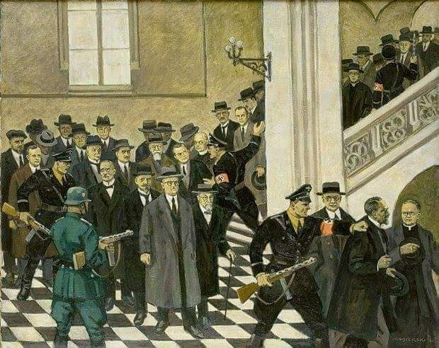

### 1939

"Nie da się opisać, ile zawracania głowy mieliśmy z krakowskimi profesorami. Gdybyśmy sprawę tę załatwili na miejscu, miałaby ona całkiem inny przebieg. Proszę więc usilnie, aby nie kierować nikogo więcej do obozów koncentracyjnych w Rzeszy, lecz podejmować likwidację na miejscu. Każdy inny sposób postępowania stanowi obciążenie dla Rzeszy i dodatkowe utrudnienie dla nas. Posługujemy się tutaj innymi metodami i musimy je stosować nadal."
Takimi słowami gubernator Hans Frank podsumował akcję Sonderaktion Krakau, która rozpoczęła się 6 listopada 1939 roku podstępnym aresztowaniem 183 profesorów Uniwersytetu Jagiellońskiego w Krakowie. Wszystkich wywieziono do obozu Sachsenhausen.

  

### 1921

Rodzi się zbrodniarz, zabójca Pileckiego https://pl.wikipedia.org/wiki/Eugeniusz_Chimczak

---

<a href="https://github.com/TomaszWaszczyk/historia.waszczyk.com/edit/master/src/content/november-6.md" target="_blank">Edytuj tę stronę dzieląc się własnymi notatkami!</a>
