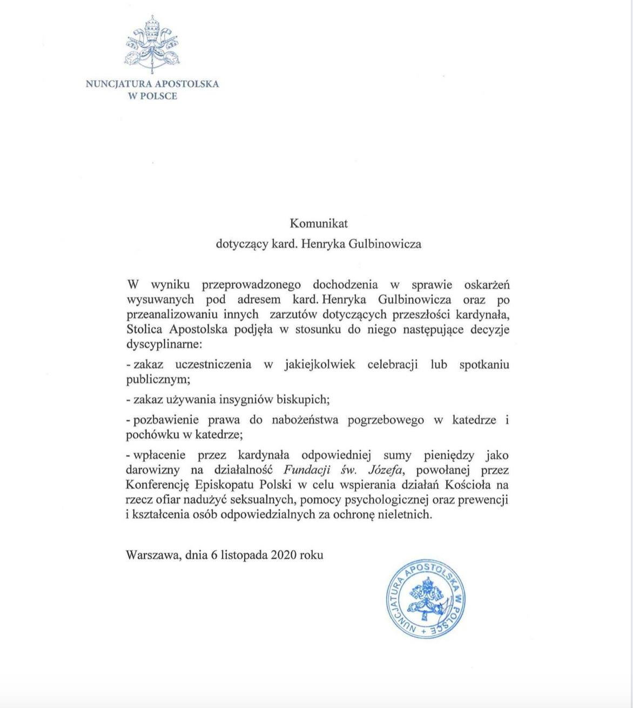

### 2021

> Kowalczyk: Jeśli ktoś zarabia o 20 proc. więcej, a inflacja jest 6 proc., to mu 14 proc. zostaje w kieszeni.

  

Nie jestem zwolennikiem obniżania inflacji kosztem duszenia gospodarki. Podwyżka stóp była na ten moment potrzebna, ale nie sądzę, aby mocny ich wzrost osłabił inflację, za to może ostudzić gospodarkę – powiedział wicepremier i minister rolnictwa Henryk Kowalczyk w czwartek.

Nie jestem zwolennikiem obniżania inflacji kosztem duszenia gospodarki, to był błąd, jaki popełniliśmy w latach 90-tych. Jeśli chcemy zdusić inflacje kosztem drastycznego zduszenia gospodarki, to jestem przeciw – powiedział wicepremier i minister rolnictwa Henryk Kowalczyk w czwartek w Radiu Zet.

### 2020

Trzęsienie ziemi. Tak można określić decyzje Stolicy Apostolskiej zakomunikowane dziś przez nuncjaturę apostolską w sprawie kard. Henryka Gulbinowicza. Zakaz uczestnictwa w nabożeństwach i wydarzeniach publicznych, zakaz używania insygniów biskupich, pozbawienie prawa do nabożeństwa i pochówku w katedrze i wreszcie kara finansowa na rzecz Fundacji św. Józefa - to pokazuje, że zarzuty wobec kardynała były bardzo poważne, bardzo wiarygodne, i że nie dotyczyły tylko tuszowania, ale i - o co był oskarżony - o własne nadużycia seksualne, także wobec nieletnich i bezbronnych dorosłych. Układ Gulbinowicza zresztą w ogóle jest w rozsypce. Najpierw usunięcie biskupa Edwarda Janiaka (wychowanek kardynała i biskup pomocniczy wrocławski), potem dochodzenie wszczęte wobec arcybiskupa Sławoja Leszka Głódzia (sekretarz i kierowca Gulbinowicza za czasów jego posługi w Białymstoku), i aż nie sposób nie zadać pytania, co dalej. Bliskimi współpracownikami kardynała, jego wychowankami byli przecież także biskup Jan Tyrawa i wieloletnie nuncjusz, a później Prymas abp Józef Kowalczyk, który - o czym też już wiadomo - przez lata tuszował rozmaite negatywne informacje dotyczące skandali seksualnych w polskim Kościele. Dzieje się, i wiele wskazuje na to, że będzie działo się więcej.

  

### 1939

"Nie da się opisać, ile zawracania głowy mieliśmy z krakowskimi profesorami. Gdybyśmy sprawę tę załatwili na miejscu, miałaby ona całkiem inny przebieg. Proszę więc usilnie, aby nie kierować nikogo więcej do obozów koncentracyjnych w Rzeszy, lecz podejmować likwidację na miejscu. Każdy inny sposób postępowania stanowi obciążenie dla Rzeszy i dodatkowe utrudnienie dla nas. Posługujemy się tutaj innymi metodami i musimy je stosować nadal."
Takimi słowami gubernator Hans Frank podsumował akcję Sonderaktion Krakau, która rozpoczęła się 6 listopada 1939 roku podstępnym aresztowaniem 183 profesorów Uniwersytetu Jagiellońskiego w Krakowie. Wszystkich wywieziono do obozu Sachsenhausen.

  

### 1921

Rodzi się zbrodniarz, zabójca Pileckiego https://pl.wikipedia.org/wiki/Eugeniusz_Chimczak

---

<a href="https://github.com/TomaszWaszczyk/historia.waszczyk.com/edit/master/src/content/november-6.md" target="_blank">Edytuj tę stronę dzieląc się własnymi notatkami!</a>
