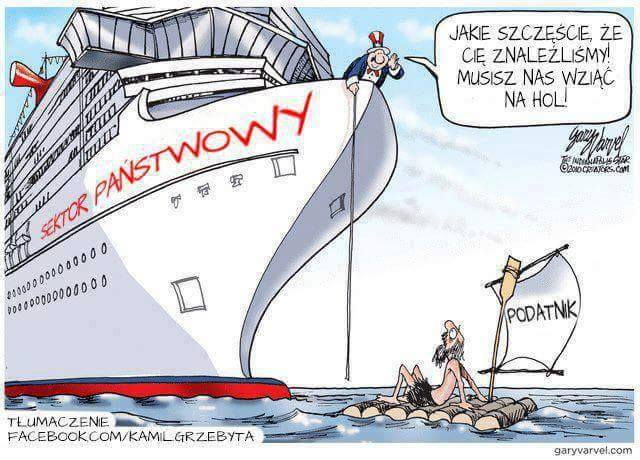
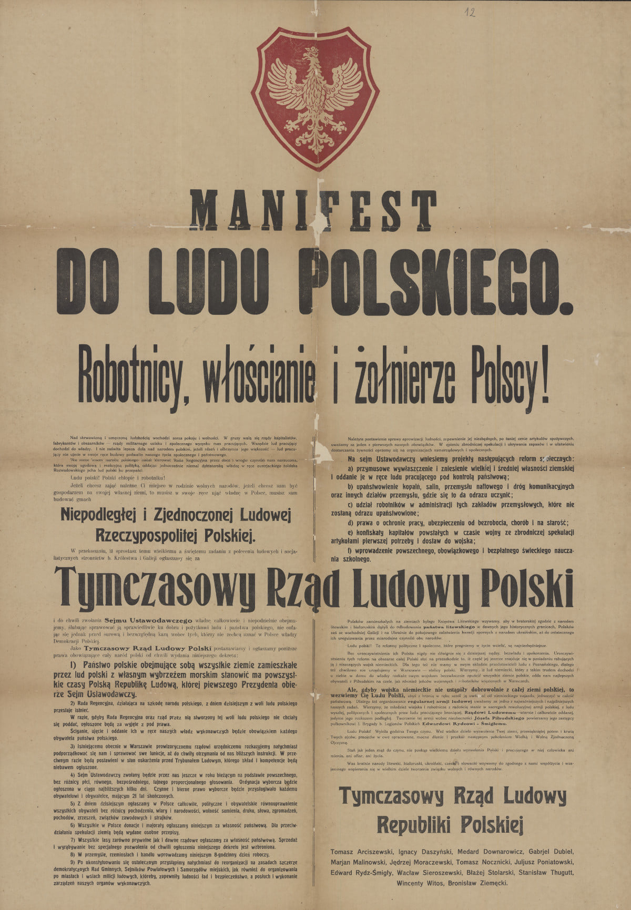

### 2021

Czy w Europie nastała już „zimna wojna” między Rosją a NATO. Spore zaniepokojenie na łamach zagranicznych mediów wywołały coraz większe napięcia związane z działaniami białoruskiego reżimu. „Nowa żelazna kurtyna zawisła na wschodzie Europy”. „Europa ma poważny problem na wschodzie kontynentu” – to tylko część nagłówków, które pojawiły się w ostatnich dniach we francuskich mediach w związku z sytuacją geopolityczną na granicy Polski i Białorusi.

  

---

  

---

### 2020

  

---

  

  

### 1984

The Stasi assesses the mood of the GDR population. Citizens are unhappy about supplies in general, do not like the emergence of a 2-tiered shopping system (based on West German money) and increasingly blame the USSR for the problems.

  

  

### 1983

https://en.wikipedia.org/wiki/Able_Archer_83

### 1981

Razem z całą rodziną został ewakuowany z Polski pułkownik Sztabu Generalnego Wojska Polskiego, agent CIA Ryszard Kukliński (zdjęcie) Głównymi przyczynami ewakuacji Kuklińskiego była praca na rzecz strony amerykańskiej i obawy jego samego o zdekonspirowanie przez polskie władze jego działalności.
Tak o tym wydarzeniu mówił pułkownik Josh O'Connor:

"Miał najnowocześniejszy sprzęt, a o jego pracy wiedziało w USA zaledwie parę osób: prezydent i jego doradca Zbigniew Brzeziński oraz nie więcej niz pięciu oficerów CIA. Byliśmy umówieni przed cmentarzem na Powązkach. Osobowy samochód zabrał stamtąd kolejno pułkownika, jego żonę i dwóch synów. Za Powązkami, w garażu wszyscy przesiedli się do innego auta i okrężną drogą pojechali do amerykańskiej ambasady. Tam pani Kuklińska z synami wsiadła do auta do przewozu poczty dyplomatycznej i bezpiecznie dojechała do Berlina Zachodniego. Kukliński wszedł do olbrzymiej skrzyni, oznakowanej, jak do przewozu szkła. Kontener miał nadajnik satelitarny, za pomocą którego można było dokładnie ustalić, gdzie się znajduje. W tej skrzyni pułkownik drżąc z zimna w luku bagażowym, doleciał samolotem do Wiednia. A stamtąd także samolotem do Berlina Zachodniego, już jako pasażer, a nie 'szkło'" .
Po przybyciu do Stanów Zjednoczonych płk Kukliński został ekspertem Departamentu Obrony i Departamentu Stanu. Otrzymał stopień pułkownika armii amerykańskiej i wysokie odznaczenie CIA.
W 1984 r. Ryszard Kukliński skazany został przez sąd wojskowy w Warszawie na karę śmierci za zdradę i zdegradowany.

  

### 1939

Z rozkazu Heinricha Himmlera, generał SS Erich von dem Bach -Zelewski (zdjęcie) objął stanowisko pełnomocnika Komisarza Rzeszy do spraw Umacniania Niemczyzny na Śląsku. Do jego obowiązków należało między innymi organizowanie masowych deportacji Ślązaków w celu stworzenia miejsca dla osiedlenia się etnicznych Niemców.

  

### 1918

W nocy z 6 na 7 listopada 1918 r. ukonstytuował się w Lublinie Tymczasowy Rząd Ludowy Republiki Polskiej z Ignacym Daszyńskim jako premierem. Tekę spraw wojskowych otrzymał Józef Piłsudski. Wobec uwięzienia Komendanta w Magdeburgu, w jego zastępstwie resort objął E. Śmigły-Rydz. Po pięciu dniach, 12 listopada TRLRP przekazał władzę na ręce Naczelnego Wodza, Józefa Piłsudskiego, który 10 listopada przybył do Warszawy.
W pierwszym akapicie, pierwszego manifestu, pierwszy polski rząd obsobaczył Rozwadowskiego.

  

### 1899

W Dyneburgu urodził się Stanisław Swianiewicz ( zdjęcie) -uczony, profesor ekonomi, prawnik, pisarz, żółnierz Polskiej Organizacji Wojskowej, weteran wojny polsko-bolszewickiej w 1920 roku oraz autor książki "Zbrodnia katyńska w świetle dokumentów". To właśnie w tej publikacji spisał wydarzenia, których był świadkiem jako więzień obozu w Kozielsku. Do sowieckiej niewoli trafił w czasie wojny obronnej w 1939 roku po przegranej bitwie pod Krasnobrodem. Cudem uniknął obozu w Katyniu, kiedy to po przewiezieniu go z Kozielska z niewiadomych powodów zawrócono go ze stacji Gniezdowo. Sam później opisywał, że przez mały otwór pod sufitem wagonu obserwował, jak wyprowadzonych umieszczano w autobusach – Czornyj woron – z oknami zasmarowanymi wapnem i wywożono dalej w nieznanym mu wówczas celu. Trafił potem do więzienia w Smoleńsku, a następnie do aresztu na Łubiance. Po kilkumiesięcznym śledztwie został za prowadzenie w Polsce naukowych badań gospodarki ZSRR „skazany” na 8 lat łagru w Republice Komi. Został zwolniony w 1941 roku na mocy układu Sikorski-Majski, po czym uznany jako potencjalne zagrożenie dla NKWD trafił ponownie do łagru, z którego zwolniony został w wyniku pertraktacji ministrów Rządu RP z władzami sowieckimi. Trafił następnie do formowanych w ZSRR przez generała Władysława Andersa Polskich Sił Zbrojnych, gdzie złożył obszerne meldunki z sytuacji panującej w łagrach.
Po wojnie wyjechał do Londynu, gdzie założył Polskie Towarzystwo Naukowe na Obczyźnie.
Ciekawostką jest też fakt, że najprawdopobniej na zlecenie władz komunistycznych zorganizowano na niego zamach w Londynie w czasie, gdy ten miał wyjeżdżać do Danii na tzw "przesłuchania sacharowskie" dotyczące łamania praw człowieka w krajach bloku wschodniego. Swianiewicz otrzymał w tył głowy cios od nieznanego sprawcy, który po zamachu zbiegł. Ostatnie lata profesor mieszkał w Domu Kombatanta „Antokol” prowadzonym przez generała Tadeusza Pełczyńskiego z żoną.
W 1990 roku został odznaczony przez Prezydenta RP na Uchodźstwie Krzyżem Komandorskim z Gwiazdą Orderu Odrodzenia Polski.
Zmarł w Londynie w wieku 98 lat.

  

### 1867

W Warszawie urodziła się Maria Skłodowska -Curie (zdjęcie). Była absolwentką III Żeńskiego Gimnazjum Rządowego w Warszawie, które ukończyła ze złotym medalem. Początkowo udzielała korepetycji z matematyki, fizyki i języków obcych. Wstępne przygotowania do badań eksperymentalnych z chemii i fizyki rozpoczęła w laboratorium przy Muzeum Przemysłu i Rolnictwa w Warszawie. W latach 1891-95 r studiowała na Wydziale Matematyczno-Przyrodniczym w Sorbonie, gdzie uzyskała licencjaty nauk fizycznych i matematycznych. Po zakończeniu studiów poślubiła francuskiego fizyka i profesora Uniwersytetu Paryskiego Pierre'a Curie i przyjęła obywatelstwo francuskie. Przeszła do historii jako wielka polska uczona pracująca we Francji, współodkrywczyni nauki o promieniotwórczości, autorka pionierskich prac z dziedziny chemii i fizyki jądrowej, współodkrywczyni polonu i radu. Przyczyniła się do rozwoju badań nad promieniotwórczością w Polsce. Była inicjatorką budowy Instytutu Radowego w Warszawie. Była pierwszą kobietą uhonorowaną nagrodą Nobla, a także jedyną jak do tej pory kobietą, którą Szwedzka Akademia Nauk uhonorowała dwukrotnie nagrodą Nobla. Była również pierwszą w 650-letniej historii paryskiej Sorbony kobietą z tytułem profesora fizyki.
Zmarła 4 lipca 1934 roku w wieku 67 lat.
Jak głosił oficjalny komunikat Skłodowska zmarła na "anemię złośliwą aplastyczną". Dziś już wiadomo, że padła ofiarą radu, którego odkrycia dokonała.

  

### 1806

Wybuchło pierwsze powstanie wielkopolskie- zwycięski zryw ludności polskiej zamieszkałej na terenach zaboru pruskiego. Okazją do wybuchu tej narodowej rewolty była tocząca się między Francją, a Prusami, co znacznie zwiększało szanse na powodzenie powstania.
Wszystko rozpoczęło się 3 listopada 1806 oku kiedy to Dąbrowski z Wybickim
uroczyście wjechali do Poznania, co pociągnęło za. sobą początek manifestacji patriotycznych. Zachęceni takim obrotem spraw przywódcy powstania wydali odezwę do narodu, która spotkała się z ogromnym odzewem wśród mieszczan.
Najaktywniejszymi grupami społecznymi biorącymi udział w tym powstaniu byli chłopi i właśnie mieszczanie, którzy na swoje barki brali walkę z pruską administracją. Natomiast oddziały powtańcze pod wodzą generała Jana Henryka Dąbrowskiego, walcząc stopniowo oczyszczały z pruskiego panowania kolejne tereny aż po Pomorze i Królewiec, który skapitulował 15 czerwca 1807 roku.
Powstanie zakończyło się podpisaniem pokoju w Tylży w lipcu 1807 roku. Na mocy tego porozumienia zaborcy zostali zmuszeni do uznania Księstwa Warszawskiego.
Grafika przedstawia obraz zatytułowany Wjazd Jana Henryka Dąbrowskiego do Poznania autorstwa Jana Gładysza.

  

---

<a href="https://github.com/TomaszWaszczyk/historia.waszczyk.com/edit/master/src/content/november-7.md" target="_blank">Edytuj tę stronę dzieląc się własnymi notatkami!</a>
