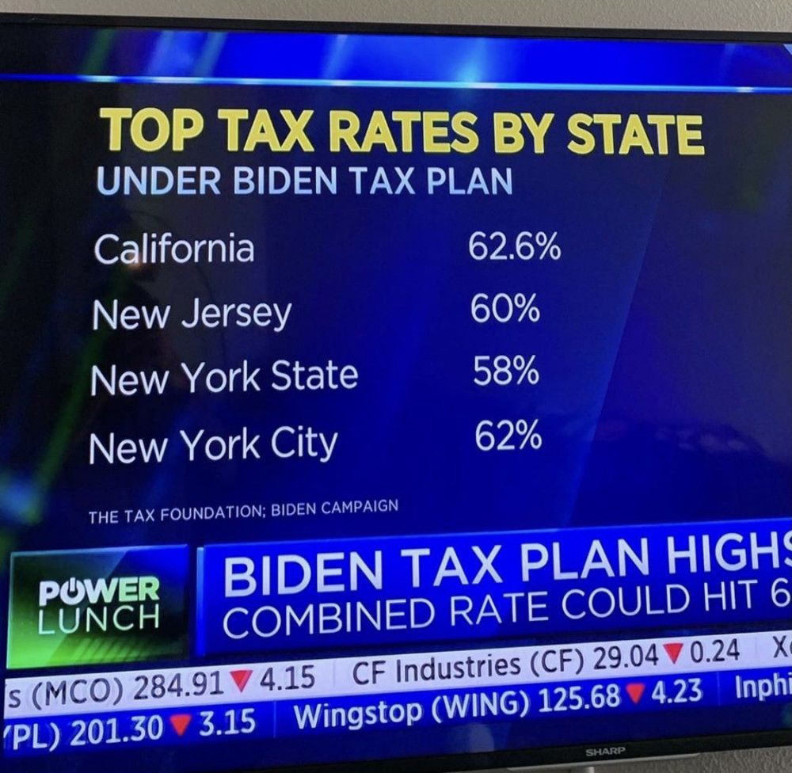
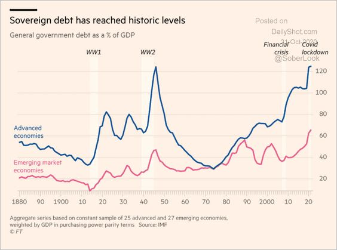
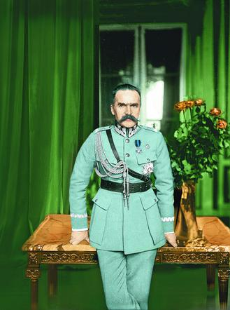

### 2020

> Są branże, kt. szczególnie odczują skutki koronawirus. To im dedykujemy działania zaprop. dziś przez premiera. Wśród rozw. jest też możliwość przebranżowienia. Chodzi o to, żeby nowa forma działalności gosp., kt. podejmą, dawała możliwość rozwoju i zarabiania - min.

  

---

W ostatnich dniach w mediach pojawiły się informacje dotyczące podatków dla najbogatszych w USA, które zaproponował Joe Biden. Po szczegółowych wyliczeniach okazało się, że w niektórych stanach osoby zarabiające powyżej 400 tys. USD rocznie, zapłacą dochodowy w wysokości ponad 60%!
Po wygranej Bidena, podatki rzędu 50% będą normą (dla całych Stanów Zjednoczonych).

  

---

Grafika pokazuje zadłużenie krajów rozwiniętych i rozwijających się w odniesieniu do PKB.
Gigantyczny dług będzie coraz silniej ograniczał rozwój gospodarczy. Obligacje zadłużonych krajów staną się jeszcze bardziej ryzykowne. Dlatego też prawdopodobne jest to, że coraz więcej banków centralnych będzie zmuszonych do skupowania rządowego długu. W Polsce tego typu praktyki wprowadzono w marcu tego roku, kiedy wszyscy zajęci byli koronawirusem.

  

---

### 1986

https://en.wikipedia.org/wiki/Aaron_Swartz

### 1926

Premier Józef Piłsudski (zdjęcie) wydał okólnik, w którym czytamy:
"W dniu 11 listopada państwo polskie obchodzić będzie 8 rocznicę jarzma niewoli i uzyskania pełnej, faktycznej niezawisłości. Data powyższa winna pozostać w stałej pamięci społeczeństwa i utrwalić się w umysłach młodego pokolenia, które w zaraniu swego życia powinno odczuwać doniosłość i uroczystość tego pamiętnego dnia".
Ten sam dokument ustanawiał 11 listopada dniem wolnym od pracy.

  

---

<a href="https://github.com/TomaszWaszczyk/historia.waszczyk.com/edit/master/src/content/november-8.md" target="_blank">Edytuj tę stronę dzieląc się własnymi notatkami!</a>
