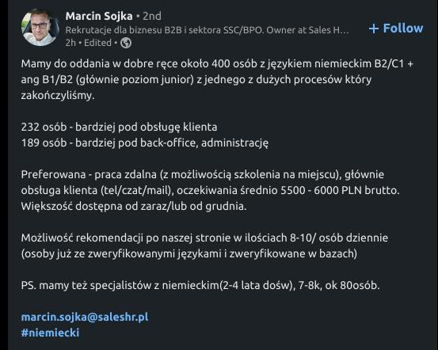
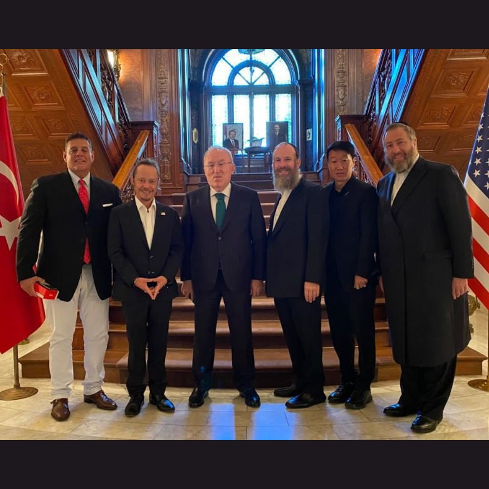

### 2022

  

### 2021

Polnische Wirtschaft:

> Krytyk Józef Flach napisał: każdy, dosłownie Polak – czy to mężczyzna, czy kobieta – jest człowiekiem o burzliwym temperamencie [...], bezgranicznej lekkomyślności [...], leniwy i rozrzutny.

Po podwyżce stóp procentowych w Czechach inwestorzy obstawiają, że za rok NBP podwyższy je do... ~3,25%. Kredyt o wartości 500.000 PLN kosztowałby o 800 PLN miesięcznie więcej, niż dziś

Pan Prezes wie co robi, masowo zinfantylizowane społczeństwo czeka pobudka. ;-(

  

  

  

---

It has been a week of great meetings and continued dialogue here in D.C., including a visit with the Ambassador of the Republic of Turkey to the U.S., Hasan Murat Mercan.

  

### 1989

Upadek muru berlińskiego.

### 1942

https://en.wikipedia.org/wiki/Werner_von_Janowski

### 1830

  

---

<a href="https://github.com/TomaszWaszczyk/historia.waszczyk.com/edit/master/src/content/november-9.md" target="_blank">Edytuj tę stronę dzieląc się własnymi notatkami!</a>
