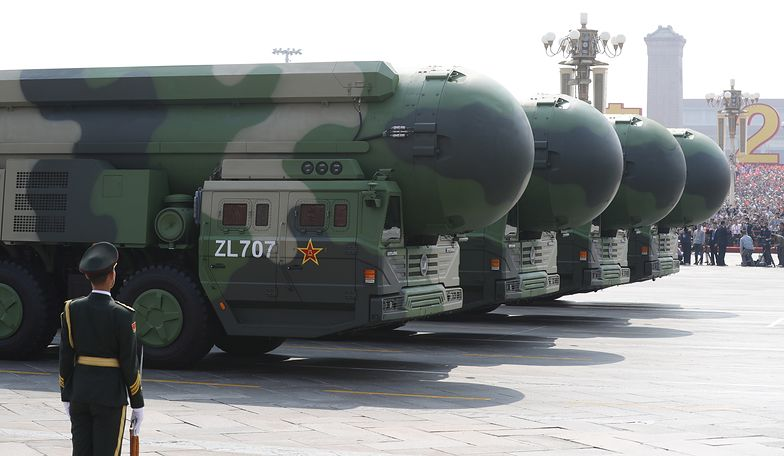
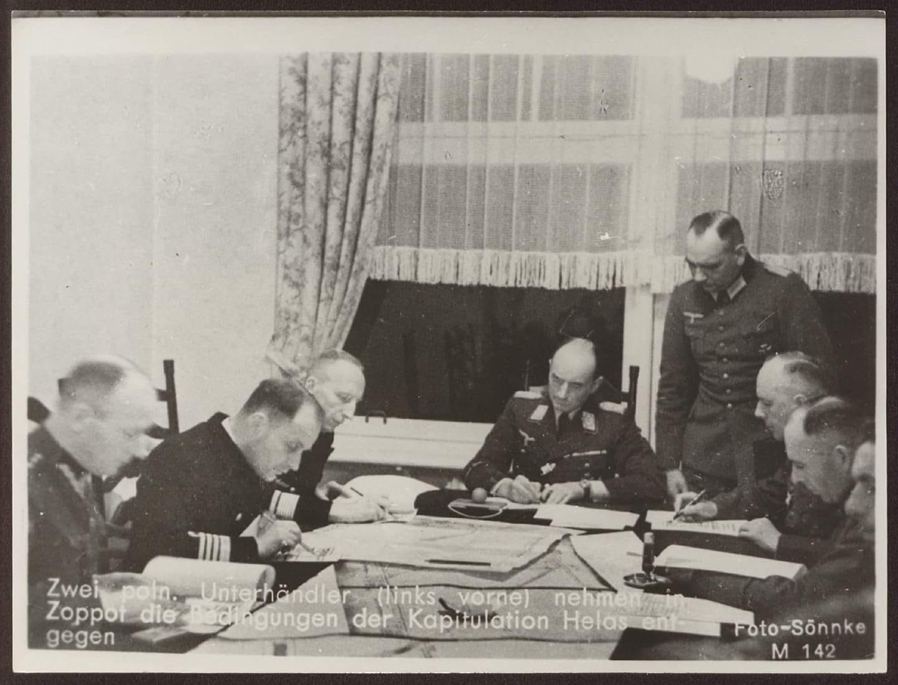
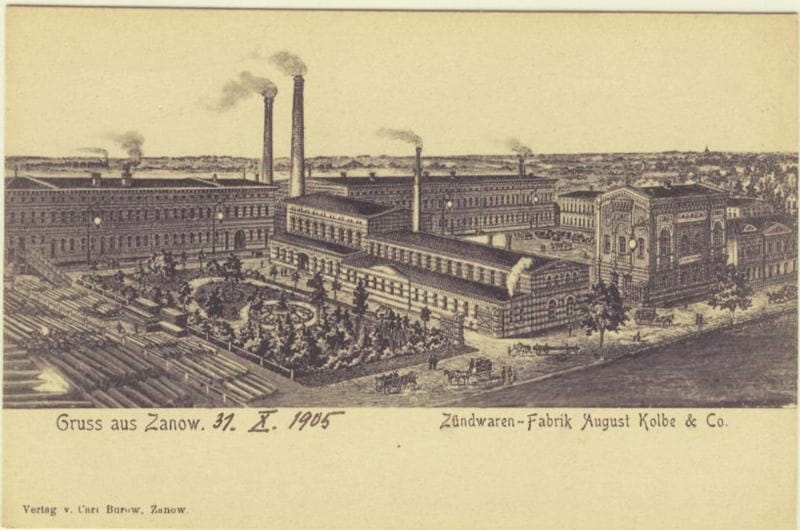
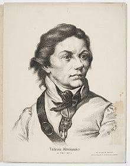
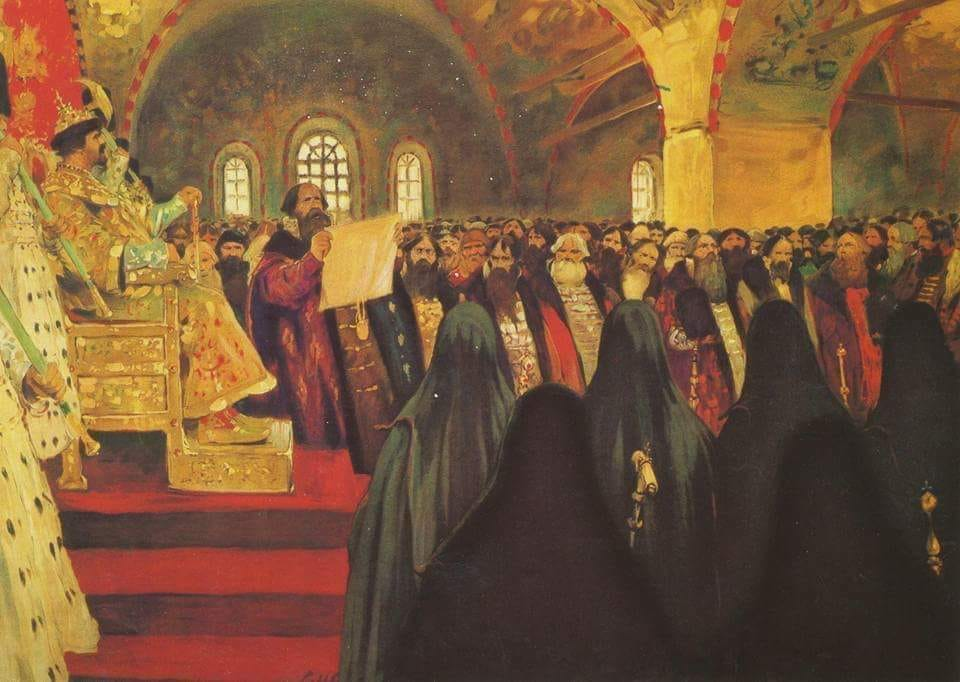

### 2019

Chiny zaprezentowały DF-41 - broń, o której mówi się, że można by jej użyć w "dzień Sądu Ostatecznego". Chińczycy pochwalili się budzącym respekt uzbrojeniem podczas wielkiej parady z okazji 70-lecia rządów komunistycznych.

Chińska broń budzi strach. Dongfeng-41 (DF-41) to międzykontynentalny pocisk balistyczny, który właśnie został po raz pierwszy pokazany publicznie. Po wystrzeleniu z pojazdu silnikowego rakiety nuklearne mogą polecieć na odległość nawet 15 tys. kilometrów.

Żadna inna rakieta na świecie nie ma tak dużego zasięgu. Amerykańskie rakiety nuklearne mają zasięg o kilka tysięcy kilometrów mniejszy od DF-41.

Prędkość 25 razy większa od prędkości dźwięku. Pocisk lata z prędkością 25 machów, czyli ponad 30 tys. kilometrów na godzinę. Do USA jest w stanie dotrzeć w niecałe pół godziny. Jednocześnie w cele w USA mogłoby uderzyć dziesięć takich pocisków - informuje The Sun.

  

### 2018

Dekret prezydencji USA który nawołuje do bojkotu wenezuelskiej branży złota - Executive Order 13850.

### 1961

https://en.wikipedia.org/wiki/Defense_Intelligence_Agency

### 1949

Rocznica Proklamowania Chińskiej Republiki Ludowej (święto narodowe)

### 1939

W sopockim Grand Hotelu miało miejsce podpisanie aktu kapitulacji Rejonu Umocnionego Hel. W imieniu polskiej strony, dokument ten, złożony na ręce kontradmirała Huberta von Schmundta podpisali komandor Marian Majewski oraz kapitan Antoni Kasztelan.
Jeszcze tego samego dnia wieczorem zdecydowano, że wszystkim obrońcom zostanie wypłacony trzymiesięczny żołd. Rozpoczęto również niszczenie akt sądowych i personalnych oraz zakopywanie i zatapianie przez całą noc sprzętu. Już następnego dnia na Hel weszły jednostki niemieckie.

  

### 1907

<a href="https://en.wikipedia.org/wiki/Panic_of_1907" target="_blank">Panika 1907</a>

### 1845

W Sianowie w województwie zachodniopomorskim uruchomiona została pierwsza na obecnych polskich ziemiach fabryka zapałek. Jej założycielem był pochodzący z Rügenwalde (obecnie Darłowo) August Kolbe. 
Początkowo był to mały zakład, w którym zatrudnionych było zaledwie dwóch pracowników. System i organizacja pracy również dalekie były od ideału. Po wyprodukowaniu pewnej ilości zapałek fabryka przerywała produkcję, a sprzedażą towaru zajmował się sam właściciel. Jednak już w roku 1861 w zakładzie pracowało już 80 osób, a technologia produkcji została ulepszona przez wprowadzenie nowej maszyny parowej o mocy 100 koni mechanicznych. 
Koniec XIX wieku i początek XX był dla sianowskiej fabryki trudnym czasem przekształceń własnościowych. W okresie drugiej wojny światowej,  a zwłaszcza pod jej koniec zakład przeszedł w ręce Rosjan, którzy oddając ją w lipcu 1945 roku polskim władzom komunistycznym ograbili ją z większości maszyn. Postępowanie Sowietów tłumaczono później podjęciem działań w oparciu o porozumienie zawarte między Polskim Komitetem Wyzwolenia Narodowego a rządem radzieckim w sprawie reparacji wojennych. W ich wyniku wojska radzieckie zabrały z fabryki cały park maszynowy, podstawowe urządzenia a także pozostałe w niej surowce. Zabrano również  z fabryki dokumentację techniczną i księgi wieczyste.
Na nowo produkcja zapałek ruszyła w 1946 roku, a zatrudnienie w fabryce znalazło 20 osób. Pracowały one na używanym sprzęcie sprowadzonym z innych podobnych fabryk, który na miejscu poddawano remontom.  Oficjalne otwarcie nowej fabryki miało miejsce we wrześniu 1947 roku.

  

### 1798

W Warszawie powstało Towarzystwo Republikanów Polskich-organizacja niepodległościowa na której czele stanął sam Tadeusz Kościuszko (grafika).
W swoim programie głosiła ona konieczność odbudowania struktur niepodległego Państwa Polskiego jako republiki parlamentarnej.
Organizacja została rozwiązana w czerwcu 1801 roku.

  

### 1653

Car Aleksy I zwołał Sobór Ziemski, podczas którego zerwany został zerwany traktat pokojowy z Polską. Na mocy postanowień tego samego zgromadzenia odebrano Polsce Ukrainę, którą przyłączono następnie do Rosji.
Najbardziej dramatycznym w skutkach efektem Soboru Ziemskiego była trwająca 13 lat wojna polsko-rosyjska.

  

---

<a href="https://github.com/TomaszWaszczyk/historia.waszczyk.com/edit/master/src/content/october-1.md" target="_blank">Edytuj tę stronę dzieląc się własnymi notatkami!</a>
