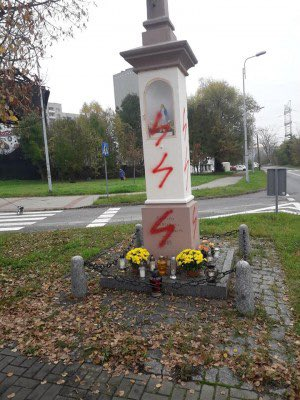
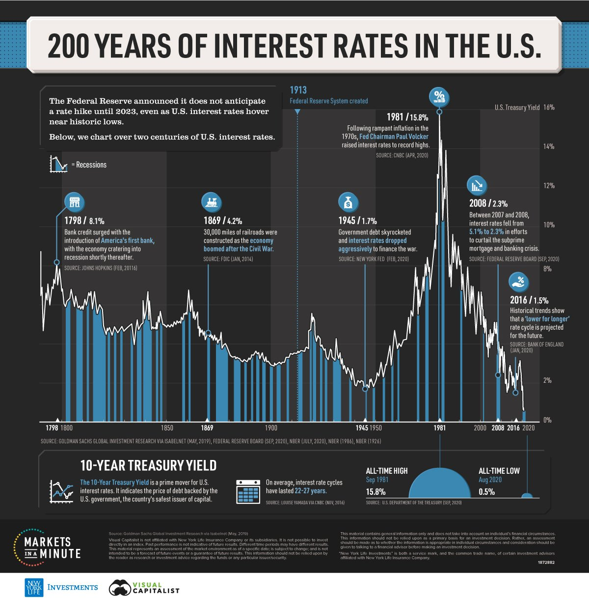
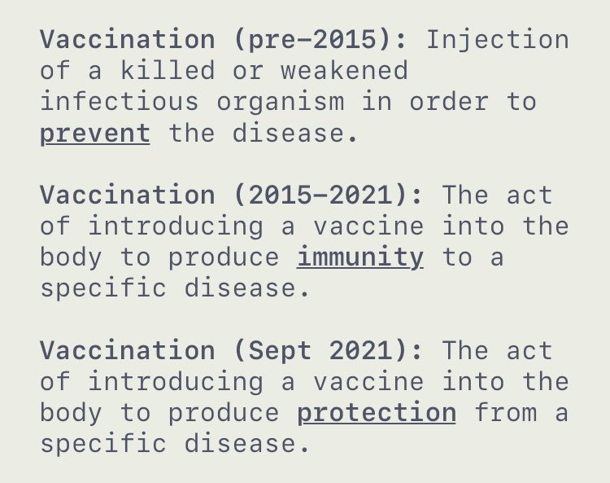

### 2022

From October 1, Ukrainian women liable for military service will be prohibited from leaving the country - that is, the same restrictions will apply as for men liable for military service.

This was announced by the lawyer of the Ministry of Defense Vladimir Smilka.

### 2021

Protesty we Francji przeciwko segregacji (TVP milczy)

<video width="640" height="480" controls>
<source src="./movies/october/parisseptember.mp4" type="video/mp4">
Your browser does not support the video tag.
</video>

### 2020

  

  

### 2019

Chiny zaprezentowały DF-41 - broń, o której mówi się, że można by jej użyć w "dzień Sądu Ostatecznego". Chińczycy pochwalili się budzącym respekt uzbrojeniem podczas wielkiej parady z okazji 70-lecia rządów komunistycznych.

Chińska broń budzi strach. Dongfeng-41 (DF-41) to międzykontynentalny pocisk balistyczny, który właśnie został po raz pierwszy pokazany publicznie. Po wystrzeleniu z pojazdu silnikowego rakiety nuklearne mogą polecieć na odległość nawet 15 tys. kilometrów.

Żadna inna rakieta na świecie nie ma tak dużego zasięgu. Amerykańskie rakiety nuklearne mają zasięg o kilka tysięcy kilometrów mniejszy od DF-41.

Prędkość 25 razy większa od prędkości dźwięku. Pocisk lata z prędkością 25 machów, czyli ponad 30 tys. kilometrów na godzinę. Do USA jest w stanie dotrzeć w niecałe pół godziny. Jednocześnie w cele w USA mogłoby uderzyć dziesięć takich pocisków - informuje The Sun.

  

### 2018

Dekret prezydencji USA który nawołuje do bojkotu wenezuelskiej branży złota - Executive Order 13850.

### 2015

  

### 2010

W październiku 2010r. berlińska firma DBM Energy wraz z inną niemiecką firmą Lekker Energie zaprezentowała elektryczne Audi A2, które przejechało około 600 km z Monachium do Berlina, przy średniej prędkości 90 km/h z włączonym ogrzewaniem. oraz oświetleniem.
Auto było wyposażone w większy pakiet akumulatorów (98 kWh) i według komunikatu prasowego firmy po przyjeździe do Berlina wykorzystane zostało 82 % zgromadzonej w ogniwach energii co oznacza, że Audi mogłoby przejechać nawet 714 km. Na mecie autem miał okazję przejechać się niemiecki minister gospodarki Rainer Brüderle.

Elektryczne Audi A2 wyposażone zostało w pakiet akumulatorów litowo-metalowo-polimerowych (LMP) nazywanych przez producenta, firmę DBM Energy, Kolibri AlphaPolymer Technology.
Firma ujawniła, że ogniwa pracują ze sprawnością 97% oraz mogą być ładowane nawet w ciągu 6 minut, a akumulatory nie tracą pojemności przez pierwsze 2500 cykli ładowania/rozładowania.

Nieco później w grudniu 2010r. "w niewyjaśnionych okolicznościach" spłonął w garażu DBM Energy testowy samochód, jednak w środku nie było akumulatorów Kolibri AlphaPolymer.

W kwietniu 2011r. DBM Energy poinformowała o ukończeniu niezależnych testów ogniw Kolibri AlphaPolymer oraz samochodu elektrycznego Audi A2 wyposażonego w pakiet Kolibri.
Kompleksowe testy ogniw przeprowadzone przez German Federal Institute for Materials Research and Testing (BAM - Bundesanstalt für Materialforschung und –prüfung) potwierdziły wysokie bezpieczeństwo ich stosowania.
Ogniwa były poddawane działaniu wysokich i niskich temperatur oraz ciśnienia, zwierane, przeciążane, dołączane do źródła o przeciwnej biegunowości, poddawane dużym siłom mechanicznym, wibracjom oraz silnym uderzeniom., a także zostały wystawiane na bezpośredni kontakt z ogniem, co nie spowodowało ich zapłonu ani wybuchu.
DBM Energy podaje żywotność ogniw podczas normalnej pracy na poziomie 5000 cykli ładowania/rozładowania.

Natomiast Dekra zbadała na hamowni osiągi elektrycznego Audi A2 wyposażonego w pakiet Kolibri gromadzący około 62,9 kWh energii. Auto ważące niecałe 1500 kg w teście ECE-R 101 przejechało 454,83 km (zużywając około 13,8 kWh/100 km). Potwierdzona została także sprawność ogniw wynosząca około 97%.

W maju 2011r. firma DBM Energy po raz kolejny prezentuje elektryczne Audi A2 wyposażone w akumulatory LMP Kolibri AlphaPolymer Technology, tym razem w wersji o zasięgu 450 km. Według zapewnień DBM Energy, koszt masowej produkcji samochodów elektrycznych z akumulatorami Kolibri nie będzie wyższy od spalinowych odpowiedników. W tym roku niemiecka firma planuje przeprowadzić całą serie prezentacji auta.

*Mirko Hannemann* twórca DBM Energy twierdzi, że w czerwcu zostaną oddane do testów 3 samochody Audi A2 aby rozwiać wątpliwości co do parametrów technologii Kolibri AlphaPolymer.
Jednocześnie mówi o potrzebach inwestycji w dalsze badania w wysokości 15 milionów euro.

W tym samym czasie DBM Energy zmienia osobowość prawną i nazwę na Hummingbird Power Systems Ltd, a także adres strony http://dbm-energy.com, na http://kolibri-ag.com. Zawartość strony zostaje pozbawiona jakichkolwiek informacji o akumulatorach trakcyjnych do samochodów elektrycznych.
Mirko Hannemann zostaje dyrektorem zarządzającym, jednocześnie do zarządu wchodzą Helmuth von Grolmann (były członek zarządu Daimler Benz AG) oraz rzecznik patentowy Richard Leitermann (prawnik, specjalista od prawa gospodarczego i prawa spółek), natomiast Richard Gaul (przez 22 lata dyrektor ds. komunikacji w BMW i od kilku lat konsultant w Federacji Przemysłu w Berlinie) zostaje rzecznikiem i szefem ds. komunikacji Hummingbird Power Systems AG.

Po tych zmianach niektóre materiały video dotyczące przełomowej technologii Kolibri AlphaPolymer zostały usunięte z sieci przez właściciela...

### 2008

  

### 2001

<video width="640" height="480" controls>
<source src="./movies/october/lepper.mp4" type="video/mp4">
Your browser does not support the video tag.
</video>

### 1961

https://en.wikipedia.org/wiki/Defense_Intelligence_Agency

### 1949

Rocznica Proklamowania Chińskiej Republiki Ludowej (święto narodowe)

### 1939

W sopockim Grand Hotelu miało miejsce podpisanie aktu kapitulacji Rejonu Umocnionego Hel. W imieniu polskiej strony, dokument ten, złożony na ręce kontradmirała Huberta von Schmundta podpisali komandor Marian Majewski oraz kapitan Antoni Kasztelan.
Jeszcze tego samego dnia wieczorem zdecydowano, że wszystkim obrońcom zostanie wypłacony trzymiesięczny żołd. Rozpoczęto również niszczenie akt sądowych i personalnych oraz zakopywanie i zatapianie przez całą noc sprzętu. Już następnego dnia na Hel weszły jednostki niemieckie.

  

### 1907

<a href="https://en.wikipedia.org/wiki/Panic_of_1907" target="_blank">Panika 1907</a>

### 1845

W Sianowie w województwie zachodniopomorskim uruchomiona została pierwsza na obecnych polskich ziemiach fabryka zapałek. Jej założycielem był pochodzący z Rügenwalde (obecnie Darłowo) August Kolbe. 
Początkowo był to mały zakład, w którym zatrudnionych było zaledwie dwóch pracowników. System i organizacja pracy również dalekie były od ideału. Po wyprodukowaniu pewnej ilości zapałek fabryka przerywała produkcję, a sprzedażą towaru zajmował się sam właściciel. Jednak już w roku 1861 w zakładzie pracowało już 80 osób, a technologia produkcji została ulepszona przez wprowadzenie nowej maszyny parowej o mocy 100 koni mechanicznych. 
Koniec XIX wieku i początek XX był dla sianowskiej fabryki trudnym czasem przekształceń własnościowych. W okresie drugiej wojny światowej,  a zwłaszcza pod jej koniec zakład przeszedł w ręce Rosjan, którzy oddając ją w lipcu 1945 roku polskim władzom komunistycznym ograbili ją z większości maszyn. Postępowanie Sowietów tłumaczono później podjęciem działań w oparciu o porozumienie zawarte między Polskim Komitetem Wyzwolenia Narodowego a rządem radzieckim w sprawie reparacji wojennych. W ich wyniku wojska radzieckie zabrały z fabryki cały park maszynowy, podstawowe urządzenia a także pozostałe w niej surowce. Zabrano również  z fabryki dokumentację techniczną i księgi wieczyste.
Na nowo produkcja zapałek ruszyła w 1946 roku, a zatrudnienie w fabryce znalazło 20 osób. Pracowały one na używanym sprzęcie sprowadzonym z innych podobnych fabryk, który na miejscu poddawano remontom.  Oficjalne otwarcie nowej fabryki miało miejsce we wrześniu 1947 roku.

  

### 1798

W Warszawie powstało Towarzystwo Republikanów Polskich-organizacja niepodległościowa na której czele stanął sam Tadeusz Kościuszko (grafika).
W swoim programie głosiła ona konieczność odbudowania struktur niepodległego Państwa Polskiego jako republiki parlamentarnej.
Organizacja została rozwiązana w czerwcu 1801 roku.

  

### 1653

Car Aleksy I zwołał Sobór Ziemski, podczas którego zerwany został zerwany traktat pokojowy z Polską. Na mocy postanowień tego samego zgromadzenia odebrano Polsce Ukrainę, którą przyłączono następnie do Rosji.
Najbardziej dramatycznym w skutkach efektem Soboru Ziemskiego była trwająca 13 lat wojna polsko-rosyjska.

  

---

<a href="https://github.com/TomaszWaszczyk/historia.waszczyk.com/edit/master/src/content/october-1.md" target="_blank">Edytuj tę stronę dzieląc się własnymi notatkami!</a>
