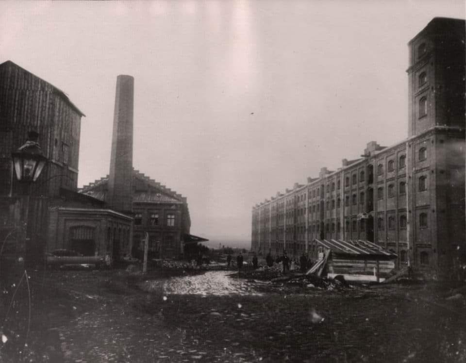

### 2019

Turecka inwazja na syryjski Kurdystan będzie miała poważne skutki międzynarodowe, w tym zapewne odczuwalne także dla nas. Z najważniejszych:
- takie wzmocnienie Turcji w regionie osłabia względnie przede wszystkim Rosję i trudno oczekiwać braku jej reakcji; dotyczy to też Iranu, Arabii Saudyjskiej, Izraela
- to Moskwa zostanie teraz prawdopodobnie głównym patronem kurdyjskiej irredenty
- wzmacnia to presję na ocieplenie amerykańsko-rosyjskie, aby wspólnie trzymać w ryzach ekspansjonizm turecki (tu oczywisty wątek polski w tle)
- wzrośnie zaangażowanie Rosji w tym regionie, kosztem innych zaangażowań (j.w.)
- bardzo wzrośnie presja na Unię Europejską, aby wzięła część odpowiedzialności za ustabilizowanie sytuacji; na szali m.in. kolejna fala - czy raczej fale - uchodźców z terenu Turcji, tych obecnych i być może przyszłych, których w razie niezadowalającej dla siebie treści i formy tego zaangażowania UE prezydent Erdogan może częściowo skierować za zachód, zamiast do syryjskiej Rożawy (znów wątek polski w tle)
- jeśli amerykańskie wycofanie militarne z regionu okaże się trwałe - a coraz więcej wskazuje, że tak - czeka go zapewne nowa fala konfliktów i chaosu; nie zdziwiłbym się gdyby za jakiś czas odrodziło się Państwo Islamskie lub inna, nowa forma wysoce zorganizowanego terroryzmu spod znaku radykalnego islamu.
Historia dzieje się teraz. I zaraz.

### 1963

Józef Franczak "Lalek" ostatni żołnierz niepodległościowego podziemia poległy w boju. Zabity w obławie 21.10.1963 18 lat po II wojnie św. Ciało „Lalka” komuniści zbezcześcili odcinając mu głowę, a nagie zwłoki wrzucili do bezimiennego grobu.

### 1973

Umiera Ludwig von Mises był jednym z najwybitniejszych ekonomistów w dziejach cywilizacji Zachodu.

> Jego dzieła przesycone są duchem wolności. (...) Mamy wobec niego trudny do spłacenia dług.

Ronald Reagan

Książka, która czekała na polskie wydanie prawie 60 lat (pierwsze wydanie Human Action to rok 1949). Opus magnum nestora austriackiej szkoły ekonomii Ludwiga von Misesa. Chłodna, rzeczowa rozprawa z socjalizmem, interwencjonizmem i wszelkimi odmianami pseudoekonomii; gruntowny wykład prakseologii i głęboka refleksja nad prawidłowościami i ograniczeniami, jakim podlega ludzkie działanie. Po 1989 roku stało się oczywiste, że socjalizm nie może się udać. Mises wiedział o tym już w latach czterdziestych, a więc wtedy, kiedy wielu intelektualistów wiązało z tym ustrojem wielkie nadzieje.

Ludzkie działanie miało 4 wydania amerykańskie i zostało przetłumaczone na kilkanaście języków, w tym chiński, japoński, rosyjski i czeski. Mamy je wreszcie po polsku. Ludwig von Mises był najwybitniejszym obrońcą kapitalizmu i krytykiem socjalizmu w XX wieku, najważniejszym przedstawicielem austriackiej szkoły ekonomii, nauczycielem Hayeka, Rothbarda oraz wielu innych ekonomistów i naukowców. Przez całe dorosłe życie pisał i wykładał w różnych krajach. Jest autorem kilkudziesięciu książek i ponad 250 artykułów. Po polsku ukazały się dotychczas: Interwencjonizm, Mentalność antykapitalistyczna, Liberalizm w tradycji klasycznej, Planowany chaos, Biurokracja, Ekonomia i polityka, Wspomnienia, Teoria a historia, Socjalizm, Teoria pieniądza i kredytu, Kalkulacja ekonomiczna w socjalizmie. Mimo to w naszym kraju jest wciąż prawie nieznany, choć nawet jego adwersarz Oskar Lange pisał, że Misesowi należy się pomnik. Mamy nadzieję, że ukazanie się Ludzkiego działania przerwie milczenie wokół dorobku Misesa. Ludzkie działanie to lektura obowiązkowa nie tylko dla wykładowców uczelni ekonomicznych i ich studentów, lecz także wszystkich, którzy chcą zrozumieć, czym jest na prawdę ekonomia. Uroczysta prezentacja książki odbyła się podczas konferencji "Mises obrońca cywlizacji i ekonomii" w Warszawie, 27 października 2007 r.

### 1957

https://en.wikipedia.org/wiki/Atlas_Shrugged

### 1956

" Nie obrażajcie się panowie, że
my wam tylko ofiarujemy
miejsca w rządzie, takie jakie
sami uważamy za możliwe.
Myśmy bowiem gospodarze(...).
Władzy raz zdobytej nie oddamy
nigdy (...). Władzy nie oddamy
dlatego, aby naród polski nie
spotkała nowa zguba, jaka mu
grozi w wypadku fałszywej linii
politycznej, którą próbuje
narodowi narzucić reakcja (...).
Zniszczymy wszystkich
bandytów reakcyjnych, bez
skrupułów. Możecie jeszcze
krzyczeć, że leje się krew narodu
polskiego, że NKWD rządzi
Polską, lecz to nie zawróci nas z
drogi."

Autorem tych słów jest Władysław Gomułka (zdjęcie),który 21.X.1956 roku został w miejsce Edwarda Ochaba I sekretarzem Komitetu Centralnego Polskiej Zjednoczonej Partii Robotniczej.
Okres jego rządów oceniany jest jako czas siermiężnego socjalizmu,kiedy to nie dbano o potrzeby zwykłych ludzi i skutecznie uniemożliwiano otwarcie się Polski na zachód. Dopiero wydarzenia marca 1968 roku sprawiły ,że pozycja Gomułki zaczęła słabnąć.
Jednak prawdziwym gwozdziem do trumny okazał się być grudzień 1970 roku,kiedy to władza zdecydowała o drastycznych podwyżkach cen,co wywołało masowe niepokoje społeczne,które Gomułka zaczął tłumić przy użyciu wojska i milicji.
17 grudnia 1970 robotnicy zrozumieli, że władza się nie ugnie i przerwali strajk. Wtedy padł rozkaz strzelania do ludzi idących do pracy.
Zginęło 45 osób, 1165 zostało rannych.
Symbolem śmierci stał się młody Janek
Wiśniewski.
Po tych wydarzeniach na stanowisku I
sekretarza, Gomułkę zastąpił Gierek.
Przegranym grudnia 1970 w sensie politycznym
był Moczar, który nie objął stanowiska I
sekretarza.

  

### 1906

W Łodzi wyrokiem sądu polowego stracono 5 robotników łódzkich fabryk, którzy byli  uczestnikami powstania łódzkiego zwanego też "czerwcowym".
Na znak protestu we wszystkich łódzkich fabrykach odbył się strajk, w którym udział wzięło 67 tysięcy osób.

  

---

<a href="https://github.com/TomaszWaszczyk/historia.waszczyk.com/edit/master/src/content/october-10.md" target="_blank">Edytuj tę stronę dzieląc się własnymi notatkami!</a>
