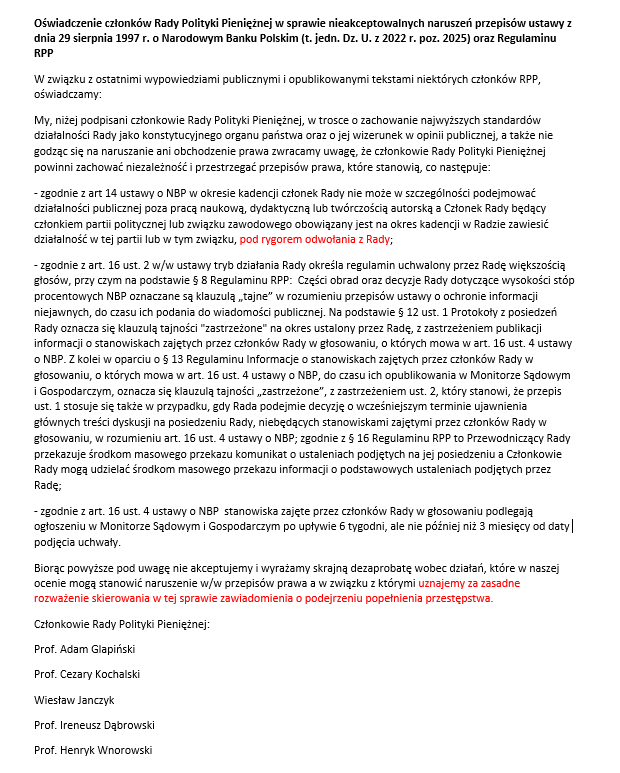

### 2023

  

### 2022

PREZES NBP I CZŁONKOWIE RPP JANCZYK I DĄBROWSKI WYRAZILI W OŚWIADCZENIU DEZAPROBATĘ WOBEC DZIAŁAŃ INNYCH CZŁONKÓW RPP, KTÓRE W ICH OCENIE MOGĄ NARUSZAĆ PRZEPISY PRAWA - Reuters News

  

  

---

Polski dług będzie bardzo drogi. Rentowności 5-letnie już prawie 8%! Minister Finansów ma problem.

Rekordowo koszty obsługi długu, 66 mld zł, to już historia. Będzie dużo więcej.

  

---

### 2020

Revisiting speculative hyperinflations in monetary models:

> This paper revisits the debate on ruling out speculative hyperinflations in monetary models. Although apparently a narrow issue, studying these extreme economies turns out to be quite illuminating in understanding the fundamentals of price level determination. It is also relevant in evaluating the broader claims that advocates of the fiscal theory of the price level have made. In Obstfeld and Rogoff (1983, 1986) we show that in pure fiat money models with rational expectations, where the government gives no backing whatsoever to currency, there is in fact no reasonable way to rule out speculative hyperinflations where the value of money goes to zero, even if the money supply itself is exogenous and constant. Such perverse equilibria are ruled out, however, if the government provides even a very small real backing to the currency – a fiscal mechanism, but one that comes into play only as a backstop. Indeed that backing does not have to be certain. Cochrane (2011, 2019), however, argues that this result is wrong, and that fractional currency backing is a Maginot line that is insufficient to rule out hyperinflation. We show here why, in fact, his analysis involves a subtle change in model specification that adds a distinct monetary fragility to our model. Our baseline analysis uses a canonical money-in-the-utility-function setup due to Brock (1974, 1975), but following Wallace (1981), we show the same results go through in an overlapping-generations model of money.

<!-- Jesteśmy w trakcie zbiorowego szaleństwa. Ludzie odlecieli i zatracili zupełnie zdolność do krytycznego myślenia. Uznani naukowcy, dziennikarze, nie mówiąc już o politykach i osobowościach twitterowych, walą absurdalnymi, na ogół czysto emocjonalnymi argumentami jak cepem, bez odrobiny refleksji i bez pokory względem skomplikowania otaczającego nas świata.
Ekscytowanie się codziennymi danymi o liczbie testów pozytywnych świadczy o totalnym ogłupieniu komentatorów. Od samego początku było najzupełniej oczywiste, że testy wykrywały tylko jakąś część osób zakażonych. Skoro zdecydowana większość zakażonych nie wykazuje żadnych objawów, nie ma powodu, by uważać, że liczba testów pozytywnych jest choćby zbliżona do prawdziwego poziomu zakażeń. Obecnie, gdy kilkanaście procent testów jest pozytywnych, prawdopodobnie nie zgadza się już nawet rząd wielkości faktycznie zakażonych. Mimo to, codziennie rano nowa liczba podawana przez Ministerstwo Zdrowia jest najważniejszą informacją dnia. Następnie sumuje się wyniki i podaje liczbę chorych od początku pojawienia się koronawirusa w Polsce, która to liczba również nie ma żadnego znaczenia. Istotne są dane o całkowitej śmiertelności, o śmiertelności z powodu wirusa i o miejscach w szpitalach.   
Całkowita śmiertelność w Polsce, póki co, jest w normie. Jeżeli spojrzymy na wykres śmiertelności, nic się na nim nie dzieje. W Polsce codziennie umiera średnio 1100 osób. Ponad 70% z tej liczby to nowotwory i choroby układu krążenia. Nawet dziesiątki zgonów na wirusa dziennie byłyby mało istotne w porównaniu do wszystkich zgonów. I tu wchodzimy w bardzo ważny aspekt tej wojny z wirusem. W wyniku nakręcenia histerii doszło do drastycznego (o kilkadziesiąt procent) spadku wykrywania nowotworów, chorób serca i udarów. Jeżeli odłożymy na bok myślenie magiczne, według którego histeria koronawirusowa ograniczyła pojawienie się nowotworów, jak na dłoni widać, że znacząco zwiększymy śmiertelność z powodu nowotworów w następnych latach. Nie bez powodu lekarze od lat mówią o absolutnie kluczowym czynniku - jak najwcześniejszej diagnozie. Teraz, z powodu strachu, tej diagnozy nie ma.  
Na kwarantannie siedzi już 230 tysięcy osób i liczba ta bardzo szybko rośnie. I znowu. Jest zupełnie oczywiste, że nie wysyłamy na kwarantannę wszystkich, którzy zetknęli się z osobami mającymi test pozytywny. Tym bardziej nie wysyłamy na kwarantannę osób, które zetknęły się z zakażonymi wirusem a którym nie przeprowadzono testu. W związku z tym na kwarantannie siedzi mały ułamek osób, które powinny tam siedzieć, aby ten masowy areszt miał jakikolwiek sens. Przebywanie na kwarantannie w istocie nie świadczy o tym, że ma się ponadprzeciętną szansę zachorowania, a o tym, że ma się ponadprzeciętnego pecha. 
Wzrost zakażeń nie ma prawa zatrzymać się w inny niż naturalny sposób, jeżeli odrzucimy totalny, wręcz chiński lockdown. Nie można powstrzymać kolejnych zakażeń, tak samo jak nie mogliśmy do tej pory powstrzymać corocznych nawrotów grypy. Nie tylko w Polsce. W Europie również. Jedyne co można zrobić, to udoskonalać leki i procedury leczenia oraz dostosować zdolność systemu ochrony zdrowia do obecnych potrzeb. Dlatego nie ma sensu oceniać skuteczności państw przez pryzmat liczby zakażeń. Trzeba patrzeć na śmiertelność, a ta, póki co, na Zachodzie jesienią jest niziutka. U nas szybko rośnie. Przygotowaniami na jesień trzeba było zająć się wiosną. Niestety jak to zwykle bywa w naszym państwie z dykty, reformowanym trytytkami, nic w tym kierunku nie zrobiono. Ważniejsze były wybory, rekonstrukcja rządu i napawanie się, jak to świat nam wszystkiego zazdrości. 
Premier Mateusz Morawiecki w okresie wyborczym robił z siebie pajaca, publicznie przekonując osoby starsze, że wirus został pokonany i jest już zupełnie niegroźny. Oznacza to, że świadomie kłamał lub naprawdę w to wierzył. Pierwsza alternatywa by w ogóle nie dziwiła, druga tłumaczy zupełny brak przygotowań do jesiennej fali zachorowań. 
Właśnie, grypa. Równie mocno wielu ludzi przywiązało się do innej absolutnie niewiarygodnej danej - do liczby zgonów spowodowanych grypą. Według oficjalnych danych w Polsce umiera co roku na grypę około 100 osób. Czasem jest to 60, a czasem 140. Tymczasem w przeliczeniu na liczbę ludności, w innych państwach zgonów jest 100 razy więcej. Dlaczego? Ponieważ w Polsce lekarze nie podają grypy jako przyczyny zgonu. Co zresztą sami przyznają w wielu wywiadach. W zależności od roku zgonów na grypę jest więc w Polsce pomiędzy 6 a 14 tysięcy. I nie powoduje to corocznej histerii połączonej z dewastowaniem gospodarki, terroryzowaniem ludności, niszczeniem porządku prawnego, szkolnictwa, zamykaniem szpitali przed chorymi, masowym testowaniem i podawaniem na czerwonym pasku w telewizji liczby testów pozytywnych.
Gdy mówię o tym co powyżej, gdy mówię o nieznanych jeszcze, długoterminowych skutkach walki z wirusem, w obszarze szkolnictwa, relacji społecznych, dzietności, porządku prawnego, wykrywania nowotworów, obniżenia odporności, to druga strona dostaje histerii i z absolutnym przekonaniem o swojej własnej moralnej wyższości, z góry wyzywa mnie od nieodpowiedzialnych osób, które nie doceniają powagi sytuacji, gardzą czyimś życiem i epatują własnym egoizmem. W takich warunkach, przy tak wysokim poziomie emocji, debata na argumenty jest niemożliwa. I to jest jeden z największych problemów. W nauce stawia się tezy, próbuje ich dowodzić, inni próbują je falsyfikować, a cały proces zbliża nas do prawdy. Obecnie nic takiego się nie dzieje. 
Osobiście najchętniej przesiedziałbym cicho następne miesiące, mając świadomość, że większość ludzi jest w tym momencie zupełnie niezdolna do przyjęcia argumentów. Niestety czuję, że mam moralny obowiązek zabierania głosu. Obowiązek ten mają też lekarze, publicyści i ludzie nauki. Niestety nieliczni ten obowiązek wypełniają. Wymienię tu Rafała Ziemkiewicza, Łukasza Warzechę, Rafała Otokę-Frąckiewicza, czy lekarza Pawła Basiukiewicza. Oni walczą o prawdę, o powrót rozumu i o zakończenie tej histerii. Niestety na razie są to głosy wołające na puszczy. Jeżeli ich nie wesprzemy, to długo się tu nic nie zmieni. -->

### 2017

W Szpitalu Pediatrycznym w Warszawie (tam gdzie było centrum głodówki) odbędzie się „dzień bez lekarza”. Jest to ich oddolna akcja, ze względu na poziom frustracji, dramatu i niezadowolenia. Rozmawiają z dyrekcją, proszą o poprawę warunków pracy (zwiększenie zatrudnienia) i płacy (lekarze specjaliści zarabiają po 2600 zł netto miesięcznie). Jest to szpital strategiczny nie tylko dla Warszawy i województwa mazowieckiego, ale także dla Polski (leczą najtrudniejsze przypadki) i szpital akademicki kształcący przyszłych lekarzy. Szpital ultranowoczesny, ponoć najnowocześniejszy szpital pediatryczny w Europie, niedawno oddany do użytku. I co? I kosmicznie zadłużony, na granicy bankructwa, ledwo starcza im już na prąd. Super lekarze, super kadra, super sprzęt – a wyceny procedur pediatrycznych, brak docenienia personelu i dramat kadrowy odbija się wielkim echem. Powiedzieli dość, natchnięci także protestem głodowym, który się u nich odbywał. Rozmawiałem z nimi, byłem zaproszony na jedno ze spotkań. To są ludzie z pasją, którzy po prostu chcą leczyć najlepiej jak umieją, nie chcą borykać się z odsyłaniem pacjentów, z kolejkami (jak cała Polska), którzy są przepracowani, zostają po godzinach, żeby przyjąć wszystkich potrzebujących pomocy pacjentów.
Pytacie dlaczego akcja jest tylko tam, nieskoordynowana na województwo, na całą Polskę i co ona może dać. To jest pytanie do Was…. Ci lekarze i pozostały personel są wzorem. Wzięli sobie do serca to co przez miesiąc słyszeli na konferencjach prasowych, na spotkaniach z głodującymi. Ponad połowa klinik już wypowiedziała opt-outy, zapisują się do związków masowo, są na granicy wypowiedzenia sporu zbiorowego. Widzą, że tylko tak mogą poprawić sytuację pacjentów i swoją. Złożyli postulaty płacowe do dyrekcji zgodne z wszystkimi rekomendacjami – o 2 i 3 średnie krajowe, o zwiększenie zatrudnienia i z prośbą o nagłośnienie sprawy, aby MZ, Rząd wreszcie dostrzegł problem (6.8% PKB w trzy lata). Tak jak tam jutro, tak może wyglądać cała Polska jeśli zabraknie lekarzy. Tak może wyglądać medyczna Polska od stycznia jeśli wypowiedzie wszyscy gremialnie opt-outy, zrezygnujecie z dodatkowej pracy w sektorze państwowym, zsolidaryzujecie się. PACJENCI i ICH RODZICE wspierają na miejscu tych lekarzy !!! Widzą ich przepracowanie, widzą ich zapał i oddanie. Mamy poparcie społeczne. Tylko my możemy zmienić rzeczywistość polskiej medycyny. 
Po połowie listopada będą dokładne wytyczne i sugestie co i jak robić. Pomożemy, odpowiemy na pytania. W piątek nadzwyczajne posiedzenie Naczelnej Izby Lekarskiej, OZZL i Porozumienia Rezydentów – będą ustalane szczegóły, omawiana pomoc dla lekarzy solidaryzujących się i rezygnujących z pracy.
To OD WAS ZALEŻY CZY TO WSZYSTKO SIĘ POWIEDZIE. TO WY TERAZ DECYDUJECIE. WEŹCIE SIĘ DO KUPY i zrozumcie, że musicie się poświęcić na dwa, trzy miesiące (im bardziej solidarnie tym krócej) i wtedy wygramy bitwę o lepszą medycynę, lepsze pensje, docenienie nas.
NIE BÓJCIE SIĘ NICZEGO, bierzcie przykład z kolegów ze szpitala pediatrycznego.

### 1991

Miała miejsce premiera filmu "Kroll" w reżyserii Władysława Pasikowskiego. Był to debiut reżyserski tego znanego dziś twórcy.
"Kroll" to trzymająca w napięciu opowieść losach dezertera Marcina Krolla (Olaf Lubaszenko), którego ucieczka z jednostki zbiegła się w czasie z samobójstwem jednego z dręczonych przez kaprala Wiadernego (Cezary Pazura). Dowództwo jednostki, chcące uniknąć problemów wysyła w celu odnalezienia uciekiniera porucznika Arka (Bogusław Linda). W trakcie poszukiwań okazuje się, że Kroll ma wiele problemów osobistych.
Film ten jest doskonałym studium ludzkich charakterów oraz typów zachowań w sytuacji ciągłego napięcia.
"Kroll" zgromadził w kinach polskich około 450 tys. widzów. Był także hitem kasowym w wypożyczalniach kaset wideo.
Na zdjęciu Bogusław Linda i Maciej Kozłowski.

  

### 1968

  

### 1966

W Będzinie została zamordowana Jolanta Gierek -18 letnia bratanica ówczesnego ówczesnego I sekretarza Komitetu Wojewódzkiego Polskiej Zjednoczonej Partii Robotniczej.   Edwarda Gierka.
Zwłoki kobiety znalezione zostały w rzece Przemszy.
Jednym  267 podejrzanych o dokonanie tego mordu był seryjny morderca Zdzisław Marchwicki, który miał do tego czasu na swoim koncie 16 podobnych czynów.
W pomoc w schwytaniu zaangażował się sam Edward Gierek. Za pomoc w wskazaniu mordercy wyznaczono niebotyczną jak na owe czasy kwotę miliona złotych. Przyniosło to skutek w postaci wielu donosów. Wkrótce też milicja stworzyła model hipotetyczny zawierający 483 cechy fizyczne i psychiczne, które miał posiadać Wampir. Nie bez znaczenia pozostawał wątek polityczny, gdyż jedna z ofiar Jadwiga Zygmunt z Sosnowca została zamordowana w 20 rocznicę wejścia w życie Manifestu PKWN, a wyłowiona z Przemszy ofiara nosiła to samo nazwisko, co katowicki dygnitarz partyjny.
Marchwicki został schwytany 6 stycznia 1972 roku w Dąbrowie Górniczej, po donosie żony, która złożyła zawiadomienie do Milicji Obywatelskiej o znęcaniu się nad nią i dziećmi. Jego proces rozpoczął się 18 września 1974 roku  w Klubie Fabrycznym Zakładów Cynkowych „Silesia” w Katowicach.
Brak twardych dowodów nie przeszkodził sędziemu Władysławowi Ochmanowi w skazaniu Wampira na karę śmierci. Udowodniono mu zabójstwa 14 kobiet i usiłowanie zabójstwa kolejnych 6. Wyrok wykonano w garażu aresztu śledczego w Katowicach 29 kwietnia 1977 roku.

  

### 1962

https://pl.wikipedia.org/wiki/Sob%C3%B3r_watyka%C5%84ski_II

### 1944

dr Ludwig Fischer, gubernator tzw. dystryktu warszawskiego, skierował do podległych sobie jednostek administracji telegram, dotyczący wydanego przez Hitlera tzw. Rozkazu nr 2. Oto fragment treści telegramu:

"Warszawa, 11 października 1944, godzina 10:40. 
Dot.: nowa polityka wobec Polski.
Po wizycie SS-Obergruppenfuhrera von dem Bacha u Głównego Dowódcy SS 
[Reichsfuhrera Heinricha Himmlera] niniejszym informuję, co następuje: (...) 
Obergruppenfuhrer von dem Bach otrzymał nowy rozkaz – Warszawa ma zostać 
spacyfikowana, tzn. zrównana z ziemią jeszcze podczas wojny, chyba że to 
uniemożliwiają potrzeby wojskowe związane z budową fortyfikacji. Przed 
zniszczeniem, należy usunąć wszystkie surowce, tekstylia i meble. Główna 
odpowiedzialność spoczywa na administracji cywilnej. Podaję niniejsze do 
wiadomości, ponieważ ten nowy rozkaz Fuehrera o zniszczeniu Warszawy ma 
ogromne znaczenie dla kontynuacji nowej polityki wobec Polski (Polenpolitik).
Podpisano: Dr. Fischer, Gubernator Distrikt Warschau, czasowo w Sochaczewie".

Uzupełnieniem tegoż rozkazu były dyspozycje, jakie Himmler wydał 12 
października podczas narady odbytej w jego kwaterze polowej na Mazurach. 
Powiedział wtedy do (szefa SS i Policji tzw. dystryktu warszawskiego) Paula 
Geibla:

"To miasto ma całkowicie zniknąć z powierzchni ziemi i służyć jako punkt 
przeładunkowy dla transportu Wehrmachtu. Kamień na kamieniu nie powinien 
pozostać. Wszystkie budynki należy zburzyć, aż do fundamentów. Pomieszczenie 
dla wojska zostanie urządzone w piwnicach – hotele więcej nie istnieją. 
Pozostaną tylko urządzenia techniczne i sieć kolei żelaznej".

Trudno znaleźć precedens dla takiego dokumentu w nowożytnej historii Europy, 
a może całego świata. Oto najwyższe władze państwowe jednego kraju podejmują 
polityczną decyzję o całkowitej likwidacji stolicy innego państwa, nawet nie 
usiłując tego uzasadnić jakimikolwiek względami natury wojskowej! Odwrotnie, 
podkreśla się, że uwarunkowania militarne wymagają zachowania pewnej liczby 
zabudowań czy urządzeń.

Rozkaz ten jest w szczególny sposób szokujący nie tylko przez swoje 
niszczycielskie barbarzyństwo; miał on także głębszą wymowę polityczną. Jest 
on klinicznym dowodem na niezwykłą w swojej zapiekłości wrogość wobec narodu 
polskiego, zjawisko wyjątkowe nawet w kontekście II wojny światowej. 
Przywódcom III Rzeszy nie wystarczyło wieloletnie męczeństwo Warszawy, 
stopień jej destrukcji sięgający 50% w chwili zakończenia Powstania, śmierć w 
1944 roku prawie 200 tysięcy jej mieszkańców, wreszcie kapitulacja miasta 2 
października. Ich dzika żądza zemsty i zniszczenia raz na zawsze ośrodka 
polskiego myśli narodowej i niepodległościowej, a także wyrządzenia jak 
największych szkód dorobkowi materialnemu, duchowemu i kulturalnemu narodu 
polskiego, podyktowały decyzję o dokończeniu zagłady miasta nawet wbrew 
własnym interesom militarnym i politycznym.

Niektórzy co bardziej trzeźwo myślący dygnitarze nazistowscy dostrzegali 
bezsens zarówno wojskowy, jak i polityczny tej akcji. Nawet w piśmie Fischera 
daje się dostrzec coś w rodzaju żalu, że dokończenie zniszczenia miasta 
dodatkowo torpedowało jego "nową politykę" wobec Polski, mającą polegać na 
osiągnięciu jakiegoś rodzaju porozumienia z Polakami w celu wspólnej walki z 
Sowietami. Oczywiście realność tych oczekiwań była znikoma, jednak przy 
decyzji o zagładzie polskiej stolicy – zgoła zerowa.

Także dowództwo warszawskiego garnizonu Wehrmachtu, odpowiedzialne za 
przygotowanie Warszawy do obrony przed spodziewanym atakiem sowieckim jako 
twierdzy (tzw. "Festung Warschau"), nie wykazywało szczególnego entuzjazmu 
dla akcji masowego burzenia, poważnie utrudniającej zadanie budowy w mieście 
umocnionych rejonów oporu. Sprzeciwiło się zrównaniu z ziemią tych 
nielicznych budowli, które ostatecznie ocalały (np. kilku zabytkowych 
obiektów po wschodniej stronie ul. Krakowskie Przedmieście). Oczywiście 
komenda garnizonu warszawskiego bynajmniej nie kierowała się miłością do 
zabytków Warszawy, a tylko potrzebą zachowania budynków jako tzw. kulisów do 
ochrony przed ostrzałem artylerii sowieckiej z prawego brzegu Wisły (część 
dowództwa niemieckiego kwaterowała w tzw. Domu Bez Kantów, znajdującym się w 
tamtym rejonie). Odpowiednie zarządzenie wydał w dniu 18 października 
dowódca 9-tej Armii, gen. Smilo von Luttwitz:

"Zgodnie z wojskowym punktem widzenia należy opracować kolejność niezbędnych 
prac związanych z rozkazem Hitlera o zniszczeniu miasta Warszawy, przy czym 
należy również ustalić, które domy jako kulisy ochraniające przed obserwacją 
i ostrzałem artyleryjskim nieprzyjaciela muszą być pozostawione".

Co innego "zwykłe" plądrowanie miasta – Wehrmacht uczestniczył w nim ochoczo. 
Niemcy pozostawili także pewną niewielką liczbę niezniszczonych dodatkowych 
budynków (m.in. w południowym śródmieściu, np. przy ul. Lwowskiej), a to 
dlatego, żeby pozostawić w nich miny i różnego rodzaju wybuchowe pułapki. 
Niektóre z nich odniosły pożądany skutek: jeszcze po opuszczeniu Warszawy 
przez Niemców były wypadki śmierci powracających do miasta Warszawiaków, w 
chwili wchodzenia do niezniszczonych domów.
Mimo powyźszych uwarunkowań, w swoim ogólnym zakresie, rozkaz Hitlera o 
zniszczeniu Warszawy został wykonany skrupulatnie i precyzyjnie.

Jednak SS-Obergruppenfuhrer Erich von dem Bach (dowódca wojsk zwalczających 
Powstanie Warszawskie) już nie zajął się wykonaniem rozkazu likwidacji miasta 
(wkrótce po kapitulacji Powstania został odkomenderowany do Budapesztu). 
Odpowiedzialność za całość akcji zniszczenia Warszawy przejęły okupacyjne 
władze cywilne przy pełnej współpracy jednostek policji, SS i armii. Całością 
działań kierował dowódca SS i Policji na tzw. dystrykt warszawski, Paul Geibel, 
podlegający bezpośrednio Himmlerowi. Utworzono specjalny sztab do niszczenia i 
rabowania miasta, tzw. Raumungsstab, mieszczący się u wylotu ulicy Wolskiej. 
Wykonawcami akcji były specjalne oddziały niszczycieli, tzw. Sprengkommando i 
Vernichtungskommando. Dowódcą oddziałów burzycieli był gen. Policji Schmelcher. 
Szczególnie "zasłużyli się" w niszczeniu miasta jego podkomendni: majorowie 
policji Wenger, Schulz i Sarnow (dowódca jednostki minerskiej).

Niszczenie odbywało się według bardzo precyzyjnych założeń. Najpierw plądrowano 
kwartały domów, potem do akcji przystępowały grupy podpalaczy (saperów), które 
traktowały miotaczami ognia mniejsze domy, a zaminowywały i wysadzały w 
powietrze większe obiekty. Po kilku dniach oddziały te jeszcze raz przechodziły 
tymi samymi ulicami i niszczyły wszystko, co jeszcze ocalało.

Niemcy sami upajali się swoimi niszczycielskimi "osiągnięciami". Żołnierze robi 
sobie "pamiątkowe" fotki na tle zniszczonych zabudowań. Zachowało się np. 
zdjęcie zadowolonych wojaków pozujących na tle zburzonego kościoła św. 
Aleksandra na placu Trzech Krzyży. Zachowywali się zupełnie tak, jak np. 
współcześni turyści pozujący na tle Pałacu Dożów w Wenecji!

Szczytem cynizmu było to, że Niemcy prowadzili też "dokumentację" swojej 
haniebnej akcji. Zajmował się tym np. niejaki Alfred Mensebach, architekt, 
członek Reichskammer der Bildenden Kunste (nazistowskiej instytucji sztuk 
pięknych). Po wojnie odnaleziono tzw. archiwum Mensebacha, zawierające 137 
zdjęć ukazujących sceny niszczenia miasta. Część fotografii robionych przez 
Niemców było nawet... barwnych (!). Album Mensebacha zawierał także informacje 
o odznaczonych za niszczenie Warszawy jego kolegach-podpalaczach, stąd znane są 
ich nazwiska, takie jak Baumer, Sedlag, czy Krause.

Zniszczenia w Warszawie dokonane pomiędzy 11 października 1944 a 17 stycznia 
1945, były olbrzymie. Prawdopodobnie przekroczyły straty poniesione przez 
miasto podczas Powstania, sięgając 25-35% całości zabudowy. Trzeba pamiętać, że 
w chwili kapitulacji Powstania, Warszawa ciągle jeszcze istniała jako zespół 
urbanistyczny. Mimo wielkich strat powstałych w wyniku walk powstańczych, a 
także wcześniejszego zburzenia getta i oblężenia miasta na początku wojny, 
stopień zniszczenia tkanki miejskiej zapewne nie sięgał 50%.

Po upadku Powstania m.in. spalono gmach Biblioteki Krasińskich z cennymi 
zbiorami archiwaliów, zniszczono Archiwum Miejskie i Archiwum Akt Nowych. 
Wysadzono katedrę i kościół Jezuitów na Starówce, spalono kościół Reformatów na 
Senatorskiej, Paulinów przy Nowomiejskiej, św. Barbary przy Nowogrodzkiej. 18 
grudnia 1944 roku wysadzono w powietrze pałac Bruhla przy ulicy Wierzbowej 
(najcenniejszy zabytek warszawskiego baroku – zniszczył go oddział mjra 
Wengera), a 29 grudnia – pałac Saski (nieuszkodzony w Powstaniu). Niszczono 
pomniki, elektrownię, filtry, wodociągi, sieć tramwajową. Dokonano ogromnych 
zniszczeń całych kwartałów ocalałych kamienic w śródmieściu północnym i w 
znacznej części południowego, a także na Woli i na Żoliborzu. Akcja trwała do 
ostatniej chwili. Jeszcze w dniu 16 stycznia 1945 roku, gdy Wehrmacht już się 
wycofywał z miasta, Niemcy zdążyli jeszcze podpalić zbiory Biblioteki 
Publicznej przy ulicy Koszykowej! Żołnierze 1-ej Armii LWP, którzy pojawili się 
tam w kilka godzin później, znaleźli już tylko wielki stos jeszcze gorących, 
dymiących popiołów.

W styczniu 1945 roku procent całkowicie zniszczonych zabudowań Warszawy 
wynosił, wg różnych szacunków, około 80-85%. Miasto już nie istniało jako 
zespół urbanistyczny. Żadna stolica świata w historii nowożytnej nie poniosła 
proporcjonalnie tak gigantycznych strat. W ogromnym stopniu – trzeba to jeszcze 
raz podkreślić – nastąpiły one w wyniku rozmyślnej akcji, podjętej na mocy 
decyzji politycznej, nie związanej w żadnym stopniu z potrzebami militarnymi 
ani działaniami wojennymi.

Oznacza to, że za zagładę Warszawy pełną odpowiedzialność polityczną, moralną i 
materialną ponosi państwo niemieckie. Które zresztą do dziś dnia nie dokonało 
żadnej rekompensaty za zniszczenie przezeń z pełną premedytacją stolicy Polski.

Już nie mówiąc o moralnej hańbie spadającej na barki kraju ponoć 
tak "cywilizowanego", "kulturalnego" i "europejskiego", a którego władze 
państwowe, administracja i siły zbrojne dopuściły się aktu, który można 
porównać jedynie z niszczycielską zawziętością starożytnych germańskich 
barbarzyńców, którą już rzymski kronikarz Tacyt określił jako "furor 
Teutonicus" (w swoim dziele pt. "Germania"). Ich niemieccy potomkowie w XX 
wieku, owi nowożytni Hunowie, "godnie" nawiązali do barbarzyńskiej tradycji 
swoich przodków.
Przerazajaca jest skala barbarzynskich decyzji, ktore opetaly chore umysly tych
"panow ludzkosci". Rownanie z ziemia calych miast (malarz zamierzal rowniez
zrownac z ziemia Moskwe i Sankt Petersburg, ale mogl sie "wyzyc" tylko na
Warszawie), wydawanie wyrokow na cale narody (Zydow, Cyganow itd.), o ktorych
"hobbysci" bawiacy sie w "bogow" decydowali w swoich "glownych kwaterach". 
W ten sposob zrobili ogromna krzywde takze wlasnemu narodowi, gdyz okreslili
"standarty" postepowania w tej okrutnej wojnie. To oni sami sa rowniez winni
zaglady Drezna, Hamburga, Krolewca oraz poniewierki wojennej milionow ludzi, w
tym Niemcow. Doczesne szczatki tych "wladcow" nie spoczely w "panteonach
chwaly" o jakich marzyli. Wiatry rozwialy ich prochy gdzie popadlo.

Bardzo słuszna uwaga. Jednak dziś wielu Niemców nie chce o tym pamiętać. W 
ramach "pisania historii na nowo" zaczynają się użalać nad wysiedleniami ze 
Wschodu, bombardowaniami alianckimi itd., zupełnie milcząc o tym, co Niemcy 
wyprawiali wcześniej, choćby tutaj w Warszawie.

Najbardziej zdumiewające jest to, że i u nas pojawiają się "współczujące" 
Niemcom głosy, doskonale wpisujące się w nurt niemieckiego rewizjonizmu 
historycznego. Są też tacy Polacy, którzy w imię jakiegoś "pojednania" (a może 
i innych celów) bezmyślnie fraternizują się z tymi organizacjami niemieckimi, 
których cele są dla Polski niebezpieczne. 

Świeżym przykładem jest trwający w tych dniach zjazd tzw. Ziomkostwa Prus 
Wschodnich, który odbywa się... w Olsztynie (!). Mało tego: uczestniczyli w tym 
sabacie przedstawiciele władz samorządowych województwa warmińsko-mazurskiego! 
Zrobili to, pomimo tego, że owo Ziomkostwo należy do rewizjonistycznego Związku 
Wypędzonych Eriki Steinbach, jego szef - Wilhelm von Gottberg - jest jej 
zastępcą w tym Związku, a na identyfikatorach przygotowanych przez 
organizatorów była nazwa "Ostpreussen" zamiast nazwy polskiego województwa.

Zresztą, Ziomkostwo von Gottberga stale uzywa nazwy Prus Wschodnich, choćby w 
wydawanej przez siebie publikacji "Ostpreussenblatt". Warto zwrócić uwagę 
(cytuję za "GW"), że w tym piśmie nigdy nie mówi się o niemieckiej winie za II 
wojnę światową, a tylko i wyłącznie o cierpieniach Niemców w Prusach Wschodnich 
zimą 1944-45 i w późniejszym okresie.

A jaki jest cel Ziomkostwa Prusaków? Von Gottberg wcale go nie ukrywa. Znowu 
zacytuję "GW":

"Wilhelm von Gottberg, przewodniczący Ziomkostwa, zapewnił, że nie domaga się 
ono zwrotu pozostawionych w Polsce majątków. - Chcemy kupować tu ziemię, nie 
odzyskiwać ją w sądzie. Ale nad pojedynczymi pozwami nie jesteś w stanie 
zapanować - dodał".

Ale z nich ŁASKAWCY! Oni nie chcą ZWROTU "swoich" ziem mazurskich w sądach, oni 
chcą ją TYLKO KUPOWAĆ.

Jest całkowicie jasne, do czego może doprowadzić napisanie na nowo historii pod 
niemieckie dyktando. Krokiem następnym będzie POWRÓT już "rozgrzeszonych" 
Niemców na "ich" tereny wschodnie. Dążą do tego z wielką wytrwałością i 
konsekwencją, a znakomicie im to ułatwi ślepota wielu naszych rodaków.

I to właśnie historia (ta prawdziwa, nie zakłamana) może nam podpowiedzieć, co 
będzie dalej.

### 1939

W Warszawie ukazał się pierwszy numer "Nowego Kuriera Warszawskiego"- organu prasowego Generalnego Gubernatorstwa. Chociaż tytuł tej gazety, która miała po zamknięciu przez Niemców wszystkich przedwojennych polskich tytułów wypełnić rynek czytelniczy nawiązywał bezpośrednio do tradycji "Kuriera Warszawskiego" to nie cieszyła się ona szacunkiem. Gazetę nazywano "gadzinówką" lub "kurwerem".
Ostatnie wydanie ukazało się w styczniu 1945 roku.

  

---

<https://pl.wikipedia.org/wiki/Sobór_watykański_II>

---

### 1916

W Małomierzycach koło Iłży przyszedł na świat Antoni Heda ps. „Szary”, generał brygady Wojska Polskiego;  dowódca Armii Krajowej, oraz wybitny dowódca powojennego podziemia antykomunistycznego. Kierował m.in. akcją rozbicia niemieckiego więzienia w Starachowicach oraz akcją uwolnienia kilkuset żołnierzy Armii Krajowej z więzienia UB w Kielcach. W okresie stalinowskim wieloletni więzień polityczny, działacz ,,Solidarności'' internowany w stanie wojennym.
Zmarł 14 lutego 2008 roku.

  

### 1914

https://pl.wikipedia.org/wiki/Krystyna_Marek

---

<a href="https://github.com/TomaszWaszczyk/historia.waszczyk.com/edit/master/src/content/october-11.md" target="_blank">Edytuj tę stronę dzieląc się własnymi notatkami!</a>
