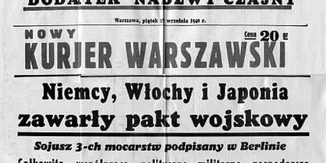

### 1962

https://pl.wikipedia.org/wiki/Sob%C3%B3r_watyka%C5%84ski_II

### 1944

dr Ludwig Fischer, gubernator tzw. dystryktu warszawskiego, skierował do podległych sobie jednostek administracji telegram, dotyczący wydanego przez Hitlera tzw. Rozkazu nr 2. Oto fragment treści telegramu:

"Warszawa, 11 października 1944, godzina 10:40. 
Dot.: nowa polityka wobec Polski.
Po wizycie SS-Obergruppenfuhrera von dem Bacha u Głównego Dowódcy SS 
[Reichsfuhrera Heinricha Himmlera] niniejszym informuję, co następuje: (...) 
Obergruppenfuhrer von dem Bach otrzymał nowy rozkaz – Warszawa ma zostać 
spacyfikowana, tzn. zrównana z ziemią jeszcze podczas wojny, chyba że to 
uniemożliwiają potrzeby wojskowe związane z budową fortyfikacji. Przed 
zniszczeniem, należy usunąć wszystkie surowce, tekstylia i meble. Główna 
odpowiedzialność spoczywa na administracji cywilnej. Podaję niniejsze do 
wiadomości, ponieważ ten nowy rozkaz Fuehrera o zniszczeniu Warszawy ma 
ogromne znaczenie dla kontynuacji nowej polityki wobec Polski (Polenpolitik).
Podpisano: Dr. Fischer, Gubernator Distrikt Warschau, czasowo w Sochaczewie".

Uzupełnieniem tegoż rozkazu były dyspozycje, jakie Himmler wydał 12 
października podczas narady odbytej w jego kwaterze polowej na Mazurach. 
Powiedział wtedy do (szefa SS i Policji tzw. dystryktu warszawskiego) Paula 
Geibla:

"To miasto ma całkowicie zniknąć z powierzchni ziemi i służyć jako punkt 
przeładunkowy dla transportu Wehrmachtu. Kamień na kamieniu nie powinien 
pozostać. Wszystkie budynki należy zburzyć, aż do fundamentów. Pomieszczenie 
dla wojska zostanie urządzone w piwnicach – hotele więcej nie istnieją. 
Pozostaną tylko urządzenia techniczne i sieć kolei żelaznej".

Trudno znaleźć precedens dla takiego dokumentu w nowożytnej historii Europy, 
a może całego świata. Oto najwyższe władze państwowe jednego kraju podejmują 
polityczną decyzję o całkowitej likwidacji stolicy innego państwa, nawet nie 
usiłując tego uzasadnić jakimikolwiek względami natury wojskowej! Odwrotnie, 
podkreśla się, że uwarunkowania militarne wymagają zachowania pewnej liczby 
zabudowań czy urządzeń.

Rozkaz ten jest w szczególny sposób szokujący nie tylko przez swoje 
niszczycielskie barbarzyństwo; miał on także głębszą wymowę polityczną. Jest 
on klinicznym dowodem na niezwykłą w swojej zapiekłości wrogość wobec narodu 
polskiego, zjawisko wyjątkowe nawet w kontekście II wojny światowej. 
Przywódcom III Rzeszy nie wystarczyło wieloletnie męczeństwo Warszawy, 
stopień jej destrukcji sięgający 50% w chwili zakończenia Powstania, śmierć w 
1944 roku prawie 200 tysięcy jej mieszkańców, wreszcie kapitulacja miasta 2 
października. Ich dzika żądza zemsty i zniszczenia raz na zawsze ośrodka 
polskiego myśli narodowej i niepodległościowej, a także wyrządzenia jak 
największych szkód dorobkowi materialnemu, duchowemu i kulturalnemu narodu 
polskiego, podyktowały decyzję o dokończeniu zagłady miasta nawet wbrew 
własnym interesom militarnym i politycznym.

Niektórzy co bardziej trzeźwo myślący dygnitarze nazistowscy dostrzegali 
bezsens zarówno wojskowy, jak i polityczny tej akcji. Nawet w piśmie Fischera 
daje się dostrzec coś w rodzaju żalu, że dokończenie zniszczenia miasta 
dodatkowo torpedowało jego "nową politykę" wobec Polski, mającą polegać na 
osiągnięciu jakiegoś rodzaju porozumienia z Polakami w celu wspólnej walki z 
Sowietami. Oczywiście realność tych oczekiwań była znikoma, jednak przy 
decyzji o zagładzie polskiej stolicy – zgoła zerowa.

Także dowództwo warszawskiego garnizonu Wehrmachtu, odpowiedzialne za 
przygotowanie Warszawy do obrony przed spodziewanym atakiem sowieckim jako 
twierdzy (tzw. "Festung Warschau"), nie wykazywało szczególnego entuzjazmu 
dla akcji masowego burzenia, poważnie utrudniającej zadanie budowy w mieście 
umocnionych rejonów oporu. Sprzeciwiło się zrównaniu z ziemią tych 
nielicznych budowli, które ostatecznie ocalały (np. kilku zabytkowych 
obiektów po wschodniej stronie ul. Krakowskie Przedmieście). Oczywiście 
komenda garnizonu warszawskiego bynajmniej nie kierowała się miłością do 
zabytków Warszawy, a tylko potrzebą zachowania budynków jako tzw. kulisów do 
ochrony przed ostrzałem artylerii sowieckiej z prawego brzegu Wisły (część 
dowództwa niemieckiego kwaterowała w tzw. Domu Bez Kantów, znajdującym się w 
tamtym rejonie). Odpowiednie zarządzenie wydał w dniu 18 października 
dowódca 9-tej Armii, gen. Smilo von Luttwitz:

"Zgodnie z wojskowym punktem widzenia należy opracować kolejność niezbędnych 
prac związanych z rozkazem Hitlera o zniszczeniu miasta Warszawy, przy czym 
należy również ustalić, które domy jako kulisy ochraniające przed obserwacją 
i ostrzałem artyleryjskim nieprzyjaciela muszą być pozostawione".

Co innego "zwykłe" plądrowanie miasta – Wehrmacht uczestniczył w nim ochoczo. 
Niemcy pozostawili także pewną niewielką liczbę niezniszczonych dodatkowych 
budynków (m.in. w południowym śródmieściu, np. przy ul. Lwowskiej), a to 
dlatego, żeby pozostawić w nich miny i różnego rodzaju wybuchowe pułapki. 
Niektóre z nich odniosły pożądany skutek: jeszcze po opuszczeniu Warszawy 
przez Niemców były wypadki śmierci powracających do miasta Warszawiaków, w 
chwili wchodzenia do niezniszczonych domów.
Mimo powyźszych uwarunkowań, w swoim ogólnym zakresie, rozkaz Hitlera o 
zniszczeniu Warszawy został wykonany skrupulatnie i precyzyjnie.

Jednak SS-Obergruppenfuhrer Erich von dem Bach (dowódca wojsk zwalczających 
Powstanie Warszawskie) już nie zajął się wykonaniem rozkazu likwidacji miasta 
(wkrótce po kapitulacji Powstania został odkomenderowany do Budapesztu). 
Odpowiedzialność za całość akcji zniszczenia Warszawy przejęły okupacyjne 
władze cywilne przy pełnej współpracy jednostek policji, SS i armii. Całością 
działań kierował dowódca SS i Policji na tzw. dystrykt warszawski, Paul Geibel, 
podlegający bezpośrednio Himmlerowi. Utworzono specjalny sztab do niszczenia i 
rabowania miasta, tzw. Raumungsstab, mieszczący się u wylotu ulicy Wolskiej. 
Wykonawcami akcji były specjalne oddziały niszczycieli, tzw. Sprengkommando i 
Vernichtungskommando. Dowódcą oddziałów burzycieli był gen. Policji Schmelcher. 
Szczególnie "zasłużyli się" w niszczeniu miasta jego podkomendni: majorowie 
policji Wenger, Schulz i Sarnow (dowódca jednostki minerskiej).

Niszczenie odbywało się według bardzo precyzyjnych założeń. Najpierw plądrowano 
kwartały domów, potem do akcji przystępowały grupy podpalaczy (saperów), które 
traktowały miotaczami ognia mniejsze domy, a zaminowywały i wysadzały w 
powietrze większe obiekty. Po kilku dniach oddziały te jeszcze raz przechodziły 
tymi samymi ulicami i niszczyły wszystko, co jeszcze ocalało.

Niemcy sami upajali się swoimi niszczycielskimi "osiągnięciami". Żołnierze robi 
sobie "pamiątkowe" fotki na tle zniszczonych zabudowań. Zachowało się np. 
zdjęcie zadowolonych wojaków pozujących na tle zburzonego kościoła św. 
Aleksandra na placu Trzech Krzyży. Zachowywali się zupełnie tak, jak np. 
współcześni turyści pozujący na tle Pałacu Dożów w Wenecji!

Szczytem cynizmu było to, że Niemcy prowadzili też "dokumentację" swojej 
haniebnej akcji. Zajmował się tym np. niejaki Alfred Mensebach, architekt, 
członek Reichskammer der Bildenden Kunste (nazistowskiej instytucji sztuk 
pięknych). Po wojnie odnaleziono tzw. archiwum Mensebacha, zawierające 137 
zdjęć ukazujących sceny niszczenia miasta. Część fotografii robionych przez 
Niemców było nawet... barwnych (!). Album Mensebacha zawierał także informacje 
o odznaczonych za niszczenie Warszawy jego kolegach-podpalaczach, stąd znane są 
ich nazwiska, takie jak Baumer, Sedlag, czy Krause.

Zniszczenia w Warszawie dokonane pomiędzy 11 października 1944 a 17 stycznia 
1945, były olbrzymie. Prawdopodobnie przekroczyły straty poniesione przez 
miasto podczas Powstania, sięgając 25-35% całości zabudowy. Trzeba pamiętać, że 
w chwili kapitulacji Powstania, Warszawa ciągle jeszcze istniała jako zespół 
urbanistyczny. Mimo wielkich strat powstałych w wyniku walk powstańczych, a 
także wcześniejszego zburzenia getta i oblężenia miasta na początku wojny, 
stopień zniszczenia tkanki miejskiej zapewne nie sięgał 50%.

Po upadku Powstania m.in. spalono gmach Biblioteki Krasińskich z cennymi 
zbiorami archiwaliów, zniszczono Archiwum Miejskie i Archiwum Akt Nowych. 
Wysadzono katedrę i kościół Jezuitów na Starówce, spalono kościół Reformatów na 
Senatorskiej, Paulinów przy Nowomiejskiej, św. Barbary przy Nowogrodzkiej. 18 
grudnia 1944 roku wysadzono w powietrze pałac Bruhla przy ulicy Wierzbowej 
(najcenniejszy zabytek warszawskiego baroku – zniszczył go oddział mjra 
Wengera), a 29 grudnia – pałac Saski (nieuszkodzony w Powstaniu). Niszczono 
pomniki, elektrownię, filtry, wodociągi, sieć tramwajową. Dokonano ogromnych 
zniszczeń całych kwartałów ocalałych kamienic w śródmieściu północnym i w 
znacznej części południowego, a także na Woli i na Żoliborzu. Akcja trwała do 
ostatniej chwili. Jeszcze w dniu 16 stycznia 1945 roku, gdy Wehrmacht już się 
wycofywał z miasta, Niemcy zdążyli jeszcze podpalić zbiory Biblioteki 
Publicznej przy ulicy Koszykowej! Żołnierze 1-ej Armii LWP, którzy pojawili się 
tam w kilka godzin później, znaleźli już tylko wielki stos jeszcze gorących, 
dymiących popiołów.

W styczniu 1945 roku procent całkowicie zniszczonych zabudowań Warszawy 
wynosił, wg różnych szacunków, około 80-85%. Miasto już nie istniało jako 
zespół urbanistyczny. Żadna stolica świata w historii nowożytnej nie poniosła 
proporcjonalnie tak gigantycznych strat. W ogromnym stopniu – trzeba to jeszcze 
raz podkreślić – nastąpiły one w wyniku rozmyślnej akcji, podjętej na mocy 
decyzji politycznej, nie związanej w żadnym stopniu z potrzebami militarnymi 
ani działaniami wojennymi.

Oznacza to, że za zagładę Warszawy pełną odpowiedzialność polityczną, moralną i 
materialną ponosi państwo niemieckie. Które zresztą do dziś dnia nie dokonało 
żadnej rekompensaty za zniszczenie przezeń z pełną premedytacją stolicy Polski.

Już nie mówiąc o moralnej hańbie spadającej na barki kraju ponoć 
tak "cywilizowanego", "kulturalnego" i "europejskiego", a którego władze 
państwowe, administracja i siły zbrojne dopuściły się aktu, który można 
porównać jedynie z niszczycielską zawziętością starożytnych germańskich 
barbarzyńców, którą już rzymski kronikarz Tacyt określił jako "furor 
Teutonicus" (w swoim dziele pt. "Germania"). Ich niemieccy potomkowie w XX 
wieku, owi nowożytni Hunowie, "godnie" nawiązali do barbarzyńskiej tradycji 
swoich przodków.
Przerazajaca jest skala barbarzynskich decyzji, ktore opetaly chore umysly tych
"panow ludzkosci". Rownanie z ziemia calych miast (malarz zamierzal rowniez
zrownac z ziemia Moskwe i Sankt Petersburg, ale mogl sie "wyzyc" tylko na
Warszawie), wydawanie wyrokow na cale narody (Zydow, Cyganow itd.), o ktorych
"hobbysci" bawiacy sie w "bogow" decydowali w swoich "glownych kwaterach". 
W ten sposob zrobili ogromna krzywde takze wlasnemu narodowi, gdyz okreslili
"standarty" postepowania w tej okrutnej wojnie. To oni sami sa rowniez winni
zaglady Drezna, Hamburga, Krolewca oraz poniewierki wojennej milionow ludzi, w
tym Niemcow. Doczesne szczatki tych "wladcow" nie spoczely w "panteonach
chwaly" o jakich marzyli. Wiatry rozwialy ich prochy gdzie popadlo.

Bardzo słuszna uwaga. Jednak dziś wielu Niemców nie chce o tym pamiętać. W 
ramach "pisania historii na nowo" zaczynają się użalać nad wysiedleniami ze 
Wschodu, bombardowaniami alianckimi itd., zupełnie milcząc o tym, co Niemcy 
wyprawiali wcześniej, choćby tutaj w Warszawie.

Najbardziej zdumiewające jest to, że i u nas pojawiają się "współczujące" 
Niemcom głosy, doskonale wpisujące się w nurt niemieckiego rewizjonizmu 
historycznego. Są też tacy Polacy, którzy w imię jakiegoś "pojednania" (a może 
i innych celów) bezmyślnie fraternizują się z tymi organizacjami niemieckimi, 
których cele są dla Polski niebezpieczne. 

Świeżym przykładem jest trwający w tych dniach zjazd tzw. Ziomkostwa Prus 
Wschodnich, który odbywa się... w Olsztynie (!). Mało tego: uczestniczyli w tym 
sabacie przedstawiciele władz samorządowych województwa warmińsko-mazurskiego! 
Zrobili to, pomimo tego, że owo Ziomkostwo należy do rewizjonistycznego Związku 
Wypędzonych Eriki Steinbach, jego szef - Wilhelm von Gottberg - jest jej 
zastępcą w tym Związku, a na identyfikatorach przygotowanych przez 
organizatorów była nazwa "Ostpreussen" zamiast nazwy polskiego województwa.

Zresztą, Ziomkostwo von Gottberga stale uzywa nazwy Prus Wschodnich, choćby w 
wydawanej przez siebie publikacji "Ostpreussenblatt". Warto zwrócić uwagę 
(cytuję za "GW"), że w tym piśmie nigdy nie mówi się o niemieckiej winie za II 
wojnę światową, a tylko i wyłącznie o cierpieniach Niemców w Prusach Wschodnich 
zimą 1944-45 i w późniejszym okresie.

A jaki jest cel Ziomkostwa Prusaków? Von Gottberg wcale go nie ukrywa. Znowu 
zacytuję "GW":

"Wilhelm von Gottberg, przewodniczący Ziomkostwa, zapewnił, że nie domaga się 
ono zwrotu pozostawionych w Polsce majątków. - Chcemy kupować tu ziemię, nie 
odzyskiwać ją w sądzie. Ale nad pojedynczymi pozwami nie jesteś w stanie 
zapanować - dodał".

Ale z nich ŁASKAWCY! Oni nie chcą ZWROTU "swoich" ziem mazurskich w sądach, oni 
chcą ją TYLKO KUPOWAĆ.

Jest całkowicie jasne, do czego może doprowadzić napisanie na nowo historii pod 
niemieckie dyktando. Krokiem następnym będzie POWRÓT już "rozgrzeszonych" 
Niemców na "ich" tereny wschodnie. Dążą do tego z wielką wytrwałością i 
konsekwencją, a znakomicie im to ułatwi ślepota wielu naszych rodaków.

I to właśnie historia (ta prawdziwa, nie zakłamana) może nam podpowiedzieć, co 
będzie dalej.

### 1939

W Warszawie ukazał się pierwszy numer "Nowego Kuriera Warszawskiego"- organu prasowego Generalnego Gubernatorstwa. Chociaż tytuł tej gazety, która miała po zamknięciu przez Niemców wszystkich przedwojennych polskich tytułów wypełnić rynek czytelniczy nawiązywał bezpośrednio do tradycji "Kuriera Warszawskiego" to nie cieszyła się ona szacunkiem. Gazetę nazywano "gadzinówką" lub "kurwerem".
Ostatnie wydanie ukazało się w styczniu 1945 roku.

  

---

<https://pl.wikipedia.org/wiki/Sobór_watykański_II>

---

<a href="https://github.com/TomaszWaszczyk/historia.waszczyk.com/edit/master/src/content/october-11.md" target="_blank">Edytuj tę stronę dzieląc się własnymi notatkami!</a>
