### 2021

> “I personally think that #Bitcoin is worthless” - Jamie Dimon, CEO of JPMorgan Chase & Co.

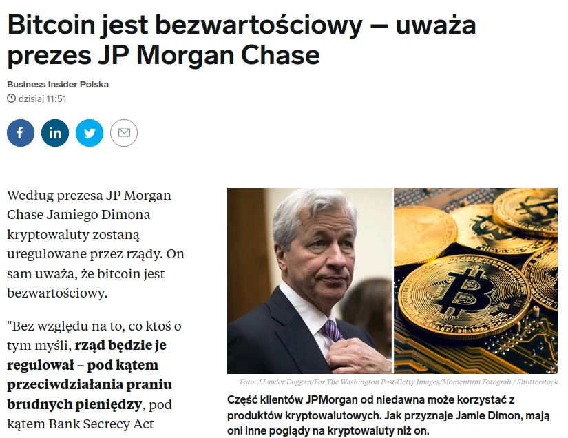  

### 2020

The Nobel prize in economics rewards advances in auction theory

For the third time since 2007, it goes to designers of market mechanisms
ALVIN ROTH, who in 2012 would share the Nobel prize in economics, he wrote, “the real test of our success will be not merely how well we understand the general principles which govern economic interactions, but how well we can bring this knowledge to bear on practical questions of microeconomic engineering.”
On October 12th it gave this year’s prize to Paul Milgrom and Robert Wilson, both of Stanford University, for their work on auction theory and design. Their work epitomises economics as engineering.
Auctions are an ancient mechanism for selling valuable commodities, from fine art to a fisherman’s catch to government bonds. Historically, a few forms of auction have been dominant. In an English auction, ascending bids are made until a sole winner remains; in the Dutch variety, a high opening price is set and is slowly reduced until a bidder is found.

---

> Dostałam od znajomej studentki z Kielc, uczelnia chce wrzucić studentów na wolontariat w szpitalu zamiast zajęć. Póki co nie wiadomo nic więcej, o całej sytuacji dowiadują się z prasy i Radia. Nie wiadomo też, czy ma to dotyczyć wszystkich obligatoryjnie, czy tylko tych chętnych.

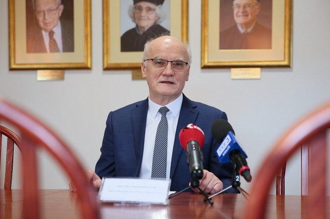  

Na zdjęciu: prof. Stanisław Głuszek - rektor UJK

Jak tłumaczy profesor Stanisław Głuszek, studenci mogliby jako pierwsi rozmawiać z pacjentami i robić wywiad lekarski. Mogą także wykonać niektóre zabiegi. Jak podkreśla rektor, kadra medyczna jest narażona na zakażenie koronawirusem, ale też na przemęczenie. Studenci mogliby nieco odciążyć lekarzy. O swojej propozycji rozmawiał z Bartoszem Stemplewskim, dyrektorem Wojewódzkiego Szpitala Zespolonego. Dyrektor nie ukrywa, że podoba mu się pomysł rektora UJK.

- Rosnąca liczba zakażeń przekłada się również na liczbę chorych członków personelu medycznego. W związku z tym potrzebujemy każdego wsparcia. Uważam, że to będzie również dobre dla samych studentów. Rozpoczęcie swojej kariery zawodowej w tak trudnych warunkach sprawi, że w przyszłości będą lepszymi medykami - mówi Bartosz Stemplewski.

Profesor Stanisław Głuszek o swojej propozycji rozmawiał już ze studentami szóstego roku kierunku lekarskiego. Jak mówi, młodzi ludzie są chętni, by jako wolontariusze wspierać lekarzy.

---

Jak podał Simon Wakter, dziś prawie połowa energii elektrycznej generowanej w Niemczech pochodzi ze źródeł węglowych.
Ma to miejsce 20 lat po rozpoczęciu w RFN transformacji energetycznej Energiewende i wpakowaniu w ten sektor setek miliardów euro.
Czy prasa już przygotowała artykuły z zachwytami, jak to ma w zwyczaju, gdy niemieckie źródła odnawialne na pare godzin pobiją rekordy? 
Bo warto zwrócić uwagę na takie aspekty Energiewende, które - w zestawieniu z długością trwania i kosztami tej transformacji - wskazują, że z perspektywy klimatycznej jest ona po prostu nieskuteczna.

---

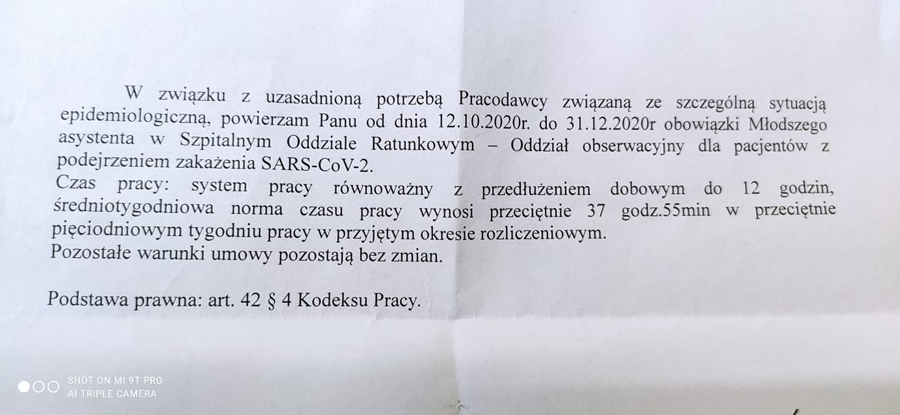  

---

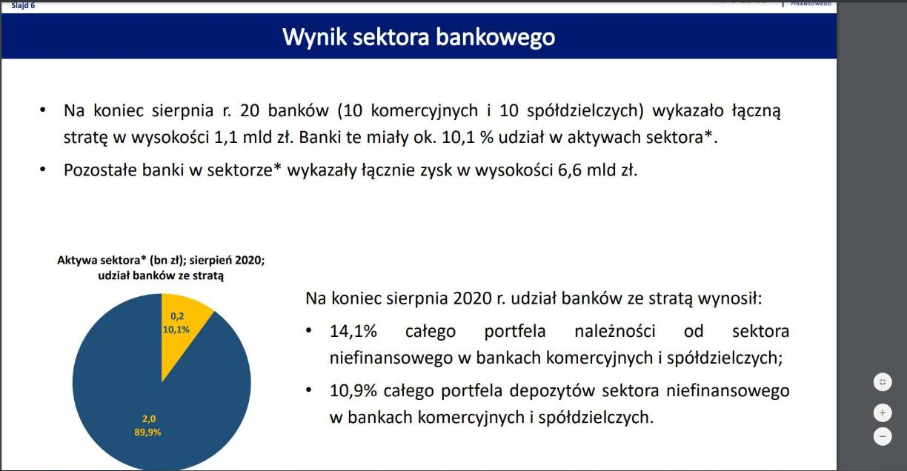  

---

### 1964

W Duesseldorfie rozpoczął się pierwszy proces załogi niemieckiego obozu zagłady w Treblince; na ławie oskarżonych zasiadł m.in. Kurt Hubert Franz  (zdjęcie)- zastępca komendanta obozu Franza Stangla. 3 września 1965 roku został skazany na na dożywotnie pozbawienie wolności pod zarzutem morderstwa na 139 osobach w 35 przypadkach oraz współuczestnictwa w likwidacji około 300 tys. ludzi. Zwolniony ze względu na podeszły wiek i stan zdrowia w 1993 roku, zmarł 4 lipca 1998 w domu spokojnej starości w Wuppertalu.

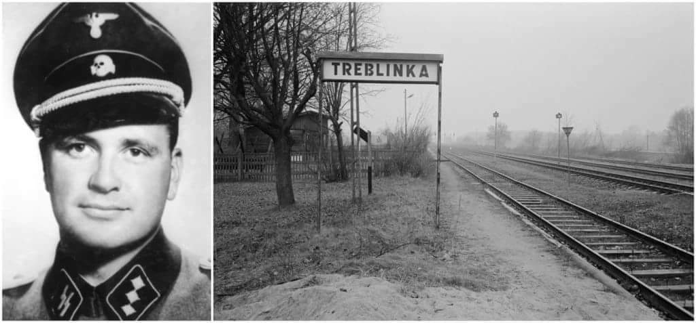  

### 1943

Miała miejsce bitwa pod Lenino, w której swój chrzest bojowy przeszła I Dywizja Piechoty im Tadeusza Kościuszki dowodzona przez generała Zygmunta Berlinga. Jednostka ta,która została sformowana wkrótce po wyjściu na środkowy wschód armii Andersa straciła w tej bitwie w ciągu dwóch dni jedną ósmą żołnierzy spośród 12 tysięcy. Zginęło 1500 żołnierzy o czym sam generał Berling tak mówił po bitwie:
"Na przyszłość trzeba temu zapobiec. A jestem pewny, że za parę tygodni naszych ludzi będzie można znaleźć w Moskwie i Sielcach. Żeby tego więcej nie było, bo się wam pułki, a mnie dywizja rozleci jak stare gacie. Sytuacja jest niewesoła, niesłychanie kompromitująca, bo się to wszystko psiakrew rozlazło jak wszy. Te oddziały, których obowiązkiem było zbierać łazików, zawiodły"
W rocznicę tego wydarzenia w 1950 roku 12.10 ustanowiono Dniem Wojska Polskiego.

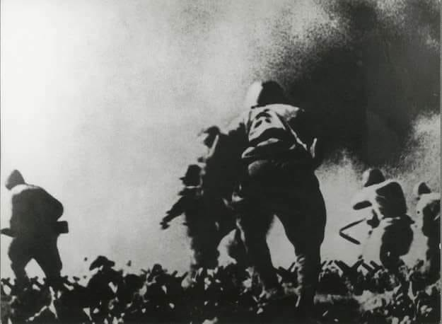  

> Zapewne przez skromność przy omawianiu składu oficerskiego nie wspomniano , że oficerami politycznymi w Dywizji byli wyłącznie Żydzi ( poza Sokorskim ) . Włodzimierz Sokorski pisał  do Stalina , że żołnierze kręcą nosami , gdy rządzą nimi Żydzi  i sugerował zmiany kadrowe.

---

### 1939

Adolf Hitler, kanclerz III Rzeszy wydał dekret o utworzeniu z dniem 26 października Generalnego Gubernatorstwa (niem. Generalgouvernement)– terytorium utworzone z części okupowanych ziem polskich niewłączonych bezpośrednio do III Rzeszy, które miało być maksymalnie eksploatowane gospodarczo oraz przygotowywane do stopniowej kolonizacji niemieckiej. Generalne Gubernatorstwo podzielone było na dystrykty: krakowski, radomski, lubelski, warszawski i galicyjski (od 1941 r.).
Generalnym Gubernatorem dla okupowanych polskich obszarów został Hans Frank, bezpośrednio podległy Adolfowi Hitlerowi.
Na zdjęciu znaczki pocztowe Generalnego Gubernatorstwa.

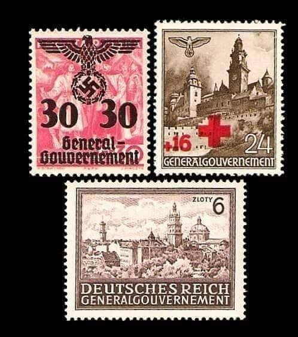  

### 1921

Liga Narodów zdecydowała o podziale Górnego Śląska między Polskę, a Niemcy. Naszemu krajowi przyznano 21 procent spornego terytorium na którym znalazły się powiaty: katowicki, lubliniecki, pszczyński, rybnicki, świętochłowicki i tarnogórski, a także 50 procent hut i 76 procent kopalń.

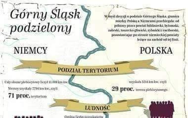  

### 1920

W Rydze delegacje polska i sowiecka podpisały traktat pokojowy i umowę o rozejmie na podstawie, których oba państwa zobowiązały się do zaprzestania działań wojennych z dniem 18 października 1920 roku.
Traktat kończył wojnę polsko-bolszewicką z
lat 1919- 1920 , ustalał przebieg granic między tymi państwami oraz regulował inne sporne dotąd kwestie.

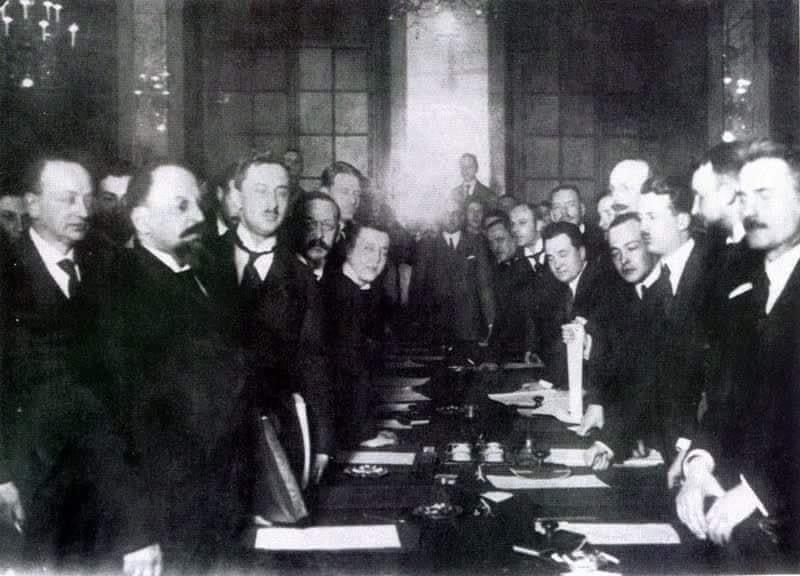  

### 1810

W Monachium odbył się pierwszy Oktoberfest. Bawarska para królewska zaprosiła mieszkańców miasta do wspólnego świętowania godów weselnych księcia Ludwika I Wittelsbacha i księżniczki Teresy von Sachsen-Hildburghausen.
W początkowych latach Oktoberfest miał przede wszystkim sportowy charakter (wyścigi konne). Dopiero pod koniec XIX wieku nabierał coraz bardziej charakteru jaki ma dzisiaj. W 1880 roku władze miasta zezwoliły na sprzedaż piwa. Obecnie to jeden z największych festynów ludowych na świecie -w ostatnich latach przeciętna liczba odwiedzających wynosiła ok. 6 milionów ludzi.

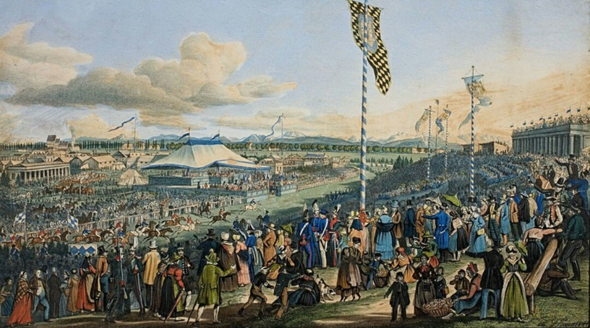  

### 1794

W czasie Insurekcji Kościuszkowskiej, Rada Najwyższa Narodowa wybrała generała lejtnanta Tomasza Wawrzeckiego (grafika) na stanowisko Naczelnika Siły Zbrojnej Narodowej. Zastąpił on wziętego do rosyjskiej niewoli Tadeusza Kościuszkę.

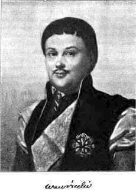  

---

<a href="https://github.com/TomaszWaszczyk/historia.waszczyk.com/edit/master/src/content/october-12.md" target="_blank">Edytuj tę stronę dzieląc się własnymi notatkami!</a>
