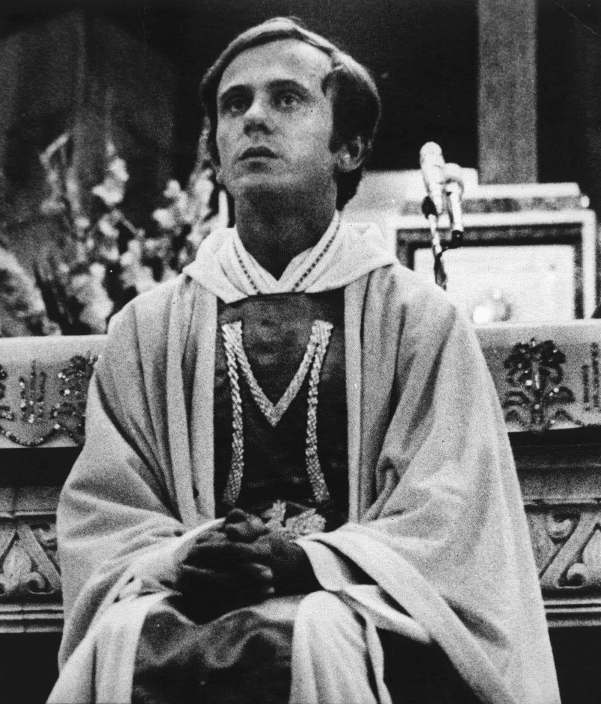
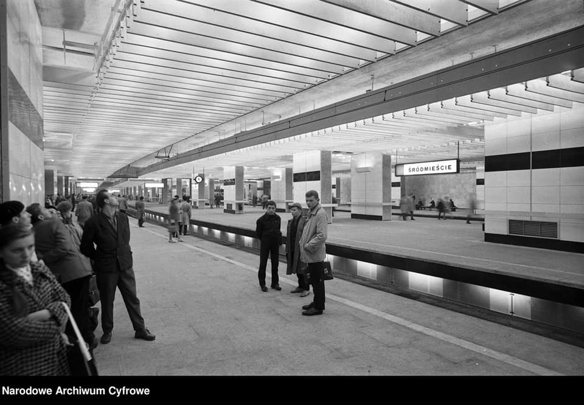
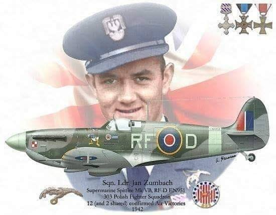
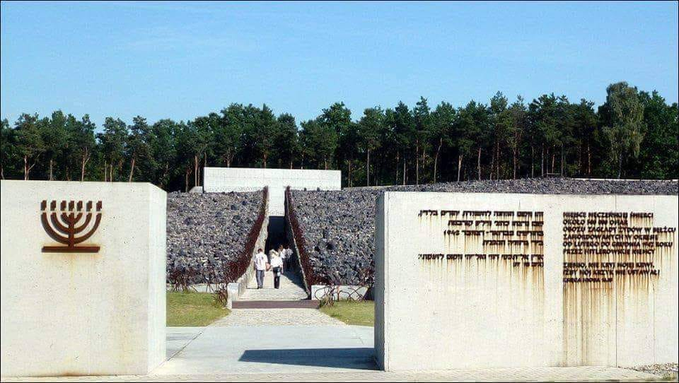

### 2020

Liczba rejestracji podmiotów gospodarczych w II kwartale 2020 r. wyniosła 64 410 wobec 94 385 w analogicznym okresie roku poprzedniego.
W II kwartale 2020 r. zaobserwowano mniejszą liczbę rejestracji niż rok wcześniej we wszystkich analizowanych rodzajach działalności.
W tym w budownictwie nastąpił spadek o 35,0%,
usługach o 34,3%,
informacji i komunikacji o 32,5%,
zakwaterowaniu i gastronomii o 31,8%,
sekcji transport i gospodarka magazynowa o 31,0%,
przemyśle o 30,4% i w handlu;
naprawie pojazdów samochodowych o 17,9%.

---

Rosyjskie władze finansowe potwierdziły plany rządu dotyczące emisji cyfrowej waluty banku centralnego, czyli CBDC. W dniu 13 października Bank Rosji opublikował dokument konsultacyjny w sprawie rozwoju cyfrowego rubla.

---

"To jest niedopuszczalne". Lekarz o sytuacji w służbie zdrowia

Z powodu aktualnej organizacji służby zdrowia pojawia się ryzyko znacznych strat wśród populacji niezarażonych COVID-19 – mówi prof. dr hab. n. med. Bogusław Machaliński.
W obecnej sytuacji "pacjentami premium" są osoba z wirusem SARS-CoV-2, podczas gdy "economy class" stali się pacjenci onkologiczni, z chorobami metabolicznymi czy sercowymi.
Rocznie w Polsce na choroby onkologiczne zapada ok. 180 000 ludzi; wczesna diagnoza jest tutaj kluczowa.
Od wybuchu pandemii ludzie wcale nie przestali cierpieć na inne choroby.
W Polsce każdego dnia statystycznie umiera z różnych przyczyn prawie 1200 osób.
Tym bardziej niezrozumiałe jest powszechne szerzenie strachu wśród ludzi, wśród których są: kobiety ciężarne, osoby z depresją, dużą wrażliwością jak i osoby z grupy wysokiego ryzyka, które mają wystarczająco dużo stresu związanego ze swoją towarzyszką życia, tj. chorobą przewlekłą. Tak więc nadużywanie terminu „pandemia” wywołuje lęk, paraliżuje działania.
Lekarz zaznacza, że obecnie panuje w służbie zdrowia chaos.
POZ nie działa prawidłowo.

<!-- Pewnego dnia Albert Einstein zaczął pisać na tablicy:
9x1 = 9 
9x2 = 18
9x3 = 27
9x4 = 36
9x5 = 45
9x6 = 54
9x7 = 63
9x8 = 72
9x9 = 81
9x10 = 91
Wszyscy zaczęli się śmiać, bo pan Einstein się pomylił. Prawidłowy wynik równania 9 x10 to 90. Śmiali się z niego wszyscy uczniowie. 
Albert Einstein czekał spokojnie, aż grupa się uspokoi, po czym powiedział: "Pomimo tego, że poprawnie rozwiązałem 9 równań, nikt z Was mi nie pogratulował. Jednak, gdy się pomyliłem, wszyscy zaczęli się śmiać, co oznacza, że pomimo sukcesu, społeczeństwo tylko czeka na Twój najmniejszy błąd i nie powstrzyma się, aby Cię za niego nie skrytykować, wyśmiać i rozliczyć."
Morał? Nie pozwól, aby zwykła krytyka zniszczyła Twoje marzenia. Pieprz to co mówią i myślą za twoimi plecami inni. Dziękuj za fałszywe znajomości, zwłaszcza tym hienom, które tylko czekają, aby podciąć Ci skrzydła. Wzleć ponad ich zawiść, daleko, aby nie upaść w ich zakłamanym towarzystwie, bo wtedy nie zawahają się, aby Cię w nim zagryźć.
Prawdziwych przyjaciół poznajemy w biedzie, ale i po ich reakcjach na nasze sukcesy i porażki. -->

---

### 1992

Na Scenie w Malarni pokazany został pierwszy spektakl - "Śmierć Ofelii" St. Wyspiańskiego, w wykonaniu Anny Kadulskiej. Widzowie powoli przyzwyczajali się, że w podwórku przy ulicy Teatralnej można zobaczyć nietypowe przedstawienie, wysłuchać wykładu (m.in. o masonerii właśnie) czy uczestniczyć w koncercie. Już w czerwcu 1993 roku miało tu miejsce niezwykłe wydarzenie - wieczór poezji Josifa Brodskiego, recytowanej w obecności poety. Kolejno na nowej scenie Teatru Śląskiego pojawiały się nowe przedstawienia, m.in. znakomicie wpisujące się w charakter tego miejsca "Sexualne zło" zbudowane z piosenek Kurta Weilla w reżyserii Józefa Opalskiego czy "Impas cnoty" - autorski spektakl Piotra Szmitkego. Musical "Wesołego powszedniego dnia" Młynarskiego i Derfla czy "Znaki szczególne" złożone z poezji Wisławy Szymborskiej cieszyły się uznaniem widzów.

### 1984

Przyszli mordercy księdza Jerzego Popiełuszki przeprowadzili nieudaną próbę zamachu na jego życie.  Ksiądz Jerzy w towarzystwie swojego kierowcy Waldemara Chrostowskiego i działacza opozycji Seweryna Jaworskiego udał się do Gdańska, by odprawić mszę świętą i wygłosić homilię w kościele św. Brygidy. W czasie tej podróży był śledzony przez oficerów SB. W drodze powrotnej do Warszawy oficerowie Grzegorz Piotrowski, Leszek Pękala i Waldemar Chmielewski próbowali zatrzymać samochód, którym podróżował ksiądz Popiełuszko, rzucając w szybę kamieniem. Kierowcy udało się jednak opanować pojazd i uciec.

  

### 1963

Warszawa, otwarcie podziemnego dworca Warszawa Śródmieście, który szybko stanie się największą, pod względem liczby pasażerów, stacją kolejową w Polsce. Zaprojektowany przez Arseniusza Romanowicza i Piotra Szymaniaka punkt przesiadkowy zachwyca funkcjonalnością i przepustowością – środkowy peron służy wyłącznie wysiadającym, dwa skrajne wsiadającym, tak aby unikać kolizji pasażerów w drzwiach i na peronach, a przez to szybciej odprawiać kolejne podmiejskie pociągi na przeciążonej warszawskiej linii średnicowej. Wszystkiemu towarzyszy świetna modernistyczna architektura i doskonały wystrój plastyczny wnętrz, na przykład op-artowe mozaiki autorstwa Wojciecha Fangora, kierujące wysiadających do właściwych wyjść. Przyszłościowo projektanci wyprowadzają z podziemnej stacji dwa fragmenty pieszych tuneli – na zachód, w kierunku przyszłego dalekobieżnego dworca centralnego i na wschód,  w stronę hipotetycznej stacji metra „Centrum”. Pociągi warszawskiej kolei podziemnej ostatecznie dotrą tam po trzydziestu pięciu latach, za to prace nad studium wykonalności tunelu łączącego obie stacje będą trwały w najlepsze jeszcze sześć dekad później. Zdjęcie: Zbyszko Siemaszko / NAC

  

### 1941

Jan Zumbach - podpułkownik pilot 303 Dywizjonu Myśliwskiego im. Tadeusza Kościuszki, w czasie eskortowania brytyjskich samolotów bombowych nad Francję, odłączył się od formacji i przeprowadził próbę ataku na dwa zauważone przez siebie niemieckie Messerschmitty Bf 109. Zumbach zestrzelił jedną z maszyn. W czasie próby dołączenia do opuszczonej formacji nad Kanałem La Manche napotkał na swej drodze dwa niemieckie samoloty myśliwskie Bf 109 i trzy myśliwce Focke-Wulf Fw 190 Würger. W wyniku nawiązanej walki Zumbach uszkodził jedną z maszyn wroga. Spitfire pilotowany przez Zumbacha nie wyszedł z walki bez szwanku, ale naszemu pilotowi udało się bezpiecznie wylądować na lotnisku w West Malling. Tydzień później podpułkownik Zumbach odebrał brytyjski Zaszczytny Krzyż Lotniczy, który nadawany jest za ,,czyn lub czyny męstwa, odwagi lub poświęcenia w obliczu wroga w czasie aktywnych działań w powietrzu".

  

---

Reichsführer-SS Heinrich Himmler w obecności Wyższego Dowódcy SS i Policji w Generalnym Gubernatorstwie Gruppenführera-SS Wilhelma Krügera wydał rozkaz Dowódcy SS i Policji w dystrykcie lubelskim Brigadeführerowi-SS Odilo Globocnikowi budowy pierwszego obozu zagłady dla Żydów na okupowanej ziemi polskiej. Budowa obozu zagłady w Bełżcu ruszyła w listopadzie. Według pierwotnych planów opracowanych przez niemieckich nazistów obóz zagłady w Bełżcu miał służyć jako miejsce, gdzie uśmiercani będą wszyscy niezdolni do pracy Żydzi z dystryktu lubelskiego. W grudniu funkcję komendanta obozu zagłady w Bełżcu objął Haupsturmführer Christian Wirth. Był on 56-letnim zdegenerowanym gestapowcem, który od 1939 roku uczestniczył w masowych eutanazjach przeprowadzanych na osobach chorych umysłowo. Zaprawiony w mordowaniu sadysta był zatem idealnym kandydatem na to stanowisko. Nieliczni, którzy ocaleli z zagłady w Bełżcu opowiadali, że Wirth osobiście katował, a następnie zaciągał Żydów do komory gazowej. Za narzędzie masowego mordu Wirth wybrał tlenek węgla, który wtłaczany był do komory gazowej przez atrapy imutujące prysznice. Obóz zagłady podzielony był na dwie części - Obóz I składający się z rampy, sortowni, rozbieralni, części administracyjnej, różnych baraków i placu apelowego; Obóz II ukryty wśród drzew, był miejscem, gdzie znajdowała się komora gazowa. Obóz II był specjalnie zamaskowany, aby ofiary pędzone na śmierć do ostatniej chwili nie wiedziały dokąd idą. Załogę obozową stanowili Niemcy (ok. dwudziestu osób), Ukraińcy (strażnicy w liczbie ok. stu osób) i wyselekcjonowani z transportów Żydzi zmuszeni do sortowania przedmiotów należących do zabitych współbraci i zakopywania ich zwłok (od października zwłoki były palone). Pierwszy transport przybył do obozu zagłady w Bełżcu w marcu 1942 r. Zagłada trwała do grudnia 1942. Szacuje się, że w tym okresie w Bełżcu zamordowanych zostało 600 000 Żydów. Ofiary pochodziły głównie z gett wschodniej Polski, a także z Niemiec, Austrii, Rumuni i Czech. Nie możemy zapomnieć o męczeństwie Romów i Sinti, którzy również byli uśmiercani w Bełżcu. Niemalże bliźniaczymi kopiami obozu zagłady w Bełżcu były obozy zagłady w Sobiborze i Treblince.

  

---

<a href="https://github.com/TomaszWaszczyk/historia.waszczyk.com/edit/master/src/content/october-13.md" target="_blank">Edytuj tę stronę dzieląc się własnymi notatkami!</a>
