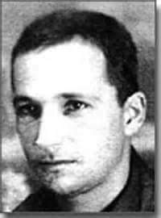
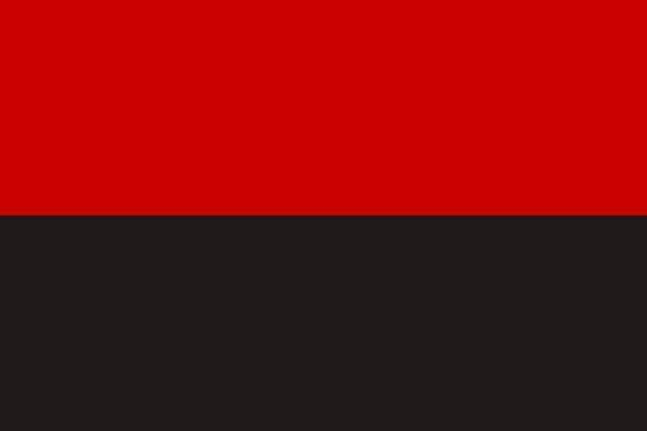
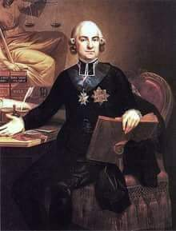

### 1943

W niemieckim obozie zagłady w Sobiborze wybuchło największe i jedyne udane powstanie żydowskich więźniów w czasie II wojny światowej. Plan i pomysł ucieczki na masową skalę (chociaż nie pomysł samej ucieczki) opracował kapitan Armii Czerwonej Aleksander ,,Sasza'' Peczerski (na zdjęciu). Powstaniem dowodzili: Lejb Feldhendler, który stał na czele starych więźniów – przeważnie polskich Żydów oraz Aleksander Peczerski, który kierował grupą jeńców sowieckich pochodzenia żydowskiego. Powstanie zakończyło się zabiciem co najmniej 20 strażników i ucieczką w chełmskie lasy ok. 300 więźniów. Wybuch powstania i moment ucieczki w następujących słowach opisał jeden z jego uczestników Tomasz Toivi Blatt: […] Sasza postanowił działać natychmiast. Wskoczył na stół i wygłosił krótką mowę po rosyjsku […]. Mówił głośno i wyraźnie, tak aby wszyscy słyszeli, ale powoli i spokojnie. Powiedział ludziom, że większość Niemców zostało zabitych i że nie ma odwrotu. Świat pustoszy straszna wojna, a każdy człowiek bierze udział w walce. Przypomniał, jak wielką potęgą jest jego ojczyzna, Związek Radziecki, i obiecał, że – żywi czy umarli – zostaniemy pomszczeni, tak samo jak cała dotknięta tragedią ludzkość. Powtórzył dwa razy, że jeśli ktoś cudem przeżyje, powinien zawsze dawać świadectwo tej zbrodni. Zakończył okrzykiem: Towarzysze, naprzód! Śmierć faszystom!!! […] Podchwycono okrzyk i w oka mgnieniu cały obóz poderwał się do działania. Większość więźniów spontanicznie podzieliła się na dwie grupy. Mniejsza rzuciła się na ogrodzenie Lagru I, gorączkowo przecinano druty kolczaste siekierami i łopatami, nie bacząc na rów z wodą i miny. Niektórzy rzucali deski, aby je zdetonować. Druga, większa grupa, uzbrojona w najróżniejszą broń, ruszyła w stronę wyjścia z Lagru I, by dotrzeć do głównej bramy. [...] Dziura w płocie została zrobiona. Pod gradem lecących w naszym kierunku pocisków nie mogliśmy się doczekać przejścia przez wykonany wcześniej otwór. Niektórzy zaczęli się wspinać na ogrodzenie. Chociaż planowaliśmy wysadzenie min przy pomocy cegieł i kawałków drewna, jednak większość i tak tego nie zrobiła. Nie mogliśmy dłużej czekać. Woleliśmy nagłą śmierć niż jeszcze jedną chwilę w tym piekle. Przyszła moja kolej, aby przejść przez dziurę w ogrodzeniu. Naglę, będąc już prawie na zewnątrz, płot zawalił się i przygniótł mnie. To prawdopodobnie uratowało mi życie. Leżąc pod drutami, deptany przez pędzony w panice tłum, widziałem eksplodujące miny. Zdałem sobie sprawę, że gdybym przedarł się przez ogrodzenie wcześniej, zginąłbym razem z innymi''. Poszukiwania zbiegów trwały do 21 października 1943 r. Zakończyły się ujęciem 160 uciekinierów. Na terenie obozu pozostało 150 Żydów. Na rozkaz Sporrenberga zostali oni rozstrzelani. Zakończenia wojny doczekało 46 byłych więźniów tego obozu.

  

### 1942

Powstała Ukraińska Powstańcza Armia-zbrojna formacja banderowska, która zostawiła na polskiej historii wyjątkowo krwawy ślad.
UPA obrała sobie za cel stworzenie monteicznej, niepodległej Ukrainy, co zaczęła szybko realizować przez brutalną eliminację mniejszości narodowych, zwłaszcza Polaków i Żydów.
Na ironię zakrawa fakt,że 14.10. jest na Ukrainie świętem Szaty Najświętszej Maryi Panny i jednocześnie świętem UPA.
Podstawową jednostką bojową UPA była
sotnia. Sotnia dzieliła się na trzy czoty
(plutony), te zaś na trzy roje (drużyny). W roju
występowały zazwyczaj dwa łanki (sekcje).
Na przełomie 1943 i 1944 sotnie miały cztery
czoty, a te z kolei cztery roje. Łanka liczyła
od 4 do 6 żołnierzy. Rój liczył 8-12 osób.
Uzbrojenie roju składało się z ręcznego
karabinu maszynowego (rkm), 2-3 pistoletów
maszynowych (pm), pozostali uzbrojeni byli w
karabiny. W sotni istniał poczet dowódcy,
składający się pracownika politycznego
( politwychownyk ), szefa sotni ( buńczucznyj),
sanitariusza, łączników, niekiedy także z roju
Wojskowej Żandarmerii Polowej ( Wijśkowo-
polowa żandarmerija ), zwiadowców czy
pododdziału ciężkiej broni piechoty.
Teoretycznie sotnia powinna liczyć 163 osoby,
jednak do lata 1944 występowały sotnie
składające się nawet ze 180-200 ludzi. Od
jesieni 1944 sotnie liczyły 100-130 osób, a od
1946 o połowę mniej.
A teraz najlepsze. 14 października 2006 roku ówczesny tak uwielbiany przez polskich polityków prezydent Ukrainy Wiktor Juszczenko podpisał w Kijowie dekret na podstawie, którego UPA została uznana za ruch wyzwoleńczy.

  

### 1907

The Panic of 1907 was the first worldwide financial crisis of the twentieth century. It transformed a recession into a contraction surpassed in severity only by the Great Depression.1 The panic’s impact is still felt today because it spurred the monetary reform movement that led to the establishment of the Federal Reserve System. Moen and Tallman (1999) argued that the experience of the Panic of 1907 changed how New York Clearing House bankers perceived the value of a central bank because the panic took hold mainly among trust companies, institutions outside their membership.

### 1773

1773 roku na wniosek króla Stanisława Augusta Poniatowskiego powołano Komisję Edukacji Narodowej-pierwszy organ oświatowy w Polsce. K.E.N była alternatywą dla obowiązującego w ówczesnej Polsce szkolnictwa opartego głównie na szkołach prowadzonych przez Jezuitów, których bardzo konserwatywny system szkolenia nakierowany był głównie na teologię co sprawiało,że inne przedmioty, głównie ścisłe spychane były na dalszy plan. K.E.N miała to zmienić.
Pierwotny skład Komisji Edukacji Narodowej wynosił 8 osób czyli 4 posłów i 4 senatorów Rzeczypospolitej i Wielkiego Księstwa Litewskiego. Pierwszym prezesem został biskup wileński Ignacy Massalski, który to stanowisko traktował bardziej jak prywatny interes,co sprawiło, że dopuścił się wielu nadużyć,w skutek czego po 3 latach przewodzenia K.E.N został usunięty z tego stanowiska. Najbardziej
zasłużonymi, oficjalnymi członkami byli
posłowie wywodzący się z magnackich rodzin
i rodzin powiązanych z tzw. Familią , m.in.:
Adam Kazimierz Czartoryski , Joachim
Chreptowicz, Ignacy Potocki i Andrzej
Zamoyski . Ponadto w pierwszym składzie
Komisji był biskup płocki Michał Poniatowski
oraz August Sułkowski i Antoni Poniński .
Dopiero pod wodzą Hugo Kołłątaja Komisja wypracowała trzystopniowy system nauczania,którego pierwszym stopniem miały być szkoły parafialne przeznaczone dla chłopstwa,drugim szkoły powiatowe,w którym nauki miały pobierać dzieci szlachty,trzecim były uniwersytety.
W ramach reformy edukacji podstawowej
stworzono Towarzystwo do Ksiąg
Elementarnych , które opracowało pionierskie
podręczniki – wymagające często (zwłaszcza
w zakresie nauk przyrodniczych i ścisłych)
tworzenia polskiej terminologii tych nauk,
która do dzisiaj jest podstawą terminologii
chemicznej, fizycznej i matematycznej
stosowanej w języku polskim. Należy dodać,
że aż do roku 1780 język polski nie był
osobnym przedmiotem nauczania - stał się
nim dopiero dzięki pracom Komisji Edukacji
Narodowej.
Kres działalności Komisji Edukacji Narodowej położyła Konfederacja Targowicka za sprawą której zmieniono jej skład i odebrano władzę nad szkołami jezuickimi. Na wielu członków K.E.N wydano wyroki śmierci,co sprawiło,że musieli oni po zwycięstwie Targowicy uciekać z Polski.
Grafika: Hugo Kołłątaj.

  

---

<a href="https://github.com/TomaszWaszczyk/historia.waszczyk.com/edit/master/src/content/october-14.md" target="_blank">Edytuj tę stronę dzieląc się własnymi notatkami!</a>
