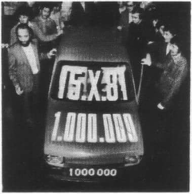
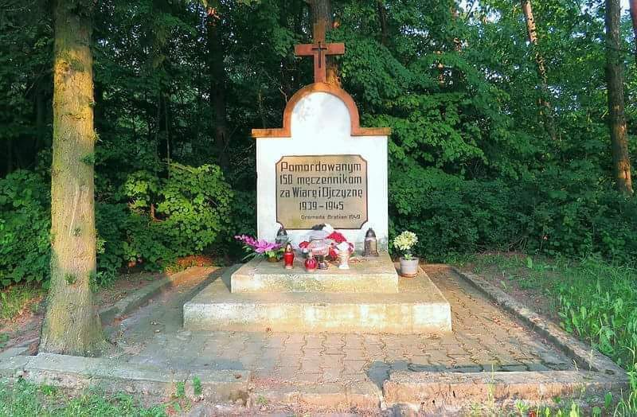

### 1981

Fabryka Samochodów Małolitrażowych w Bielsku Białej.  wyprodukowała milionowy egzemplarz samochodu Fiat 126p. Nastąpiło to po 8 latach i 4 miesiącach od rozpoczęcia produkcji tego pojazdu

  

### 1939

W lesie koło wsi Bratian w okolicach Nowego Miasta Lubawskiego członkowie niemieckiego Selbstschutzu dokonali mordu na 150 przedstawicielach polskiej inteligencji. Polaków, więzionych wcześniej w aresztach Selbstschutzu w Nowym Mieście Lubawskim, których rozstrzelano i pochowano w czterech zbiorowych mogiłach. Wśród zamordowanych były dwie kobiety.

  

---

<a href="https://github.com/TomaszWaszczyk/historia.waszczyk.com/edit/master/src/content/october-4.md" target="_blank">Edytuj tę stronę dzieląc się własnymi notatkami!</a>
