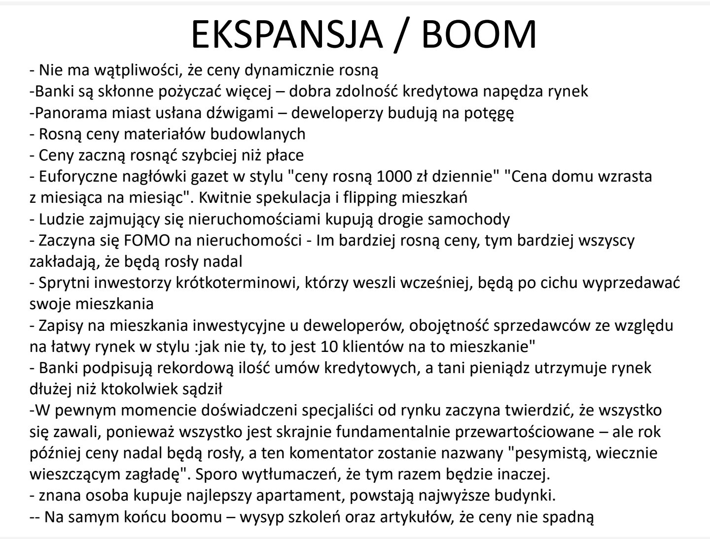

### 2022

"Canada, Saskatchewan: Rząd prowincjonalny uchwalił orwellowskie uprawnienia nadzwyczajne w imię walki z COVID, które pozwalają urzędnikom zatrzymywać lub usuwać ludzi bez nakazu i zajmować mienie osobiste".

  

---

  

---

  

  

<video width="640" height="480" controls>
<source src="./movies/october/glapinskipozyczka.mp4" type="video/mp4">
Your browser does not support the video tag.
</video>

---

Po części to rzeczowa merytoryczna analiza. Po części bezrefleksyjna ględa. A w największym stopniu jednak - szczególnie w obecnych okolicznościach- intelektualna prowokacja (w linku odesłanie do summary).
Nowa książka Eichengreena, El-Ganainy, Estevesa i Michenera - zgodnie z tytułem - ma być wielką obroną całych stuleci zaciągania przez władzę długów. Rzecz jasna w godnych pochwały celach, ze szlachetnych pobudek, dla dobra obywateli...
A wychodzi z tego - moim zdaniem - 300 stron niezamierzonej raczej przez autorów parodii.
Bo dług publiczny, zaciągany z umiarem, finansujący efektywnie usługi publiczne, będący ratunkowym narzędziem w nagłych i nieprzewidzianych okolicznościach, nie potrzebuje obrony. Broni się sam.
Ale nie da się obronić długu publicznego finansującego przedsięwzięcia ekonomicznie beznadziejne, korupcję, nepotyzm, defraudację; długu powstającego i pozostajacego poza jakąkolwiek demokratyczną kontrolą, a służącego utrzymaniu się u władzy. Długu ukrywanego do ostatniej chwili przed opinia publiczną, z którego wyplątać się można później jedynie przez default.
Choć są i takie próby nadania mu sensu. Bo przecież jest tanio; bo w walucie krajowej; bo da się samo-wyrosnąć; bo dług to pasywo, do którego przypisane są jakieś aktywa, itp, itd.

Dla ludzi myślących dług publiczny jest normalnym instrumentem ekonomicznym. I jako taki nie potrzebuje obrony. Podobnie jak wiele innych powszechnie znanych ludzkości używek, których nadmiar dopiero szkodzi, bo niszczy rozum i poczucie odpowiedzialności.

Może następna książka Eichengreena, dobrego przecież speca od kryzysów walutowych, będzie właśnie o tym🤔

In Defense of Public Debt

---

### 2020

> Ubiegłotygodniowa decyzja ArcelorMittal Poland (AMP) o demontażu instalacji w Krakowie to najprawdopodobniej dopiero początek kapitulacji sektora hutniczego w Polsce – mówią ludzie z branży
> – Tak realizuje się scenariusz wygaszania hutnictwa w Polsce, przed którym ostrzegaliśmy. Spodziewaliśmy się tej decyzji, bo dziś nie ma warunków, by produkcja stali była tu opłacalna. Jako Europa przegrywamy z tańszymi wyrobami ze Wschodu, a wewnątrz Unii Europejskiej nasz kraj za sprawą droższej energii nie ma szans z Niemcami, Belgami czy nawet Czechami – przyznaje Stefan Dzienniak, prezes Hutniczej Izby Przemysłowo-Handlowej (HIPH).

– ''Tak realizuje się scenariusz wygaszania hutnictwa w Polsce, przed którym ostrzegaliśmy. Spodziewaliśmy się tej decyzji, bo dziś nie ma warunków, by produkcja stali była tu opłacalna. Jako Europa przegrywamy z tańszymi wyrobami ze Wschodu, a wewnątrz Unii Europejskiej nasz kraj za sprawą droższej energii nie ma szans z Niemcami, Belgami czy nawet Czechami'' – przyznaje Stefan Dzienniak, prezes Hutniczej Izby Przemysłowo-Handlowej (HIPH).

Jeszcze cztery lata temu planowano, że wielki piec w Nowej Hucie będzie pracować co najmniej dwie dekady, dlatego odremontowano go kosztem 175 mln zł. Wygaszony został jesienią ubiegłego roku z powodu spadku popytu na stal, z założeniem, że ruszy w marcu 2020 r., ale zamrożenie gospodarki pokrzyżowało te plany. Teraz zapadła decyzja o rozbiórce. To efekt malejącego popytu na stal z Europy i kosztów energii w Polsce, wyższych niż w innych krajach naszego kontynentu.

  

---

We wrześniu sprzedano obligacje oszczędnościowe o łącznej wartości 2 240 mln zł.

We wrześniu 2020 roku sprzedano obligacje:

    3-miesięczne (OTS1220) – 1 060,5 mln zł,
    2-letnie (DOS0922) – 278,4 mln zł,
    3-letnie (TOZ0923) – 11,5 mln zł,
    4-letnie (COI0924) – 753,0 mln zł,
    10-letnie (EDO0930) – 122,5 mln zł.

Największą popularnością cieszyły się obligacje 3-miesięczne. Nabywcy indywidualni przeznaczyli na ich zakup kwotę 1.060,5 mln zł (47% udział w strukturze sprzedaży). Zainteresowaniem cieszyły się również obligacje 4-letnie (34%) i 2-letnie (12%). W dalszej kolejności oszczędzający wybierali obligacje 10-letnie (5%) i 3-letnie (0,5%).

Na zakup obligacji rodzinnych dedykowanych beneficjentom programu Rodzina 500+ przeznaczono 13,8 mln zł. Obligacje rodzinne kierowane są wyłącznie do osób otrzymujących świadczenie w ramach programu Rodzina 500+, które chcą oszczędzać na przyszłe potrzeby swoich dzieci. Beneficjenci programu mogą nabywać ten rodzaj obligacji do wysokości kwoty przyznanego świadczenia wychowawczego. Obligacje rodzinne są dostępne w ciągłej sprzedaży, zatem ich zakupu można dokonać w dowolnym momencie.

  

> We wrześniu sprzedaż skarbowych obligacji oszczędnościowych wyniosła 2,2 mld zł. Od początku roku nabywcy indywidualni przeznaczyli na zakup instrumentów detalicznych ponad 21 mld zł, co przełożyło się na 77% wzrost w stosunku do analogicznego okresu ubiegłego roku. Zainteresowanie naszymi obligacjami potwierdza również utrzymująca się wysoka średnia miesięczna sprzedaż, która po 9 miesiącach ukształtowała się na poziomie 2,4 mld zł

---

> Kolejny raz poruszam sprawę, która dotyczy ogromu ludzi, która wywołuje olbrzymie emocje, a na temat której osoby decyzyjne z Porozumienia Rezydentów nie wypowiadają się. Większość osób zainteresowanych stanem ochrony zdrowia, jakością kształcenia zobaczyła jak wygląda baza do LEK (jeden wielki żart). Niestety temat był poruszany wiele razy, a osoby które mają jakikolwiek wpływ na proces leigislacyjny nie zareagowały. Nikt nawet w najmniejszym stopniu się do tego nie odniósł. Dzisiaj wielu z nich się dziwi- jak Mikołaj Sinica, Damian Patecki, Piotr Pisula. W momencie kiedy środowisko studentów, stażystów protestowało każdy z nich mówił, że baza pytań do lek jest potrzebna, że to dobre rozwiązanie. Teraz widzimy ogrom niezadowolonych ludzi, którzy widzą, że jeden z najważniejszych egzaminów w ich życiu, który powinien decydować o ich lekarskiej przyszłości jest nic nie warty. Baza pytań składająca się z 1900 pozycji? Przecież to jakaś kpina. Oczekujemy szacunku do naszego zawodu, a niedługo będzie z nas się śmiał każdy pacjent. Chcemy aby nasze wytyczne ludzie traktowali poważnie, bo kończymy poważne studia, za którymi idzie sensowna wiedza, ale dopuszczamy do takich rzeczy? Nie jestem w stanie zrozumieć czemu w pogoni za własną korzyścią jaką jest egzamin PES z bazy jesteście w stanie przymknąć oko na to co się dzieje? Niedługo problemem stanie się ogrom ludzi którzy o medycynie nie mają zielonego pojęcia, a skończyli kierunek lekarski (na prywatnej uczelni hehe) i będzie trzeba dać im zajęcie, specjalizację. Każda grupa zawodowa dba o szacunek, prestiż swojego zawodu, tylko nie my- niestety od jakiegoś czasu. Jak potrzebowaliście studentów i stażystów do protestów to wiedzieliście jak ich znaleźć, jak teraz my potrzebujemy pomocy, chcemy prawdziwego, rzetelnego egzaminu, który będzie sprawdzał naszą wiedzę, który będzie decydował o naszej przyszłości to udajcie że nas nie słyszycie. LEK w dotychczasowej formule nie był idealny, ale był o niebo lepszy od obowiązujących teraz rozwiązań. Rozumiem 15% pytań z bazy, bo takie powtórzyć się muszą, rozumiem publikowanie pytań po egzaminie, ale to co teraz się dzieje, to jedna wielka żenada.
> Jeśli uważacie mój post za nieodpowiedni to zróbcie proszę kolejną ankietę (hehe) a przekonacie się co ludzie myślą o bazuni. Zresztą takich ankiet już było wiele i niestety tylko nas hejtowaliście i broniliście tego poronionego pomysłu.
> PS proszę nie mówić, że PR było przeciwne bazie do LEKu, bo na stronach rządowych odnoszących się do konsultacji publicznych jednoznacznie jest zaznaczone że PR chciało (UWAGA) 100% bazy pyatań do LEK. Jeśli ktoś nie wierzy, uważa to za kłamstwo to mogę wstawić screeny.

---

### 2018

Kilka słów o tzw. aferze KNF. Tym z Państwa, którzy sprawy nie śledzą, polecam się zainteresować, bo może to być najważniejsze wydarzenie polityczne tego roku.
Poznałem Marka Chrzanowskiego bodajże w 2011 roku. Jako student trzeciego roku uczęszczałem na prowadzony przez niego przedmiot o dumnej nazwie "Współczesne problemy gospodarki polskiej" (czy jakoś tak). Dobrze zapamiętałem ten przedmiot, bo był on jednym z najbardziej żenujących z jakimi miałem do czynienia w ciągu studiów w SGH. Przedmiot mający rzekomo być pomostem między teoretyczną wiedzą ekonomiczną a problemami rzeczywistej gospodarki, był zbiorem mądrości, które są oczywiste nie tylko dla każdego studenta trzeciego roku ekonomii, ale dla każdego , kto raz w tygodniu czyta dział gospodarczy wyborczej albo rzeczpospolitej. Problemy, jakie były tam poruszane, wstydziłbym się omawiać z moimi studentami na pierwszym roku, na trzecim to jest po prostu jakiś absurd. 
Obserwowałem potem trochę jego karierę. Najpierw zrobił błyskawiczną habilitację, potem - już po Dobrej Zmianie - został doradcą Prezydenta, potem członkiem Rady Polityki Pieniężnej, z której to funkcji rezygnował dwa razy, za pierwszym wycofał rezygnację nim weszła w życie, wreszcie w listopadzie 2016 został szefem KNF. Śmialiśmy się wtedy z tej nominacji, bo ładnie pokazywała mizerię kadrową tych środowisk, jeśli jeden człowiek, którego trudno nazwać wybitną postacią, jest wsadzany do trzech różnych instytucji to znaczy, że ławka rezerwowych jest krótsza niż ktokolwiek mógł sądzić. 
Gdzieś w okolicach 2015 roku Jarosław Kaczyński tłumaczył, że kwalifikacje nie będą podstawowym kryterium (nie mogę tego znaleźć, więc cytuję z pamięci). Mówił, że w latach 2005-07 brali na stanowiska doświadczonych ludzi z zewnątrz i skończyło się tak, że większość pracowała potem dla Platformy. Dlatego teraz wyjściowym kryterium ma być wspólny światopogląd albo jak powiedział ówczesny minister skarbu Jackiewicz "ludzie pewni".
Nominacja Chrzanowskiego może być wręcz symboliczna dla tego myślenia. W chwili gdy został szefem jednej z najbardziej kluczowych instytucji dla polskiej gospodarki miał raptem 35 lat, w jego cv próżno szukać czegokolwiek istotnego dla sprawowanej funkcji. Nawet naukowy dorobek Chrzanowskiego trudno uznać za przekonujący. Zerkając w Google scholar można zauważyć, że napisał on przez całą karierę zaledwie 5 tekstów, które ktokolwiek zacytował (zaiste to przerażające, jak mało potrzeba, by zostać w Polsce profesorem). Z tych pięciu tekstów żaden nie dotyczył polityki pieniężnej, żaden nie dotyczył nadzoru finansowego, żaden nie dotyczył banków. Można by też przywołać recenzję jego habilitacji ("habilitant nie podejmował własnych analiz empirycznych"), można by też dodać, że po reformie Gowina nie spełniałby nawet kryteriów formalnych, ale to już chyba byłoby kopanie leżącego. 
Takich osób jest teraz mnóstwo: trzydziesto- lub wręcz dwudziestolatkowie z zerowym doświadczeniem zawodowym, za to z doświadczeniem w młodzieżówce lub regionalnych strukturach Prawa i Sprawiedliwości lub w zaprzyjaźnionych instytucjach (np. Fundacja Republikańska). Co druga publiczna instytucja zna takie historie, hasztag misiewicze nie wziął się z powietrza. Byłoby nie najgorzej, gdyby po prostu brali niezasłużone pensje. Sprawa Chrzanowskiego pokazuje, że mogą stanowić też zagrożenie dla stabilności państwa. 
Kilka lat temu czytałem bardzo ciekawy wywiad z Markiem Jurkiem, który powiedział, że ważniejsza od kompetencji jest uczciwość. Chrzanowski udowodnił, jak błędne jest to myślenie i to w dwójnasób. Po pierwsze, kompetencje w przeciwieństwie do uczciwości są obserwowalne. Możemy ocenić wykształcenie, doświadczenie zawodowe, jakość realizowanych projektów. O uczciwości obiektywnie możemy powiedzieć jedynie tyle: dotychczas był uczciwy. Ale z tego nie wynika, że na wyższym stanowisku, przy większych pokusach i możliwościach tak będzie również. Bo subiektywnych metod oceny typu "dobrze mu z oczu patrzy" (A z Chrzanowskim tak właśnie jest!), nie stosuje się chyba w rekrutacji na najwyższe stanowiska państwowe. 
Jest jednak drugi aspekt, jeszcze moim zdaniem ważniejszy. Załóżmy na chwilę, że Chrzanowski był uczciwy i żadnej łapówki nie było (choć słuchając wypowiedzi osób z obozu rządzącego wynika, że nawet oni w to nie wierzą. Taki na przykład Adam Bielan próbuje przekonywać, że Chrzanowski nie ma nic wspólnego z PiS a zatrudniono go - uwaga - ze względu na kompetencje). Są pisowscy propagandziści przekonujący, że czarnym charakterem jest tu Czarnecki. Proszę jednak zwrócić uwagę, że Chrzanowski powinien z hukiem wylecieć za sam fakt spotkania z prezesem nadzorowanego przez siebie banku. Jest potwornym grzechem partii rządzącej, że na stanowiska, gdzie trzeba układać się z wszystkimi Czarneckimi tego świata wystawia człowieka tak niedoświadczonego, że potrafił zrobić rzecz, co do której na pierwszy rzut oka widać, że jest idiotyczna.
Najgorsze jest to, że mnóstwo wskazuje na to, że Czarnecki nie był wyjątkiem. Obawiam się, że może to być metoda prowadzenia polityki przez Chrzanowskiego. Prawnik, któremu pracę miał rzekomo załatwić Czarnecki pracuje teraz w Radzie Nadzorczej Plus Banku, któremu groziły te same konsekwencje, co należącemu do Czarneckiego Idea Bankowi. Przypadek, bo to po prostu rozchwytywany specjalista? Jego doświadczenie w bankowości to praca na niskim stanowisku w lokalnym banku w Częstochowie. Wnioski nasuwają się, niestety same. I twierdzenie, że może to być typowa rozgrywka Chrzanowskiego jest w zasadzie optymistyczne, bo zakłada, że jest on czarną owcą a nie reprezentantem określonego typu myślenia o Państwie. Trudno nie zastanowić się na przykład nad nagłą zmianą polityki programowej Polsatu, który od paru miesięcy publikuje materiały coraz bardziej przychylne Rządowi. 
Gdyby ktoś z Państwa nie wiedział, Solorz-Żak jest właścicielem Plus Banku. Tego wspomnianego powyżej.

### 1981

Fabryka Samochodów Małolitrażowych w Bielsku Białej.  wyprodukowała milionowy egzemplarz samochodu Fiat 126p. Nastąpiło to po 8 latach i 4 miesiącach od rozpoczęcia produkcji tego pojazdu

  

### 1939

W lesie koło wsi Bratian w okolicach Nowego Miasta Lubawskiego członkowie niemieckiego Selbstschutzu dokonali mordu na 150 przedstawicielach polskiej inteligencji. Polaków, więzionych wcześniej w aresztach Selbstschutzu w Nowym Mieście Lubawskim, których rozstrzelano i pochowano w czterech zbiorowych mogiłach. Wśród zamordowanych były dwie kobiety.

  

### 1929

#### The Depression

Thousands of banks failed during the Depression and loss of confidence caused anxious depositors to create "runs" on banks as they tried to withdraw their money before the banks collapsed.

  

Many smaller banks, such as this one in Haverhill, Iowa, lacked sufficient reserves to stay in business and became no more than convenient billboards. Many of the small banks had lent large portions of their assets for stock market speculation and were virtually put out of business overnight when the market crashed.

  

In all, 9,000 banks failed--taking with them $7 billion in depositors' assets. And in the 1930s there was no such thing as deposit insurance--this was a New Deal reform. When a bank failed the depositors were simply left without a penny. The life savings of millions of Americans were wiped out by the bank failures.

### 1926

https://en.wikipedia.org/wiki/Michel_Foucault

---

<a href="https://github.com/TomaszWaszczyk/historia.waszczyk.com/edit/master/src/content/october-15.md" target="_blank">Edytuj tę stronę dzieląc się własnymi notatkami!</a>
