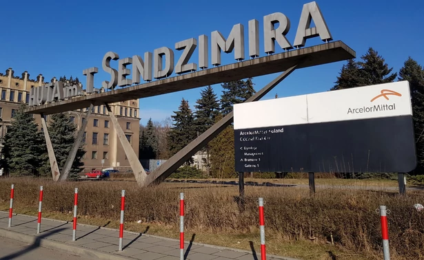

### 2020

> Ubiegłotygodniowa decyzja ArcelorMittal Poland (AMP) o demontażu instalacji w Krakowie to najprawdopodobniej dopiero początek kapitulacji sektora hutniczego w Polsce – mówią ludzie z branży
> – Tak realizuje się scenariusz wygaszania hutnictwa w Polsce, przed którym ostrzegaliśmy. Spodziewaliśmy się tej decyzji, bo dziś nie ma warunków, by produkcja stali była tu opłacalna. Jako Europa przegrywamy z tańszymi wyrobami ze Wschodu, a wewnątrz Unii Europejskiej nasz kraj za sprawą droższej energii nie ma szans z Niemcami, Belgami czy nawet Czechami – przyznaje Stefan Dzienniak, prezes Hutniczej Izby Przemysłowo-Handlowej (HIPH).

– ''Tak realizuje się scenariusz wygaszania hutnictwa w Polsce, przed którym ostrzegaliśmy. Spodziewaliśmy się tej decyzji, bo dziś nie ma warunków, by produkcja stali była tu opłacalna. Jako Europa przegrywamy z tańszymi wyrobami ze Wschodu, a wewnątrz Unii Europejskiej nasz kraj za sprawą droższej energii nie ma szans z Niemcami, Belgami czy nawet Czechami'' – przyznaje Stefan Dzienniak, prezes Hutniczej Izby Przemysłowo-Handlowej (HIPH).

Jeszcze cztery lata temu planowano, że wielki piec w Nowej Hucie będzie pracować co najmniej dwie dekady, dlatego odremontowano go kosztem 175 mln zł. Wygaszony został jesienią ubiegłego roku z powodu spadku popytu na stal, z założeniem, że ruszy w marcu 2020 r., ale zamrożenie gospodarki pokrzyżowało te plany. Teraz zapadła decyzja o rozbiórce. To efekt malejącego popytu na stal z Europy i kosztów energii w Polsce, wyższych niż w innych krajach naszego kontynentu.

  

---

We wrześniu sprzedano obligacje oszczędnościowe o łącznej wartości 2 240 mln zł.

We wrześniu 2020 roku sprzedano obligacje:

    3-miesięczne (OTS1220) – 1 060,5 mln zł,
    2-letnie (DOS0922) – 278,4 mln zł,
    3-letnie (TOZ0923) – 11,5 mln zł,
    4-letnie (COI0924) – 753,0 mln zł,
    10-letnie (EDO0930) – 122,5 mln zł.

Największą popularnością cieszyły się obligacje 3-miesięczne. Nabywcy indywidualni przeznaczyli na ich zakup kwotę 1.060,5 mln zł (47% udział w strukturze sprzedaży). Zainteresowaniem cieszyły się również obligacje 4-letnie (34%) i 2-letnie (12%). W dalszej kolejności oszczędzający wybierali obligacje 10-letnie (5%) i 3-letnie (0,5%).

Na zakup obligacji rodzinnych dedykowanych beneficjentom programu Rodzina 500+ przeznaczono 13,8 mln zł. Obligacje rodzinne kierowane są wyłącznie do osób otrzymujących świadczenie w ramach programu Rodzina 500+, które chcą oszczędzać na przyszłe potrzeby swoich dzieci. Beneficjenci programu mogą nabywać ten rodzaj obligacji do wysokości kwoty przyznanego świadczenia wychowawczego. Obligacje rodzinne są dostępne w ciągłej sprzedaży, zatem ich zakupu można dokonać w dowolnym momencie.

  

> We wrześniu sprzedaż skarbowych obligacji oszczędnościowych wyniosła 2,2 mld zł. Od początku roku nabywcy indywidualni przeznaczyli na zakup instrumentów detalicznych ponad 21 mld zł, co przełożyło się na 77% wzrost w stosunku do analogicznego okresu ubiegłego roku. Zainteresowanie naszymi obligacjami potwierdza również utrzymująca się wysoka średnia miesięczna sprzedaż, która po 9 miesiącach ukształtowała się na poziomie 2,4 mld zł

---

> Kolejny raz poruszam sprawę, która dotyczy ogromu ludzi, która wywołuje olbrzymie emocje, a na temat której osoby decyzyjne z Porozumienia Rezydentów nie wypowiadają się. Większość osób zainteresowanych stanem ochrony zdrowia, jakością kształcenia zobaczyła jak wygląda baza do LEK (jeden wielki żart). Niestety temat był poruszany wiele razy, a osoby które mają jakikolwiek wpływ na proces leigislacyjny nie zareagowały. Nikt nawet w najmniejszym stopniu się do tego nie odniósł. Dzisiaj wielu z nich się dziwi- jak Mikołaj Sinica, Damian Patecki, Piotr Pisula. W momencie kiedy środowisko studentów, stażystów protestowało każdy z nich mówił, że baza pytań do lek jest potrzebna, że to dobre rozwiązanie. Teraz widzimy ogrom niezadowolonych ludzi, którzy widzą, że jeden z najważniejszych egzaminów w ich życiu, który powinien decydować o ich lekarskiej przyszłości jest nic nie warty. Baza pytań składająca się z 1900 pozycji? Przecież to jakaś kpina. Oczekujemy szacunku do naszego zawodu, a niedługo będzie z nas się śmiał każdy pacjent. Chcemy aby nasze wytyczne ludzie traktowali poważnie, bo kończymy poważne studia, za którymi idzie sensowna wiedza, ale dopuszczamy do takich rzeczy? Nie jestem w stanie zrozumieć czemu w pogoni za własną korzyścią jaką jest egzamin PES z bazy jesteście w stanie przymknąć oko na to co się dzieje? Niedługo problemem stanie się ogrom ludzi którzy o medycynie nie mają zielonego pojęcia, a skończyli kierunek lekarski (na prywatnej uczelni hehe) i będzie trzeba dać im zajęcie, specjalizację. Każda grupa zawodowa dba o szacunek, prestiż swojego zawodu, tylko nie my- niestety od jakiegoś czasu. Jak potrzebowaliście studentów i stażystów do protestów to wiedzieliście jak ich znaleźć, jak teraz my potrzebujemy pomocy, chcemy prawdziwego, rzetelnego egzaminu, który będzie sprawdzał naszą wiedzę, który będzie decydował o naszej przyszłości to udajcie że nas nie słyszycie. LEK w dotychczasowej formule nie był idealny, ale był o niebo lepszy od obowiązujących teraz rozwiązań. Rozumiem 15% pytań z bazy, bo takie powtórzyć się muszą, rozumiem publikowanie pytań po egzaminie, ale to co teraz się dzieje, to jedna wielka żenada.
> Jeśli uważacie mój post za nieodpowiedni to zróbcie proszę kolejną ankietę (hehe) a przekonacie się co ludzie myślą o bazuni. Zresztą takich ankiet już było wiele i niestety tylko nas hejtowaliście i broniliście tego poronionego pomysłu.
> PS proszę nie mówić, że PR było przeciwne bazie do LEKu, bo na stronach rządowych odnoszących się do konsultacji publicznych jednoznacznie jest zaznaczone że PR chciało (UWAGA) 100% bazy pyatań do LEK. Jeśli ktoś nie wierzy, uważa to za kłamstwo to mogę wstawić screeny.

---

### 1981

Fabryka Samochodów Małolitrażowych w Bielsku Białej.  wyprodukowała milionowy egzemplarz samochodu Fiat 126p. Nastąpiło to po 8 latach i 4 miesiącach od rozpoczęcia produkcji tego pojazdu

  

### 1939

W lesie koło wsi Bratian w okolicach Nowego Miasta Lubawskiego członkowie niemieckiego Selbstschutzu dokonali mordu na 150 przedstawicielach polskiej inteligencji. Polaków, więzionych wcześniej w aresztach Selbstschutzu w Nowym Mieście Lubawskim, których rozstrzelano i pochowano w czterech zbiorowych mogiłach. Wśród zamordowanych były dwie kobiety.

  

### 1926

https://en.wikipedia.org/wiki/Michel_Foucault

---

<a href="https://github.com/TomaszWaszczyk/historia.waszczyk.com/edit/master/src/content/october-15.md" target="_blank">Edytuj tę stronę dzieląc się własnymi notatkami!</a>
