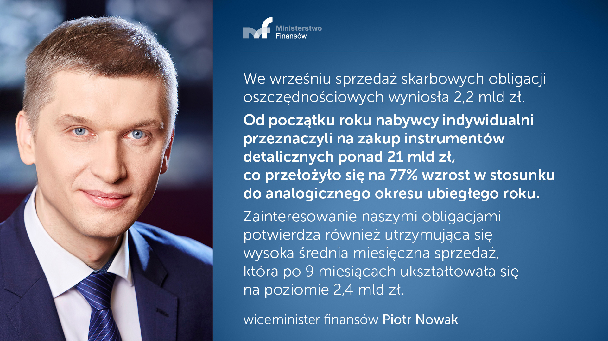
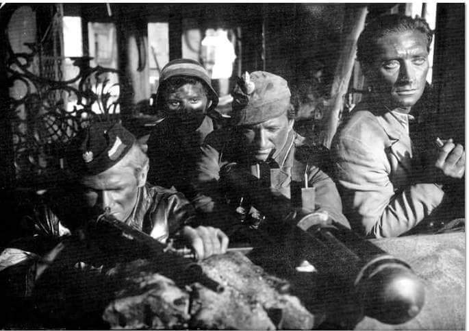
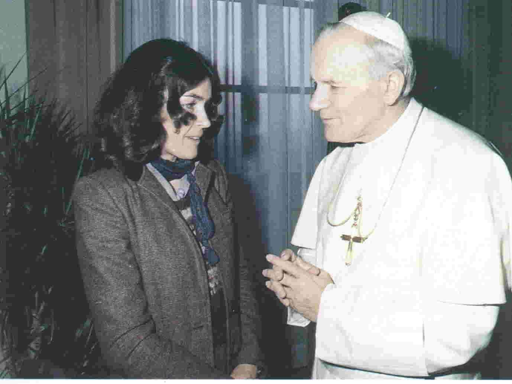
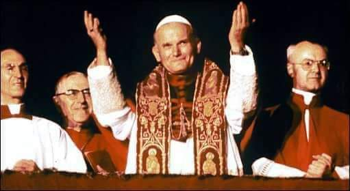
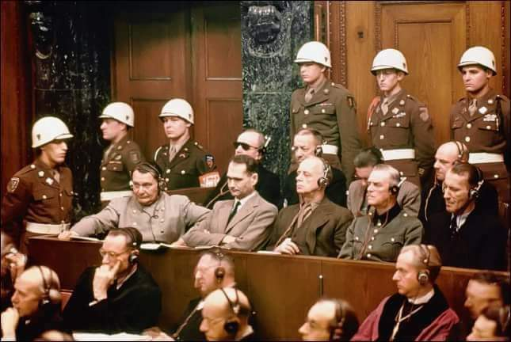
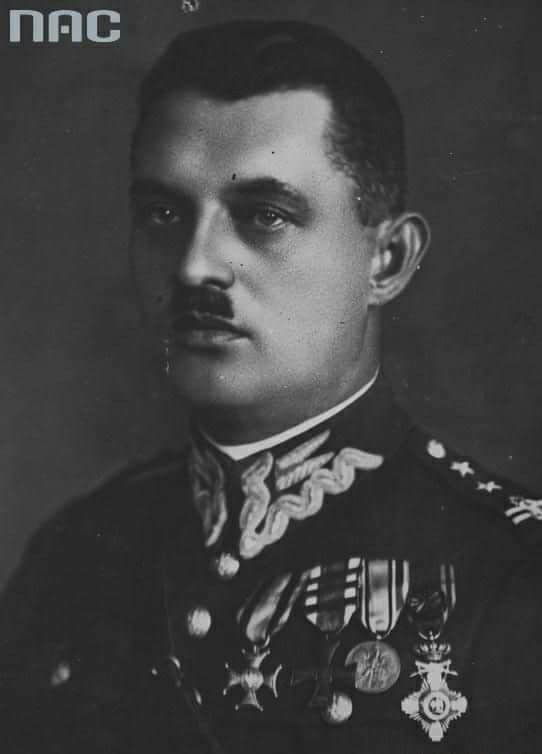
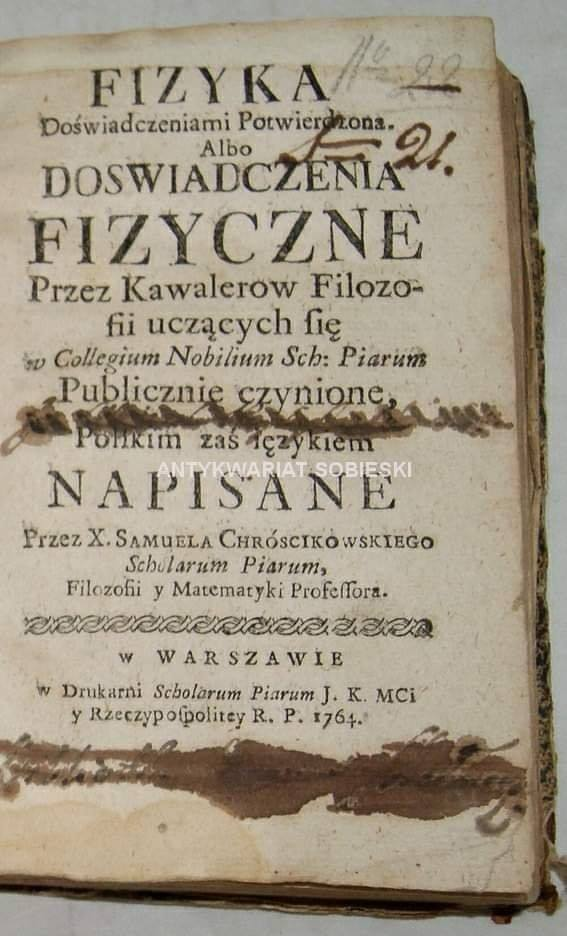

### 2020

  

---

RMF FM: prokuratura zabezpieczyła część majątku Czarneckiego

W związku z prowadzonym śledztwem ws. afery GetBack, prokuratura zabezpieczyła znaczny majątek miliardera Leszka Czarneckiego, donosi nieoficjalnie radio RMF FM.
Na swojej stronie internetowej stacja napisała, że „…prokuratorzy nie chcą mówić o szczegółach. Jedyne, co usłyszeliśmy, to "kwota jest niebagatelna, robi wrażenie, jednak jest niższa, niż suma szkody wyrządzonej klientom banku".

---

### 1992

W Londynie zmarł z powodu pęknięcia aorty brzusznej Władysław Sheybal - polski aktor, malarz, scenarzysta i reżyser. Pochodził z rodziny o inteligenckich i artystycznych tradycjach.  Dzieciństwo spędził w Krzemieńcu. W okresie okupacji niemieckiej był słuchaczem konspiracyjnego Państwowego Instytutu Sztuki Teatralnej. Angażował się w działalność ruchu oporu za co został wkrótce aresztowany i skazany na karę śmierci. Przed karą śmierci udało mu się wyratować ucieczką. Występował na scenach w Teatrze Wojska Polskiego, Starym Teatrze w Krakowie, Teatrze Śląskim w Katowicach, Miejskich Teatrach Dramatycznych,  Teatrze Narodowym w Warszawie, Teatrze Ateneum. W filmie wojennym ,,Kanał'' - w reżyserii Andrzeja Wajdy wcielił się w pianistę Michała, który w ostatnim etapie walk powstańczych dołączył do jednej z ewakuujących się kanałami grup powstańczych. W roku 1957 artysta opuścił Polskę.  Zamieszkał w Londynie. Działał w środowisku polonijnym i w teatrach angielskich. Wystąpił w wielu filmach i serialach angielskich, amerykańskich i włoskich. Zasłynął rolą mistrza szachowego Kronsteena w ''Pozdrowieniach z Rosji'' z serii filmów o przygodach brytyjskiego agenta Jamesa Bonda oraz rolą kapitan  Ferreira w nagrodzonym Złotym Globem słynnym serialu amerykańskim ''Szogun''. Z ciekawostek dodam, że Sheybal użyczył swojego głosu w horrorze ''Egzorcysta II - Heretyk'' (Sheybal przemawia głosem demona pazuzu). Artysta odszedł mając 69 lat. Został pochowany na cmentarzu Putney Vale. 
Zdjęcie: Kadr z filmu Kanał. Pierwszy z prawej stoi Władysław Sheybal.

  

### 1978

Himalaistka Wanda Rutkiewicz ( na zdjęciu z papieżem Janem Pawłem II ), jako pierwsza w historii Polka i w ogóle trzecia na świecie kobieta zdobyła szczyt Mount Everest.
Tak o Wandzie Rutkiewicz mówiła inna słynna himalaistka Anna Czerwińska:
" Wanda organizacyjnie i kondycyjnie zawsze była krok przed naszym środowiskiem. Gdy w Polsce nikomu nie śniło się o wyprawie na Everest ona potrafiła zorganizować sobie taki wyjazd, zakręcić się w każdym środowisku od przysłowiowego biskupa do sekretarza KC i zawsze wywalczyć to, na czym jej zależało. Upór i siła woli były u niej dominujące. Dostałam od niej kartkę po zdobyciu najwyższej góry świata. Mam ją do dziś. Treść była krótka, to co pamiętam to zdanie: jestem w szczęśliwym odwrocie."
16 października 1978 roku w ogóle był znamienną datą w polskiej historii. Jak już wcześniej wspomniała Marta tego samego dnia na papieża wybrano kardynała Karola Wojtyłę, który 10 czerwca 1979 roku podczas pierwszej pielgrzymki spotkał się w Krakowie z Wandą Rutkiewicz, do której powiedział :
" Dobry Bóg tak chciał, że tego samego dnia weszliśmy tak wysoko"

  

---

Pośród niesnasek Pan Bóg uderza 
W ogromny dzwon, 
Dla słowiańskiego oto papieża 
Otworzył tron. 
Ten przed mieczami tak nie uciecze 
Jako ten Włoch, 
On śmiało, jak Bóg, pójdzie na miecze; 
Świat mu to proch! 
Twarz jego, słowem rozpromieniona, 
Lampa dla sług, 
Za nim rosnące pójdą plemiona 
W światło, gdzie Bóg. 
Na jego pacierz i rozkazanie 
Nie tylko lud 
Jeśli rozkaże, to słońce stanie, 
Bo moc to cud! 
On się już zbliża rozdawca nowy 
Globowych sił: 
Cofnie się w żyłach pod jego słowy 
Krew naszych żył; 
W sercach się zacznie światłości bożej 
Strumienny ruch, 
Co myśl pomyśli przezeń, to stworzy, 
Bo moc to duch. 
A trzeba mocy, byśmy ten pański 
Dźwignęli świat: 
Więc oto idzie papież słowiański, 
Ludowy brat; 
Oto już leje balsamy świata 
Do naszych łon, 
A chór aniołów kwiatem umiata 
Dla niego tron. 
On rozda miłość, jak dziś mocarze 
Rozdają broń, 
Sakramentalną moc on pokaże, 
Świat wziąwszy w dłoń; 
Gołąb mu słowa w hymnie wyleci, 
Poniesie wieść, 
Nowinę słodką, że duch już świeci 
I ma swą cześć; 
Niebo się nad nim piękne otworzy 
Z obojga stron, 
Bo on na świecie stanął i tworzy 
I świat, i tron. 
On przez narody uczyni bratnie, 
Wydawszy głos, 
Że duchy pójdą w cele ostatnie 
Przez ofiar stos; 
Moc mu pomoże sakramentalna 
Narodów stu, 
Moc ta przez duchy będzie widzialna 
Przed trumną tu. 
Takiego ducha wkrótce ujrzycie 
Cień, potem twarz: 
Wszelką z ran świata wyrzuci zgniłość, 
Robactwo, gad, 
Zdrowie przyniesie, rozpali miłość 
I zbawi świat; 
Wnętrze kościołów on powymiata, 
Oczyści sień, 
Boga pokaże w twórczości świata, 
Jasno jak dzień.

--- Juliusz Słowacki, Słowiański papież, 1848 r.

---

Najdostojniejsi kardynałowie, podczas ósmego głosowania konklawe dokonali wyboru nowego Biskupa Rzymu. Został nim 58-letni Polak - kardynał Karol Wojtyła, który przyjął imię Jan Paweł II. Na 111 głosów otrzymał aż 103 głosy poparcia.
Był on pierwszym od 1522 r. papieżem, który nie pochodził z Włoch. Ponadto był pierwszym w historii ,,słowiańskim papieżem''. Emotikon smile
Pierwsze orędzie nowo wybranego papieża:
,,Niech będzie pochwalony Jezus Chrystus!
Najdrożsi Bracia i Siostry,
jeszcze przeżywamy wielki smutek z powodu śmierci naszego ukochanego papieża Jana Pawia I, a oto najdostojniejsi kardynałowie już powołali nowego Biskupa Rzymu.
Powołali go z dalekiego kraju... z dalekiego, lecz zawsze tak bliskiego przez łączność w wierze i tradycji chrześcijańskiej. Bałem się przyjąć ten wybór, jednak przyjąłem go w duchu posłuszeństwa dla Pana naszego Jezusa Chrystusa i w duchu całkowitego zaufania Jego Matce, Najświętszej Maryi Pannie.
Nie wiem, czy potrafię rozmawiać waszym... naszym językiem włoskim. Jeżeli się pomylę, to mnie poprawicie. Przedstawiam się wam wszystkim dzisiaj, by wyznać naszą wspólną wiarę, naszą nadzieję, naszą ufność pokładaną w Matce Chrystusa i Kościoła z pomocą Pana Boga i z pomocą ludzi''
--- Jan Paweł II, 16.10.1978 r.

  

---

### 1946

W Norymberdze stracono dziesięciu z jedenastu nazistowskich zbrodniarzy wojennych. Egzekucji dokonano na podstawie wyroku z 1 października 1946 roku wydanego przez sędziów Międzynarodowego Trybunału Wojskowego w Norymberdze Wówczas skazali oni na karę śmierci przez powieszenie: Hansa Franka, Wilhelma Fricka, Hermanna Göringa, Alfreda Jodla, Ernsta Kalternbrunnera, Wilhelma Keitla, Joachima von Ribbentropa, Alfreda Rosenberga, Fritza Sauckela, Arthura Seyss-Inquarta i Juliusa Streichera. Wyroki dożywotniego pozbawienia wolności otrzymali: Walther Funk, Rudolf Hess i Erich Raeder. Na 20 lat więzienia skazani zostali Baldur von Schirach i Albert Speer. Na 15 lat skazano - Konstantina von Neuratha. Na 10 lat - Karla Dönitza. Uniewinnieni zostali: Franz von Papen, Hans Fritzsche i Hjalmar Schacht. Nie byli sądzeni Gustav Krupp - ze względów zdrowotnych, oraz Robert Ley, który powiesił się 25 października 1945 roku w celi więziennej. In absentia został skazany na śmierć Martin Bormann. Egzekucji uniknęli trzej główni animatorzy nazizmu: Adolf Hitler, Heinrich Himmler i Joseph Goebbels, którzy popełnili samobójstwo na długo przez rozpoczęciem procesu norymberskiego. Pierwszy na szubienicę wszedł i został stracony Ribbentrop - o godzinie 1:04, ostatni zaś Seyss-Inquart - o 2:45. Kilka godzin przed rozpoczęciem egzekucji, 15 października 1946 o godzinie 22:45, Hermann Göring popełnił samobójstwo, zażywając truciznę, którą dostarczyła mu do celi nieznana do dziś osoba. Skazani na karę wieloletniego więzienia zbrodniarze odbywali karę w berlińskim więzieniu Spandau, gdzie do 1966 roku prawie wszyscy zostali zwolnieni. Najdłużej odbywającym karę i ostatnim więźniem Spandau był Rudolf Hess - lub jego sobowtór- który powiesił się w 1987 roku.

  

### 1892

W Modlnicy w województwie małopolskim urodził się Jan Karcz (zdjęcie) pułkownik dyplomowany Kawalerii Wojska Polskiego, absolwent Politechniki Lwowskiej i Szkoły Oficerskiej Saperów, uczestnik obrony Lwowa w roku 1918. Za męstwo na polu walki został odznaczony Srebrnym Krzyżem Orderu Wojennego Virtuti Militari oraz 4-krotnie Krzyżem Walecznych.
W czasie wojny obronnej dowodził Mazowiecką Brygadą Kawalerii, która toczyła z Niemcami zacięte walki opóźniające.
Brał czynny udział w działalności sportowej i społecznej. Pełnił obowiązki przewodniczącego Komisji Technicznej Towarzystwa Międzynarodowych i Krajowych Zawodów Konnych w Polsce. Za działalność społeczną został odznaczony Krzyżem Oficerskim Orderu Odrodzenia Polski. Był również współautorem Zarysu historii wojennej 1 Pułku Szwoleżerów Józefa Piłsudskiego.
W czasie okupacji podjął walkę konspiracyjną (ps. „Jan”). Wstąpił do tajnej Organizacji Orła Białego działającej na terenie Krakowa. Wraz z nią przeszedł do Związku Walki Zbrojnej (Okręg Krakowski). Na początku 1941 został przypadkowo aresztowany w łapance w Tarnowie. Początkowo więziony w Lublinie w więzieniu na Zamku, w dniu 27 listopada 1941 przywieziony do niemieckiego obozu koncentracyjnego Auschwitz-Birkenau.
Osadzony jako więzień polityczny – Polak (P.Pole) z numerem 23569, również tam Jan Karcz nie złożył broni. Wstąpił do konspiracyjnego Związku Organizacji Wojskowej, założonego w obozie Auschwitz przez rtm. Witolda Pileckiego. Prawdopodobnie w grudniu 1941 został wydany przez zdrajcę obozowemu gestapo. Po przejściu okrutnego przesłuchania w bunkrze bloku 11 został osadzony w karnej kompanii i skierowany do obozu w Birkenau. Tam założył płk Jan Karcz ekspozyturę ZOW i kierował nią do stycznia 1943 roku. 23 stycznia został powtórnie osadzony w bunkrze bloku 11 i 25 stycznia rozstrzelany pod Ścianą Straceń, a jego ciało spalone w krematorium.
11 listopada 1969 roku Prezydent RP, August Zaleski mianował go pośmiertnie generałem brygady.

  

### 1853

https://pl.wikipedia.org/wiki/Wojna_krymska

### 1799

W Chełmie, w wieku 69 lat zmarł Samuel Chróścikowski .
Pochodził z Piasków koło Chełma. Był profesorem Collegium Nobillium, wicerektorem kolegium pijarskiego we Lwowie, rektorem kolegium w Chełmie. W roku 1764 napisał pierwszy polski podręcznik do fizyki zatytułowany "Fizyka doświadczeniami potwierdzona".

  

Zdjęcie; Antykwariat Sobieski.

---

<a href="https://github.com/TomaszWaszczyk/historia.waszczyk.com/edit/master/src/content/october-16.md" target="_blank">Edytuj tę stronę dzieląc się własnymi notatkami!</a>
