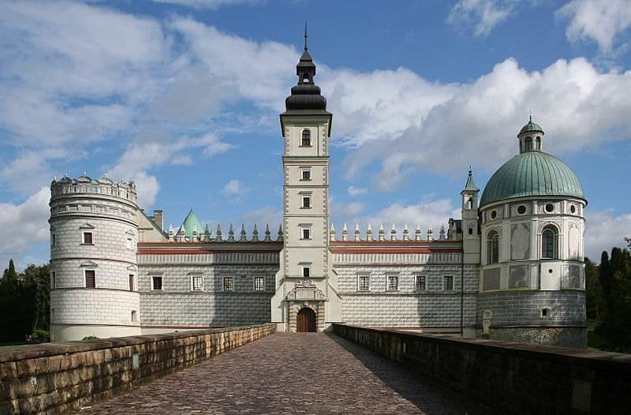
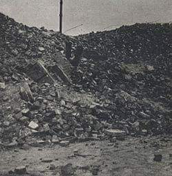
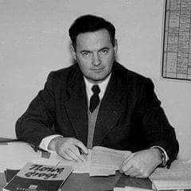
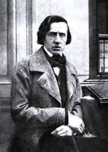

### 2022

„Piętnaście państw popisało w Brukseli, w czasie szczytu ministrów obrony NATO, list intencyjny w sprawie budowy European Sky Shield - europejskiej tarczy antyrakietowej. Wśród nich nie ma Polski.
Wśród sygnatariuszy listu znaleźli się ministrowie obrony: Niemiec, Litwy, Łotwy, Estonii, Czech, Węgier, Słowacji, Rumunii, Bułgarii, Norwegii, Finlandii, Holandii, Belgii, Wielkiej Brytanii.

Zwraca uwagę obecność wszystkich krajów Grupy Wyszehradzkiej, poza Polską, Wielkiej Brytanii, która z naszym krajem współpracuje choćby w projekcie budowy systemu obrony przeciwlotniczej krótkiego zasięgu, a także krajów bałtyckich, z którymi prowadzimy jednolitą politykę względem Rosji i Białorusi.”

„Autorem projektu jest niemiecki kanclerz Olaf Scholz. Na razie nie przesądzono o technologii, jaką będzie wykorzystywała przyszła wspólna tarcza antyrakietowa, ale Niemcy wskazują na izraelską Żelazną Kopułę, uznawaną za najlepszy system obrony przeciwlotniczej i przeciwrakietowej. Chodzi konkretnie o pociski Arrow 3, produkcji amerykańskiej firmy Boeing i izraelskiego IAI, które mają chronić przed atakiem pocisków balistycznych. Pociski Arrow 3, których produkcję rozpoczęto w 2017 roku, mają zasięg do 2400 kilometrów, prędkość hipersoniczną (przekraczają co najmniej pięć razy prędkość dźwięku) i zestrzeliwują pociski przeciwnika ponad atmosferą ziemską używając głowicy "hit to kill", czyli niepowodującą wybuchu.

Dlaczego Polska nie podpisała listu intencyjnego w sprawie europejskiej tarczy antyrakietowej? Polski minister obrony Mariusz Błaszczak stwierdził, że "Polska taką broń już posiada": - To jest projekt, który być może zostanie zrealizowany, oczywiście chcemy, by został zrealizowany. My realizujemy projekt razem z Wielką Brytanią, mamy już pierwsze elementy tego projektu - chodzi o Sky Sabre i chodzi o "małą Narew" - mówił i przypomniał, że uczestniczył w Zamościu razem z ministrem obrony Wielkiej Brytanii Benem Wallace'em w przekazaniu polskim przeciwlotnikom pierwszych wyrzutni brytyjskich pocisków CAMM.

Polska rzeczywiście prowadzi obecnie najbardziej zaawansowany projekt budowy wielowarstwowej obrony przeciwlotniczej i przeciwrakietowej w naszej części Europy. Oparty jest na pociskach średniego zasięgu - amerykański Patriot oraz krótkiego zasięgu - CAMM. Z wypowiedzi ministra Błaszczaka, który porównywał mającą zasięg ok 40 km Sky Sabre do pocisków Arrow 3 mających zasięg 2400 km, może wynikać, że polski szef MON nie był zorientowany, o co chodzi w sprawie budowy europejskiej tarczy. Wedle koncepcji NATO taki system miałby chronić Europę nie tylko przed pociskami krótkiego i średniego zasięgu, ale także przed największymi interkontynentalnymi pociskami balistycznymi. Do tej pory Europa takim system nie dysponuje.

Możliwe jest też, że szef polskiego MON nie zagłębiał się w propozycję, która wyszła od Niemiec i jest oparta częściowo na izraelskiej technologii. Rząd PiS jest bowiem na wojennej ścieżce z Niemcami(…)”

### 2021

> "The European Central Bank is exploring raising its limit on purchases of EU-issued bonds, in a move that would enhance its flexibility in asset-buying schemes and boost the status of the bloc’s groundbreaking joint debt programme launched this year." - FT, October 17, 2021

### 1944

Władze komunistyczne definitywnie odebrały rodowi Sapiehów Zamek w Krasiczynie. Dramatyczna wojenna historia tej powstałej w roku 1580 budowli sięga połowy września 1939 roku, kiedy oddziały niemieckie dokonały mordu na 30 polskich jeńcach- żołnierzach i oficerach Wojska Polskiego. Kolejnym ciosem była sowiecka agresja na Polskę. Krasiczyn znalazł się w sowieckiej strefie wpływów. Ostatni właściciel zamku Leon Sapieha- brat kardynała Adama Sapiehy, zdając sobie sprawę z tego do czego zdolni są Sowieci, starał się uratować jak najwięcej ruchomości. Kuriozum w tym przypadku jest fakt, że ratowaniu zamkowego majątku pomogli mu Niemcy, którzy zajmowali zamek o dwa tygodnie dłużej niż chcieli tego Sowieci.
W latach 1945- 1946 na zamku znajdowała schronienie okoliczna ludność uciekająca przed atakami UPA.

  

### 1943

17 na 18 października 1943 roku Niemcy dokonali jednej z największych egzekucji na polskich więźniach aresztu przy ulicy Pawiej w Warszawie. Nagich więźniów wyprowadzano grupami na ulicę i rozstrzeliwano za pomocą ognia prowadzonego z broni maszynowej.
Do godziny czwartej nad ranem w rejonie ulic Pawiej i Dzielnej zabito 600 osób.
Prawdopodobnie jedną z ofiar tej egzekucji był też jeden z esesmanów, który nie mogąc sobie poradzić z tym psychicznie popełnił samobójstwo.
Na zdjęciu ruiny domu przy ul. Dzielnej 27. W latach
1943-1944 zamordowano w tym miejscu tysiące więźniów Pawiaka.

  

### 1916

W Drohobyczu (obecnie Ukraina ) urodził się Tadeusz Chciuk-Celt (zdjęcie)-harcmistrz,żołnierz Związku Walki Zbrojnrj, cichociemny, a także wieloletni zastępca dyrektora Sekcji Polskiej Radia Wolna Europa w Monachium. Był współtwórcą tego radia. Specjalizował się w programach o problematyce wiejskiej. Tworzył je pod pseudonimem Michał Lasota. Zawołaniem tworzonych przez niego programów było "Tym co żywią i bronią-chłopom polskim-Szczęść Boże".
Walczył na falach eteru przeciw komunizacji
Polski. Był nadto czołowym komentatorem
politycznym rozgłośni, a także autorem
słuchowisk radiowych i audycji harcerskich. W
latach 1976- 1983.
Zmarł w 2001 roku w Monachium. Jego
prochy złożono z honorami wojskowymi w
Panteonie Żołnierzy Polski Walczącej na
Cmentarzu Wojskowym na Powązkach w
Warszawie.

  

### 1849

Zmarł na gruźlicę płuc Fryderyk Franciszek Chopin. Artysta zmarł w swoim paryskim mieszkaniu przy placu Vendôme. Jego ciało spoczęło na największym i najstarszym paryskim cmentarzu Pére-Lachaise, wśród m.in. takich sław jak Honoré de Balzac i Molier. Zgodnie z ostatnią wolą artysty jego serce zostało przewiezione do Polski i w urnie wmurowane w filar kościoła Św. Krzyża na Krakowskim Przedmieściu w Warszawie. Fryderyk Chopin był najwybitniejszym polskim kompozytorem i słynnym pianistą, od 1830 roku przebywał poza Polską, głównie w Paryżu, gdzie wkrótce stał się artystą legendarnym. Jego osobowość silnie pobudzała fascynację ludzi związanych ze sztuką , przyjaźnił się m.in. z Eugene Delacroix i Ference Lisztem, który niegdyś scharakteryzował Chopina i jego twórczość w następujący sposób: "Chopina można zaliczyć do rzędu najwybitniejszych muzyków, którzy stali się wcieleniem poczucia poetyckiego całego narodu; bynajmniej jednak nie dlatego, że do kompozycji swych wprowadził rytm polonezów, mazurów i krakowiaków i że wiele utworów opatrzył nazwą tańców ludowych. Gdyby ograniczył się jedynie do mnożenia owych melodii, odtwarzałby tylko wciąż ten sam motyw, wspomnienie tej samej sprawy, tego samego zjawiska; taka ustawiczna reprodukcja wkrótce stałaby się nudna, służyłaby bowiem jedynie do propagowania formy, które wcześniej czy później nużyłyby monotonią. Jeśli nazwisko jego po dziś dzień jest nazwiskiem artysty tak bardzo polskiego, wynika to z faktu, że posługiwał się ową formą jedynie po to, by w niej wyrazić pewien sposób odczuwania, bardziej powszechny w jego kraju niż gdzie indziej, oraz dla tego że we wszystkich formach, jakie wybrał, daje zawsze wyraz tym samym uczuciom. Jego preludia, etiudy, a zwłaszcza nokturny, jego scherza i koncerty - zarówno najkrótsze utwory, jak najznamienitsze - przesycone są tym samym rodzajem czułej wrażliwości, wyrażonej w rozmaitym stopniu nasilenia, w tysięcznych odmianach i wariacjach, lecz zawsze tej samej i niezmiennej. Będąc artystą tak wyjątkowo subiektywnym, tchnął we wszystkie swe kompozycje to samo życie i przepoił je własną indywidualnością.''. Chopin przez kilka lat związany był romansem z francuską powieściopisarką i dziennikarką George Sand. Koncertował rzadko, dla grona wybranych, grał w skupieniu wytwarzając wokół siebie aurę tajemnicy. Jego występy, a zwłaszcza improwizacje, uchodziły za najwyższe objawienie romantycznego piękna. W twórczości Chopina wyklarował się wysoce indywidualny styl łączący narodowe i ludowe tradycje muzyki polskiej ze zdobyczami muzyki romantyzmu. Tworzył wspaniałe koncerty, mazurki, polonezy, nokturny, etiudy, preludia, walce, ballady, scherza, sonaty, a także utwory kameralne i pieśni. Od 1927 roku w Warszawie organizowany jest, co 5 lat Międzynarodowy Konkurs Pianistyczny im. Fryderyka Chopina, najstarszy na świecie monograficzny konkurs muzyczny. Jego twórcą był Jerzy Żurawlew.
Pierwszym laureatem  konkursu był Lew Oborin z ZSRR.

  

---

<a href="https://github.com/TomaszWaszczyk/historia.waszczyk.com/edit/master/src/content/october-4.md" target="_blank">Edytuj tę stronę dzieląc się własnymi notatkami!</a>
