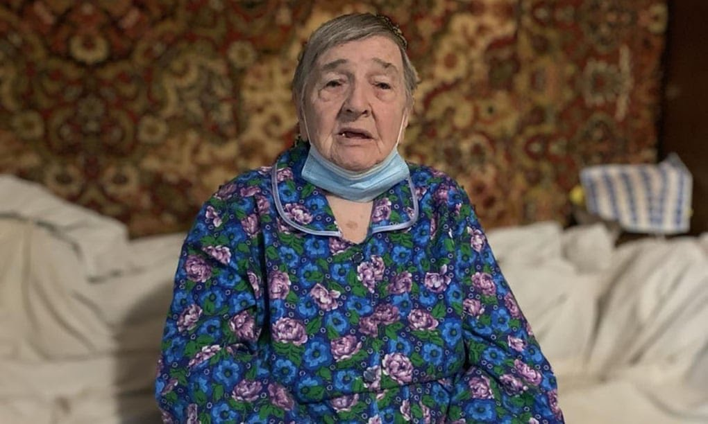
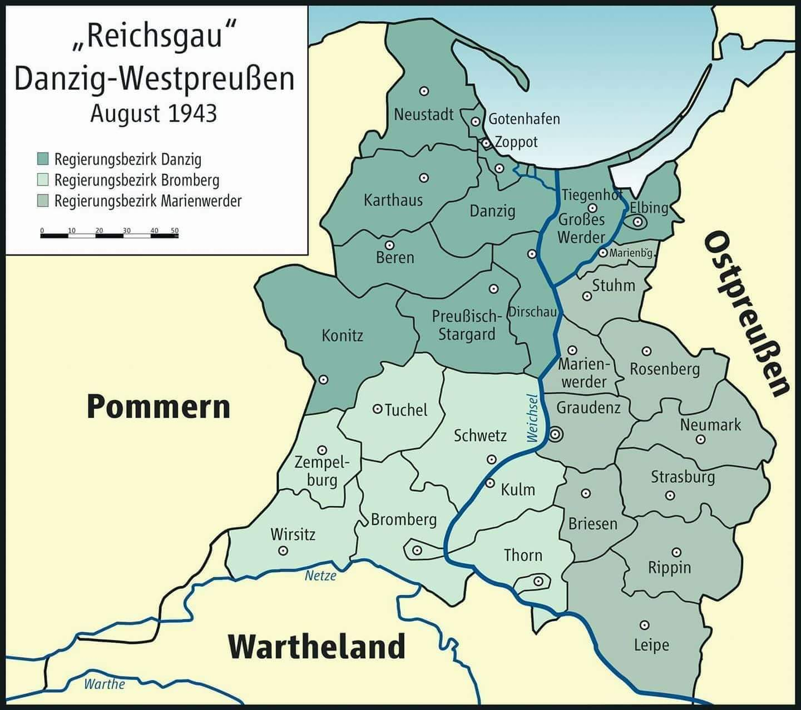
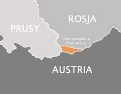

### 2023

The Nazis invaded Mariupol on October 8, 1941. They faced resistance from the Soviet troops and local partisans; but it was eventually captured. Oleksandr Malynovskyi; a Ukrainian nationalist leader who cooperated with the Nazis was appointed as the mayor of Mariupol.

The Red Army broke through the Nazi defenses and managed to capture most of the city by September 10, 1943, and declared it liberated.

During the Nazi occupation; On October 18 1941, most of the Jews of Mariupol were executed by members of the Sonderkommando 10a, part of the Einsatzgruppe D unit, under the command of Heinz Seetzen with the help of (Ukrainische Hilfspolizei)  Ukrainian auxiliary police. 

Jews were then taken to anti-tank trenches 7-10 kilometers from the city, near the Agrobaza (agricultural station) of the Perovsky sovkhoz. There they were forced to undress and sit on the edge of the trenches, where they were shot with machine guns. According to the sources, the number of victims were at least 8,000 . Later, Jewish women married to non-Jewish men were killed at the same site, together with their children.

This is a picture  of Vanda Semyonovna Obiedkova;  one of the very few survivors of the Mariupol masscare of 1941  who froze to death on 4 April sheltering in her basement from Russian shelling during the attack on Mariupol in 2022 .

  

### 2022

  

### 2020

> Nie możemy działać jako siłownia - będziemy działać jako sklep z odpłatnym testowaniem sprzętu. „Sprawiedliwość jest drugim wielkim zadaniem prawa, jednak pierwszym jest pewność prawa, pokój.”
> Problem nieposłuszeństwa obywatelskiego jest znany od czasów rzymskich. Czy prawo nieakceptowane społecznie jest prawem ? Czy prawo, które suweren w sposób jawny obchodzi i zyskuje przy tym akceptację społeczna jest prawem ? Kto ocenia czy prawo powinno rzeczywiście obowiązywać ? A może powinnismy ślepo czytać przepisy i się do nich stosować ? Prawo przecież jest prawem, bo zapewnia pewność funkcjonowania Państwa, pomimo ze wydaje nam się niesprawiedliwe. Dla wtajemniczonych nazwiska Kelsena i Radbrucha powinny te kwestie wyjaśniać, dla niewtajemniczonych polecam lekturę.

  

---

18:47 Siłownia kontra obostrzenia. Przekształciła się w sklep i zachęca do odpłatnego testowania sprzętu

16:30 Szwajcaria ogłasza nowe restrykcje w związku z pandemią

13:02 Papież: Trzeba płacić podatki, to obywatelski obowiązek

12:31 Ponad 55 tys. osób ukaranych mandatem za brak maseczki

11:25 Znaczek pocztowy kupisz przez internet. Poczta Polska uruchomiła witrynę z dostępem do usług cyfrowych

10:48 Mateusz Morawiecki zakończył odbywanie kwarantanny

10:43 Prezydent w poniedziałek powoła Przemysława Czarnka na stanowisko ministra edukacji i nauki

07:33 Prezydent Tanzanii o rodzinach z dwójką dzieci: to lenie

07:16 Gigantyczny wzrost bezrobocia w miastach, które były liderami rynku pracy w Kanadzie

<!-- Sobota - 17 października
22:21 Ponad 26 mln Amerykanów już zagłosowało w wyborach
22:18 Bez aresztu dla Ryszarda Krauzego i czterech innych podejrzanych 
21:19 Armenia i Azerbejdżan uzgodniły "humanitarny rozejm" od niedzieli
20:26 Rekordowe zwycięstwo Partii Pracy Jacindy Ardern w wyborach w Nowej Zelandii
19:04 Wyspy Kanaryjskie przywracają ruch wycieczkowców
17:58 Szef MZ: podmioty lecznicze walczące z Covid-19 mają gwarancję wpływu 1/12 ryczałtu co miesiąc
16:25 Słowacja przetestuje wszystkich mieszkańców na obecność koronawirusa
15:48 PSL pokazuje pomysły na walkę z epidemią. Projekt "Premia dla bohatera" zamiast premii w ministerstwach
15:15 Premier: Nie idziemy drogą państw, które kolejny raz wprowadzają lockdown
13:48 Grzesiowski: Trzeba zorganizować szpitale w szkołach, salach gimnastycznych, na halach targowych
13:07 "Wspólna Polska". Rafał Trzaskowski powołał nowy ruch
12:14 Godziny dla seniorów nie obowiązują w weekendy
12:04 Rzecznik MZ: Mamy 14,7 tys. łóżek dla pacjentów z koronawirusem i ponad 1,1 tys. respiratorów
09:50 Po wyroku TSUE nadal brak rozwiązań ws. transferu danych osobowych poza UE
09:06 Moody's obniżył rating Wielkiej Brytanii do Aa3
08:34 Szkoły w Europie walczą z koronawirusem. Które kraje zamknęły placówki?
08:00 Allegro napędza warszawską giełdę
07:44 Założyciel portalu "eBilet" chce unieważnienia akwizycji spółki przez Allegro
06:51 Ponad 200 zł za śmieci dla czteroosobowej rodziny w Warszawie
06:42 Wojewoda mazowiecki: Nie ma wojny rządu z lekarzami -->

---

### 1944

https://en.wikipedia.org/wiki/Volkssturm

### 1939

Podczas spotkania z naczelnym dowództwem Wermachtu Adolf Hitler powiedział:
"Mam nadzieję, że za dziesięć lat Greiser i Forster będą mogli zameldować, iż Poznań i Prusy Zachodnie stały się już kwitnącą niemiecką krainą".
Grafika przedstawia niemiecką mapę Okręgu Gdańsk-Prusy Zachodnie z rejencjami i miastami powiatowymi.

  

### 1815

Z inicjatywy cara Aleksandra I, w wyniku uchwały Kongresu Wiedeńskiego utworzono Wolne Miasto Kraków nazywne też Republiką Krakowską.
Był to rejon powstały w ramach pertraktacji między trzema zaborcami, który mimo teoretycznej autonomii nadal był strefą wpływów Rosji, Austrii i Prus. Jedynym,co przysięgli zaborcy była obietnica nie wprowadzania swoich wojsk na terytorium tej enklawy pod warunkiem, że Kraków musiał wydawać wszystkich szpiegów i dezerterów zbigłych z jego terytorium.

  

---

<a href="https://github.com/TomaszWaszczyk/historia.waszczyk.com/edit/master/src/content/october-18.md" target="_blank">Edytuj tę stronę dzieląc się własnymi notatkami!</a>
