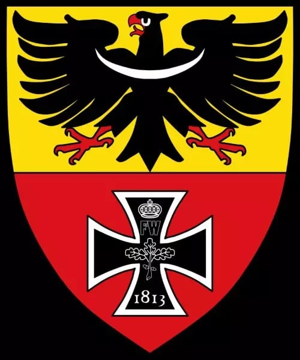

### 1984

Zamordowano księdza Jerzego Popiełuszkę.

### 1938

Herb Wrocławia – ustanowiony przez nazistów. Użycie go przez kontrowersyjną stację telewizyjną wywołało skandal
(Artykuł przeczytało 22 500 Czytelników)

Herb został zaprojektowany przez Hansa Schweitzera, znanego także pod nazwiskiem Mjölnir (nazwa młota Thora), który był jednym z ulubionych artystów Nazistów. Zatrudnił go sam Józef Goebbels do projektowania nazistowskich plakatów. 19 października 1938 naziści na rozkaz gauleitera Śląska Josepha Wagnera usunęli tradycyjny herb, zastępując go dwupolowym. W jego górnej, złotej części widniał orzeł śląski, a w czerwonej, dolnej Krzyż Żelazny – projektantem nowej tarczy był berliński prof. Schweitzer-Mjoelnir. Cytat z gazety z tego okresu:
W 1938 naziści postanowili zmienić dotychczasowy herb Wrocławia, który był ich zdaniem zbyt chrześcijański i zbyt słowiański. Nowy herb zaprojektował właśnie Schweitzer.
. Nadprezydentowi i gauleiterowi Śląska Josefowi Wagnerowi źle się kojarzy herbowa litera „W”. Jest podobno „zbyt słowiańska, jako że stanowi inicjał imienia czeskiego księcia Wratysława, założyciela naszego miasta. Lew zresztą też ma niewłaściwe, bo czeskie pochodzenie.
Dalej:
Poza tym Wagner uważa, że w starym herbie jest za dużo chrześcijańskiej symboliki. Widok głowy św. Jana Chrzciciela na misie nie poprawia samopoczucia naszego gauleitera. Zarządził więc wprowadzenie nowego godła. Na tarczy znalazł się śląski orzeł i Krzyż Żelazny z literami FW i datą 1813. To inicjały króla Fryderyka Wilhelma III, który ustanowił odznaczenie Krzyż Żelazny za wojny wyzwoleńcze z Napoleonem.
Odwołanie do króla Fryderyka Wilhelma III związane jest bezpośrednio z we Wrocławiu 17 marca 1813 pod naciskiem pruskich patriotów odezwą An Mein Volk (niem. Do mojego ludu), wzywającą do walki z Napoleonem. Wcześniej król ustanowił order Krzyża Żelaznego oraz pozwolił na formowanie ochotniczych freikorps. To od nich barw mundurowych pochodzą kolory współczesnej flagi niemieckiej.
Nazistowski herb przedstawiał w jego górnej, złotej części, orła śląskiego, a w czerwonej, dolnej pruski Krzyż Żelazny.
Herb zmieniono dopiero po wojnie w 1945 roku. Niedawno telewizja TVN opatrując materiały z protestów we Wrocławiu opatrzyła je herbem ustanowionym przez nazistów. Tak naprawdę bez znaczenia, czy to ignorancja, czy prowokacja, ale to niezbyt dobrze świadczy o tej kontrowersyjnej stacji.

 

### 1936

https://pl.wikipedia.org/wiki/Plan_Czteroletni_(III_Rzesza)

---

<a href="https://github.com/TomaszWaszczyk/historia.waszczyk.com/edit/master/src/content/october-19.md" target="_blank">Edytuj tę stronę dzieląc się własnymi notatkami!</a>
