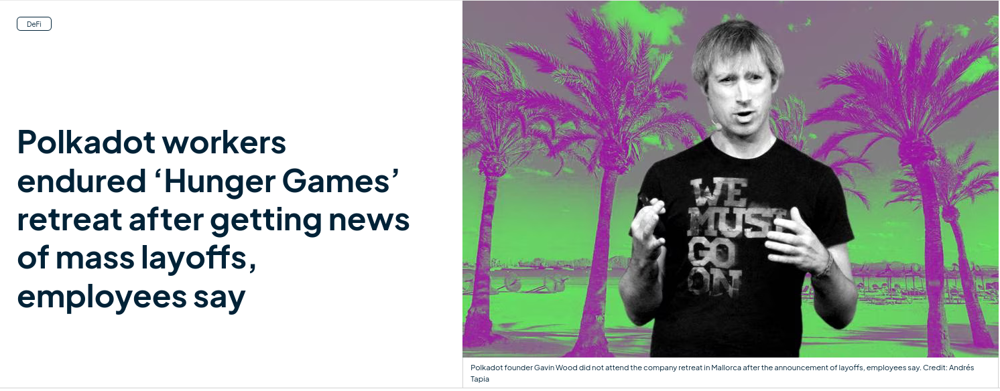
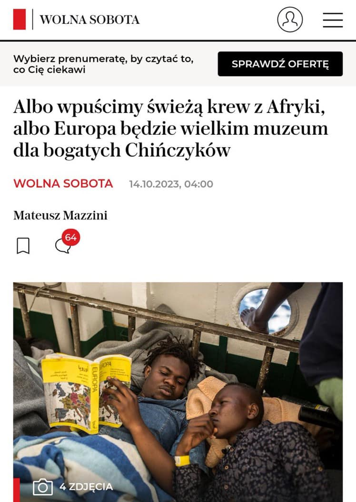
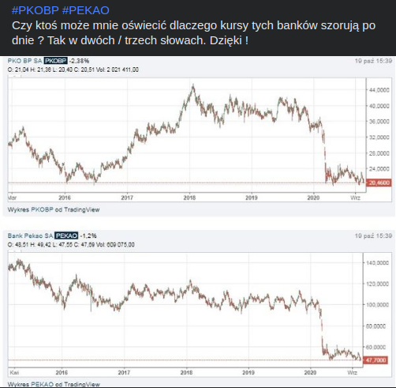
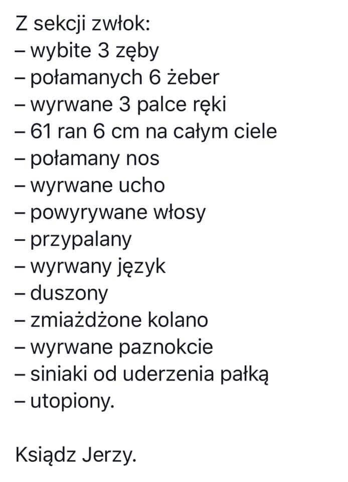
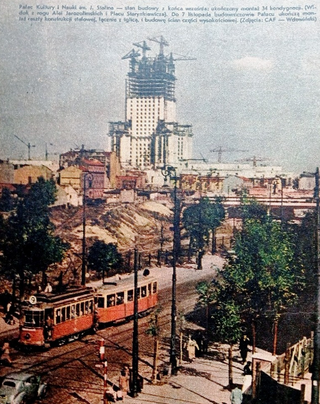
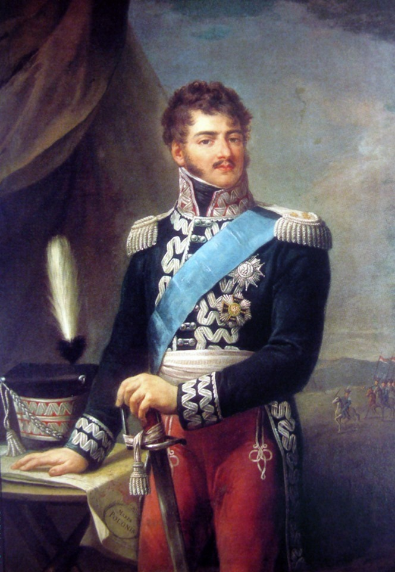

### 2023

  

> squid game

<video width="640" height="480" controls>
<source src="./movies/october/squid-game.mp4" type="video/mp4">
Your browser does not support the video tag.
</video>

<a href="./documents/october/parisclub_claims_as_of_31_12_2022_vf.pdf" target="_blank">Paris Club</a>

  

---

### ~2029

Ciekawe czy przeszłość stanie się przyszłością...

<video width="640" height="480" controls>
<source src="./movies/october/inflacja.mp4" type="video/mp4">
Your browser does not support the video tag.
</video>

### 2020

> – Lekarze mają coraz lepsze warunki finansowe, naprawdę. Jeśli w tej chwili którykolwiek z nich powiedziałby, że zarabia słabo, źle, że to są małe pieniądze, to mówiłby nieprawdę – przyznał senator PiS i lekarz Stanisław Karczewski.

---

Europe copied China's paper money, now the ECB copies China "programmable" CBDC or "surveillance coin"?

There will be nowhere in the EU to be safe from mass ECB surveillance?

The architecture of the digital yuan has leaked into the ECB (programmable money), seeking to leverage its mass surveillance and social scoring features, with the inbuilt monitory "kill switch" targeting social dissidents or those that simply horde ECB money?

"The PBoC has created a unique data structure for the DC/EP notes (more accurately, strings). There is a well defined lifecycle to the DC/EP notes from their generation to decommissioning. From the time of issuance, there are certain programmable components embedded in the data structure of the notes. There are also multiple levels of users within the digital currency system of the DC/EP. For each level of user, there are certain programmable functions enabled for DC/EP usage."

A Machiavellian ECB, is So Sad..

---
  
---

### 1991

W wieku 94 lat, zmarł ksiądz prałat Jan Zieja - podpułkownik Wojska Polskiego, Kapelan Legionów, Naczelny Kapelan Szarych Szeregów, duszpasterz Armii Krajowej i Batalionów Chłopskich, współpracownik Frontu Odrodzenia Polski oraz Rady Pomocy Żydom "Żegota", w powstaniu warszawskim kapelan pułku ,,Baszty''; od 1976 roku członek Komitetu Obrony Robotników; ekumenista, rzecznik dialogu z judaizmem. Został uhonorowany Krzyżem Srebrnym Orderu Wojennego Virtuti Militari, Krzyżem Wielkim Orderu Odrodzenia Polski (pośmiertnie), Krzyżem Walecznych i Warszawskim Krzyżem Powstańczym. Pochowany został na Cmentarzu dla Ociemniałych w Laskach.

  

### 1987

https://en.wikipedia.org/wiki/Black_Monday_(1987)

### 1984

Zamordowano księdza Jerzego Popiełuszkę.

  

''Prośmy Chrystusa Pana, abyśmy zachowali godność dziecka Bożego na każdy dzień; byśmy w życiu naszym na co dzień kierowali się sprawiedliwością; by nasze codzienne życie było przepełnione prawdą; abyśmy w naszym codziennym życiu okazywali męstwo w walce o wartości prawdziwie chrześcijańskie; byśmy byli wolni od leku, zastraszania, ale przede wszystkim od żądzy odwetu i przemocy" - jest to fragment kazania wygłoszonego przez księdza kapelana NSZZ „Solidarność”Jerzego Popiełuszkę (na zdjęciu) w dniu 19 października 1984 roku w kościele pw. Świętych Polskich Braci Męczenników w Bydgoszczy. Było to ostatnie kazanie, jakie wygłosił w swoim życiu. W drodze powrotnej do Warszawy ksiądz Jerzy został uprowadzony przez oficerów Samodzielnej Grupy „D” Departamentu IV MSW, którzy przebrani w mundury milicjantów zatrzymali auto, którym poruszał się ksiądz. Po zmuszeniu Popiełuszki do opuszczenia auta, skatowali go i wrzucili do bagażnika. Aby uniemożliwić mu jakąkolwiek możliwość ruchu i próbę oswobodzenia skrępowali mu nogi i ręce sznurkiem.  Esbecy porwali księdza Jerzego Popiełuszkę razem z jego osobistym kierowcą, czyli Waldemarem Chrostowskim. Jednak Chrostowskiemu udało się wyskoczyć z pędzącego samochodu i uciec. Oprawcy zatrzymali się przy tamie włocławskiej i  jeszcze żywego księdza wrzucili w worku, który uprzednio obciążyli kamieniami, do Wisły
Prawdopodobnie 13 września 1984 roku w Warszawie odbyło się spotkanie w czasie którego Wojciech Jaruzelski miał powiedzieć do Czesława Kiszczaka: "Załatw to, niech on nie szczeka".
19.10.1984 roku w miejscowości Górsk na trasie z Torunia do Warszawy oficerowie MSW: Grzegorz Piotrowski, Leszek Pękala i Waldemar Chmielewski wykonali polecenie. Czwartym, chociaż nie bezpośrednim katem był Adam Pietruszka. Jerzy Popiełuszko miał 37 lat.Ogłoszenie ks. Jerzego Popiełuszki błogosławionym Kościoła katolickiego odbyło się 6 czerwca 2010 w Warszawie na placu Piłsudskiego.

  

  

### 1939

1939 roku władze niemieckie w okupowanej Polsce wydały zarządzenie na podstawie którego utworzony został Główny Urząd Powierniczy Wschód. Do zadań tej instytucji należała konfiskata polskiego mienia. Objęto nią polskie sklepy, restauracje, gospodarstwa rolne, warsztaty rzemieślnicze i przedsiębiorstwa. Prawo do przejęcia tych majątków mieli w pierwszym rzędzie Niemcy mieszkający w Polsce jeszcze przed wybuchem wojny, a od 1940 roku przejmowali je sprowadzeni z Rzeszy hitlerowcy.
Na zdjęciu hala zakładu PZL Mielec przemianowanego na Flugzeugwerk-Mielec(FWM).

  

### 1938

Herb Wrocławia – ustanowiony przez nazistów. Użycie go przez kontrowersyjną stację telewizyjną wywołało skandal
(Artykuł przeczytało 22 500 Czytelników)

Herb został zaprojektowany przez Hansa Schweitzera, znanego także pod nazwiskiem Mjölnir (nazwa młota Thora), który był jednym z ulubionych artystów Nazistów. Zatrudnił go sam Józef Goebbels do projektowania nazistowskich plakatów. 19 października 1938 naziści na rozkaz gauleitera Śląska Josepha Wagnera usunęli tradycyjny herb, zastępując go dwupolowym. W jego górnej, złotej części widniał orzeł śląski, a w czerwonej, dolnej Krzyż Żelazny – projektantem nowej tarczy był berliński prof. Schweitzer-Mjoelnir. Cytat z gazety z tego okresu:
W 1938 naziści postanowili zmienić dotychczasowy herb Wrocławia, który był ich zdaniem zbyt chrześcijański i zbyt słowiański. Nowy herb zaprojektował właśnie Schweitzer.
. Nadprezydentowi i gauleiterowi Śląska Josefowi Wagnerowi źle się kojarzy herbowa litera „W”. Jest podobno „zbyt słowiańska, jako że stanowi inicjał imienia czeskiego księcia Wratysława, założyciela naszego miasta. Lew zresztą też ma niewłaściwe, bo czeskie pochodzenie.
Dalej:
Poza tym Wagner uważa, że w starym herbie jest za dużo chrześcijańskiej symboliki. Widok głowy św. Jana Chrzciciela na misie nie poprawia samopoczucia naszego gauleitera. Zarządził więc wprowadzenie nowego godła. Na tarczy znalazł się śląski orzeł i Krzyż Żelazny z literami FW i datą 1813. To inicjały króla Fryderyka Wilhelma III, który ustanowił odznaczenie Krzyż Żelazny za wojny wyzwoleńcze z Napoleonem.
Odwołanie do króla Fryderyka Wilhelma III związane jest bezpośrednio z we Wrocławiu 17 marca 1813 pod naciskiem pruskich patriotów odezwą An Mein Volk (niem. Do mojego ludu), wzywającą do walki z Napoleonem. Wcześniej król ustanowił order Krzyża Żelaznego oraz pozwolił na formowanie ochotniczych freikorps. To od nich barw mundurowych pochodzą kolory współczesnej flagi niemieckiej.
Nazistowski herb przedstawiał w jego górnej, złotej części, orła śląskiego, a w czerwonej, dolnej pruski Krzyż Żelazny.
Herb zmieniono dopiero po wojnie w 1945 roku. Niedawno telewizja TVN opatrując materiały z protestów we Wrocławiu opatrzyła je herbem ustanowionym przez nazistów. Tak naprawdę bez znaczenia, czy to ignorancja, czy prowokacja, ale to niezbyt dobrze świadczy o tej kontrowersyjnej stacji.

 

### 1936

https://pl.wikipedia.org/wiki/Plan_Czteroletni_(III_Rzesza)

### 1923

https://pl.wikipedia.org/wiki/Gulden_gda%C5%84ski

### 1813

VI koalicja antyfrancuska: porażka wojsk napoleońskich w bitwie pod Lipskiem (tzw. „Bitwie Narodów”). W czasie odwrotu w nurtach Elstery utonął książę Józef Poniatowski.
Książę Józef Poniatowski był zwolennikiem Konstytucji 3 maja. Podczas wojny polsko-rosyjskiej w 1792 roku dowodził wojskami koronnymi. Zwycięstwo pod Zieleńcami, jakie odniósł, stało się impulsem dla Stanisława Augusta do ustanowienia orderu Virtuti Militari. Józef Poniatowski i Tadeusz Kościuszko byli pierwszymi odznaczonymi. Po przystąpieniu króla do konfederacji targowickiej Józef Poniatowski złożył dymisję i odszedł z wojska. Walczył w powstaniu kościuszkowskim, m.in. jako dowódca jednego z odcinków obrony Warszawy.
Po utworzeniu Księstwa Warszawskiego w 1807 roku książę Józef Poniatowski został ministrem wojny i organizował wojsko polskie. W 1809 r. dowodził wojskami Księstwa Warszawskiego w wojnie z Austrią. Wziął udział w bitwie pod Raszynem.
W kampanii 1812 roku, podczas wyprawy Napoleona na Moskwę, dowodził V Korpusem Wielkiej Armii, składającym się z wojsk Księstwa Warszawskiego, walczącym m.in. pod Smoleńskiem i Borodino.
Po kampanii rosyjskiej Poniatowski odbudowywał armię polską. Rząd Księstwa Warszawskiego zamierzał odwrócić się od Napoleona i ponownie paktować z Aleksandrem I w sprawie odbudowy państwa polskiego. Książę Józef Poniatowski pozostał jednak wierny cesarzowi i wycofał się z ok. 30 tys. wojska polskiego do Saksonii, będącej aliantem Francji. Objął dowództwo VIII Korpusu Wielkiej Armii.
Na dzień przed bitwą pod Lipskiem cesarz Napoleon mianował Poniatowskiego marszałkiem Francji. Wśród uhonorowanych tym tytułem był jedynym cudzoziemcem. Jego nazwisko znajduje się na Łuku Triumfalnym w Paryżu.
W trakcie bitwy pod Lipskiem Józef Poniatowski był kilkakrotnie ranny. Podczas przeprawy przez Elsterę został najprawdopodobniej omyłkowo postrzelony przez Francuzów, zginął 19 października 1813 roku. Jak pisał jego biograf Szymon Askenazy, przed śmiercią Poniatowski powiedział, że trzeba umrzeć mężnie, mówił także o Polsce i honorze.
Przypisywane są mu słowa "Bóg mi powierzył honor Polaków. Bogu go tylko oddam".

  

### 1595

Rozpoczęła się dwudniowa bitwa pod Cecorą (obecnie Rumunia). Była ona wynikiem dalekowzrocznej polityki wielkiego hetmana koronnego Jana Zamoyskiego, który prowadząc swoje wojska na Mołdawię chciał zdobyć część jej terytorium, na którym chciał utworzyć państwa buforowe, które byłyby strefą chroniącą Polskę przed Turcją.
Po zdobyciu Chocimia Zamoyski obsadził na tronie mołdawskim przychylnego Rzeczypospolitej Jeremiego Mohyłę. Nie spodobało się to samym Turkom, których wojska już wieczorem 18 października dotarły pod Cecorę. Tatarzy ponosili w tej walce ogromne straty, co sprawiło, że chan Gazi II Girej doszedł do wniosku, że dalszy opór nie ma sensu.
Ostatecznie 21 października podpisano pokój,
na mocy którego Tatarzy uznali władzę
Jeremiego Mohyły w Mołdawii i zgodzili się,
by na obszarze hospodarstwa pozostały
polskie wojska. Dwa dni po zawartym układzie
armia tatarska rozpoczęła odwrót.

 

---

<a href="https://github.com/TomaszWaszczyk/historia.waszczyk.com/edit/master/src/content/october-19.md" target="_blank">Edytuj tę stronę dzieląc się własnymi notatkami!</a>
