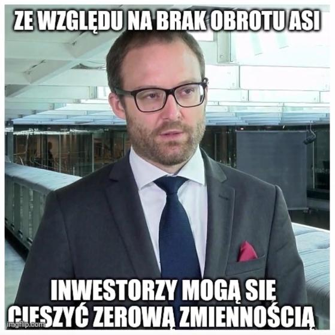
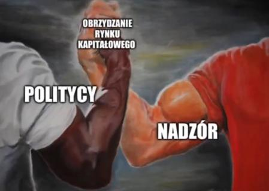
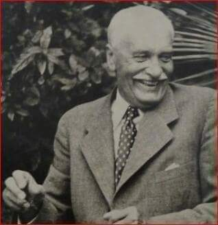
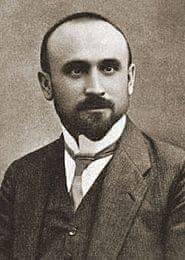

### 2023

  

  

<video width="640" height="480" controls>
<source src="./movies/october/ant.mp4" type="video/mp4">
Your browser does not support the video tag.
</video>

<video width="640" height="480" controls>
<source src="./music/pali-sie.mp4" type="video/mp4">
Your browser does not support the video tag.
</video>

---

### 2009

W Warszawie zmarł Marek Edelman, jeden z założycieli Żydowskiej Organizacji Bojowej, ostatni przywódca Powstania w Getcie Warszawskim, wybitny lekarz-kardiolog, który ocalił życie wielu osobom. Jako młody chłopak należał do Ogólnożydowskiego Związku Robotniczego „Bund”. Po śmierci ,,Aniołka'' stanął na czele Powstania w Getcie Warszawskim 1943, a piętnaście miesięcy później wziął udział w Powstaniu Warszawskim, walcząc wspólnie z plutonem ŻOB na Starym Mieście. Jego pluton był podporządkowany Armii Ludowej. Należy wspomnieć, iż sam Marek Edelman pragnął prowadzić walkę jako żołnierz Armii Krajowej. Niestety, już na początku Powstania patrol AK niesłusznie uznał Marka za konfidenta niemieckiego i chciał go rozstrzelać. Marek Edelman nie mógł ryzykować, aby podobna sytuacja powtórzyła się, dlatego zdecydował się na walkę w szeregach AL. Po Powstaniu ukrywał się wraz z Cywią Lubetkin i kilkoma znajomymi w warszawskiej wilii przy ulicy Promyka 43, później trafił do obozu w Pruszkowie, a następnie do szpitala w Boernerowie. ,,Wyzwolenia'' doczekał w Grodzisku Mazowieckim. Po wojnie Marek Edelman pracował jako kardiolog w łódzkich szpitalach. Nigdy nie zaakceptował komunistycznego reżimu i uciskania bezbronnych. Za swoje poglądy tudzież narodowość żydowską doznawał krzywd ze strony komunistycznych działaczy: wyrzucano go z pracy, odmówiono mu zatwierdzenia habilitacji. Sygnował „List 101” przeciw zmianom w konstytucji, monopolowi PZPR i sojuszowi ze Związkiem Sowieckim. Angażował się w działalność Komitetu Obrony Robotników. Od 1980 roku był członkiem NSZZ ,,Solidarność''. W czasie stanu wojennego był internowany. W 1989 roku stanął na czele Wojewódzkiego Komitetu Obywatelskiego w Łodzi. Napisał książki: „Getto walczy", „Zawał serca", „I była miłość w getcie...." - książka spisana przez Paulę Sawicką. Należał do Rady Honorowej Budowy Muzeum Powstania Warszawskiego; Kawaler Orderu Orła Białego.

---

### 1946

W Versoix koło Genewy zmarł Ignacy Mościcki, polityk sanacyjny, światowej sławy chemik i odkrywca. Był profesorem Politechniki Lwowskiej. Po odzyskaniu przez Polskę niepodległości zajął się wskrzeszaniem polskiego przemysłu chemicznego. Od 1922 roku był dyrektorem naczelnym Państwowej Fabryki Związków Azotowych w Chorzowie. Z inicjatywy Ignacego Mościckiego powstały Zakłady Azotowe w Tarnowie-Mościcach (jedna z najnowocześniejszych fabryk azotu na świecie). Do najważniejszych odkryć naukowym profesora Mościckiego możemy zaliczyć: odkrycie metody izolacji przewodów elektrycznych; opracowanie tzw. ,,metody Mościckiego'', czyli przemysłowej metody otrzymywania kwasu azotowego z powietrza przez syntezę tlenku azotu w łuku elektrycznym; opatentowanie metody oddzielania ropy naftowej od wody. W latach 1926-39 Ignacy Mościcki piastował urząd prezydenta RP. Polityka nie była najmocniejszą stroną Ignacego Mościckiego, ale za to wprost idealnie nadawał się do pełnienia funkcji reprezentacyjnych. Po śmierci Marszałka Piłsudskiego zorganizował tzw. ,,grupę zamkową'' i stanął na jej czele. W obliczu zbliżającej się klęski września (1939 r.) ewakuował się wraz z członkami polskiego rządu do Rumunii, gdzie został internowany. Przekazał urząd prezydenta RP na uchodźstwie Władysławowi Raczkiewiczowi. Resztę życia spędził na terenie Szwajcarii, będąc honorowym obywatelem tego państwa.

  

---

### 1940

Szef dystryktu warszawskiego Ludwig Fischer podpisał zarządzenie o utworzeniu w Warszawie getta. Aneksem do tego zarządzenia był spis warszawskich ulic wyznaczających granicę dzielnicy żydowskiej.

---

Fragment wspomnień urodzonego w Radziechowach w województwie śląskim biskupa Tadeusza Pieronka (zdjęcie), opisujący wysiedlenia Żywieczcyzny:

Krążyła po wsi wieść, że nastąpią wysiedlania, ponieważ już nastąpiły w sąsiednich wioskach. Ale wiadomości o charakterze tego wysiedlenia były mylne. Mówiono mianowicie, że są to przesiedlenia do miejsc, gdzie można lepiej pracować, znaleźć się w lepszych warunkach życiowych, gdzie przyjmuje się ludzi z orkiestrą i z weselem, i oczywiście oni wszystko mają do dyspozycji. Taka rozmowa odbyła się między innymi przy stoliku z piwem, gdzie chłopi zebrali się w kółku rolniczym dnia 2 października 1940 r. Opowiadali sobie te rzeczy. Wszedł na to jeden z żandarmów niemieckich, policjant o nazwisku Baron, który usłyszał, że tam ludzie śpiewają sobie „Jeszcze Polska nie zginęła”, więc zabrał do aresztu kogo mógł, ale przeczył, jakoby w tej miejscowości miały być wysiedlenia. Co się okazało? Następnego dnia, 3 października 1940 r. o godz. 4.00 rano przebudził mieszkańców warkot ciężkich samochodów. Wokół wsi ustawiono karabiny maszynowe. Nikogo nie wpuszczano ani nikogo nie wypuszczano, a nawet w samej wsi nie można było przechodzić z miejsca na miejsce. Policja przeprowadzająca wysiedlenia ulokowała się w naszym domu. Zaciągnęli linię telefoniczną i zaczęli wysiedlanie. Ustanowiono dwa miejsca zbiórki – pierwsze koło strażnicy, w środku wsi, drugie na górze, na placu Mików. To była duża, górska wioska, droga schodziła w dół w dolinę Soły. Wysiedlenie objęło prawie dwie trzecie wsi. Niemcy wchodzili do domów trójkami, odczytywali listę wyznaczonych do wysiedlenia mieszkańców tego domu i po niemiecku zapowiadali: macie 15 minut, możecie zabrać bagaż do 25 kilogramów, dokumenty, papiery. Ponieważ wśród tych wysiedlających byli Ślązacy, to po śląsku odzywali się mniej więcej tak: „Bajtliki se pobiercie najwyżej 25 kilogramów, papira, dowoda,a nie bier pierzyna, kołdra i klajdungu, bo jak cie, pieruna, zawale tom graba, to ino bachora z ciebie wyleco”.

Cały tekst dostępny jest w Biuletynie IPN nr 5/2004

---

### 1938

W dniu 31 marca 1938 r. sejm polski wobec spodziewanego masowego powrotu do kraju polskich Żydów zamieszkałych na terenie Niemiec, uchwalił ustawę o pozbawianiu obywatelstwa. Zgodnie z jej zapisami obywatele polscy przebywający nieprzerwanie za granicą co najmniej przez 5 lat po powstaniu Państwa Polskiego mogli zostać pozbawieni obywatelstwa. W połowie października 1938 r. ukazało się rozporządzenie Ministerstwa Spraw Wewnętrznych, które nakazywało każdemu obywatelowi polskiemu przebywającemu poza krajem przedłożenie paszportu do rejestracji we właściwym konsulacie i uzyskanie adnotacji kontrolnej potwierdzającej ważność dokumentu. Paszporty pozbawione adnotacji nie upoważniały do przekroczenia granicy polskiej po dniu 29 października 1938 r.

26 października 1938 roku szef służby bezpieczeństwa Rzeszy, Reinhard Heydrich, ogłosił rozporządzenie o natychmiastowym wydaleniu z Niemiec wszystkich polskich Żydów. Otrzymali oni nakaz deportacji i na własny koszt, w zaplombowanych pociągach, byli przewożeni do granicy z Polską. Mogli zabrać jedynie 10 marek i trochę ubrań. Deportowano całe rodziny, samotnych mężczyzn i samotne kobiety, a także dzieci i młodzież bez opieki osób starszych. Akcję przeprowadzono zarówno w dużych miastach, jak i małych wioskach. Na wysiedlenie zareagował polski konsul w Lipsku Feliks Chiczewski – otworzył drzwi konsulatu generalnego i udzielił schronienia ponad 1 300 osobom.

---

Wojska polskie wkroczyły na czechosłowackie Zaolzie.
W okresie dwudziestolecia międzywojennego stosunki Polski i istniejącej wówczas Czechosłowacji były naznaczone konfliktem granicznym o sporne terytoria Zaolzia. Gdy w Monachium trwały debaty polityków Wielkiej Brytanii, Francji, Niemiec i Włoch nad zaborem Sudetów przez III Rzeszę, strona polska postanowiła skorzystać z okazji do odzyskania obszaru zajętego po I wojnie światowej przez Czechosłowację.
Pod koniec września Warszawa wystosowała ultimatum dotyczące przekazania Rzeczypospolitej Zaolzia. Rząd czeski miał niewielkie pole manewru, a utrata Śląska Zaolziańskiego była tylko kroplą w morzu kłopotów, z jakimi borykała się w tym czasie Praga. 2 października jednostki Wojska Polskiego wkroczyły na Zaolzie i zajęły region, przyłączając go do terytorium II RP. To wydarzenie stawiło Polaków na równi z agresorem niemieckim i na wiele lat wypaczyło stosunki polsko-czechosłowackie. A przecież w 1939 roku oba kraje czekał podobny los, bowiem zostały podbite przez siły Wehrmachtu i znalazły się pod niemiecką okupacją.
Próba odbudowania zaufania miała miejsce jeszcze w czasie II wojny światowej w ramach współpracy przebywających w Londynie rządów emigracyjnych obu państw. Już w listopadzie 1939 roku pojawiła się koncepcja federacji środkowoeuropejskiej, która byłaby gwarantem stabilności i rozwoju regionu. Oba kraje wzięły również aktywny udział w bitwie o Wielką Brytanię, a lotnicy polscy i czechosłowaccy walczyli niejednokrotnie ramię w ramię. Najlepszym przykładem współpracy było zaangażowanie pilota polskiego 303. Dywizjonu Myśliwskiego Josefa Františka, który po upadku Pragi uciekł do Polski, znalazł tam azyl i angaż w Polskich Siłach Powietrznych. Czech wielokrotnie podkreślał, że czuje się Polakiem.
11 listopada 1940 roku premierzy rządów emigracyjnych Władysław Sikorski i Edvard Beneš podpisali wspólną deklarację polsko-czechosłowacką, której fragment brzmiał: ,,Polska i Czechosłowacja, zamykając raz na zawsze okres dawnych urazów i sporów i biorąc pod uwagę wspólność podstawowych swych interesów, zdecydowane są po ukończeniu wojny wejść ze sobą, jako państwa niepodległe i suwerenne, w ściślejszy związek polityczny i gospodarczy, który stałby się podstawą nowego porządku rzeczy w Europie Środkowej i gwarancją jego trwałości". Kres współpracy położyły nieporozumienia dotyczące traktowania Związku Radzieckiego, który w opinii Polaków występował jako sojusznik III Rzeszy, agresor i okupant terytorium polskiego. We wrześniu 1939 roku wojska Armii Czerwonej zaatakowały bowiem terytorium Polski. Mimo prób wspólnego działania na forum Mieszanego Komitetu Koordynacyjnego koncepcje obu krajów rozmijały się. Ich zapatrywania nie miały jednak większego znaczenia wobec dominacji ZSRR w regionie. Wojska Armii Czerwonej w 1944 i 1945 roku wyzwoliły terytorium Polski i Czechosłowacji, a Moskwa zainstalowała tam marionetkowe komunistyczne rządy (w Polsce już 1945 roku, w Czechosłowacji po udanym przewrocie politycznym w 1948 roku), które ostatecznie zostały uznane przez mocarstwa zachodnie.
Trudne sąsiedztwo polsko-czeskie było naznaczone przede wszystkim konfliktami granicznymi. Mimo podobnej sytuacji obu krajów projekt ścisłej współpracy upadł pod naciskiem politycznego pragmatyzmu i rozmijających się wizji odbudowy państwowości. Przez lata Polskę i Czechy łączyła także obecność w radzieckiej strefie wpływów i zniewolenie ze strony Sowietów. Ostateczne pojednanie było efektem wspólnej drogi przebytej od komunistycznej dyktatury do wolności w duchu zjednoczenia i demokratyzacji.

---

### 1924

Ówczesny minister przemysłu i handlu Józef Kiedroń (zdjęcie ) otworzył w Katowicach Wystawę Automobili Bezwypadkowych.

  

---

### 1902

https://pl.wikipedia.org/wiki/Jerzy_Zawieyski

---

<a href="https://github.com/TomaszWaszczyk/historia.waszczyk.com/edit/master/src/content/october-2.md" target="_blank">Edytuj tę stronę dzieląc się własnymi notatkami!</a>
